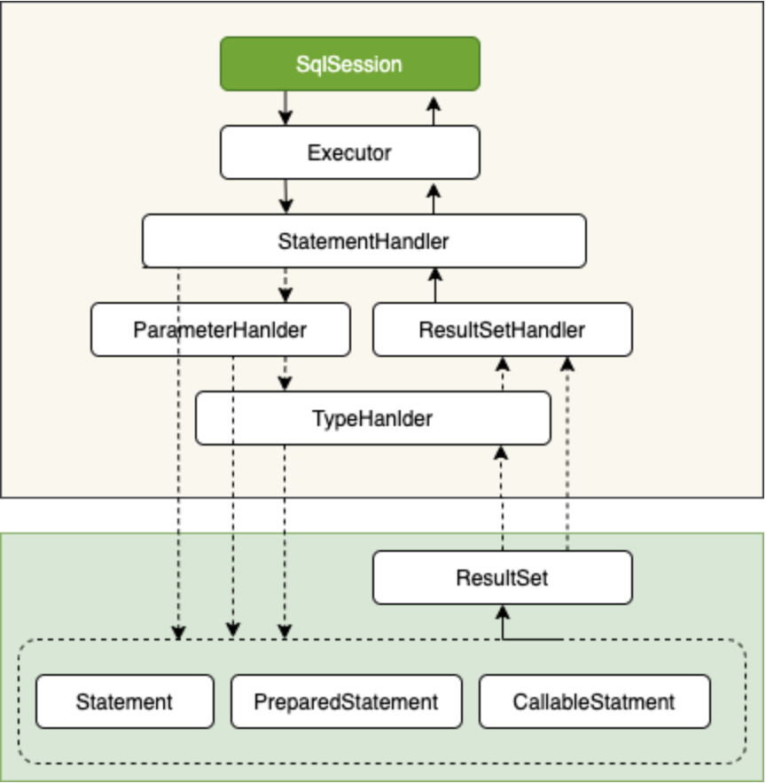

####mybatisPlus实现真实批量插入操作 三种方式
https://blog.csdn.net/qq_21223653/article/details/121171293

1)数据库连接配置文件添加 rewriteBatchedStatements=true
2)直接采用手写sql的方式 mapper.xml foreach
3)引入mybats-plus-extends包 配置insertBatchSomeColumn类

