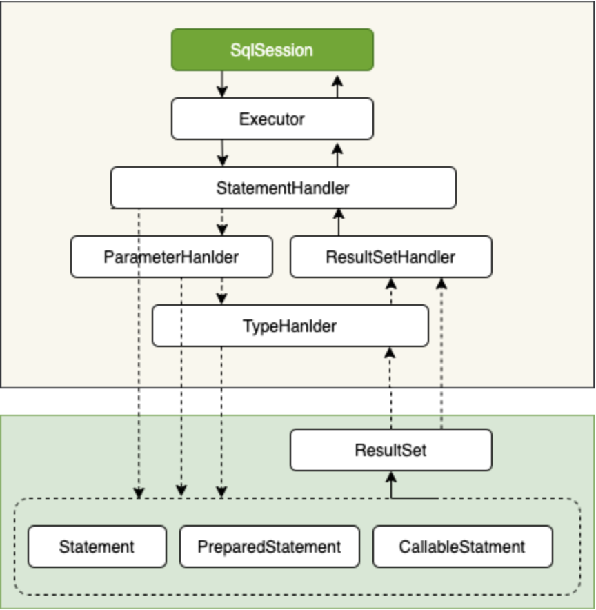

####mybatisPlus实现真实批量插入操作 三种方式
https://blog.csdn.net/qq_21223653/article/details/121171293

1)数据库连接配置文件添加 rewriteBatchedStatements=true
2)直接采用手写sql的方式 mapper.xml foreach
3)引入mybats-plus-extends包 配置insertBatchSomeColumn类

## sqlsession四大关键组件

- Executor（执行器）[Executor类图](#executor类图)

- StatementHandler[（数据库会话器）](#数据库会话器)
- ParameterHandler [（参数处理器）](#参数处理器)
- ResultSetHandler[（结果处理器）](#结果处理器)

### <a style='color:black' name="executor类图">Executor类图</a> 

### <a style='color:black' name="数据库会话器">StatementHandler类图</a>

### <a style='color:black' name="参数处理器">ParameterHandler类图</a>

### <a style='color:black' name="结果处理器">ResultSetHandler类图</a>

### mybatis执行流程

1. 读取 MyBatis 配置文件——mybatis-config.xml 、加载映射文件——映射文件即 SQL 映射文件，文件中配置了操作数据库的 SQL 语句。最后生成一个配置对象。

2. 构造会话工厂：通过 MyBatis 的环境等配置信息构建会话工厂 SqlSessionFactory。

3. 创建会话对象：由会话工厂创建 SqlSession 对象，该对象中包含了执行 SQL 语句的所有方法。

4. Executor 执行器：MyBatis 底层定义了一个 Executor 接口来操作数据库，它将根据 SqlSession 传递的参数动态地生成需要执行的 SQL 语句，同时负责查询缓存的维护。

5. StatementHandler：数据库会话器，串联起参数映射的处理和运行结果映射的处理。

6. 参数处理：对输入参数的类型进行处理，并预编译。

7. 结果处理：对返回结果的类型进行处理，根据对象映射规则，返回相应的对象。

   

### mybatis功能架构

### mybatis获取mapper

### Mybatis都有哪些执行器？

- **SimpleExecutor**：每执行一次update或select，就开启一个Statement对象，用完立刻关闭Statement对象。
- **ReuseExecutor**：执行update或select，以sql作为key查找Statement对象，存在就使用，不存在就创建，用完后，不关闭Statement对象，而是放置于Map<String, Statement>内，供下一次使用。简言之，就是重复使用Statement对象。
- **BatchExecutor**：执行update（没有select，JDBC批处理不支持select），将所有sql都添加到批处理中（addBatch()），等待统一执行（executeBatch()），它缓存了多个Statement对象，每个Statement对象都是addBatch()完毕后，等待逐一执行executeBatch()批处理。与JDBC批处理相同。

- 在Mybatis配置文件中，在设置（settings）可以指定默认的ExecutorType执行器类型，也可以手动给DefaultSqlSessionFactory的创建SqlSession的方法传递ExecutorType类型参数，如`SqlSession openSession(ExecutorType execType)`。