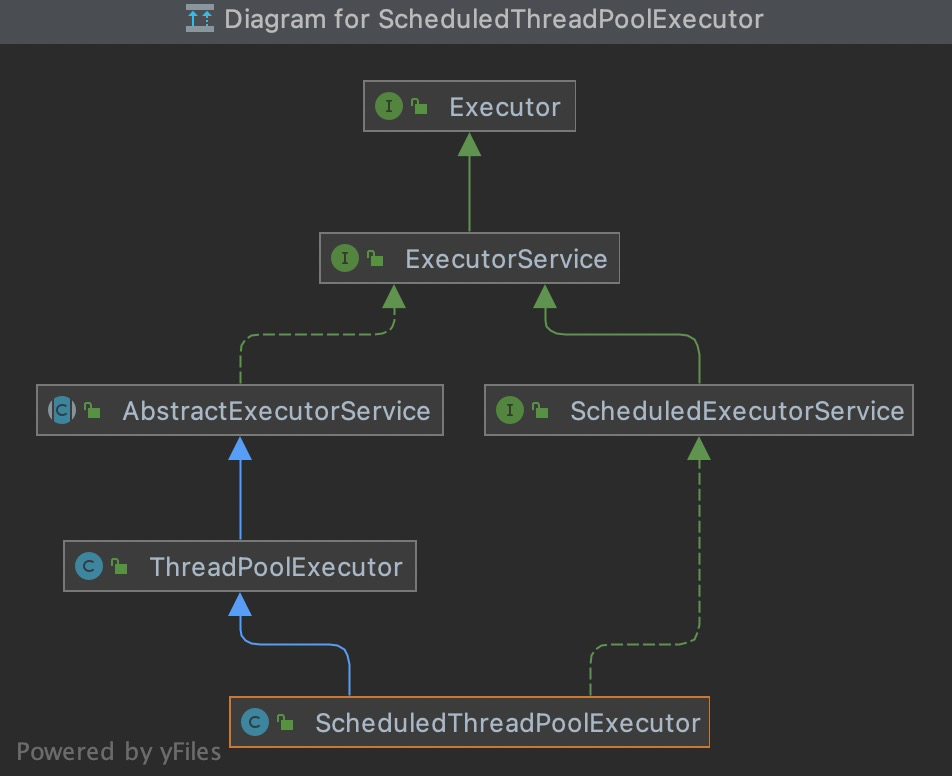

## ThreadPoolExecutor类继承关系


## ScheduledThreadPoolExecutor类继承关系




## 

## interface Executor类

```java
void execute(Runnable command);
```


## abstract class AbstractExecutorService类

```java
public <T> Future<T> submit(Callable<T> task) {
    if (task == null) throw new NullPointerException();
    RunnableFuture<T> ftask = newTaskFor(task);
    execute(ftask);
    return ftask;
}
```


## Worker对象结构

```java
/** Thread this worker is running in.  Null if factory fails. */
final Thread thread;
/** Initial task to run.  Possibly null. */
Runnable firstTask;
/** Per-thread task counter */
volatile long completedTasks;
```


## Thread的run和start的区别？

### run方法运行使用的是方法调用，线程是main线程


### start方法运行使用的是线程调用，线程是新建的线程


## Thread和Runnable的关系？


##    java8中规范的四大函数式接口（transmit）

```java
   1、Consumer<T>  :消费型接口  void accept(T t);

   2、Supplier<T>   :供给型接口  T get();

   3、Function<T,R>  :函数型接口  R apply(T t);

   4、Predicate<T>  :断言型接口  boolean test(T t);
```


## Executors提供四种创建线程池的弊端

```java
FixedThreadPool(LinkedBlockingQueue) 和 SingleThreadPool(LinkedBlockingQueue):
//允许的请求队列长度为 Integer.MAX_VALUE，可能会堆积大量的请求，从而导致 OOM。 

CachedThreadPool 和 ScheduledThreadPool:
//允许的创建最大线程数为 Integer.MAX_VALUE，可能会创建大量的线程，从而导致 OOM。 
```


JAVA1.8时间

**LocalDate**、**LocalTime**、**Instant**、**Duration**、**Period**


## 3O定义

OOA（analyse）：面向对象分析，分析里面有几个对象，以及对象之间的关系

OOD（design）：面向对象设计，设计对象之间发生了什么关系

OOP（programme）：面向对象编程，最后在进行编程

## FutureTask

Future接口代表一个异步执行的任务。

FutureTask类代表一个可取消的异步计算任务。


### RejectedExecutionHandler拒绝策略

```java
AbortPolicy
CallerRunsPolicy
DiscardOldestPolicy
DiscardPolicy
```


 

## 线程时间片一般是10ms～100ms不等，上下文切换时间大约为5ms～10ms

## 进程

程序由指令和数据组成，但这些指令要运行，数据要读写，就必须将指令加载至 CPU，数据加载至内存。在指令运行过程中还需要用到磁盘、网络等设备，在指令运行过程中还需要用到磁盘、网络等设备。进程就是用来加载指令、管理内存、管理 IO 的 。操作系统会以进程为单位，分配系统资源(CPU时间片、内存等资源)，进程是 资源分配的最小单位。


## 线程

线程是进程中的实体，一个进程可以拥有多个线程，一个线程必须有一个父进程。 一个线程就是一个指令流，将指令流中的一条条指令以一定的顺序交给 CPU 执行 。 线程，有时被称为轻量级进程(Lightweight Process，LWP)，是操作系统调度(CPU调度)执行的最小单位。


## 进程与线程的区别

进程基本上**相互独立**的，而**线程存在于进程内**，是进程的一个**子集**，进程拥有共享的资源，如内存空间等，供其内部的线程共享 进程间通信较为复杂。**同一台计算机的进程通信称为 IPC(Inter-process communication)**不同计算机之间的进程通信，需要通过网络，并遵守共同的协议，例如 HTTP 线程通信相对简单，因为它们共享进程内的内存，一个例子是多个线程可以访问同一个共享变量线程更轻量，线程上下文切换成本一般上要比进程上下文切换低


## 进程间通信的方式

1. 管道(pipe)及有名管道(named pipe):管道可用于具有亲缘关系的父子进程间的通信，有名管道除了具有管道所具有的功能外，它还允许无亲缘关系进程间的通信。**管道是[linux](https://so.csdn.net/so/search?from=pc_blog_highlight&q=linux)系统最常见的进程间通信方式之一，它在两个进程之间实现一个数据流通的通道，数据以一种数据流的方式在进程间流动。它把一个程序的输出直接连到另一个程序的输入。**

2. 信号(signal):信号是在软件层次上对中断机制的一种模拟，它是比较复杂的通信方式，用于通知进程有某事件发生，一个进程收到一个信号与处理器收到一个中断请求效果 上可以说是一致的。

3. 消息队列(message queue):消息队列是消息的链接表，它克服了上两种通信方式 中信号量有限的缺点，具有写权限得进程可以按照一定得规则向消息队列中添加新信息; 对消息队列有读权限得进程则可以从消息队列中读取信息。

4. 共享内存(shared memory):可以说这是最有用的进程间通信方式。它使得多个进程可以访问同一块内存空间，不同进程可以及时看到对方进程中对共享内存中数据得更新。这种方式需要依靠某种同步操作，如互斥锁和信号量等。

5. 信号量(semaphore):主要作为进程之间及同一种进程的不同线程之间得同步和互 斥手段。

6. 套接字(socket):这是一种更为一般得进程间通信机制，它可用于网络中不同机器之 间的进程间通信，应用非常广泛。

   

## 线程时间片一般是10ms～100ms不等，上下文切换时间大约为5ms～10ms

1. 上下文切换只能在内核模式下发生。
2. 上下文切换是多任务操作系统的一个基本特性


## 内核模式(Kernel Mode)vs 用户模式(User Mode)


应用程序一般会在以下几种情况下切换到内核模式：

1． 系统调用。

2． 异常事件。当发生某些预先不可知的异常时，就会切换到内核态，以执行相关的异常事件。

3． 设备中断。在使用外围设备时，如外围设备完成了用户请求，就会向CPU发送一个中断信号，此时，CPU就会暂停执行原本的下一条指令，转去处理中断事件。此时，如果原来在用户态，则自然就会切换到内核态。

**！Linux 创建线程（pthread_create 库）**

## 操作系统层面线程生命周期（五态模型）

初始状态，可运行状态，运行状态，休眠状态，终止状态


## java线程定义(六种)

```
//尚未启动的线程的线程状态
NEW
//可运行线程的线程状态。 处于可运行状态的线程正在 Java 虚拟机中执行，但它可能正在等待来自操作系统的其他资源，例如处理器
RUNNABLE
//线程阻塞等待监视器锁的线程状态。 处于阻塞状态的线程正在等待监视器锁进入同步块/方法或在调用Object.wait后重新进入同步块/方法。针对Synchronized
BLOCKED
//等待线程的线程状态。 由于调用以下方法之一，线程处于等待状态：
//Object.wait没有超时
//Thread.join没有超时
//LockSupport.park
//正在等待另一个对象的唤醒例如Object.notify()或者Object.notifyAll()
WAITING
//具有指定等待时间的等待线程的线程状态。 由于使用指定的正等待时间调用以下方法之一，线程处于定时等待状态：
//Thread.sleep
//Object.wait超时
//Thread.join超时
//LockSupport.parkNanos
//LockSupport.parkUntil
TIMED_WAITING
//终止线程的线程状态。 线程已完成执行
TERMINATED
```


### JVM层面和OS系统层面也会有不同的表示


## Java中实现线程有几种方式?

### 方式1:使用 Thread类或继承Thread类

```
Thread thread = new Thread(){
    @Override
    public void run() {
        System.out.println("线程创建完成");
    }
};
thread.start();
```


### 方式2:实现 Runnable 接口配合Thread

```
Thread thread = new Thread(() -> {
    System.out.println("利用runnbale方式创建线程");
});
//新建线程执行
thread.start();
//main线程执行 调用方法
thread.run();
```


### 方式3:使用有返回值的 Callable


Future.java


java thread >> jvm javathread >> os thread

## 协程（coroutines）

是一种基于线程之上，但又比线程更加轻量级的存在，协程不是被操作系统内核所管理，而完全是由程序所控制（也就是在用户态执行），具有对内核来说不可见的特性。


## 什么是JMM模型？（volatile）

Java 内存模型（Java Memory Model 简称JMM）是一种抽象的概念，并不真实存在，它描述的一组规则或规范，通过这组规范定义了程序中各个变量（包括实例字段、静态字段和构成数组对象的元素）的访问方式。JVM运行程序的实体是线程，而每个线程创建时 JVM 都会为其创建一个工作内存（有些地方称为栈空间），用于存储线程私有的数据，而Java 内存模型中规定所有变量都存储在主内存，其主内存是共享内存区域，所有线程都可以访问，但线程对变量的操作（读取赋值等）必须在工作内存中进行，首先要将变量从主内存考吧到增加的工作内存空间，然后对变量进行操作，操作完成后再将变量写回主内存，不能直接操作主内存中的变量，工作内存中存储这主内存中的变量副本拷贝，工作内存是每个线程的私有数据区域，因此不同的线程间无法访问对方的工作内存，线程间的通信（传值）必须通过主内存来完成。

### JMM 不同于 JVM 内存区域模式

JMM 与 JVM 内存区域的划分是不同的概念层次，更恰当说 JMM 描述的是一组规则，通过这组规则控制各个变量在共享数据区域内和私有数据区域的访问方式，**JMM是围绕原子性、有序性、可见性展开**。JMM 与 Java 内存区域唯一相似点，都存在共享数据区域和私有数据区域，在 JMM 中主内存属于共享数据区域，从某个程度上讲应该包括了堆和方法区，而工作内存数据线程私有数据区域，从某个程度上讲则应该包括程序计数器、虚拟机栈以及本地方法栈。

线程、工作内存、主内存工作交互图（基于JMM规范），如下： 

### 主内存

主要存储的是Java实例对象，所有线程创建的实例对象都存放在主内存中，不管该**实例对象是成员变量还是方法中的本地变量**（也称局部变量），当然也包括了共享的类信息、常量、静态变量。由于是共享数据区域，多个线程同一个变量进行访问可能会发送线程安全问题。

### 工作内存

主要存储当前方法的所有本地变量信息（工作内存中存储着主内存中的变量副本拷贝），每个线程只能访问自己的工作内存，即线程中的本地变量对其他线程是不可见的，就算是两个线程执行的是同一段代码，它们也会在各自的工作内存中创建属于当前线程的本地变量，当然也包括了字节码行号指示器、相关Native方法的信息。注意由于工作内存是每个线程的私有数据，线程间无法相互访问工作内存，因此存储在工作内存的数据不存在线程安全问题。

根据 JVM 虚拟机规范主内存与工作内存的数据存储类型以及操作方式，对于一个实例对象中的成员方法而言，如果方法中包括本地变量是基本数据类型（boolean、type、short、char、int、long、float、double），将直接存储在工作内存的帧栈中，而对象实例将存储在主内存（共享数据区域，堆）中。但对于实例对象的成员变量，不管它是基本数据类型或者包装类型（Integer、Double等）还是引用类型，都会被存储到堆区。至于 static 变量以及类本身相关信息将会存储在主内存中。

需要注意的是，在主内存中的实例对象可以被多线程共享，倘若两个线程同时调用类同一个对象的同一个方法，那么两个线程会将要操作的数据拷贝一份到直接的工作内存中，执行晚操作后才刷新到主内存。模型如下图所示： 

### Java 内存模型与硬件内存架构的关系

通过对前面的硬件内存架构、Java内存模型以及Java多线程的实现原理的了解，我们应该已经意识到，多线程的执行最终都会映射到硬件处理器上进行执行，但Java内存模型和硬件内存架构并不完全一致。对于硬件内存来说只有寄存器、缓存内存、主内存的概念，并没有工作内存（线程私有数据区域）和主内存（堆内存）之分，也就是说 Java 内存模型对内存的划分对硬件内存并没有任何影响，因为 JMM 只是一种抽象的概念，是一组规则，并不实际存在，不管是工作内存的数据还是主内存的数据，对于计算机硬件来说都会存储在计算机主内存中，当然也有可能存储到 CPU 缓存或者寄存器中，因此总体上来说，Java 内存模型和计算机硬件内存架构是一个相互交叉的关系，是一种抽象概念划分与真实物理硬件的交叉。（注意对于Java内存区域划分也是同样的道理） 

### JMM 存在的必要性

在明白了 Java 内存区域划分、硬件内存架构、Java多线程的实现原理与Java内存模型的具体关系后，接着来谈谈Java内存模型存在的必要性。

由于JVM运行程序的实体是线程，而每个线程创建时 JVM 都会为其创建一个工作内存（有些地方称为栈空间），用于存储线程私有的数据，线程与主内存中的变量操作必须通过工作内存间接完成，主要过程是将变量从主内存拷贝的每个线程各自的工作内存空间，然后对变量进行操作，操作完成后再将变量写回主内存，如果存在两个线程同时对一个主内存中的实例对象的变量进行操作就有可能诱发线程安全问题。

假设主内存中存在一个共享变量 `x` ，现在有 A 和 B 两个线程分别对该变量 `x=1` 进行操作， A/B线程各自的工作内存中存在共享变量副本 `x` 。假设现在 A 线程想要修改 `x` 的值为 2，而 B 线程却想要读取 `x` 的值，那么 B 线程读取到的值是 A 线程更新后的值 2 还是更新钱的值 1 呢？

答案是：不确定。即 B 线程有可能读取到 A 线程更新钱的值 1，也有可能读取到 A 线程更新后的值 2，这是因为工作内存是每个线程私有的数据区域，而线程 A 操作变量 `x` 时，首先是将变量从主内存拷贝到 A 线程的工作内存中，然后对变量进行操作，操作完成后再将变量 `x` 写回主内存。而对于 B 线程的也是类似的，这样就有可能造成主内存与工作内存间数据存在一致性问题，假设直接的工作内存中，这样 B 线程读取到的值就是 `x=1` ，但是如果 A 线程已将 `x=2` 写回主内存后，B线程才开始读取的话，那么此时 B 线程读取到的就是 `x=2` ，但到达是那种情况先发送呢？

如下图所示案例：  以上关于主内存与工作内存直接的具体交互协议，即一个变量如何从主内存拷贝到工作内存，如何从工作内存同步到主内存之间的实现细节，Java内存模型定义来以下八种操作来完成。

### 数据同步八大原子操作

1. **lock**（锁定）：作用于主内存的变量，把一个变量标记为一个线程独占状态；
2. **unlock**（解锁）：作用于主内存的变量，把一个处于锁定状态的变量释放出来，释放后的变量才可以被其他线程锁定；
3. **read**（读取）：作用于主内存的变量，把一个变量值从主内存传输到线程的工作内存中，以后随后的load工作使用；
4. **load**（载入）：作用于工作内存的变量，它把read操作从主内存中得到的变量值放入工作内存的变量；
5. **use**（使用）：作用于工作内存的变量，把工作内存中的一个变量值传递给执行引擎；
6. **assign**（赋值）：作用于工作内存的变量，它把一个从执行引擎接收到的值赋给工作内存的变量；
7. **store**（存储）：作用于工作内存的变量，把工作内存中的一个变量的值传送到主内存中，以便随后的write的操作；
8. **wirte**（写入）：作用于工作内存的变量，它把store操作从工作内存中的一个变量值传送到主内存的变量中。

- 如果要把一个变量从主内存中复制到工作内存中，就需要按顺序地执行 read 和 load 操作；
- 如果把变量从工作内存中同步到主内存中，就需要按顺序地执行 store 和 write 操作。

但Java 内存模型只要求上述操作必须按顺序执行，而没有保证必须是连续执行。 

#### 同步规则分析

1. 不允许一个线程无原因地（没有发生任何 assign 操作）把数据从工作内存同步回主内存中；
2. 一个新的变量只能在主内存中诞生，不允许在工作内存中直接使用一个未被初始化（load 或者 assign）的变量。即就是对一个变量实施 use 和 store 操作之前，必须先自行 assign 和 load 操作；
3. 一个变量在同一时刻只允许一条线程对其进行 lock 操作，但 lock 操作可不被同一线程重复执行多次，多次执行 lock 后，只有执行相同次数 unlock 操作，变量才会被解锁。lock 和 unlock 必须成对出现；
4. 如果对一个变量执行 lock 操作，将会清空工作内存中此变量的值，在执行引擎使用变量之前需要重新执行 load 或 assign 操作初始化变量的值；
5. 如果一个变量事先没有被 lock 操作锁定，则不允许对它执行 unlock 操作；也不允许去 unlock 一个被其他线程锁定的变量；
6. 对一个变量执行 unlock 操作之前，必须先把此变量同步到主内存中（执行store 和 write 操作）。

### 并发编程的可见性、原子性与有序性问题

#### 原子性

**原子性**指的是一个操作不可中断，即使是在多线程环境下，一个操作一旦开始就不会被其他线程影响。

在Java中，对于基本数据类型的变量的读取和赋值操作是原子性操作需要注意的是：对于32位系统来说，long 类型数据和 double 类型数据（对于基本类型数据：byte、short、int、float、boolean、char 读写是原子操作），它们的读写并非原子性的，也就是说如果存在两条线程同时对 long 类型或者 double 类型的数据进行读写是存在相互干扰的，因为对于32位虚拟机来说，每次原子读写是32位，而 long 和 double 则是64位的存储单元，这样回导致一个线程在写时，操作完成前32位的原子操作后，轮到B线程读取时，恰好只读取来后32位的数据，这样可能回读取到一个即非原值又不是线程修改值的变量，它可能是“半个变量”的数值，即64位数据被两个线程分成了两次读取。但也不必太担心，因为读取到“半个变量”的情况比较少，至少在目前的商用虚拟机中，几乎都把64位的数据的读写操作作为原子操作来执行，因此对于这个问题不必太在意，知道怎么回事即可。

```java
X=10; //原子性(简单的读取、将数字赋值给变量) 
Y = x; //变量之间的相互赋值，不是原子操作
X++; //对变量进行计算操作
X=x+1;
复制代码
```

#### 可见性

理解了**指令重排**现象后，可见性容易理解了。可见性指的是当一个线程修改了某个共享变量的值，其他线程是否能够马上得知这个修改的值。对于串行程序来说，可见性是不存在的，因为我们在任何一个操作中修改了某个变量的值，后续的操作中都能读取到这个变量，并且是修改过的新值。

但在多线程环境中可就不一定了，前面我们分析过，由于线程对共享变量的操作都是线程拷贝到各自的工作内存进行操作后才写回到主内存中的，这就可能存在一个线程A修改了共享变量 `x` 的值，还未写回主内存时，另外一个线程B又对主内存中同一个共享变量 `x` 进行操作，但此时A线程工作内存中共享变量 `x` 对线程B来说并不可见，这种工作内存与主内存同步延迟现象就会造成可见性问题，另外指令重排以及编译器优化也可能回导致可见性问题，通过前面的分析，我们知道无论是编译器优化还是处理器优化的重排现象，在多线程环境下，确实回导致程序乱序执行的问题，从而也就导致可见性问题。

#### 有序性

有序性是指对于单线程的执行代码，我们总是认为代码的执行是按顺序依次执行的，这样的理解并没有毛病，比较对于单线程而言确实如此，但对于多线程环境，则可能出现乱序现象，因为程序编译称机器码指令后可能回出现指令重排现象，重排后的指令与原指令的顺序未必一致，要明白的是，在Java程序中，倘若在本线程内，所有操作都视为有序行为，如果是多线程环境下，一个线程中观察另外一个线程，所有操作都是无序的，前半句指的是单线程内保证串行语义执行的一致性，后半句则指令重排现象和工作内存与主内存同步延迟现象。

### JMM如何解决原子性、可见性和有序性问题

#### 原子性问题

除了 JVM 自身提供的对基本数据类型读写操作的原子性外，可以通过 **synchronized** 和 **Lock** 实现原子性。因为 synchronized 和 Lock 能够保证任一时刻只有一个线程访问该代码块。

#### 可见性问题

**volatile** 关键字可以保证可见性。当一个共享变量被 volatile 关键字修饰时，它会保证修改的值立即被其他的线程看到，即修改的值立即更新到主存中，当其他线程需要读取时，它会去内存中读取新值。synchronized 和 Lock 也可以保证可见性，因为它们可以保证任一时刻只有一个线程能访问共享资源，并在其释放锁之前将修改的变量刷新到内存中。

#### 有序性问题

在Java里面，可以通过 volatile 关键字来保证一定的“有序性”。另外可以通过 synchronized 和 Lock 来保证有序性，很显然，synchronized 和 Lock 保证每个时刻是只有一个线程执行同步代码，相当于是让线程顺序执行同步代码，自然就保证来有序性。

### Java内存模型

每个线程都有自己的工作内存，线程对变量的所有操作都必须在工作内存中进行，而不能直接对主内存进行操作。并且每个线程不能访问其他线程的工作内存。Java 内存模型具有一些先天的“有序性”，即不需要通过任何手段就能够得到保证的有序性，这个通常也称为 `happens-before` 原则。如果两个操作的执行次序无法从 `happens-before` 原则推导出来，那么它们就不能保证它们的有序性，虚拟机可以随意地对它们进行重排序。

### 指令重排序

Java语言规范规定 JVM 线程内部维持顺序化语义。即只要程序的最终结果与它顺序化情况的结果相等，那么指令的执行顺序可以与代码顺序不一致，此过程叫做指令的重排序。

指令重排序的意义是什么？JVM能根据处理特性（CPU多级缓存、多核处理器等）适当的对机器指令进行重排序，使机器指令更更符合CPU的执行特性，最大限度的发挥机器性能。

下图为从源码到最终执行的指令序列示意图： 

#### as-if-serial 语义

`as-if-serial` 语义的意思是：不管怎么重排序（编译器和处理器为了提高并行度），（单线程）程序的执行结果不能被改变。编译器、runtime和处理器都必须遵守 as-if-serial 语义。

为了遵守 as-if-serial 语义，编译器和处理器不会对存在数据依赖关系的操作做重排序，因为这种重排序会改变执行结果。但是，如果操作之间不存在数据依赖关系，这些操作就可能被编译器和处理器重排序。

#### happens-before 原则

只靠 synchronized 和 volatile 关键字来保证原子性、可见性以及有序性，那么编写并发程序可能会显得十分麻烦，幸运的是，从JDK 5 开始，Java 使用新的 JSR-133 内存模型，提供了 `happens-before 原则` 来辅助保证程序执行的原子性、可见性和有序性的问题，它是判断数据十分存在竞争、线程十分安全的一句。happens-before 原则内容如下：

1. **程序顺序原则**，即在一个线程内必须保证语义串行，也就是说按照代码顺序执行。
2. **锁规则**，解锁（unlock）操作必然发生在后续的同一个锁的加锁（lock）之前，也就是说，如果对于一个锁解锁后，再加锁，那么加锁的动作必须在解锁动作之后（同一个锁）。
3. **volatile规则**， volatile变量的写，先发生于读，这保证了volatile变量的可见性，简单理解就是，volatile变量在每次被线程访问时，都强迫从主内存中读该变量的值，而当该变量发生变化时，又会强迫将最新的值刷新到主内存，任何时刻，不同的线程总是能够看到该变量的最新值。
4. **线程启动规则**，线程的 start() 方法先于它的每一个动作，即如果线程A在执行线程B的 start 方法之前修改了共享变量的值，那么当线程B执行start方法时，线程A对共享变量的修改对线程B可见。
5. **传递性**，A先于B，B先于C，那么A必然先于C。
6. **线程终止原则**，线程的所有操作先于线程的终结，Thread.join() 方法的作用是等待当前执行的线程终止。假设在线程B终止之前，修改了共享变量，线程A从线程B的join方法成功返回，线程B对共享变量的修改将对线程A可见。
7. **线程中断规则**，对线程 interrupt() 方法的调用先行发生于被中断线程的代码检查到中断事件的发生，可以通过 Thread.interrupted() 方法检测线程十分中断。
8. **对象终结规则**，对象的构造函数执行，结束先于 finalize() 方法。

> finalize()是Object中的方法，当垃圾回收器将要回收对象所占内存之前被调用，即当一个对象被虚拟机宣告死亡时会先调用它finalize()方法，让此对象处理它生前的最后事情（这个对象可以趁这个时机挣脱死亡的命运）。

## volatile 内存语义

volatile 是Java虚拟机提供的轻量级的同步机制。volatile 关键字有如下两个作用：

1. 保证被 volatile 修饰的共享变量对所有线程总是可见的，也就是当一个线程修改了被 volatile 修饰共享变量的值，新值总是可以被其他线程立即得知。
2. 紧张指令重排序优化。

### volatile 的可见性

关于 volatile 的可见性作用，我们必须意思到被 volatile 修饰的变量对所有线程总是立即可见的，对于 volatile 变量的所有写操作总是能立刻反应到其他线程中。

**案例**：线程A改变 initFlag 属性之后，线程B马上感知到

```java
package com.niuh.jmm;

import lombok.extern.slf4j.Slf4j;

/**
 * @description: -server -Xcomp -XX:+UnlockDiagnosticVMOptions -XX:+PrintAssembly -XX:CompileCommand=compileonly,*Jmm03_CodeVisibility.refresh
 * -Djava.compiler=NONE
 **/
@Slf4j
public class Jmm03_CodeVisibility {

    private static boolean initFlag = false;

    private volatile static int counter = 0;

    public static void refresh() {
        log.info("refresh data.......");
        initFlag = true;
        log.info("refresh data success.......");
    }

    public static void main(String[] args) {
        // 线程A
        Thread threadA = new Thread(() -> {
            while (!initFlag) {
                //System.out.println("runing");
                counter++;
            }
            log.info("线程：" + Thread.currentThread().getName()
                    + "当前线程嗅探到initFlag的状态的改变");
        }, "threadA");
        threadA.start();

        // 中间休眠500hs
        try {
            Thread.sleep(500);
        } catch (InterruptedException e) {
            e.printStackTrace();
        }

        // 线程B
        Thread threadB = new Thread(() -> {
            refresh();
        }, "threadB");
        threadB.start();
    }
}

复制代码
```

结合前面介绍的数据同步八大原子操作，我们来分析下：

**线程A启动后**：

- 第一步：执行read操作，**作用于主内存**，将变量`initFlag`从主内存拷贝一份，这时候还没有放到工作内存中，而是放在了总线里。如下图
- 第二步：执行load操作，**作用于工作内存**，将上一步拷贝的变量，放入工作内存中；
- 第三步：执行use（使用）操作，**作用于工作内存**，把工作内存中的变量传递给执行引擎，对于线程A来说，执行引擎会判断`initFlag = true`吗？不等于，循环一直进行

执行过程如下图： 

**线程B启动后**：

- 第一步：执行read操作，**作用于主内存**，从主内存拷贝`initFlag`变量，这时候拷贝的变量还没有放到工作内存中，这一步是为了load做准备；
- 第二步：执行load操作，**作用于工作内存**，将拷贝的变量放入到工作内存中；
- 第三步：执行use操作，**作用于工作内存**，将工作内存的变量传递给执行引擎，执行引擎判断`while(!initFlag)`,那么执行循环体；
- 第四步：执行assign操作，**作用于工作内存**，把从执行引擎接收的值赋值给工作内存的变量，即设置 `inifFlag = true` ;
- 第五步：执行store操作，**作用于工作内存**，将工作内存中的变量 `initFlag = true` 传递给主内存；
- 第六步：执行write操作，**作用于工作内存**，将变量写入到主内存中。


1. 通过volatile关键字保证可见性

2. 通过内存屏障保证可见性     **Unsafe.storeFence()**

3. 通过synchronized关键字保证可见性

4. 通过Lock保证可见性

5. 通过final关键字保证可见性

6. 上下文切换也可以保证可见性  **Thread.yield()方法**

7. Integer类型也可以保证可见性

   ```java
   /**
    * The value of the {@code Integer}.
    *
    * @serial
    */
   private final int value;
   
   /**
    * Constructs a newly allocated {@code Integer} object that
    * represents the specified {@code int} value.
    *
    * @param   value   the value to be represented by the
    *                  {@code Integer} object.
    */
   public Integer(int value) {
       this.value = value;
   }
   ```

8. 方法体执行时间过长也可以保证可见性，导致工作内存值失效，重新从共享内存读取

   ```java
   shortWait(1000000); //1ms
   public static void shortWait(long interval) {
       long start = System.nanoTime();
       long end;
       do {
           end = System.nanoTime();
       } while (start + interval >= end);
   }
   ```

9. Thread.sleep方法也可以保证可以见行，内部使用内存屏障实现的

   总结：Java中可见性如何保证？ 方式归类有两种：

   1. jvm层面storeLoad内存屏障    ===>  x86   lock替代了mfence

   2. 上下文切换   Thread.yield();

      

```c++
在linux系统x86中的实现 orderAccess_linux_x86.inline.hpp
inline void OrderAccess::storeload()  { fence(); }
inline void OrderAccess::fence() {
  if (os::is_MP()) {
    // always use locked addl since mfence is sometimes expensive
#ifdef AMD64
    __asm__ volatile ("lock; addl $0,0(%%rsp)" : : : "cc", "memory");
#else
    __asm__ volatile ("lock; addl $0,0(%%esp)" : : : "cc", "memory");
#endif
  }
}
// storeLoad  JVM内存屏障  ---->  (汇编层面指令)  lock; addl $0,0(%%rsp)
// lock前缀指令不是内存屏障的指令，但是有内存屏障的效果  （立马刷新会主内存，还有一个效果是另其他工作内存缓存失效）
```

Thread.Sleep也会调用内存屏障保证可见行


### volatile 无法保证原子性

```java
//示例
public class VolatileVisibility {
    public static volatile int i =0;
    public static void increase(){
        i++;
    }
}
复制代码
```

在并发场景下， `i` 变量的任何改变都会立马反应到其他线程中，但是如此存在多线程同时调用 increase() 方法的化，就会出现线程安全问题，毕竟 `i++` 操作并不具备原子性，该操作是先读取值，然后写回一个新值，相当于原来的值加上1，分两部完成。如果第二个线程在第一个线程读取旧值和写回新值期间读取 `i` 的值，那么第二个线程就会于第一个线程一起看到同一个值，并执行相同值的加1操作，这也就造成了线程安全失败，因此对于 increase 方法必须使用 synchronized 修饰，以便保证线程安全，需要注意的是一旦使用 synchronized 修饰方法后，由于 sunchronized 本身也具备于 volatile 相同的特性，即可见性，因此在这样的情况下就完全可以省去 volatile 修饰变量。

**案例**：起了10个线程，每个线程加到1000，10个线程，一共是10000

```java
package com.niuh.jmm;

/**
 * volatile可以保证可见性, 不能保证原子性
 */
public class Jmm04_CodeAtomic {

    private volatile static int counter = 0;
    static Object object = new Object();

    public static void main(String[] args) {

        for (int i = 0; i < 10; i++) {
            Thread thread = new Thread(() -> {
                for (int j = 0; j < 1000; j++) {
                    synchronized (object) {
                        counter++;//分三步- 读，自加，写回
                    }
                }
            });
            thread.start();
        }

        try {
            Thread.sleep(3000);
        } catch (InterruptedException e) {
            e.printStackTrace();
        }

        System.out.println(counter);

    }
}
复制代码
```

而实际结果,不到10000, 原因是: 有并发操作.  这时候, 如果我在counter上加关键字volatile, 可以保证原子性么?

```java
private volatile static int counter = 0;
复制代码
```

我们发现, 依然不是10000, 这说明volatile不能保证原子性. 

每个线程, 只有一个操作, counter++, 为什么不能保证原子性呢? 

其实counter++不是一步完成的. 他是分为多步完成的. 我们用下面的图来解释  线程A通过read, load将变量加载到工作内存, 通过user将变量发送到执行引擎, 执行引擎执行counter++，这时线程B启动了, 通过read, load将变量加载到工作内存, 通过user将变量发送到执行引擎, 然后执行复制操作assign, stroe, write操作. 我们看到这是经过了n个步骤. 虽然看起来就是简单的一句话. 

当线程B执行store将数据回传到主内存的时候, 同时会通知线程A, 丢弃counter++, 而这时counter已经自加了1, 将自加后的counter丢掉, 就导致总数据少1. 

### volatile 禁止重排优化

volatile 关键字另一个作用就是禁止指令重排优化，从而避免多线程环境下程序出现乱序执行的现象，关于指令重排优化前面已经分析过，这里主要简单说明一下 volatile 是如何实现禁止指令重排优化的。先了解一个概念，**内存屏障**（Memory Barrier）

#### 硬件层的内存屏障

Intel 硬件提供了一系列的内存屏障，主要又：

1. lfence，是一种 Load Barrier 读屏障；
2. sfence，是一种 Store Barrier 写屏障；
3. mfence，是一种全能型的屏障，具备 lfence 和 sfence 的能力；
4. Lock 前缀，Lock 不是一种内存屏障，但是它能完成类似内存屏障的功能。Lock 会对 CPU总线和高速缓存加锁，可以理解为 CPU 指令级的一种锁。它后面可以跟 ADD、ADC、AND、BTC、BTR、BTS、CMPXCHG、CMPXCH8B、DEC、INC、NEG、NOT、OR、SBB、SUB、XOR、XADD、and XCHG 等指令。

#### JVM的内存屏障

不同硬件实现内存屏障的方式不同，Java 内存模型屏蔽了这些底层硬件平台的差异，由 JVM 来为不同平台生产相应的机器码。JVM中提供了四类内存屏障指令：

| **指令示例**             | **说明**                                                     |
| ------------------------ | ------------------------------------------------------------ |
| Load1;LoadLoad;Load2     | 保证load1的读取操作和load2及后续读取操作之前执行             |
| Store1;StoreStore;Store2 | 在store2及其后的写操作执行前，保证store1的写操作已刷新到主内存 |
| Load1;LoadStore;Store2   | 在store2及其后的写操作执行前，保证load1的读操作已经读取结束  |
| Store1;StoreLoad;Load2   | 在store1的写操作已刷新到主内存之后，load2及其后的读操作才能执行 |

内存屏障，又称**内存栅栏**，是一个CPU指令，它的作用有两个：

1. 一是保证特定操作的执行顺序；
2. 二是保证某些变量的内存可见性（利用该特性实现 volatile 的内存可见性）。

由于编译器和处理器都能执行指令重排优化。如果在指令间插入一条 `Memory Barrier` 则会高速编译器和CPU，不管什么指令都不能和这条 Memory Barrier 指令重排序，也就是说通过插入内存屏障禁止在内存屏障前后的指令执行重排序优化。

Memory Barrier 的另外一个作用是强制刷出各种 CPU 的缓存数据，因此任何 CPU 上的线程都能读取到这些数据的最新版本。

总之，volatile 变量正是通过内存屏障实现其内存中的语义，即可见性和禁止重排优化。

下面看一个非常典型的禁止重排优化的例子DCL，如下：

```java
public class DoubleCheckLock {
    private volatile static DoubleCheckLock instance;
    private DoubleCheckLock(){}
    public static DoubleCheckLock getInstance(){
        //第一次检测
        if (instance==null){
            //同步
            synchronized (DoubleCheckLock.class){
                if (instance == null){
                    //多线程环境下可能会出现问题的地方
                    instance = new  DoubleCheckLock();
                }
            }
        }
        return instance;
    }
}
复制代码
```

上述代码一个经典的单例的双重检测的代码，这段代码在单线程环境下并没什么问题，但如果在多线程环境下就可能会出现线程安全的问题。因为在于某一线程执行到第一次检测，读取到 instance 不为 null 时，instance 的引用对象可能还没有完成初始化。

> 关于 单例模式 可以查看[《设计模式系列 — 单例模式》](https://link.juejin.cn?target=https%3A%2F%2Fmp.weixin.qq.com%2Fs%2Ftj2YqoRUtRgjfFMzR7KyWA)

因为 `instance = new DoubleCheckLock();` 可以分为以下3步完成（伪代码）

```java
memory = allocate(); // 1.分配对象内存空间
instance(memory); // 2.初始化对象
instance = memory; // 3.设置instance指向刚分配的内存地址，此时instance != null
复制代码
```

由于步骤1 和步骤2 间可能会重排序，如下：

```java
memory=allocate();//1.分配对象内存空间
instance=memory;//3.设置instance指向刚分配的内存地址，此时instance！=null，但是对象还没有初始化完成！
instance(memory);//2.初始化对象
复制代码
```

由于步骤2和步骤3不存在数据依赖关系，而且无论重排前还是重排后程序的指向结果在单线程中并没有改变，因此这种重排优化是允许的。但是指令重排只会保证串行语义执行的一致性（单线程），但并不会关心多线程间的语义一致性。所以当一条线程访问 instance 不为 null 时，由于 instance 实例未必已经初始化完成，也就造成来线程安全问题。那么该如何解决呢，很简单，我们使用 volatile 禁止 instance 变量被执行指令重排优化即可。

```java
//禁止指令重排优化
private volatile static DoubleCheckLock instance;
复制代码
```

### volatile 内存语义的实现

前面提到过重排序分为**编译器重排序**和**处理器重排序**。为来实现 volatile 内存语义，JMM 会分别限制这两种类型的重排序类型。

读：

```java
      volatile int a, b; if(a == 1 && b == 2)
      JIT通过load acquire依赖保证读顺序：
      0x2000000001de819c:  adds r37=597,r36;;  ;...84112554
      0x2000000001de81a0:  ld1.acq r38=[r37];;  ;...0b30014a a010
```

写：

```java
      volatile A a; a = new A();
      JIT通过lock addl使CPU的cache line失效：
      0x01a3de1d: movb $0x0,0x1104800(%esi);
      0x01a3de24: lock addl $0x0,(%esp);
```

下面是JMM针对编译器制定的 volatile 重排序规则表。

| 第一个操作 | 第二个操作：普通读写 | 第二个操作：volatile读 | 第二个操作：volatile写 |
| ---------- | -------------------- | ---------------------- | ---------------------- |
| 普通读写   | 可以重排             | 可以重排               | 不可以重排             |
| volatile读 | 不可以重排           | 不可以重排             | 不可以重排             |
| volatile写 | 可以重排             | 不可以重排             | 不可以重排             |

举例来说，第二行最后一个单元格的意思是：在程序中，当第一个操作为普通变量的读或者写时，如果第二个操作为 volatile 写，则编译器不能重排序这两个操作。

从上图可以看出：

- 当第二个操作是 volatile 写时，不管第一个操作是什么，都不能重排序。这个规则确保了 volatile 写之前的操作不会被编译器重排序到 volatile 写之后。
- 当第一个操作是 volatile 读时，不管第二个操作是什么，都不能重排序。这个规则确保了 volatile 读之后的操作不会被编译器重排序到 volatie 读之前。
- 当第一个操作是 volatile 写，第二个操作是 volatile 读或写时，不能重排序。

为了实现 volatile 的内存语义，编译在生成字节码时，会在指令序列中插入内存屏障来禁止特定类型的处理器重排序。对于编译器来说，发现一个最优布置来最小化插入屏障的总数几乎不可能。为此，JMM 采取保守策略。下面是基于保守策略的JMM内存屏障插入策略。

- 在每个volatile写操作的前面插入一个StoreStore屏障；
- 在每个volatile写操作的后面插入一个StoreLoad屏障；
- 在每个volatile读操作的后面插入一个LoadLoad屏障；
- 在每个volatile读操作的后面插入一个LoadStore屏障；

上述内存屏障插入策略非常保守，但它可以保证在任一处理器平台，任意的程序中都能得到正确的 volatile 内存语义。

下面是保守策略下，**volatile 写插入**内存屏障后生成的指令序列示意图  上图中 StoreStore 屏障可以保证在volatile 写之前，其前面的所有普通写操作已经对任意处理器可见来。这是因为StoreStore屏障将保障上面所有的普通写在 volatile 写之前刷新到主内存。

这里比较有意思的是，volatile 写后面的 StoreLoad 屏障。此屏障的作用是避免 volatile 写与后面可能有的 volatile 读/写操作重排序。因为编译器常常无法准确判断在一个 volatile 写的后面十分需要插入一个 StoreLoad 屏障（比如，一个volatile写之后方法立即return）。为来保证能正确实现 volatile 的内存语义，JMM 在采取了保守策略：在每个 volatile 写的后面，或者每个 volatile 读的前面插入一个 StoreLoad 屏障。从整体执行效率的角度考虑，JMM最终选择了在每个 volatile 写的后面插入一个 StoreLoad 屏障，因为volatile写-读内存语义的常见使用模式是：一个写线程写 volatile 变量，多个线程读同一个 volatile 变量。当读线程的数量大大超过写线程时，选择在 volatile 写之后插入 StoreLoad 屏障将带来可观的执行效率的提升。从这里可以看到JMM在实现上的一个特点：首先确保正确性，然后再去追求执行效率。

下图是在保守策略下，**volatile 读插入**内存屏障后生成的指令序列示意图  上图中 LoadLoad 屏障用来禁止处理器把上面的 volatile读 与下面的普通读重排序。LoadStore 屏障用来禁止处理器把上面的volatile读与下面的普通写重排序。

上述 volatile写 和 volatile读的内存屏障插入策略非常保守。在实际执行时，只要不改变 volatile写-读的内存语义，编译器可以根据具体情况省略不必要的屏障。

下面通过具体的示例代码进行说明。

```java
class VolatileBarrierExample {
       int a;
       volatile int v1 = 1;
       volatile int v2 = 2;
       void readAndWrite() {
           int i = v1;　　    // 第一个volatile读
           int j = v2;    　  // 第二个volatile读
           a = i + j;         // 普通写
           v1 = i + 1;     　 // 第一个volatile写
           v2 = j * 2;    　  // 第二个 volatile写
       }
}
复制代码
```

针对 `readAndWrite()` 方法，编译器在生成字节码时可以做如下的优化。  注意，最后的 StoreLoad 屏障不能省略。因为第二个 volatile 写之后，方法立即 return。此时编译器可能无法准确判断断定后面十分会有 volatile 读或写，为了安全起见，编译器通常会在这里插入一个 StoreLoad 屏障。

上面的优化针对任意处理器平台，由于不同的处理器有不同“松紧度”的处理器内存模型，内存屏障的插入还可以根据具体的处理器内存模型继续优化。以X86处理完为例，上图中除最后的 StoreLoad 屏障外，其他的屏障都会被省略。

前面保守策略下的 volatile 读和写，在 X86 处理器平台可以优化如下图所示。X86处理器仅会对读-写操作做重排序。X86 不会对读-读、读-写 和 写-写 做重排序，因此在 X86 处理器中会省略掉这3种操作类型对应的内存屏障。在 X86 中，JMM仅需在 volatile 写后面插入一个 StoreLoad 屏障即可正确实现 volatile写-读的内存语义，这意味着在 X86 处理器中，volatile写的开销比volatile读的开销会大很多（因为执行StoreLoad的屏障开销会比较大）。 

## 

**参考文章：https://juejin.cn/post/6893430262084927496**


## ThreadLocal

## 四种引用类型

强引用：java默认的引用类型，例如 Object a = new Object();其中 a 为强引用，new Object()为一个具体的对象。一个对象从根路径能找到强引用指向它，jvm虚拟机就不会回收。

软引用(SoftReference)：进行年轻代的垃圾回收不会触发SoftReference所指向对象的回收；但如果触发Full GC，那SoftReference所指向的对象将被回收。备注：是除了软引用之外没有其他强引用引用的情况下。

弱引用(WeakReference) :如果对象除了有弱引用指向它后没有其他强引用关联它，当进行年轻代垃圾回收时，该引用指向的对象就会被垃圾回收器回收。

虚引用(PhantomeReference) 该引用指向的对象，无法对垃圾收集器收集对象时产生任何影响，但在执行垃圾回收后垃圾收集器会通过注册在PhantomeReference上的队列来通知应用程序对象被回收。


## Lock接口

在Lock接口出现之前，java程序是靠synchronized关键字实现锁功能的，而java SE5之后，并发包中新增了Lock接口（以及相关实现类）用来实现锁功能，它提供了与synvhronized关键字类似的同步功能，只是在使用时需要显示地获取和释放锁。虽然它却少了（通过synchronized块或者方法所提供的）隐式获取**释放锁的便捷性**，但是却拥有了锁获取与释放的**可操作性**、可中断的获取锁以及超时获取所等多种synchronized关键字所不具备的同步特性。


## 队列同步器

AbstractQueueSynchronizer（同步器）用来构建锁或者其他同步组件的基础框架。它使用了一个int成员变量表示同步状态，通过内置的FIFO队列来完成资源获取线程的排队工作。同步器的主要方式是继承，子类通过继承同步器并实现它的抽象方法来管理同步状态。这个同步器本身没有实现任何同步接口，它仅仅是定义了若干同步状态获取和释放的方法来供自定义同步组件使用。

重写同步器制定的方法时，需要使用同步器提供的三个方法来访问或者修改同步状态。

getState():

setState(int newState): 设置当前同步状态

compareAndSetState(int expect,int update): 使用CAS设置当前状态，该方法能够保证状态的原子性 。


### JAVA阻塞队列

```
ArrayBolockingQueue：一个由数组结构组成的有界阻塞队列 用的是同一把 ReentrankLock 锁
 
LinkedBlockingQueue：一个由链表结构组成的无界阻塞队列 用的是两把锁takeLock和putLock，一个是用来take的，一个是用来put的

PriorityBlockingQueue：一个支持优先级排序的无界阻塞队列

DelayQueue：一个使用优先级队列实现的无界阻塞队列

SynchronousQueue：一个不存在元素的阻塞队列

LinkedTransferQueue：一个由链表结构组成的无界阻塞队列

LinkedBlockingDeque：一个由链表结构组成的双向阻塞队列
```

**地址：**https://www.processon.com/view/link/618ce3941e0853689b0818e2

### 原子操作类

#### 原子更新基本类型类

```
AtomicBoolean

AtomicInteger

AtomicLong
```


#### 原子更新数组

```
AtomicIntegerArray

AtomicLongArray

AtomicReferenceArray

AtomicIntegerArray
```


#### 原子更新应用类型

```
AtomicReference

AtomicReferenceFieldUpdater

AtomicMarkableReference
```


#### 原子更新字段类

```
AtomicIntegerFieldUpdater

AtomicLongFieldUpdater

AtomicStampedReference
```


## 栈的使用场景

### 栈在函数调用中的应用

### 栈在表达式求值中的应用

实际上，编译器就是通过两个栈来实现的。其中一个保存操作数的栈，另一个是保存运算符的栈。我们从左向右遍历表达式，当遇到数字，我们就直接压入操作数栈；当遇到运算符，就与运算符栈的栈顶元素进行比较。如果比运算符栈顶元素的优先级高，就将当前运算符压入栈；如果比运算符栈顶元素的优先级低或者相同，从运算符栈中取栈顶运算符，从操作数栈的栈顶取 2 个操作数，然后进行计算，再把计算完的结果压入操作数栈，继续比较。


### 栈在括号匹配中的应用


哈希算法 MD5 SHA CRC


MD5 Message-Digest Algorithm，MD5 消息摘要算法

SHA  Secure Hash Algorithm，安全散列算法

HASH算法的基本要求

- 从哈希值不能反向推导出原始数据（所以哈希算法也叫单向哈希算法）；

- 对输入数据非常敏感，哪怕原始数据只修改了一个 Bit，最后得到的哈希值也大不相同；

- 散列冲突的概率要很小，对于不同的原始数据，哈希值相同的概率非常小；

- 哈希算法的执行效率要尽量高效，针对较长的文本，也能快速地计算出哈希值。

  

**鸽巢原理**（也叫抽屉原理）。这个原理本身很简单，它是说，如果有 10 个鸽巢，有 11 只鸽子，那肯定有 1 个鸽巢中的鸽子数量多于 1 个，换句话说就是，肯定有 2 只鸽子在 1 个鸽巢内。

应用一：安全加密

应用二：唯一标识

应用三：数据校验

应用四：散列函数

应用五：负载均衡

应用六：数据分片

应用七：分布式存储


左旋（rotate left）、右旋（rotate right）。左旋全称其实是叫围绕某个节点的左旋，那右旋的全称估计你已经猜到了，就叫围绕某个节点的右旋。


# HashMap版本问题

## HashMap1.7问题

1. **多线程环境操作下，在resize扩容的过程中，由于采用的是头插法，所以会导致环形链表的产生 **
2. **get方法的不可见性；（即上一秒put完值，下一秒get值，所get到的值不是最新值。）**
3. **put方法值如果index一致，多线程环境下可能会造成数据丢失，导致后一个插入的覆盖前一个的值。**

参考文章：https://segmentfault.com/a/1190000024510131


第一轮

```java
 //next= 7   e = 3
 Entry<K,V> next = e.next;
 // i=3
 int i = indexFor(e.hash, newCapacity);
 //e.next = null ，刚初始化时新数组的元素为null
 e.next = newTable[i];
 //给新数组i位置 赋值 3
 newTable[i] = e;
 // e = 7
 e = next;
```

第二轮

```java
 //next= 5   e = 7
 Entry<K,V> next = e.next;
 // i=3
 int i = indexFor(e.hash, newCapacity);
 //e.next = 3 ，此时相同位置上已经有key=3的值了，将该值赋值给当前元素的next
 e.next = newTable[i];
 //给新数组i位置 赋值 7
 newTable[i] = e;
 // e = 5
 e = next;
```

**头插法**

## HashMap1.8ConcurrentModificationException问题

https://blog.csdn.net/weixin_30587025/article/details/96339354

## hashmap流程图


## lock 与 lockInterruptibly比较区别在于：

lock 优先考虑获取锁，待获取锁成功后，才响应中断。
lockInterruptibly 优先考虑响应中断，而不是响应锁的普通获取或重入获取。


## 线程的历史

- 单进程人工切换

  -纸袋机

- 多进程批处理

  -多个任务批量执行

- 多进程并行处理

  -把程序写在不同的内存位置来回切换

- 多线程

  -一个程序内部不同任务的来回切换

- 纤程/协程

  -绿色线程，用户管理的(而不是OS管理的)线程


线程等待与计算时间估算工具 profiler 性能分析工具 jprofiler
线上可以使用 arthas 

线程池线程计算方式


魔数 3
心理学认为人对事物的印象通常不能超过3 这个魔法数， 三屏是人类短期记忆的极限，而80 行在一般显示器上是两屏半的代码量。


# ThreadLocal、InheritableThreadLocal、TransmittableThreadLocal 三者之间区别

参考文章：https://blog.csdn.net/weixin_43954303/article/details/113837928?spm=1001.2014.3001.5501


# Syhchronized

## Syhchronized和ReentrantLock的区别

1、等待可中断**

**2、公平锁**

**3、锁绑定多个条件**

## 为什么synchronized与ReentrantLock都可满足需要时优先使用synchronized？

1、synchronized在语法上清晰，简单易用

2、Lock对于释放锁还是得由程序员自己保证，synchronized的话则可以由java虚拟机来确保即使出现异常，所也能被自动释放。

3、对于长远来看，synchronized优化的空间的可能性更大，因为锁是记录在对象头里面

### Synchronized原理


### Markword布局


## 锁优化

**自适应自旋锁**：根据前一次在同一个锁上的自旋时间及锁的拥有者的状态来决定的，如果再同一个锁对象上，自旋等待刚刚成功获得过锁，并且持有锁的线程正在运行中，那么虚拟机就会认为这次自旋也很有可能再次成功。

**锁消除：**锁消除是指虚拟机即使编译器在运行时检测到某段需要同步的代码根本不可能存在共享数据竞争而实施的一种对锁进行消除的优化策略。

**锁粗化：**如果一系列的连续操作都对同一个对象反复加锁和解锁，设置加锁操作是出现在循环体中，如果虚拟机检探测到有这样一串零碎的操作都对同一个对象加锁，将会把枷锁同步的范围扩展（粗化）到整个操作序列的外部。

**轻量级锁：**在代码即将进入同步块的时候，如果此同步对象没有被锁定（锁标志位为'01'状态），虚拟机首先将在当前线程的栈帧中建立一个名为锁记录(Lock Record)的空间，用于存储锁对象目前的mark work的拷贝（官方为这份拷贝加了一个Displaced前缀，即Displaced Mark Work）。

​		然后，虚拟机将使用CAS操作尝试把对象的Mark Word更新为指向Lock Record的指针。如果这个更新动作成功了，即代表该线程拥有了这个对象的锁，并且对象Mark Word的锁标志位（Mark Word的最后两个比特）将转变为“00”，表示此对象处于轻量级锁定状态。

​		如果这个更新操作失败了，那就意味着至少存在一条线程与当前线程竞争获取该对象的锁。虚拟机首先会检查对象的Mark Word是否指向当前线程的栈帧，如果是，说明当前线程已经拥有了这个对象的锁，那直接进入同步块继续执行就可以了，否则就说明这个锁对象已经被其他线程抢占了。如果出现两条以上的线程争用同一个锁的情况，那轻量级锁就不再有效，必须要膨胀为重量级锁，锁标志的状态值变为“10”，此时Mark Word中存储的就是指向重量级锁（互斥量）的指针，后面等待锁的线程也必须进入阻塞状态。

**偏向锁：**

​		它的目的是消除数据在无竞争情况下的同步原语，进一步提高程序的运行性能。

​		**当一个对象已经计算过抑制性哈希码后，他就再也无法进入偏向锁状态了，因为储存了hashcode，**

​		**而当一个对象当前正处于偏向锁状态，又收到需要计算其一致性哈希码请求时，他的偏向状态会被立即撤销，并且锁会膨胀为重量级锁。**

采用了一种等到竞争出现才释放锁的机制。


​		偏向锁在Java 6和Java 7里是默认启用的，但是它在应用程序启动几秒钟之后才激活，如有必要可以使用JVM参数来关闭延迟：-XX:BiasedLockingStartupDelay=0。如果你确定应用程序里所有的锁通常情况下处于竞争状态，可以通过JVM参数关闭偏向锁：-XX:- UseBiasedLocking=false，那么程序默认会进入轻量级锁状态。 


## 对象内置锁（ObjectMonitor）

参考文章：https://www.cnblogs.com/hongdada/p/14513036.html

```c++
//结构体如下
ObjectMonitor::ObjectMonitor() {  
  _header       = NULL;  
  _count       = 0;  
  _waiters      = 0,  
  _recursions   = 0;       //线程的重入次数
  _object       = NULL;  
  _owner        = NULL;    //标识拥有该monitor的线程
  _WaitSet      = NULL;    //等待线程组成的双向循环链表，_WaitSet是第一个节点
  _WaitSetLock  = 0 ;  
  _Responsible  = NULL ;  
  _succ         = NULL ;  
  _cxq          = NULL ;    //多线程竞争锁进入时的单向链表
  FreeNext      = NULL ;  
  _EntryList    = NULL ;    //_owner从该双向循环链表中唤醒线程结点，_EntryList是第一个节点
  _SpinFreq     = 0 ;  
  _SpinClock    = 0 ;  
  OwnerIsThread = 0 ;  
}  
```


# java位移

## << >>

**左（右）移位数大于等于32位操作时，会先求余（%）后再进行左（右）移操作（同理，long是取余64）**

```markdown
>>>
而无符号右移运算符是补上0，也就是说，对于正数移位来说等同于：>>，负数通过此移位运算符能移位成正数。以-733183670>>>8为例来画一下图
```


## 二进制的三种表达形式

```text
负数
<< 左移 补位0
>> 右移 补位1
```

原码：负数绝对值的二进制（符号为1）

反码：原码取反（符号为不参与）

补码：取反之后 + 1

-8

原码：1000 1000

反码：1111 0111

补码：1111 1000（程序里存的二进制就是这个）


都是先移位在减一，然后取反得到数。

-8 >> 2

1、1111 1110 -1 = 1111 1101

2、1111 1101 取反 1000 0010（符号为不参与）

3、1000 0010  = -2


-8 << 2

1、1110 0000 -1 = 1101 1111 (先移位再减)

2、1101 1111取反 1010 0000 （符号为不参与）

3、1010 0000 = -32


# CycliBarriar和CountdownLatch的区别？


# 线程通信

1、使用volatile关键字

2、使用Object类的wait() / notify() （需要结合Synchronized使用）

3、使用JUC工具类CountDownLatch

4、使用ReetrantLock结合Condition

5、基本LockSupport实现线程间的阻塞和唤醒

其中2、4在线程A唤醒B的时候，线程B不是立马获取到锁，只是通知可以参与锁竞争了


# Thread.sleep、Object.wait、LockSupport.park 区别

### Thread.sleep() 方法

**通过sleep方法进入休眠的线程不会释放持有的锁，因此，在持有锁的时候调用该方法需要谨慎。**

### Object.wait() 方法

会释放锁，需要搭配synchronized使用

**为什么需要搭配synchronized使用：**https://blog.csdn.net/lengxiao1993/article/details/52296220

### LockSupport.park() 方法

不会释放锁，会响应中断  


# ReentrantLock为什么非公平比公平快

在激烈竞争的情况下，非公平锁的性能高于公平锁的性能的一个原因是：在恢复一个被挂起的线程与该线程真正开始运行之间存在着严重的延迟。假设线程A持有一个锁，并且线程B请求这个锁。由于这个锁已被线程A持有，因此B将被挂起。当A释放锁时，B将被唤醒，因此会再次尝试获取锁。与此同时，如果C也请求这个锁，那么C很可能会在B被完全唤醒之前获得、使用以及释放这个锁。这样的情况是一个"双赢"的局面：B获得锁的时刻并没有推迟，C更早地获得了锁，并且吞吐量也获得了提高。