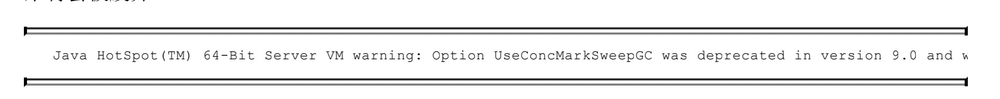
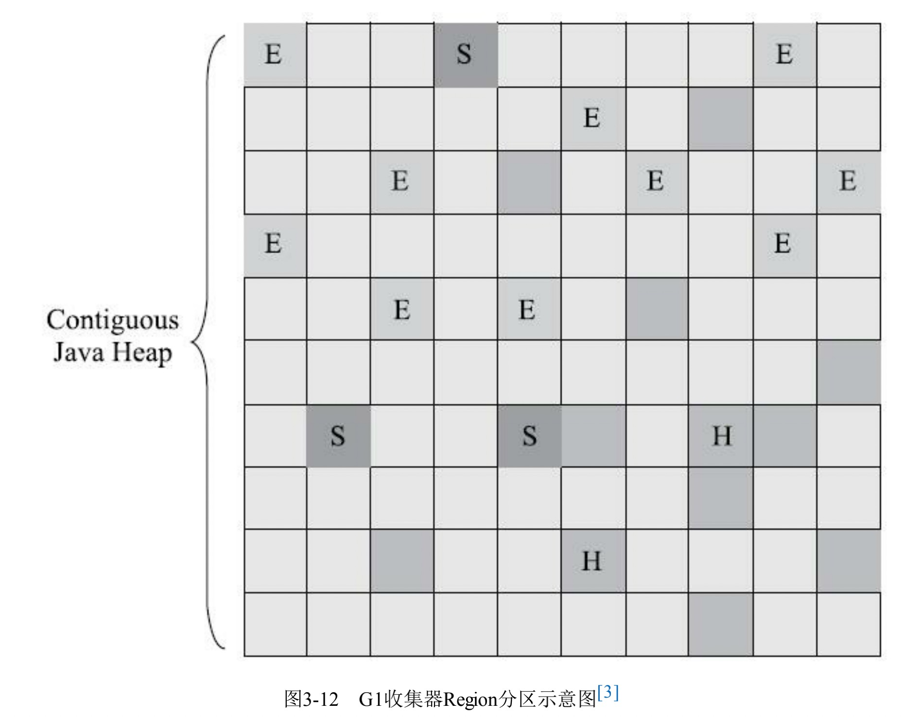
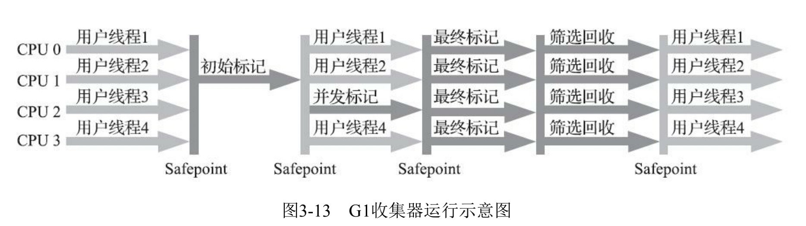
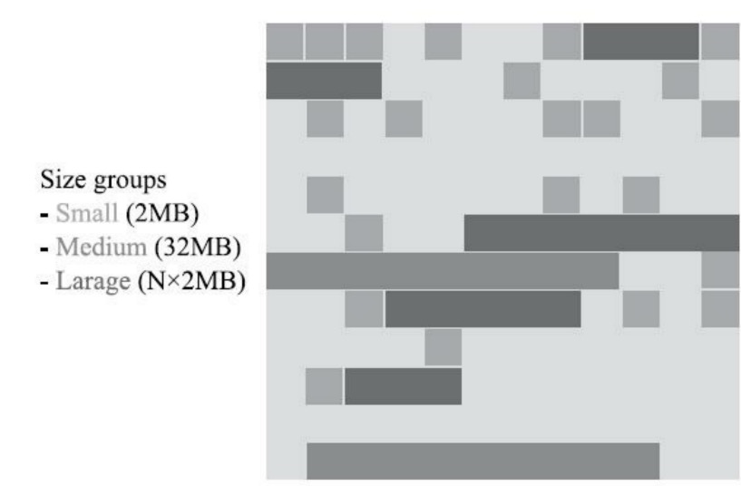
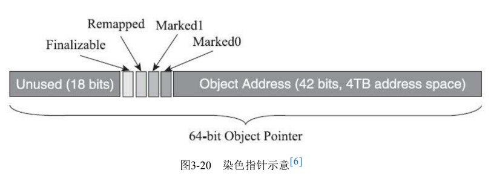
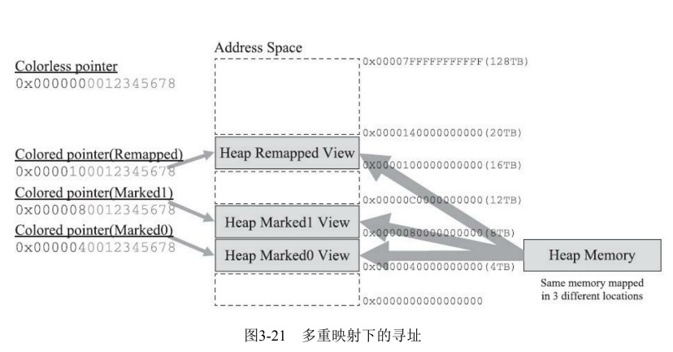
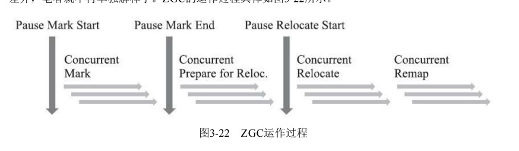

# 方法区

方法区(MethodArea)与Java堆一样，是各个线程共享的内存区域，它用于存储已被虚拟机加载的类型信息、常量、静态变量、即时编译器编译后的代码缓存等数据。虽然《Java虚拟机规范》中把方法区描述为堆的一个逻辑部分，但是它却有一个别名叫作“非堆”(Non-Heap)，目的是与Java堆区分开来。

在JDK6的时候HotSpot开发团队就有放弃永久代，逐步改为采用本地内存(NativeMemory)来实现方法区的计划了，到了JDK7的HotSpot，已经把原本放在永久代的**字符串常量池、静态变量**等移出，而到了JDK8，终于完全废弃了永久代的概念，改用与JRockit、J9一样在本地内存中实现的元空间(Meta-space)来代替，把JDK7中永久代还剩余的内容(主要是类型信息)全部移到元空间中。

### 运行时常量池

运行时常量池(RuntimeConstantPool)是方法区的一部分。Class文件中除了有类的版本、字段、方法、接口等描述信息外，还有一项信息是常量池表(ConstantPoolTable)，**用于存放编译期生成的各种字面量与符号引用**，这部分内容将在类加载后存放到方法区的运行时常量池中。


# JVM运行时数据区

## 栈

### 动态连接

**每个栈帧都包含一个指向运行时常量池中该栈帧所属方法的引用**，持有这个引用是为了支持方法调用过程中的动态连接(DynamicLinking)。我们知道Class文件的常量池中存有大量的符号引用，字节码中的方法调用指令就以常量池里指向方法的符号引用作为参数。这些符号引用一部分会在类加载阶段或者第一次使用的时候就被转化为直接引用，这种转化被称为**静态解析**。另外一部分将在每一次运行期间都转化为直接引用，这部分就称为**动态连接**。

调用不同类型的方法，字节码指令集里设计了不同的指令。在Java虚拟机支持以下5条方法调用字 节码指令，分别是： 

1. ·invokestatic。用于调用静态方法。 
2. ·invokespecial。用于调用实例构造器<init>()方法、私有方法和父类中的方法。 
3. ·invokevirtual。用于调用所有的虚方法。 
4. ·invokeinterface。用于调用接口方法，会在运行时再确定一个实现该接口的对象。 
5. ·invokedynamic。先在运行时动态解析出调用点限定符所引用的方法，然后再执行该方法。前面4 条调用指令，分派逻辑都固化在Java虚拟机内部，而invokedynamic指令的分派逻辑是由用户设定的引导方法来决定的。 

# 编译器常用的8种优化方法

## **1、常量传播**

常量传播，就是说在编译期时，能够直接计算出结果（这个结果往往是常量）的变量，将被编译器由直接计算出的结果常量来替换这个变量。

例：

```java
intmain(intargc,char**argv){intx=1;std::cout<<x<<std::endl;return0;}
```

上例种，编译器会直接用常量1替换变量x，优化成：

```java
intmain(intargc,char**argv){std::cout<<1<<std::endl;return0;}
```

## **2、常量折叠**

常量折叠，就是说在编译期间，如果有可能，多个变量的计算可以最终替换为一个变量的计算，通常是多个变量的多级冗余计算被替换为一个变量的一级计算

例：

```
intmain(intargc,char**argv){inta=1;intb=2;intx=a+b;std::cout<<x<<std::endl;return0;}
```

常量折叠优化后：

```
intmain(intargc,char**argv){intx=1+2;std::cout<<x<<std::endl;return0;}
```

当然，可以再进行进一步的常量替换优化：

```
intmain(intargc,char**argv){std::cout<<3<<std::endl;return0;}
```

通常，编译优化是一件综合且连贯一致的复杂事情，下文就不再赘述了。

## **3、复写传播**

复写传播，就是编译器用一个变量替换两个或多个相同的变量。

例：

```
intmain(intargc,char**argv){inty=1;intx=y;std::cout<<x<<std::endl;return0;}
```

优化后：

```
intmain(intargc,char**argv){intx=1;std::cout<<x<<std::endl;return0;}
```

上例有两个变量y和x，但是其实是两个相同的变量，并且其它地方并未区分它们两个，所以它们是重复的，可称为“复写”，编译器可以将其优化，将x“传播”给y，只剩下一个变量x，当然，反过来优化掉x只剩下一个y也是可以的。

## **4、公共子表式消除**

公共子表达式消除是说，如果一个表达式E已经计算过了，并且从先前的计算到现在的E中的变量都没有发生变化，那么E的此次出现就成为了公共子表达式，因此，编译器可判断其不需要再次进行计算浪费性能。

例：

```
intmain(intargc,char**argv){inta=1;intb=2;intx=（a+b)*2+(b+a)*6;std::cout<<x<<std::endl;return0;}
```

优化后：

```
intmain(intargc,char**argv){inta=1;intb=2;intE=a+b;intx=E*2+E*6;std::cout<<x<<std::endl;return0;}
```

当然，也有可能会直接变成：

```
intmain(intargc,char**argv){inta=1;intb=2;intE=a+b;intx=E*8;std::cout<<x<<std::endl;return0;}
```

## **5、无用代码消除**

无用代码消除指的是永远不能被执行到的代码或者没有任何意义的代码会被清除掉，比如return之后的语句，变量自己给自己赋值等等。

例：

```
intmain(intargc,char**argv){intx=1;intx=x;std::cout<<x<<std::endl;return0;}
```

上例中，x变量自我赋值显然是无用代码，将会被优化掉：

```
intmain(intargc,char**argv){intx=1;std::cout<<x<<std::endl;return0;}
```

## **6、数组范围检查消除**

如果开发语言是Java这种动态类型安全型的，那在访问数组时比如array[]时，Java不会像C/C++那样只是存粹的裸指针访问，而是会在运行时访问数组元素前进行一次是否越界检查，这将会带来许多开销，如果即时编译器能根据数据流分析出变量的取值范围在[0,array.length]之间，那么在循环期间就可以把数组的上下边界检查消除，以减少不必要的性能损耗。

## **7、方法内联**

这种优化方法是将比较简短的函数或者方法代码直接粘贴到其调用者中，以减少函数调用时的开销，比较重要且常用，很容易理解，就比如C++的inline关键字一样，只不过inline是开发者的手动方法内联，而编译器在分析代码和数据流之后，也有可能做出自动inline的优化。

## **8、逃逸分析**

一个对象如果被其声明的方法之外的一个或多个函数所引用，那就被称为逃逸，可以通俗理解为，该对象逃逸了其原本的命名空间或者作用域，使得声明（或者定义）该对象的方法结束时，该对象不能被销毁。

通常，一个函数里的局部变量其内存空间是在栈上分配的，而对象则是在堆上分配的内存空间，在函数调用结束时，局部变量会随着栈空间销毁而自动销毁，但堆上的空间要么是依赖类似JVM的垃圾内存自动回收机制（GC），要么就得像C/C++那样的依赖开发者本身的记忆力，因此，堆上的内存分配与销毁一般开销会比栈上的大得多。

逃逸分析的基本原理就是分析对象动态作用域。如果确定一个方法不会逃逸出方法之外，那让整个对象在栈上分配内存将会是一个很不错的主意，对象所占用的内存空间就可以随栈帧而销毁。在一般应用中，不会逃逸的局部对象所占用的比例很大，如果能在编译器优化时，为其在栈上分配内存空间，那大量的对象就会随着方法结束而自动销毁了，不用依赖前面讲的GC或者记忆力，系统的压力将会小很多。

**栈上分配（StackAllocations）**：在Java虚拟机中，Java堆上分配创建对象的内存空间几乎是Java程序员都知道的常识，Java堆中的对象对于各个线程都是共享和可见的，只要持有这个对象的引用，就可以访问到堆中存储的对象数据。虚拟机的垃圾收集子系统会回收堆中不再使用的对象，但回收动作无论是标记筛选出可回收对象，还是回收和整理内存，都需要耗费大量资源。如果确定一个对象不会逃逸出线程之外，那让这个对象在栈上分配内存将会是一个很不错的主意，对象所占用的内存空间就可以随栈帧出栈而销毁。在一般应用中，完全不会逃逸的局部对象和不会逃逸出线程的对象所占的比例是很大的，如果能使用栈上分配，那大量的对象就会随着方法的结束而自动销毁了，垃圾收集子系统的压力将会下降很多。**栈上分配可以支持方法逃逸，但不能支持线程逃逸。**

**标量替换（ScalarReplacement）**：若一个数据已经无法再分解成更小的数据来表示了，Java虚拟机中的**原始数据类型（int、long等数值类型及reference类型等）**都不能再进一步分解了，那么这些数据就可以被称为标量。相对的，如果一个数据可以继续分解，那它就被称为**聚合量（Aggregate）**，Java中的对象就是典型的聚合量。如果把一个Java对象拆散，根据程序访问的情况，将其用到的成员变量恢复为原始类型来访问，这个过程就称为标量替换。假如逃逸分析能够证明一个对象不会被方法外部访问，并且这个对象可以被拆散，那么程序真正执行的时候将可能不去创建这个对象，而改为直接创建它的若干个被这个方法使用的成员变量来代替。将对象拆分后，除了可以让对象的成员变量在栈上（栈上存储的数据，很大机会被虚拟机分配至物理机器的高速寄存器中存储）分配和读写之外，还可以为后续进一步的优化手段创建条件。标量替换可以视作栈上分配的一种特例，实现更简单（不用考虑整个对象完整结构的分配），但对逃逸程度的要求更高，它不允许对象逃逸出方法范围内。

**同步消除（SynchronizationElimination）**：线程同步本身是一个相对耗时的过程，如果逃逸分析能够确定一个变量不会逃逸出线程，无法被其他线程访问，那么这个变量的读写肯定就不会有竞争，对这个变量实施的同步措施也就可以安全地消除掉。


# quasar

（java引用纤程，协程，目的是为了追求最大力度发挥硬件性能和提升软件的速度，避免上下文切换）

```java
<!--https://mvnrepository.com/artifact/co.paralleluniverse/quasar-core-->
<dependency>
<groupId>co.paralleluniverse</groupId>
<artifactId>quasar-core</artifactId>
<version>0.8.0</version>
</dependency>
```


# Class文件结构

根据《Java虚拟机规范》的规定，Class文件格式采用一种类似于C语言结构体的伪结构来存储数据，这种伪结构中只有两种数据类型：**“无符号数”和“表”**。后面的解析都要以这两种数据类型为基础，所以这里笔者必须先解释清楚这两个概念。

- 无符号数属于基本的数据类型，以u1、u2、u4、u8来分别代表1个字节、2个字节、4个字节和8个字节的无符号数，无符号数可以用来描述数字、索引引用、数量值或者按照UTF-8编码构成字符串值。
- 表是由多个无符号数或者其他表作为数据项构成的复合数据类型，为了便于区分，所有表的命名都习惯性地以“_info”结尾。表用于描述有层次关系的复合结构的数据，整个Class文件本质上也可以视作是一张表，这张表由表6-1所示的数据项按严格顺序排列构成。

**前四个字节**是魔数，确定表示作用，确保是否为一个能被虚拟机接受的Class文件。**紧接着4个字节**存储的是Class文件的版本号：第5和第6个字节是次版本号，第7和第8个字节是主版本号。


# Class文件对应JVM指令

```java
public class Singleton {

    /**
     * 查看汇编指令
     * -XX:+UnlockDiagnosticVMOptions -XX:+PrintAssembly -Xcomp
     */
    private volatile static Singleton myinstance;

    /**
     * 双重锁机制保证单例安全
     * @return
     */
    public static Singleton getInstance() {
        if (myinstance == null) {
            synchronized (Singleton.class) {
                if (myinstance == null) {
                    myinstance = new Singleton();
                }
            }
        }
        return myinstance;
    }
}
```

```java
 0 getstatic #2 <com/madm/learnroute/edu/jmm/dcl/Singleton.myinstance : Lcom/madm/learnroute/edu/jmm/dcl/Singleton;>
 3 ifnonnull 37 (+34)
 6 ldc #3 <com/madm/learnroute/edu/jmm/dcl/Singleton>
 8 dup
 9 astore_0
10 monitorenter
11 getstatic #2 <com/madm/learnroute/edu/jmm/dcl/Singleton.myinstance :Lcom/madm/learnroute/edu/jmm/dcl/Singleton;>
14 ifnonnull 27 (+13)
**17 new #3 <com/madm/learnroute/edu/jmm/dcl/Singleton>**
**20 dup**
**21 invokespecial #4 <com/madm/learnroute/edu/jmm/dcl/Singleton.<init> : ()V>**

<u>**Invoke instance method; direct invocation of instance initialization methods and methods of the current class and its supertypes**</u>

**24 putstatic #2 <com/madm/learnroute/edu/jmm/dcl/Singleton.myinstance :Lcom/madm/learnroute/edu/jmm/dcl/Singleton;>**
27 aload_0
28 monitorexit
29 goto 37 (+8)
32 astore_1
33 aload_0
34 monitorexit
35 aload_1
36 athrow
37 getstatic #2 <com/madm/learnroute/edu/jmm/dcl/Singleton.myinstance :Lcom/madm/learnroute/edu/jmm/dcl/Singleton;>
40 areturn
```

# 生存还是死亡？

​		即使在可达性分析算法中判定为不可达的对象，也不是“非死不可”的，这时候它们暂时还处于“缓 刑”阶段，要真正宣告一个对象死亡，至少要经历两次标记过程：如果对象在进行可达性分析后发现没 有与GC Roots相连接的引用链，那它将会被第一次标记，随后进行一次筛选，**筛选的条件是此对象是否需要执行finalize()方法**。假如对象没有覆盖finalize()方法，或者finalize()方法已经被虚拟机调用 过，那么虚拟机将这两种情况都视为“没有必要执行”。 

​		如果这个对象被判定为确有必要执行finalize()方法，那么该对象将会被放置在一个名为F-Queue的 队列之中，并在稍后由一条由虚拟机自动建立的、低调度优先级的**Finalizer线程**去执行它们的finalize() 方法。这里所说的“执行”是指虚拟机会触发这个方法开始运行，但并不承诺一定会等待它运行结束。 这样做的原因是，如果某个对象的finalize()方法执行缓慢，或者更极端地发生了死循环，将很可能导致F-Queue队列中的其他对象永久处于等待，甚至导致整个内存回收子系统的崩溃。finalize()方法是对象逃脱死亡命运的最后一次机会，稍后**收集器将对F-Queue中的对象进行第二次小规模的标记**，如果对象要在finalize()中成功拯救自己——只要重新与引用链上的任何一个对象建立关联即可，譬如把自己 （this关键字）赋值给某个类变量或者对象的成员变量，那在第二次标记时它将被移出“即将回收”的集 合；如果对象这时候还没有逃脱，那基本上它就真的要被回收了。


# 垃圾收集算法

## Garbage First(G1)收集器

Garbage First（简称G1）收集器是垃圾收集器技术发展历史上的里程碑式的成果，它开创了收集器面向局部收集的设计思路和基于Region的内存布局形式。早在JDK7刚刚确立项目目标、Oracle公司制定的JDK 7 RoadMap里面，G1收集器就被视作JDK 7中HotSpot虚拟机的一项重要进化特征。从JDK6 Update 14开始就有Early Access版本的G1收集器供开发人员实验和试用，但由此开始G1收集器的“实验状态”（Experimental）持续了数年时间，直至JDK 7 Update 4，Oracle才认为它达到足够成熟的商用 程度，移除了“Experimental”的标识；到了JDK 8 Update 40的时候，**G1提供并发的类卸载的支持**，补全了其计划功能的最后一块拼图。这个版本以后的G1收集器才被Oracle官方称为“全功能的垃圾收集器”（Fully-Featured Garbage Collector）。

**G1是一款主要面向服务端应用的垃圾收集器**。HotSpot开发团队最初赋予它的期望是（在比较长期的）未来可以替换掉JDK 5中发布的CMS收集器。现在这个期望目标已经实现过半了，JDK 9发布之日，G1宣告取代Parallel Scavenge加Parallel Old组合，成为服务端模式下的默认垃圾收集器，而CMS则沦落至被声明为不推荐使用（Deprecate）的收集器[1]。如果对JDK 9及以上版本的HotSpot虚拟机使用参数-XX：+UseConcMarkSweepGC来开启CMS收集器的话，用户会收到一个警告信息，提示CMS未来将会被废弃： 



Java HotSpot(TM) 64-Bit Server VM warning: Option UseConcMarkSweepGC was deprecated in version 9.0 and will likely be removed in a future release. 

​		但作为一款曾被广泛运用过的收集器，经过多个版本的开发迭代后，CMS（以及之前几款收集器）的代码与HotSpot的内存管理、执行、编译、监控等子系统都有千丝万缕的联系，这是历史原因导致的，并不符合职责分离的设计原则。为此，**规划JDK10功能目标时，HotSpot虚拟机提出了“统一垃圾收集器接口”，将内存回收的“行为”与“实现”进行分离**，CMS以及其他收集器都重构成基于这套接口的一种实现。以此为基础，日后要移除或者加入某一款收集器，都会变得容易许多，风险也可以控制，这算是在为CMS退出历史舞台铺下最后的道路了。 

​		作为CMS收集器的替代者和继承人，设计者们希望做出一款能够建立起“停顿时间模型”（PausePrediction Model）的收集器，停顿时间模型的意思是能够支持指定在一个长度为M毫秒的时间片段内，消耗在垃圾收集上的时间大概率不超过N毫秒这样的目标，这几乎已经是实时Java（RTSJ）的中软实时垃圾收集器特征了。 

​		那具体要怎么做才能实现这个目标呢？首先要有一个思想上的改变，在G1收集器出现之前的所有其他收集器，包括CMS在内，垃圾收集的目标范围要么是整个新生代（Minor GC），要么就是整个老年代（Major GC），再要么就是整个Java堆（Full GC）。而G1跳出了这个樊笼，它可以面向堆内存任何部分来组成回收集（Collection Set，一般简称CSet）进行回收，衡量标准不再是它属于哪个分代，而是哪块内存中存放的垃圾数量最多，回收收益最大，这就是G1收集器的Mixed GC模式。G1开创的基于Region的堆内存布局是它能够实现这个目标的关键。虽然G1也仍是遵循分代收集理论设计的，但其堆内存的布局与其他收集器有非常明显的差异：G1不再坚持固定大小以及固定数量的分代区域划分，而是把连续的Java堆划分为多个大小相等的独立区域（Region），每一个Region都可以根据需要，扮演新生代的Eden空间、Survivor空间，或者老年代空间。收集器能够对扮演不同角色的Region采用不同的策略去处理，这样无论是新创建的对象还是已经存活了一段时间、熬过多次收集的旧对象都能获取很好的收集效果。Region中还有一类特殊的Humongous区域，专门用来存储大对象。G1认为只要大小超过了一个Region容量一半的对象即可判定为大对象。每个Region的大小可以通过参数-XX：G1HeapRegionSize设定，取值范围为1MB～32MB，且应为2的N次幂。而对于那些超过了整个Region容量的超级大对象，将会被存放在N个连续的Humongous Region之中，G1的大多数行为都把Humongous Region作为老年代的一部分来进行看待，如图3-12所示。 



​		虽然G1仍然保留新生代和老年代的概念，但新生代和老年代不再是固定的了，它们都是一系列区域（不需要连续）的动态集合。G1收集器之所以能建立可预测的停顿时间模型，是因为它将Region作为单次回收的最小单元，即每次收集到的内存空间都是Region大小的整数倍，这样可以有计划地避免在整个Java堆中进行全区域的垃圾收集。更具体的处理思路是让G1收集器去跟踪各个Region里面的垃圾堆积的“价值”大小，价值即回收所获得的空间大小以及回收所需时间的经验值，然后在后台维护一个优先级列表，每次根据用户设定允许的收集停顿时间（使用参数-XX：MaxGCPauseMillis指定，默认值是200毫秒），优先处理回收价值收益最大的那些Region，这也就是“Garbage First”名字的由来。这种使用Region划分内存空间，以及具有优先级的区域回收方式，保证了G1收集器在有限的时间内获取尽可能高的收集效率。图3-12 G1收集器Region分区示意图[3]

​		G1将堆内存“化整为零”的“解题思路”，看起来似乎没有太多令人惊讶之处，也完全不难理解，但其中的实现细节可是远远没有想象中那么简单，否则就不会从2004年Sun实验室发表第一篇关于G1的论文后一直拖到2012年4月JDK 7 Update 4发布，用将近10年时间才倒腾出能够商用的G1收集器来。G1收集器至少有（不限于）以下这些关键的细节问题需要妥善解决：

​		·譬如，将Java堆分成多个独立Region后，Region里面存在的跨Region引用对象如何解决？解决的思路我们已经知道（见3.3.1节和3.4.4节）：使用记忆集避免全堆作为GC Roots扫描，但在G1收集器上记忆集的应用其实要复杂很多，它的每个Region都维护有自己的记忆集，这些记忆集会记录下别的Region指向自己的指针，并标记这些指针分别在哪些卡页的范围之内。G1的记忆集在存储结构的本质上是一种哈希表，Key是别的Region的起始地址，Value是一个集合，里面存储的元素是卡表的索引号。这种“双向”的卡表结构（卡表是“我指向谁”，这种结构还记录了“谁指向我”）比原来的卡表实现起来更复杂，同时由于Region数量比传统收集器的分代数量明显要多得多，因此G1收集器要比其他的传统垃圾收集器有着更高的内存占用负担。根据经验，G1至少要耗费大约相当于Java堆容量10%至20%的额外内存来维持收集器工作。 

​		·譬如，在并发标记阶段如何保证收集线程与用户线程互不干扰地运行？这里首先要解决的是用户线程改变对象引用关系时，必须保证其不能打破原本的对象图结构，导致标记结果出现错误，该问题的解决办法笔者已经抽出独立小节来讲解过（见3.4.6节）：CMS收集器采用增量更新算法实现，而G1收集器则是通过原始快照（SATB）算法来实现的。此外，垃圾收集对用户线程的影响还体现在回收过程中新创建对象的内存分配上，程序要继续运行就肯定会持续有新对象被创建，G1为每一个Region设计了两个名为TAMS（Top at Mark Start）的指针，把Region中的一部分空间划分出来用于并发回收过程中的新对象分配，并发回收时新分配的对象地址都必须要在这两个指针位置以上。G1收集器默认在这个地址以上的对象是被隐式标记过的，即默认它们是存活的，不纳入回收范围。与CMS中的“Concurrent Mode Failure”失败会导致Full GC类似，如果内存回收的速度赶不上内存分配的速度，G1收集器也要被迫冻结用户线程执行，导致Full GC而产生长时间“Stop The World”。

​		·譬如，怎样建立起可靠的停顿预测模型？用户通过-XX：MaxGCPauseMillis参数指定的停顿时间只意味着垃圾收集发生之前的期望值，但G1收集器要怎么做才能满足用户的期望呢？G1收集器的停顿预测模型是以衰减均值（Decaying Average）为理论基础来实现的，在垃圾收集过程中，G1收集器会记录每个Region的回收耗时、每个Region记忆集里的脏卡数量等各个可测量的步骤花费的成本，并分析得出平均值、标准偏差、置信度等统计信息。这里强调的“衰减平均值”是指它会比普通的平均值更容易受到新数据的影响，平均值代表整体平均状态，但衰减平均值更准确地代表“最近的”平均状态。换句话说，Region的统计状态越新越能决定其回收的价值。然后通过这些信息预测现在开始回收的话，由哪些Region组成回收集才可以在不超过期望停顿时间的约束下获得最高的收益。 

​		如果我们不去计算用户线程运行过程中的动作（如使用写屏障维护记忆集的操作），G1收集器的运作过程大致可划分为以下四个步骤：

**·初始标记（Initial Marking）**：仅仅只是标记一下GC Roots能直接关联到的对象，并且修改TAMS指针的值，让下一阶段用户线程并发运行时，能正确地在可用的Region中分配新对象。这个阶段需要停顿线程，但耗时很短，而且是借用进行Minor GC的时候同步完成的，所以G1收集器在这个阶段实际并没有额外的停顿。 

**·并发标记（Concurrent Marking）**：从GC Root开始对堆中对象进行可达性分析，递归扫描整个堆里的对象图，找出要回收的对象，这阶段耗时较长，但可与用户程序并发执行。当对象图扫描完成以后，还要重新处理SATB记录下的在并发时有引用变动的对象。 

**·最终标记（Final Marking）**：对用户线程做另一个短暂的暂停，用于处理并发阶段结束后仍遗留下来的最后那少量的SATB记录。 

**·筛选回收（Live Data Counting and Evacuation）**：负责更新Region的统计数据，对各个Region的回收价值和成本进行排序，根据用户所期望的停顿时间来制定回收计划，可以自由选择任意多个Region构成回收集，然后把决定回收的那一部分Region的存活对象复制到空的Region中，再清理掉整个旧Region的全部空间。这里的操作涉及存活对象的移动，是必须暂停用户线程，由多条收集器线程并行完成的。

​		从上述阶段的描述可以看出，G1收集器除了并发标记外，其余阶段也是要完全暂停用户线程的，换言之，它并非纯粹地追求低延迟，官方给它设定的目标是在延迟可控的情况下获得尽可能高的吞吐量，所以才能担当起“全功能收集器”的重任与期望[4]。

​		从Oracle官方透露出来的信息可获知，回收阶段（Evacuation）其实本也有想过设计成与用户程序一起并发执行，但这件事情做起来比较复杂，考虑到G1只是回收一部分Region，停顿时间是用户可控制的，所以并不迫切去实现，而选择把这个特性放到了G1之后出现的低延迟垃圾收集器（即ZGC）中。另外，还考虑到G1不是仅仅面向低延迟，停顿用户线程能够最大幅度提高垃圾收集效率，为了保证吞吐量所以才选择了完全暂停用户线程的实现方案。通过图3-13可以比较清楚地看到G1收集器的运作步骤中并发和需要停顿的阶段。图3-13 G1收集器运行示意图 



​		毫无疑问，可以由用户指定期望的停顿时间是G1收集器很强大的一个功能，设置不同的期望停顿时间，可使得G1在不同应用场景中取得关注吞吐量和关注延迟之间的最佳平衡。不过，这里设置的“期望值”必须是符合实际的，不能异想天开，毕竟G1是要冻结用户线程来复制对象的，这个停顿时间再怎么低也得有个限度。它默认的停顿目标为两百毫秒，一般来说，回收阶段占到几十到一百甚至接近两百毫秒都很正常，但如果我们把停顿时间调得非常低，譬如设置为二十毫秒，很可能出现的结果就是由于停顿目标时间太短，导致每次选出来的回收集只占堆内存很小的一部分，收集器收集的速度逐渐跟不上分配器分配的速度，导致垃圾慢慢堆积。很可能一开始收集器还能从空闲的堆内存中获得一些喘息的时间，但应用运行时间一长就不行了，最终占满堆引发Full GC反而降低性能，所以通常把期望停顿时间设置为一两百毫秒或者两三百毫秒会是比较合理的。 

​		从G1开始，最先进的垃圾收集器的设计导向都不约而同地变为追求能够应付应用的内存分配速率（Allocation Rate），而不追求一次把整个Java堆全部清理干净。这样，应用在分配，同时收集器在收集，只要收集的速度能跟得上对象分配的速度，那一切就能运作得很完美。这种新的收集器设计思路从工程实现上看是从G1开始兴起的，所以说G1是收集器技术发展的一个里程碑。

​		G1收集器常会被拿来与CMS收集器互相比较，毕竟它们都非常关注停顿时间的控制，官方资料[5]中将它们两个并称为“The Mostly Concurrent Collectors”。在未来，G1收集器最终还是要取代CMS的，而当下它们两者并存的时间里，分个高低优劣就无可避免。 

​		相比CMS，G1的优点有很多，暂且不论可以指定最大停顿时间、分Region的内存布局、按收益动态确定回收集这些创新性设计带来的红利，单从最传统的算法理论上看，G1也更有发展潜力。与CMS的“标记-清除”算法不同，G1从整体来看是基于“标记-整理”算法实现的收集器，但从局部（两个Region之间）上看又是基于“标记-复制”算法实现，无论如何，这两种算法都意味着G1运作期间不会产生内存空间碎片，垃圾收集完成之后能提供规整的可用内存。这种特性有利于程序长时间运行，在程序为大 对象分配内存时不容易因无法找到连续内存空间而提前触发下一次收集。

​		不过，G1相对于CMS仍然不是占全方位、压倒性优势的，从它出现几年仍不能在所有应用场景中代替CMS就可以得知这个结论。比起CMS，G1的弱项也可以列举出不少，如在用户程序运行过程中，G1无论是为了垃圾收集产生的内存占用（Footprint）还是程序运行时的额外执行负载（Overload）都要比CMS要高。

​		就内存占用来说，虽然G1和CMS都使用卡表来处理跨代指针，但G1的卡表实现更为复杂，而且堆中每个Region，无论扮演的是新生代还是老年代角色，都必须有一份卡表，这导致G1的记忆集（和其他内存消耗）可能会占整个堆容量的20%乃至更多的内存空间；相比起来CMS的卡表就相当简单，只有唯一一份，而且只需要处理老年代到新生代的引用，反过来则不需要，由于新生代的对象具有朝生夕灭的不稳定性，引用变化频繁，能省下这个区域的维护开销是很划算的[6]。

​		在执行负载的角度上，同样由于两个收集器各自的细节实现特点导致了用户程序运行时的负载会有不同，譬如它们都使用到写屏障，CMS用写后屏障来更新维护卡表；而G1除了使用写后屏障来进行同样的（由于G1的卡表结构复杂，其实是更烦琐的）卡表维护操作外，为了实现原始快照搜索（SATB）算法，还需要使用写前屏障来跟踪并发时的指针变化情况。相比起增量更新算法，原始快照搜索能够减少并发标记和重新标记阶段的消耗，避免CMS那样在最终标记阶段停顿时间过长的缺点，但是在用户程序运行过程中确实会产生由跟踪引用变化带来的额外负担。由于G1对写屏障的复杂操作要比CMS消耗更多的运算资源，所以CMS的写屏障实现是直接的同步操作，而G1就不得不将其实现为类似于消息队列的结构，把写前屏障和写后屏障中要做的事情都放到队列里，然后再异步处理。

​		以上的优缺点对比仅仅是针对G1和CMS两款垃圾收集器单独某方面的实现细节的定性分析，通常我们说哪款收集器要更好、要好上多少，往往是针对具体场景才能做的定量比较。按照笔者的实践经验，目前在小内存应用上CMS的表现大概率仍然要会优于G1，而在大内存应用上G1则大多能发挥其优势，这个优劣势的Java堆容量平衡点通常在6GB至8GB之间，当然，以上这些也仅是经验之谈，不同应用需要量体裁衣地实际测试才能得出最合适的结论，随着HotSpot的开发者对G1的不断优化，也会让对比结果继续向G1倾斜。 


## ZGC收集器 

​		ZGC（“Z”并非什么专业名词的缩写，这款收集器的名字就叫作Z Garbage Collector）是一款在 JDK 11中新加入的具有实验性质[1]的低延迟垃圾收集器，是由Oracle公司研发的。2018年Oracle创建了 JEP 333将ZGC提交给OpenJDK，推动其进入OpenJDK 11的发布清单之中。

​		 ZGC和Shenandoah的目标是高度相似的，都希望在尽可能对吞吐量影响不太大的前提下[2]，实现 在任意堆内存大小下都可以把垃圾收集的停顿时间限制在十毫秒以内的低延迟。但是ZGC和 Shenandoah的实现思路又是差异显著的，如果说RedHat公司开发的Shen-andoah像是Oracle的G1收集器 的实际继承者的话，那Oracle公司开发的ZGC就更像是Azul System公司独步天下的PGC（Pauseless GC）和C4（Concurrent Continuously CompactingCollector）收集器的同胞兄弟。 

​		早在2005年，运行在Azul VM上的PGC就已经实现了标记和整理阶段都全程与用户线程并发运行 的垃圾收集，而运行在Zing VM上的C4收集器是PGC继续演进的产物，主要增加了分代收集支持，大 幅提升了收集器能够承受的对象分配速度。无论从算法还是实现原理上来讲，PGC和C4肯定算是一脉 相承的，而ZGC虽然并非Azul公司的产品，但也应视为这条脉络上的另一个节点，因为ZGC几乎所有 的关键技术上，与PGC和C4都只存在术语称谓上的差别，实质内容几乎是一模一样的。相信到这里读 者应该已经对Java虚拟机收集器常见的专业术语都有所了解了，如果不避讳专业术语的话，我们可以 给ZGC下一个这样的定义来概括它的主要特征：ZGC收集器是一款基于Region内存布局的，（暂时） 不设分代的，使用了读屏障、染色指针和内存多重映射等技术来实现可并发的标记-整理算法的，以低 延迟为首要目标的一款垃圾收集器。接下来，笔者将逐项来介绍ZGC的这些技术特点。

​		 首先从ZGC的内存布局说起。与Shenandoah和G1一样，ZGC也采用基于Region的堆内存布局，但 与它们不同的是，ZGC的Region（在一些官方资料中将它称为Page或者ZPage，本章为行文一致继续称 为Region）具有动态性——动态创建和销毁，以及动态的区域容量大小。在x64硬件平台下，ZGC的 Region可以具有如图3-19所示的大、中、小三类容量： 

·小型Region（Small Region）：容量固定为2MB，用于放置小于256KB的小对象。 

·中型Region（Medium Region）：容量固定为32MB，用于放置大于等于256KB但小于4MB的对 象。

·大型Region（Large Region）：容量不固定，可以动态变化，但必须为2MB的整数倍，用于放置 4MB或以上的大对象。每个大型Region中只会存放一个大对象，这也预示着虽然名字叫作“大型 Region”，但它的实际容量完全有可能小于中型Region，最小容量可低至4MB。大型Region在ZGC的实 现中是不会被重分配（重分配是ZGC的一种处理动作，用于复制对象的收集器阶段，稍后会介绍到） 的，因为复制一个大对象的代价非常高昂。



​		接下来是ZGC的核心问题——并发整理算法的实现。Shenandoah使用转发指针和读屏障来实现并 发整理，ZGC虽然同样用到了读屏障，但用的却是一条与Shenandoah完全不同，更加复杂精巧的解题 思路。

​		ZGC收集器有一个标志性的设计是它采用的染色指针技术（Colored Pointer，其他类似的技术中可 能将它称为Tag Pointer或者Version Pointer）。从前，如果我们要在对象上存储一些额外的、只供收集 器或者虚拟机本身使用的数据，通常会在对象头中增加额外的存储字段（详见2.3.2节的内容），如对 象的哈希码、分代年龄、锁记录等就是这样存储的。这种记录方式在有对象访问的场景下是很自然流 畅的，不会有什么额外负担。但如果对象存在被移动过的可能性，即不能保证对象访问能够成功呢？ 又或者有一些根本就不会去访问对象，但又希望得知该对象的某些信息的应用场景呢？能不能从指针 或者与对象内存无关的地方得到这些信息，譬如是否能够看出来对象被移动过？这样的要求并非不合 理的刁难，先不去说并发移动对象可能带来的可访问性问题，此前我们就遇到过这样的要求——追踪 式收集算法的标记阶段就可能存在只跟指针打交道而不必涉及指针所引用的对象本身的场景。例如对 象标记的过程中需要给对象打上三色标记（见3.4.6节），这些标记本质上就只和对象的引用有关，而 与对象本身无关——某个对象只有它的引用关系能决定它存活与否，对象上其他所有的属性都不能够 影响它的存活判定结果。HotSpot虚拟机的几种收集器有不同的标记实现方案，有的把标记直接记录在 对象头上（如Serial收集器），有的把标记记录在与对象相互独立的数据结构上（如G1、Shenandoah使 用了一种相当于堆内存的1/64大小的，称为BitMap的结构来记录标记信息），而ZGC的染色指针是最 直接的、最纯粹的，它直接把标记信息记在引用对象的指针上，这时，与其说可达性分析是遍历对象
图来标记对象，还不如说是遍历“引用图”来标记“引用”了。

​		染色指针是一种直接将少量额外的信息存储在指针上的技术，可是为什么指针本身也可以存储额 外信息呢？在64位系统中，理论可以访问的内存高达16EB（2的64次幂）字节[3]。实际上，基于需求 （用不到那么多内存）、性能（地址越宽在做地址转换时需要的页表级数越多）和成本（消耗更多晶 体管）的考虑，在AMD64架构[4]中只支持到52位（4PB）的地址总线和48位（256TB）的虚拟地址空 间，所以目前64位的硬件实际能够支持的最大内存只有256TB。此外，操作系统一侧也还会施加自己 的约束，64位的Linux则分别支持47位（128TB）的进程虚拟地址空间和46位（64TB）的物理地址空 间，64位的Windows系统甚至只支持44位（16TB）的物理地址空间。

​		尽管Linux下64位指针的高18位不能用来寻址，但剩余的46位指针所能支持的64TB内存在今天仍 然能够充分满足大型服务器的需要。鉴于此，ZGC的染色指针技术继续盯上了这剩下的46位指针宽 度，将其高4位提取出来存储四个标志信息。通过这些标志位，虚拟机可以直接从指针中看到其引用对 象的三色标记状态、是否进入了重分配集（即被移动过）、是否只能通过finalize()方法才能被访问 到，如图3-20所示。当然，由于这些标志位进一步压缩了原本就只有46位的地址空间，也直接导致 ZGC能够管理的内存不可以超过4TB（2的42次幂）[5]。




​		虽然染色指针有4TB的内存限制，不能支持32位平台，不能支持压缩指针（-XX： +UseCompressedOops）等诸多约束，但它带来的收益也是非常可观的，在JEP 333的描述页[7]中， ZGC的设计者Per Liden在“描述”小节里花了全文过半的篇幅来陈述染色指针的三大优势： 

​		·染色指针可以使得一旦某个Region的存活对象被移走之后，这个Region立即就能够被释放和重用 掉，而不必等待整个堆中所有指向该Region的引用都被修正后才能清理。这点相比起Shenandoah是一个 颇大的优势，使得理论上只要还有一个空闲Region，ZGC就能完成收集，而Shenandoah需要等到引用 更新阶段结束以后才能释放回收集中的Region，这意味着堆中几乎所有对象都存活的极端情况，需要 1∶1复制对象到新Region的话，就必须要有一半的空闲Region来完成收集。至于为什么染色指针能够导 致这样的结果，笔者将在后续解释其“自愈”特性的时候进行解释。 

​		·染色指针可以大幅减少在垃圾收集过程中内存屏障的使用数量，设置内存屏障，尤其是写屏障的 目的通常是为了记录对象引用的变动情况，如果将这些信息直接维护在指针中，显然就可以省去一些 专门的记录操作。实际上，到目前为止ZGC都并未使用任何写屏障，只使用了读屏障（一部分是染色
指针的功劳，一部分是ZGC现在还不支持分代收集，天然就没有跨代引用的问题）。内存屏障对程序 运行时性能的损耗在前面章节中已经讲解过，能够省去一部分的内存屏障，显然对程序运行效率是大 有裨益的，所以ZGC对吞吐量的影响也相对较低。

​		 ·染色指针可以作为一种可扩展的存储结构用来记录更多与对象标记、重定位过程相关的数据，以 便日后进一步提高性能。现在Linux下的64位指针还有前18位并未使用，它们虽然不能用来寻址，却可 以通过其他手段用于信息记录。如果开发了这18位，既可以腾出已用的4个标志位，将ZGC可支持的 最大堆内存从4TB拓展到64TB，也可以利用其余位置再存储更多的标志，譬如存储一些追踪信息来让 垃圾收集器在移动对象时能将低频次使用的对象移动到不常访问的内存区域。 

​		不过，要顺利应用染色指针有一个必须解决的前置问题：Java虚拟机作为一个普普通通的进程， 这样随意重新定义内存中某些指针的其中几位，操作系统是否支持？处理器是否支持？这是很现实的 问题，无论中间过程如何，程序代码最终都要转换为机器指令流交付给处理器去执行，处理器可不会 管指令流中的指针哪部分存的是标志位，哪部分才是真正的寻址地址，只会把整个指针都视作一个内 存地址来对待。这个问题在Solaris/SPARC平台上比较容易解决，因为SPARC硬件层面本身就支持虚拟 地址掩码，设置之后其机器指令直接就可以忽略掉染色指针中的标志位。但在x86-64平台上并没有提 供类似的黑科技，ZGC设计者就只能采取其他的补救措施了，这里面的解决方案要涉及虚拟内存映射 技术，让我们先来复习一下这个x86计算机体系中的经典设计。

​		 在远古时代的x86计算机系统里面，所有进程都是共用同一块物理内存空间的，这样会导致不同进 程之间的内存无法相互隔离，当一个进程污染了别的进程内存后，就只能对整个系统进行复位后才能 得以恢复。为了解决这个问题，从Intel 80386处理器开始，提供了“保护模式”用于隔离进程。在保护模 式下，386处理器的全部32条地址寻址线都有效，进程可访问最高也可达4GB的内存空间，但此时已不 同于之前实模式下的物理内存寻址了，处理器会使用分页管理机制把线性地址空间和物理地址空间分 别划分为大小相同的块，这样的内存块被称为“页”（Page）。通过在线性虚拟空间的页与物理地址空 间的页之间建立的映射表，分页管理机制会进行线性地址到物理地址空间的映射，完成线性地址到物 理地址的转换[8]。如果读者对计算机结构体系了解不多的话，不妨设想这样一个场景来类比：假如你 要去“中山一路3号”这个地址拜访一位朋友，根据你所处城市的不同，譬如在广州或者在上海，是能够 通过这个“相同的地址”定位到两个完全独立的物理位置的，这时地址与物理位置是一对多关系映射。 

​		不同层次的虚拟内存到物理内存的转换关系可以在硬件层面、操作系统层面或者软件进程层面实 现，如何完成地址转换，是一对一、多对一还是一对多的映射，也可以根据实际需要来设计。 Linux/x86-64平台上的ZGC使用了多重映射（Multi-Mapping）将多个不同的虚拟内存地址映射到同一 个物理内存地址上，这是一种多对一映射，意味着ZGC在虚拟内存中看到的地址空间要比实际的堆内 存容量来得更大。把染色指针中的标志位看作是地址的分段符，那只要将这些不同的地址段都映射到 同一个物理内存空间，经过多重映射转换后，就可以使用染色指针正常进行寻址了，效果如图3-21所 示。



​		在某些场景下，多重映射技术确实可能会带来一些诸如复制大对象时会更容易这样的额外好处， 可从根源上讲，ZGC的多重映射只是它采用染色指针技术的伴生产物，并不是专门为了实现其他某种 特性需求而去做的。 

​		接下来，我们来学习ZGC收集器是如何工作的。ZGC的运作过程大致可划分为以下四个大的阶 段。全部四个阶段都是可以并发执行的，仅是两个阶段中间会存在短暂的停顿小阶段，这些小阶段， 譬如初始化GC Root直接关联对象的Mark Start，与之前G1和Shenandoah的Initial Mark阶段并没有什么 差异，笔者就不再单独解释了。ZGC的运作过程具体如图3-22所示。



​		·并发标记（Concurrent Mark）：与G1、Shenandoah一样，并发标记是遍历对象图做可达性分析的 阶段，前后也要经过类似于G1、Shenandoah的初始标记、最终标记（尽管ZGC中的名字不叫这些）的 短暂停顿，而且这些停顿阶段所做的事情在目标上也是相类似的。与G1、Shenandoah不同的是，ZGC 的标记是在指针上而不是在对象上进行的，标记阶段会更新染色指针中的Marked 0、Marked 1标志 位。

​		·并发预备重分配（Concurrent Prepare for Relocate）：这个阶段需要根据特定的查询条件统计得出 本次收集过程要清理哪些Region，将这些Region组成重分配集（Relocation Set）。重分配集与G1收集器 的回收集（Collection Set）还是有区别的，ZGC划分Region的目的并非为了像G1那样做收益优先的增
量回收。相反，ZGC每次回收都会扫描所有的Region，用范围更大的扫描成本换取省去G1中记忆集的 维护成本。因此，ZGC的重分配集只是决定了里面的存活对象会被重新复制到其他的Region中，里面 的Region会被释放，而并不能说回收行为就只是针对这个集合里面的Region进行，因为标记过程是针对 全堆的。此外，在JDK 12的ZGC中开始支持的类卸载以及弱引用的处理，也是在这个阶段中完成的。

​		 ·并发重分配（Concurrent Relocate）：重分配是ZGC执行过程中的核心阶段，这个过程要把重分 配集中的存活对象复制到新的Region上，并为重分配集中的每个Region维护一个转发表（Forward Table），记录从旧对象到新对象的转向关系。得益于染色指针的支持，ZGC收集器能仅从引用上就明 确得知一个对象是否处于重分配集之中，如果用户线程此时并发访问了位于重分配集中的对象，这次 访问将会被预置的内存屏障所截获，然后立即根据Region上的转发表记录将访问转发到新复制的对象 上，并同时修正更新该引用的值，使其直接指向新对象，ZGC将这种行为称为指针的“自愈”（Self- Healing）能力。这样做的好处是只有第一次访问旧对象会陷入转发，也就是只慢一次，对比 Shenandoah的Brooks转发指针，那是每次对象访问都必须付出的固定开销，简单地说就是每次都慢， 因此ZGC对用户程序的运行时负载要比Shenandoah来得更低一些。还有另外一个直接的好处是由于染 色指针的存在，一旦重分配集中某个Region的存活对象都复制完毕后，这个Region就可以立即释放用于 新对象的分配（但是转发表还得留着不能释放掉），哪怕堆中还有很多指向这个对象的未更新指针也 没有关系，这些旧指针一旦被使用，它们都是可以自愈的。

​		 ·并发重映射（Concurrent Remap）：重映射所做的就是修正整个堆中指向重分配集中旧对象的所 有引用，这一点从目标角度看是与Shenandoah并发引用更新阶段一样的，但是ZGC的并发重映射并不 是一个必须要“迫切”去完成的任务，因为前面说过，即使是旧引用，它也是可以自愈的，最多只是第 一次使用时多一次转发和修正操作。重映射清理这些旧引用的主要目的是为了不变慢（还有清理结束 后可以释放转发表这样的附带收益），所以说这并不是很“迫切”。因此，ZGC很巧妙地把并发重映射 阶段要做的工作，合并到了下一次垃圾收集循环中的并发标记阶段里去完成，反正它们都是要遍历所 有对象的，这样合并就节省了一次遍历对象图[9]的开销。一旦所有指针都被修正之后，原来记录新旧 对象关系的转发表就可以释放掉了。 

​		ZGC的设计理念与Azul System公司的PGC和C4收集器一脉相承[10]，是迄今垃圾收集器研究的最 前沿成果，它与Shenandoah一样做到了几乎整个收集过程都全程可并发，短暂停顿也只与GC Roots大 小相关而与堆内存大小无关，因而同样实现了任何堆上停顿都小于十毫秒的目标。 

​		相比G1、Shenandoah等先进的垃圾收集器，ZGC在实现细节上做了一些不同的权衡选择，譬如G1 需要通过写屏障来维护记忆集，才能处理跨代指针，得以实现Region的增量回收。记忆集要占用大量 的内存空间，写屏障也对正常程序运行造成额外负担，这些都是权衡选择的代价。ZGC就完全没有使 用记忆集，它甚至连分代都没有，连像CMS中那样只记录新生代和老年代间引用的卡表也不需要，因 而完全没有用到写屏障，所以给用户线程带来的运行负担也要小得多。可是，必定要有优有劣才会称 作权衡，ZGC的这种选择[11]也限制了它能承受的对象分配速率不会太高，可以想象以下场景来理解 ZGC的这个劣势：ZGC准备要对一个很大的堆做一次完整的并发收集，假设其全过程要持续十分钟以 上（请读者切勿混淆并发时间与停顿时间，ZGC立的Flag是停顿时间不超过十毫秒），在这段时间里 面，由于应用的对象分配速率很高，将创造大量的新对象，这些新对象很难进入当次收集的标记范 围，通常就只能全部当作存活对象来看待——尽管其中绝大部分对象都是朝生夕灭的，这就产生了大 量的浮动垃圾。如果这种高速分配持续维持的话，每一次完整的并发收集周期都会很长，回收到的内 存空间持续小于期间并发产生的浮动垃圾所占的空间，堆中剩余可腾挪的空间就越来越小了。目前唯
一的办法就是尽可能地增加堆容量大小，获得更多喘息的时间。但是若要从根本上提升ZGC能够应对 的对象分配速率，还是需要引入分代收集，让新生对象都在一个专门的区域中创建，然后专门针对这 个区域进行更频繁、更快的收集。Azul的C4收集器实现了分代收集后，能够应对的对象分配速率就比 不分代的PGC收集器提升了十倍之多。

​		 ZGC还有一个常在技术资料上被提及的优点是支持“NUMA-Aware”的内存分配。NUMA（Non- Uniform Memory Access，非统一内存访问架构）是一种为多处理器或者多核处理器的计算机所设计的 内存架构。由于摩尔定律逐渐失效，现代处理器因频率发展受限转而向多核方向发展，以前原本在北 桥芯片中的内存控制器也被集成到了处理器内核中，这样每个处理器核心所在的裸晶（DIE）[12]都有 属于自己内存管理器所管理的内存，如果要访问被其他处理器核心管理的内存，就必须通过Inter- Connect通道来完成，这要比访问处理器的本地内存慢得多。在NUMA架构下，ZGC收集器会优先尝 试在请求线程当前所处的处理器的本地内存上分配对象，以保证高效内存访问。在ZGC之前的收集器 就只有针对吞吐量设计的Parallel Scavenge支持NUMA内存分配[13]，如今ZGC也成为另外一个选择。 

​		在性能方面，尽管目前还处于实验状态，还没有完成所有特性，稳定性打磨和性能调优也仍在进 行，但即使是这种状态下的ZGC，其性能表现已经相当亮眼，从官方给出的测试结果[14]来看，用“令 人震惊的、革命性的ZGC”来形容都不为过。

​		 图3-23和图3-24是ZGC与Parallel Scavenge、G1三款收集器通过SPECjbb 2015[15]的测试结果。在 ZGC的“弱项”吞吐量方面，以低延迟为首要目标的ZGC已经达到了以高吞吐量为目标Parallel Scavenge 的99%，直接超越了G1。如果将吞吐量测试设定为面向SLA（Service Level Agreements）应用 的“Critical Throughput”的话[16]，ZGC的表现甚至还反超了Parallel Scavenge收集器。 

​		而在ZGC的强项停顿时间测试上，它就毫不留情地与Parallel Scavenge、G1拉开了两个数量级的差 距。不论是平均停顿，还是95%停顿、99%停顿、99.9%停顿，抑或是最大停顿时间，ZGC均能毫不费 劲地控制在十毫秒之内，以至于把它和另外两款停顿数百近千毫秒的收集器放到一起对比，就几乎显 示不了ZGC的柱状条（图3-24a），必须把结果的纵坐标从线性尺度调整成对数尺度（图3-24b，纵坐 标轴的尺度是对数增长的）才能观察到ZGC的测试结果。


CMS使用针对于三色标级使用的是增量更新

什么是 JMX

JMX 全称为 Java Management Extensions，翻译过来就是 Java 管理扩展，用来管理和监测 Java 程序。最常用到的就是对于 JVM 的监测和管理，比如 JVM 内存、CPU 使用率、线程数、垃圾收集情况等等。

编译器种类：
前端编译器：把.java文件转变成*.class文件的过程
即时编译器：运行期把字节码转变成本地机器码的过程 -c -s
提前编译器：直接把程序编译成与目标机器指令集相关的二进制代码的过程


### 对象创建

​		Java是一门面向对象的编程语言，Java程序运行过程中无时无刻都有对象被创建出来。在语言层面 上，创建对象通常(例外:复制、反序列化)仅仅是一个new关键字而已，而在虚拟机中，对象(文 中讨论的对象限于普通Java对象，不包括数组和Class对象等)的创建又是怎样一个过程呢?

​		当Java虚拟机遇到一条字节码new指令时，首先将去检查这个指令的参数是否能在常量池中定位到 一个类的符号引用，并且检查这个符号引用代表的类是否已被加载、解析和初始化过。如果没有，那 必须先执行相应的类加载过程，本书第7章将探讨这部分细节。

​		在类加载检查通过后，接下来虚拟机将为新生对象分配内存。对象所需内存的大小在类加载完成 后便可完全确定(如何确定将在2.3.2节中介绍)，为对象分配空间的任务实际上便等同于把一块确定 大小的内存块从Java堆中划分出来。假设Java堆中内存是绝对规整的，所有被使用过的内存都被放在一 边，空闲的内存被放在另一边，中间放着一个指针作为分界点的指示器，那所分配内存就仅仅是把那 个指针向空闲空间方向挪动一段与对象大小相等的距离，这种分配方式称为“指针碰撞”(Bump The Pointer)。但如果Java堆中的内存并不是规整的，已被使用的内存和空闲的内存相互交错在一起，那 就没有办法简单地进行指针碰撞了，虚拟机就必须维护一个列表，记录上哪些内存块是可用的，在分 配的时候从列表中找到一块足够大的空间划分给对象实例，并更新列表上的记录，这种分配方式称 为“空闲列表”(Free List)。选择哪种分配方式由Java堆是否规整决定，而Java堆是否规整又由所采用 的垃圾收集器是否带有空间压缩整理(Comp act)的能力决定。因此，当使用Serial、ParNew等带压缩 整理过程的收集器时，系统采用的分配算法是指针碰撞，既简单又高效;而当使用CM S这种基于清除

​		(Sweep)算法的收集器时，理论上[1]就只能采用较为复杂的空闲列表来分配内存。

​		除如何划分可用空间之外，还有另外一个需要考虑的问题:对象创建在虚拟机中是非常频繁的行 为，即使仅仅修改一个指针所指向的位置，在并发情况下也并不是线程安全的，可能出现正在给对象 A分配内存，指针还没来得及修改，对象B又同时使用了原来的指针来分配内存的情况。解决这个问题 有两种可选方案:一种是对分配内存空间的动作进行同步处理——实际上虚拟机是采用CAS配上失败 重试的方式保证更新操作的原子性;另外一种是把内存分配的动作按照线程划分在不同的空间之中进 行，即每个线程在Java堆中预先分配一小块内存，称为本地线程分配缓冲(Thread Local Allocation Buffer，TLAB)，哪个线程要分配内存，就在哪个线程的本地缓冲区中分配，只有本地缓冲区用完 了，分配新的缓存区时才需要同步锁定。虚拟机是否使用TLAB，可以通过-XX:+/-UseTLAB参数来 设定。

​		内存分配完成之后，虚拟机必须将分配到的内存空间(但不包括对象头)都初始化为零值，如果 使用了TLAB的话，这一项工作也可以提前至TLAB分配时顺便进行。这步操作保证了对象的实例字段 在Java代码中可以不赋初始值就直接使用，使程序能访问到这些字段的数据类型所对应的零值。

​		接下来，Java虚拟机还要对对象进行必要的设置，例如这个对象是哪个类的实例、如何才能找到 类的元数据信息、对象的哈希码(实际上对象的哈希码会延后到真正调用O bject ::has hCode()方法时才 计算)、对象的GC分代年龄等信息。这些信息存放在对象的对象头(Object Header)之中。根据虚拟 机当前运行状态的不同，如是否启用偏向锁等，对象头会有不同的设置方式。关于对象头的具体内 容，稍后会详细介绍。

​		在上面工作都完成之后，从虚拟机的视角来看，一个新的对象已经产生了。但是从Java程序的视 角看来，对象创建才刚刚开始——构造函数，即Class文件中的<init>()方法还没有执行，所有的字段都 为默认的零值，对象需要的其他资源和状态信息也还没有按照预定的意图构造好。一般来说(由字节 码流中new指令后面是否跟随invokesp ecial指令所决定，Java编译器会在遇到new关键字的地方同时生成 这两条字节码指令，但如果直接通过其他方式产生的则不一定如此)，new指令之后会接着执行<init> ()方法，按照程序员的意愿对对象进行初始化，这样一个真正可用的对象才算完全被构造出来。


# 线程的实现

​		实现线程主要有三种方式：使用内核线程实现（1：1实现），使用用户线程实现（1：N实现）， 使用用户线程加轻量级进程混合实现（N：M实现）。 

## 1.内核线程实现 

​		使用内核线程实现的方式也被称为1：1实现。内核线程（Kernel-Level Thread，KLT）就是直接由操作系统内核（Kernel，下称内核）支持的线程，这种线程由内核来完成线程切换，**内核通过操纵调度器（Scheduler）对线程进行调度**，并负责将线程的任务映射到各个处理器上。每个内核线程可以视 为内核的一个分身，这样操作系统就有能力同时处理多件事情，支持多线程的内核就称为多线程内核 （Multi-Threads Kernel）。

​		程序一般不会直接使用内核线程，而是使用内核线程的一种高级接口——**轻量级进程**（Light Weight Process，LWP），轻量级进程就是我们通常意义上所讲的线程


## 2.用户线程实现 

​		而狭义上的用户线程指的是完全建立在用户空间的线程库上，系统内核不能感知到用户线程的存在及如何实现的。用户线程的建立、同步、销毁和调度完全在用户态中完成，不需要内核的帮助。如果程序实现得当，这种线程不需要切换到内核态，因此操作可以是非常快速且低消耗的，也能够支持规模更大的线程数量，部分高性能数据库中的多线程就是由用户线程实现的。


## 3.混合实现

​		线程除了依赖内核线程实现和完全由用户程序自己实现之外，还有一种将内核线程与用户线程一起使用的实现方式，被称为N：M实现。在这种混合实现下，既存在用户线程，也存在轻量级进程。用户线程还是完全建立在用户空间中，因此用户线程的创建、切换、析构等操作依然廉价，并且可以支持大规模的用户线程并发。而操作系统支持的轻量级进程则作为用户线程和内核线程之间的桥梁，这样可以使用内核提供的线程调度功能及处理器映射，并且用户线程的系统调用要通过轻量级进程来完成，这大大降低了整个进程被完全阻塞的风险。在这种混合模式中，用户线程与轻量级进程的数量比是不定的，是N：M的关系。


# Jvm自带命令

## javap

javap是jdk自带的反解析工具。它的作用就是根据class字节码文件，反解析出当前类对应的code区（汇编指令）、本地变量表、异常表和代码行偏移量映射表、常量池等等信息。