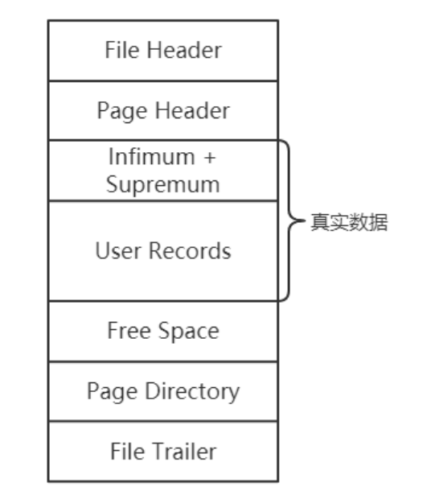
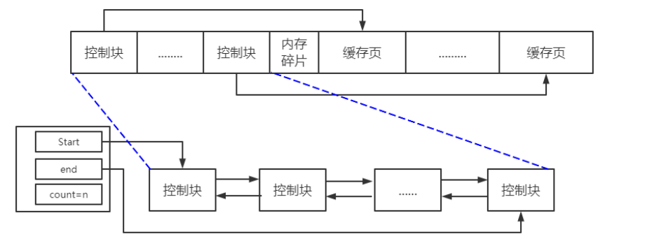
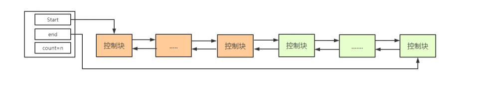
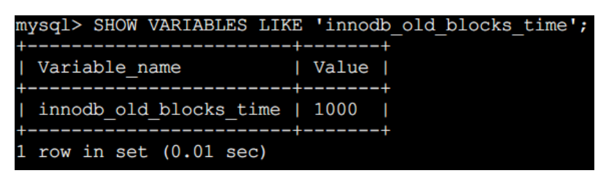
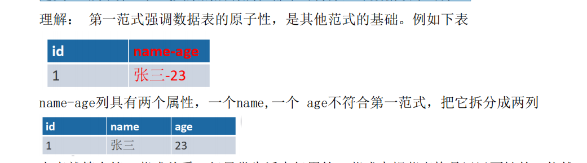
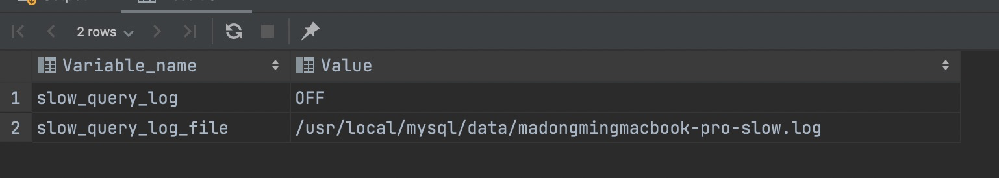
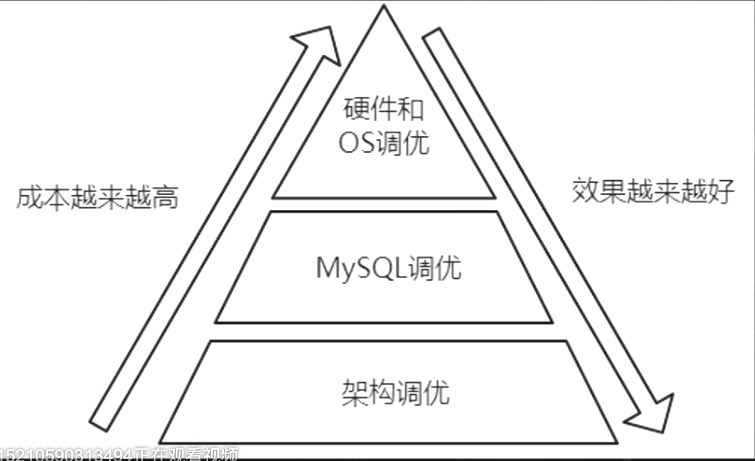
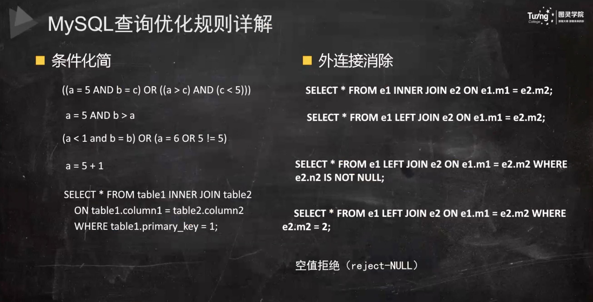
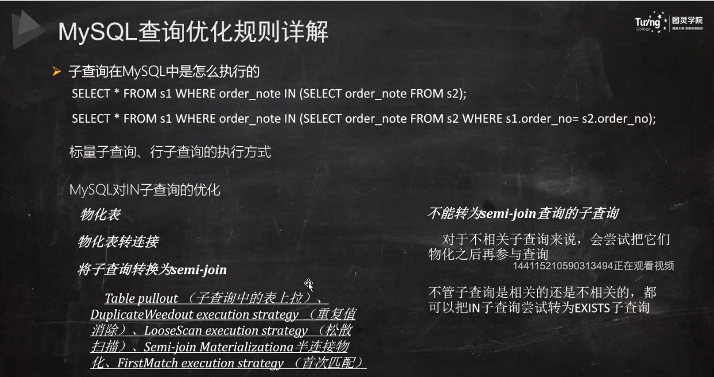
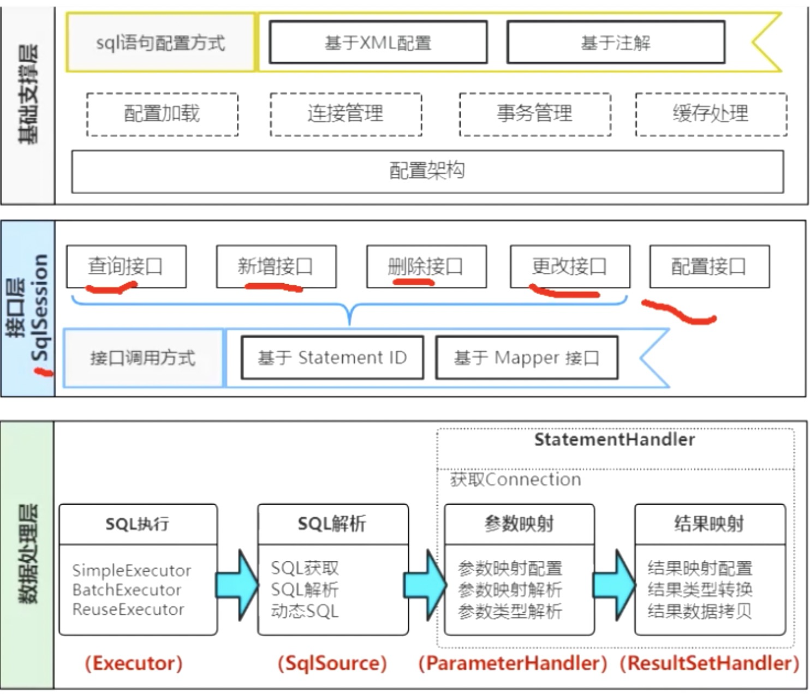

目录

## Explain（执行计划）

**Table 8.1 EXPLAIN Output Columns**

| Column                                                       | JSON Name       | Meaning                                        |
| :----------------------------------------------------------- | :-------------- | :--------------------------------------------- |
| [`id`](https://dev.mysql.com/doc/refman/5.7/en/explain-output.html#explain_id) | `select_id`     | The `SELECT` identifier                        |
| [`select_type`](https://dev.mysql.com/doc/refman/5.7/en/explain-output.html#explain_select_type) | None            | The `SELECT` type                              |
| [`table`](https://dev.mysql.com/doc/refman/5.7/en/explain-output.html#explain_table) | `table_name`    | The table for the output row                   |
| [`partitions`](https://dev.mysql.com/doc/refman/5.7/en/explain-output.html#explain_partitions) | `partitions`    | The matching partitions                        |
| [`type`](https://dev.mysql.com/doc/refman/5.7/en/explain-output.html#explain_type) | `access_type`   | The join type                                  |
| [`possible_keys`](https://dev.mysql.com/doc/refman/5.7/en/explain-output.html#explain_possible_keys) | `possible_keys` | The possible indexes to choose                 |
| [`key`](https://dev.mysql.com/doc/refman/5.7/en/explain-output.html#explain_key) | `key`           | The index actually chosen                      |
| [`key_len`](https://dev.mysql.com/doc/refman/5.7/en/explain-output.html#explain_key_len) | `key_length`    | The length of the chosen key                   |
| [`ref`](https://dev.mysql.com/doc/refman/5.7/en/explain-output.html#explain_ref) | `ref`           | The columns compared to the index              |
| [`rows`](https://dev.mysql.com/doc/refman/5.7/en/explain-output.html#explain_rows) | `rows`          | Estimate of rows to be examined                |
| [`filtered`](https://dev.mysql.com/doc/refman/5.7/en/explain-output.html#explain_filtered) | `filtered`      | Percentage of rows filtered by table condition |
| [`Extra`](https://dev.mysql.com/doc/refman/5.7/en/explain-output.html#explain_extra) | None            | Additional information                         |

explain 通过执行计划可以模拟优化器执行sql语句，查询sql的课优化空间

set session optimizer_switch='derived_merge=off'; #关闭mysql5.7新特性对衍生表的合并优化
set session optimizer_switch='derived_merge=on'; #关闭mysql5.7新特性对衍生表的合并优化

1. **explain**：会在 explain 的基础上额外提供一些查询优化的信息。紧随其后通过 show warnings 命令可 以得到优化后的查询语句，从而看出优化器优化了什么。额外还有 filtered 列，是一个半分比的值，rows filtered/100 可以**估算**出将要和 explain 中前一个表进行连接的行数（前一个表指 explain 中的id值比当前表id值小的 表）
2. **explain partitions**：相比 explain 多了个 partitions 字段，如果查询是基于分区表的话，会显示查询将访问的分 区。

#### **ID列**

Id列越大执行优先级越高，id相同则从上往下执行，id为NULL最后执行。

#### **Select_type列**

1） SIMPLE：简单的SELECT，不实用UNION或者子查询。
2） PRIMARY：最外层SELECT。
3） UNION：第二层，在SELECT之后使用了UNION。
4） DEPENDENT UNION：UNION语句中的第二个SELECT，依赖于外部子查询。
5） UNION RESULT：UNION的结果。
6） SUBQUERY：子查询中的第一个SELECT。
7） DEPENDENT SUBQUERY：子查询中的第一个SELECT，取决于外面的查询。
8） DERIVED：导出表的SELECT（FROM子句的子查询）

#### **table列**

显示explain正在执行哪一张表

#### type列

**null > system > const > eq_ref > ref > range > index > ALL**
**一般来说，得保证查询达到range级别，最好达到ref**

1. Null：mysql能够在优化阶段分解查询语句，在执行阶段用不着再访问表或索引。
2. const,system：该表数据只有一行的时候是system，在查询条件只差一条记录的时候是const。
3. eq_ref：primary key 或 unique key 索引的所有部分被连接使用 ，最多只会返回一条符合条件的记录。这可能是在 const 之外最好的联接类型了，简单的 select 查询不会出现这种 type。
4. ref：相比 eq_ref，不使用唯一索引，而是使用普通索引或者唯一性索引的部分前缀，索引要和某个值相比较，可能会找到多个符合条件的行。
5. range：范围扫描通常出现在 in(), between ,> ,<, >= 等操作中。使用一个索引来检索给定范围的行。
6. index：扫描全索引就能拿到结果，一般是扫描某个二级索引，这种扫描不会从索引树根节点开始快速查找，而是直接 对二级索引的叶子节点遍历和扫描，速度还是比较慢的，这种查询一般为使用覆盖索引，二级索引一般比较小，所以这种通常比ALL快一些。
7. ALL：即全表扫描，扫描你的聚簇索引的所有叶子节点。通常情况下这需要增加索引来进行优化了。

#### possible_keys列

显示可能应用在这张表中的索引，一个或多个。查询涉及到的字段上若存在索引，则该索引将被列出，但不一定被查询实际使用

#### key列

实际使用的索引，如果为NULL，则没有使用索引。 如果没有使用索引，则该列是 NULL。如果想强制mysql使用或忽视possible_keys列中的索引，在查询中使用 force index、ignore index。 

#### key_len列

这一列显示了mysql在索引里使用的字节数，通过这个值可以算出具体使用了索引中的哪些列。

字符串，char(n)和varchar(n)，5.0.3以后版本中，**n均代表字符数，而不是字节数，**如果是utf-8，一个数字 

或字母占1个字节，一个汉字占3个字节 

char(n)：如果存汉字长度就是 3n 字节 

varchar(n)：如果存汉字则长度是 3n + 2 字节，加的2字节用来存储字符串长度，因为varchar是变长字符串 

数值类型

tinyint：1字节 

smallint：2字节 

int：4字节 

bigint：8字节 

时间类型

date：3字节

timestamp：4字节 时间到2039年

datetime：8字节    时间到9999年

如果字段允许为 NULL，需要1字节记录是否为 NULL 

索引最大长度是768字节，当字符串过长时，mysql会做一个类似左前缀索引的处理，将前半部分的字符提取出来做索 

引。

#### ref列

这一列显示了在key列记录的索引中，表查找值所用到的列或常量，常见的有：const（常量），字段名（例：film.id） 

#### rows列

这一列是mysql估计要读取并检测的行数，注意这个不是结果集里的行数。 

#### Extra列

这一列展示的是额外信息。常见的重要值如下： 

using index：使用覆盖索引

Using where：使用 where 语句来处理结果，并且查询的列未被索引覆盖

Using index condition：查询的列不完全被索引覆盖，where条件中是一个前导列的范围； 

Using temporary：mysql需要创建一张临时表来处理查询。出现这种情况一般是要进行优化的，首先是想到用索 

引来优化。 

Using filesort：将用外部排序而不是索引排序，数据较小时从内存排序，否则需要在磁盘完成排序。这种情况下

一般般也是要考虑使用索引来优化的。

Select tables optimized away：使用某些聚合函数（比如 max、min）来访问存在索引的某个字段是

Using MRR：Multi-Range Read 回表优化

Using join buffer（Block nested Loop）在使用join连接被驱动表没有索引的情况下使用BNL


# InnoDB行记录格式

## COMPACT


## Redundant


## COMPRESSED 和 DYNAMIC 

Compressed 和 Dynamic 行记录格式与 Compact 行记录格式是类似的，只不过在处理行溢出数据时有些区别。

这两种格式采用完全的行溢出方式，数据页不会存储真实数据的前768字节，只存储20个字节的指针来指向溢出页。而实际的数据都存储在溢出页中，看起来就像下面这样：


Compressed 与 Dynamic 相比，Compressed 存储的行数据会以zlib的算法进行压缩以节省空间，因此对于 BLOB、TEXT、VARCHAR 这类大长度类型的数据能够进行非常有效的存储。


## VARCHAR类型

一行数据，除了 TEXT、BLOB 等大对象类型，总长度最大 `65535字节`。而且这个 65535 最大长度是包含 `变长字段长度列表`、`NULL值列表` 的。

`VARCHAR(M)` 中的 M 指的是字符长度，而不是字节长度，计算时，要用总长度除以字符集最大长度，例如 utf8mb4 字符集每个字符的最大长度为 4字节。

VARCHAR 类型如果小于255字节，要在变长字段长度列表占 `1字节`，否则占 `2字节`；如果可为NULL，还要在NULL值列表占 `1字节`，不过这一个字节可以存8个可为NULL的列的状态。所以一个 VARCHAR(M) 的字节长度最大为 `65532字节`。

## CHAR 数据类型

我们一般会认为 `CHAR(M)` 是定长类型，M 与 VARCHAR(M) 中的 M 是一样的，**指的是字符的长度**。类型为CHAR(M)时，**对于长度不足的值会用空格来补足，就算存的是空值，也会用空格补足，查询的时候会去除首尾的空格，而VARCHAR就不会。**

## 行溢出数据

MySQL中磁盘和内存交互的基本单位是`页`，一个页的大小一般是`16KB`，也就是`16384字节`，而一个VARCHAR(M)类型的列最多可以存储`65532字节`，一些大对象如 TEXT、BLOB 可能存储更多的数据，这时一个页可能就存不了一条记录。这个时候就会发生`行溢出`，多的数据就会存到另外的`溢出页`中。

InnoDB 规定一页至少存储两条记录，如果页中只能存放下一条记录，InnoDB存储引擎会自动将行数据存放到溢出页中。在一般情况下，InnoDB 的数据都是存放在 `FIL_PAGE_INDEX` 类型的数据页中的。但是当发生行溢出时，溢出的数据会存放到 `FIL_PAGE_TYPE_BLOB` 类型的溢出页中。

当发生行溢出时，**数据页只保存了前768字节的前缀数据**，接着是20个字节的偏移量，指向行溢出页，大致如下图所示。


**参考文章：**https://juejin.cn/post/6970934163973079048


# InnoDB索引页格式

​		前边我们简单提了一下页的概念，它是 InnoDB 管理存储空间的基本单位，一个页的大小一般是 16KB。

​		InnoDB 为了不同的目的而设计了许多种不同类型的页，存放我们表中记录的那种类型的页自然也是其中的一员，官方称这种存放记录的页为索引（INDEX）页，不过要理解成数据页也没问题，毕竟存在着聚簇索引这种索引和数据混合的东西。




**区（**extent**）**

​		表空间中的页可以达到 2^32个页，实在是太多了，为了更好的管理这些页面，InnoDB 中还有一个区（英文名：extent）的概念。对于 16KB 的页来说，连续的64 个页就是一个区，也就是说一个区默认占用 1MB 空间大小。不论是系统表空间还是独立表空间，都可以看成是由若干个区组。

​		每 256个区又被划分成一个**组**


# Innodb三大特性

### doublewrite

​		**doublewrite是为了保证数据页的可靠性。避免发生部分写失效（partial page write）**

Double Write 分为了两个组成部分：

- 内存中的double write buffe 2M
- 物理磁盘上共享表空间中连续的128个页，即2个区（extent），大小同样为2MB

**表空间**

- **共享表空间**，来自多个不同表及其对应索引的数据可以保存在单个.ibd文件中。
- **独立表空间**，单个表的数据及其索引保存在一个.ibd文件中。

因为存储引擎缓冲池内的数据页大小默认为16KB，我们都知道 Linux 会以页为单位管理[内存](https://so.csdn.net/so/search?q=内存&spm=1001.2101.3001.7020)，无论是将磁盘中的数据加载到内存中，还是将内存中的数据写回磁盘，操作系统都会以页面为单位进行操作，哪怕我们只向磁盘中写入一个字节的数据，我们也需要将整个页面中的全部数据刷入磁盘中。

内核把物理页作为内存管理的基本单位。尽管处理器的最小可寻址单位通常为字（甚至字节），但是，内存管理单元（MMU，管理内存并把虚拟内存地址转换为物理地址的硬件）通常以页为单位进行处理。正因为如此，MMU以页（page）大小为单位来管理系统中的页表（这也是页表名的来由）。从虚拟内存的角度来看，页就是最小单位。

所以在进行刷盘操作时，就有可能发生如下场景：


由于重做日志redo log记录的是物理内容，比如那个页那个offset修改了什么数据，一旦数据页被破坏了redo log就作用不了了，所以在应用重做日志前，用户需要一个页的副本，当写入失效发生时，先通过页的副本来还原该页。

**Double write崩溃恢复**


参考文章：https://cloud.tencent.com/developer/article/1739772

### Buffer Pool

​		我们知道，对于使用 InnoDB 作为存储引擎的表来说，不管是用于存储用户数据的索引（包括聚簇索引和二级索引），还是各种系统数据，都是以页的形式存放在表空间中的，而所谓的表空间只不过是 InnoDB 对文件系统上一个或几个实际文件的抽象，也就是说我们的数据说到底还是存储在磁盘上的。但是磁盘的速度慢，所以 InnoDB 存储引擎在处理客户端的请求时，当需要访问某个页的数据时，就会把完整的页的数据全部加载到内存中，也就是说即使我们只需要访问一个页的一条记录，那也需要先把整个页的数据加载到内存中。将整个页加载到内存中后就可以进行读写访问了，在进行完读写访问之后并不着急把该页对应的内存空间释放掉，而是将其缓存起来，这样将来有请求再次访问该页面时，就可以省去磁盘 IO 的开销了。

**free链表**	

​	buffer存储格式都是按照每个存储页都对应一个控制块而所有的控制块在前，存储页在后，如果新来一个页如何辨别哪里是空位置可以存放呢，就用到了**free链表**会把空闲的所有控制块都放入到**free链表**



我们其实是根据表空间号 + 页号来定位一个页的，所以我们可以用表空间号 + 页号作为 key，缓存页作为 value 创建一个哈希表，在需要访问某个页的数据时，先从哈希表中根据表空间号 + 页号看看有没有应的缓存页，如果有，直接使用该缓存页就好，如果没有，那就从 free 链表中选一个空闲的缓存页，然后把磁盘中对应的页加载到该缓存页的位置。

**flush链表**

​		如果我们修改了 Buffer Pool 中某个缓存页的数据，那它就和磁盘上的页不一致了，这样的缓存页也被称为脏页（英文名：dirty page）所以，需要再创建一个存储脏页的链表，凡是修改过的缓存页对应的控制块都会作为一个节点加入到一个链表中，因为这个链表节点对应的缓存页都是需要被刷新到磁盘上的，所以也叫 flush 链表。

​		如果非常多的使用频率偏低的页被同时加载到 Buffer Pool 时，可能会把那些使用频率非常高的页从 Buffer Pool 中淘汰掉。

**刷新脏页到磁盘**

后台有专门的线程每隔一段时间负责把脏页刷新到磁盘，这样可以不影响用户线程处理正常的请求。主要有两种刷新路径：

1、从 LRU 链表的冷数据中刷新一部分页面到磁盘。

2、从 flush 链表中刷新一部分页面到磁盘。

**LRU优化**

因为有这两种情况的存在，所以 InnoDB 把这个 LRU 链表按照一定比例分成两截，

分别是：

一部分存储使用频率非常高的缓存页，所以这一部分链表也叫做热数据，或者称 young 区域。

另一部分存储使用频率不是很高的缓存页，所以这一部分链表也叫做冷数据，或者称 old 区域。



所以在对某个处在 old 区域的缓存页进行第一次访问时就在它对应的控制块中记录下来这个访问时间，**如果后续的访问时间与第一次访问的时间在某个时间间隔内，那么该页面就不会被从 old 区域移动到 young 区域的头部**，否则将它移动到 young 区域的头部。上述的这个间隔时间是由系统变量innodb_old_blocks_time 控制的：



这个 innodb_old_blocks_time 的默认值是 1000，它的单位是毫秒，也就意味着对于从磁盘上被加载到 LRU 链表的 old 区域的某个页来说，如果第一次和最后一次访问该页面的时间间隔小于 1s（很明显在一次全表扫描的过程中，多次访问一个页面中的时间不会超过 1s），那么该页是不会被加入到 young 区域的，当然，像innodb_old_blocks_pct 一样，我们也可以在服务器启动或运行时设置innodb_old_blocks_time 的值，这里需要注意的是，如果我们把innodb_old_blocks_time 的值设置为 0，那么每次我们访问一个页面时就会把该页面放到 young 区域的头部。

​		**当从磁盘读取数据页后，会先将数据页存放到 LRU 链表冷数据区的头部，**如果这些缓存页在 1 秒之后被访问，那么就将缓存页移动到热数据区的头部；如果是 1 秒之内被访问，则不会移动，缓存页仍然处于冷数据区中。1 秒这个数值，是由参数 innodb_old_blocks_time 控制。

​		当遇到全表扫描或者预读时，如果没有空闲缓存页来存放它们，那么将会淘汰一个数据页，**而此时淘汰地是冷数据区尾部的数据页**。冷数据区的数据就是不经常访问的，因此这解决了误将热点数据淘汰的问题。如果在 1 秒后，因全表扫描和预读机制额外加载进来的缓存页，仍然没有人访问，那么它们会一直待在冷数据区，当再需要淘汰数据时，首先淘汰地就是这一部分数据。

至此，基于冷热分离优化后的 LRU 链表，完美解决了直接使用 LRU 链表带来的问题。

​		综上所述，正是因为将 LRU 链表划分为 young 和 old 区域这两个部分，又添加了 **innodb_old_blocks_time** 这个系统变量，才使得预读机制和全表扫描造成的缓存命中率降低的问题得到了遏制，因为用不到的预读页面以及全表扫描的页面都只会被放到 old 区域，而不影响 young 区域中的缓存页。

**LRU 链表的极致优化**

把young区域等分为4份，当处于前4分之1的时候不需要移动到young头部，后4分之三需要，优化目的在于减少对于同步所带来的开销损耗。

实际上，MySQL 在冷热分离的基础上还做了一层优化。

当一个缓存页处于热数据区域的时候，我们去访问这个缓存页，这个时候我们真的有必要把它移动到热点数据区域的头部吗？

从代码的角度来看，将链表中的数据移动到头部，实际上就是修改元素的指针指向，这个操作是非常快的。但是为了安全起见，在修改链表的时候，我们需要对链表加上锁，否则容易出现并发问题。

当并发量大的时候，因为要加锁，会存在锁竞争，每次移动显然效率就会下降。因此 MySQL 针对这一点又做了优化，如果一个缓存页处于热数据区域，且在热数据区域的前 1/4 区域（注意是热数据区域的 1/4，不是整个链表的 1/4），那么当访问这个缓存页的时候，就不用把它移动到热数据区域的头部；如果缓存页处于热数据的后 3/4 区域，那么当访问这个缓存页的时候，会把它移动到热数据区域的头部。

**参考文章：https://zhuanlan.zhihu.com/p/142087506**


### 自适应哈希索引

​		InnoDB存储引擎除了我们前面所说的各种索引，还有一种自适应哈希索引，我们知 道B+树的查找次数,取决于B+树的高度,在生产环境中,B+树的高度一般为3~4层,故 需要3~4次的IO查询。 

​		所以在InnoDB存储引擎内部自己去监控索引表，如果监控到某个索引经常用，那么 就认为是热数据，然后内部自己创建一个hash索引，称之为自适应哈希索引( Adaptive Hash Index,AHI)，创建以后，如果下次又查询到这个索引，那么直接通 过hash算法推导出记录的地址，直接一次就能查到数据，比重复去B+tree索引中查 询三四次节点的效率高了不少。 

必须得是等值查询。

### 预读

​		InnoDB 提供了预读（英文名：read ahead）。所谓预读，就是 InnoDB认为执行当前的请求可能之后会读取某些页面，就预先把它们加载到 Buffer Pool中。根据触发方式的不同，预读又可以细分为下边两种：

*线性预读*

InnoDB 提供了一个系统变量 innodb_read_ahead_threshold，如果顺序访问了某个区（extent）的页面超过这个系统变量的值，**就会触发一次异步读取下一个区中全部的页面到 Buffer Pool 的请求**。这个 innodb_read_ahead_threshold 系统变量的值默认是 56，我们可以在服务器启动时通过启动参数或者服务器运行过程中直接调整该系统变量的值，取值范围是 0~64。

*随机预读*

如果 Buffer Pool 中已经缓存了某个区的 13 个连续的页面，不论这些页面是不是顺序读取的，都会触发一次异步读取本区中所有其他的页面到 Buffer Pool 的请求。InnoDB同时提供了innodb_random_read_ahead 系统变量，它的默认值为OFF。

**show variables like '%_read_ahead%';**

# 数据库范式

目前关系数据库有六种范式：第一范式（

1NF）、第二范式（2NF）、第三范式（3NF）、 巴斯-科德范式（BCNF）、第四范式(4NF）和第五范式（5NF，又称完美范式）。

**数据库设计的第一范式**

定义： 属于第一范式关系的所有属性都不可再分，即数据项不可分。 



**数据库设计的第二范式**

第二范式（2NF）要求数据库表中的每个实例或行必须可以被惟一地区分。通常在实现来 

说，需要为表加上一个列，以存储各个实例的惟一标识。主键ID。

**数据库设计的第三范式**

指每一个非主属性既不部分依赖于也不传递依赖于业务主键，也就是在第二范式的基础 上消除了非主键对主键的传递依赖。**不包含已在其它表中已包含的非主关键字信息。**


### **反范式设计**

​		所谓得反范式化就是为了性能和读取效率得考虑而适当得对数据库设计范式得要求进行 违反。允许存在少量得冗余，换句话来说反范式化就是使用空间来换取时间。


### 三星索引

1.索引将相关的记录放到一起则获得一星 离得越近比如在同一个页，**索引的扫描范围越小**

2.如果索引中的数据顺序和查找的排序顺序一致则获得二星（排序星）**有点类似于最左匹配完全**

3.如果索引中的列包含了查询中需要的全部列则获得三星（宽索引星）**可以理解为覆盖索引**


## Mysql内部优化策略

1、移除不必要的括号 

2、常量传递（constant_propagation） 

3、移除没用的条件（trivial_condition_removal） 

4、表达式计算 


## Mysql性能优化

1、硬件优化

2、Mysql调优

1. 业务层-请求了不需要的数据
2. 选择合适的存储引擎 Innodb MyISAM
3. 查询性能优化 通过慢查询日志 slow_query_log
4. 根据相爱年供应时间

3、架构调优

# Mysql组件


## 连接器

**管理连接与权限校验**

客户端如果长时间不发送command到Server端，连接器就会自动将它断开。这个时间是由参数 wait_timeout 控制的，默认值 是 8 小时。 28800秒

 show global variables like "wait_timeout"; 

Lost connection to MySQL server during query 查询期间丢失与 MySQL 服务器的连接

开发当中我们大多数时候用的都是长连接,把连接放在Pool内进行管理，但是长连接有些时候会导致 MySQL 占用内存涨得特别快，这是因为 MySQL 在执行过程中临时使用的内存是管理在连接对象里面的。这些资源会在连接断开的时候才释放。所以如果长连接累积下来，可能导致内存占用太大，被系统强行杀掉（OOM），从现象看就是 MySQL 异常重启了。 

**怎么解决这类问题呢？** 

1、定期断开长连接。使用一段时间，或者程序里面判断执行过一个占用内存的大查询后，断开连接，之后要查询再重连。 

2、如果你用的是 MySQL 5.7 或更新版本，可以在每次执行一个比较大的操作后，通过执行**mysql_reset_connection** 来重新初始化连接资源。这个过程不需要重连和重新做权限验证，但是会将连接恢复到刚刚创建完时的状态。 

**查询缓存（mysql8.0已经移除了查询缓存功能）**

查询缓存按照理想来说是对于效率提升很好的一个手段，但是由于缓存失效的非常频繁，只要对一个表的更新，那这张表的所有缓存都会被清空一般也就长时间不被修改的表才用到缓存。而对于8.0之前有三个参数来决定query_cache_type缓存的使用

0代表关闭查询缓存

1代表开启缓存

2代表只有遇到关键字sql_cache关键字时才缓存

## 分析器

如果没有命中查询缓存，就要开始真正执行语句了。首先，MySQL 需要知道你要做什么，因此需要对 SQL 语句做解析。

分析器先会做“词法分析”。你输入的是由多个字符串和空格组成的一条 SQL 语句，MySQL 需要识别出里面的字符串分别是什么，代表什么。

MySQL 从你输入的"select"这个关键字识别出来，这是一个查询语句。它也要把字符串“T”识别成“表名 T”，把字符串“ID”识别成“列 ID”。

做完了这些识别以后，就要做“语法分析”。根据词法分析的结果，语法分析器会根据语法规则，判断你输入的这个 SQL 语句是否满足 MySQL 语法。

如果你的语句不对，就会收到“You have an error in your SQL syntax”的错误提醒，比如下面这个语句 select 少打了开头的字母“s”。

```vbnet
mysql> elect * from t where ID=1;
 
ERROR 1064 (42000): You have an error in your SQL syntax; check the manual that corresponds to your MySQL server version for the right syntax to use near 'elect * from t where ID=1' at line 1
```

一般语法错误会提示第一个出现错误的位置，所以你要关注的是紧接“use near”的内容。

mysql的词法分析由MysqlLex（mysql自己实现的），语法分析由Bison生成。

## 优化器

执行计划生成，索引选择

经过了分析器，MySQL 就知道你要做什么了。在开始执行之前，还要先经过优化器的处理。

优化器是在表里面有多个索引的时候，决定使用哪个索引；或者在一个语句有多表关联（join）的时候，决定各个表的连接顺序。比如你执行下面这样的语句，这个语句是执行两个表的 join：

```csharp
mysql> select * from t1 join t2 using(ID)  where t1.c=10 and t2.d=20;
```

- 既可以先从表 t1 里面取出 c=10 的记录的 ID 值，再根据 ID 值关联到表 t2，再判断 t2 里面 d 的值是否等于 20。
- 也可以先从表 t2 里面取出 d=20 的记录的 ID 值，再根据 ID 值关联到 t1，再判断 t1 里面 c 的值是否等于 10。

这两种执行方法的逻辑结果是一样的，但是执行的效率会有不同，而优化器的作用就是决定选择使用哪一个方案。

优化器阶段完成后，这个语句的执行方案就确定下来了，然后进入执行器阶段。如果你还有一些疑问，比如优化器是怎么选择索引的，有没有可能选择错等等，没关系，我会在后面的文章中单独展开说明优化器的内容。

## 执行器

MySQL 通过分析器知道了你要做什么，通过优化器知道了该怎么做，于是就进入了执行器阶段，开始执行语句。

开始执行的时候，要先判断一下你对这个表 T 有没有执行查询的权限，如果没有，就会返回没有权限的错误，如下所示 (在工程实现上，如果命中查询缓存，会在查询缓存返回结果的时候，做权限验证。查询也会在优化器之前调用 precheck 验证权限)。

```sql
mysql> select * from T where ID=10;
 
ERROR 1142 (42000): SELECT command denied to user 'b'@'localhost' for table 'T'
```

如果有权限，就打开表继续执行。打开表的时候，执行器就会根据表的引擎定义，去使用这个引擎提供的接口。

比如我们这个例子中的表 T 中，ID 字段没有索引，那么执行器的执行流程是这样的：

1. 调用 InnoDB 引擎接口取这个表的第一行，判断 ID 值是不是 10，如果不是则跳过，如果是则将这行存在结果集中；
2. 调用引擎接口取“下一行”，重复相同的判断逻辑，直到取到这个表的最后一行。
   1. 执行器将上述遍历过程中所有满足条件的行组成的记录集作为结果集返回给客户端。

#### 索引使用情况（mysql5.6引入索引下推）

1、联合索引第一个字段用范围不会走索引

2、强制走索引  force index（）

3、覆盖索引优化

4、in和or在表数据量比较大的情况会走索引，在表记录不多的情况下会选择全表扫描

5、like KK% 一般情况都会走索引

​		索引下推（Index Condition Pushdown）可以在索引遍历过程中，对索引中包含的所有字段先做判断，过滤掉不符合条件的记录之后再回表，可 以有效的减少回表次数。

**为什么范围查找Mysql没有用索引下推优化？*

估计应该是Mysql认为**范围查找过滤的结果集过大**，like KK% 在绝大多数情况来看，过滤后的结果集比较小，所以这里Mysql选择给 like 

KK% 用了索引下推优化，当然这也不是绝对的，有时like KK% 也不一定就会走索引下推。 

order by 与group by

order by根据where和order by字段的情况 再根据联合索引或者其他耳机索引的创建情况决定是否走了index和filesort

排序方式也是决定一部分因素之一

```mysql
explain select from employees where name in ('LiLei','zhuge')  order by age,position;
```

对于排序来说多个相等条件也是范围查询

1、MySQL支持两种方式的排序filesort和index，Using index是指MySQL扫描索引本身完成排序。index 

效率高，filesort效率低。 

2、order by满足两种情况会使用Using index。 

​       1) order by语句使用索引最左前列。 

​       2) 使用where子句与order by子句条件列组合满足索引最左前列。 

3、尽量在索引列上完成排序，遵循索引建立（索引创建的顺序）时的最左前缀法则。 

4、如果order by的条件不在索引列上，就会产生Using filesort。 

5、能用覆盖索引尽量用覆盖索引 

6、group by与order by很类似，其实质是先排序后分组，遵照索引创建顺序的最左前缀法则。对于group 

by的优化如果不需要排序的可以加上**order by null禁止排序**。注意，where高于having，能写在where中 

的限定条件就不要去having限定了。


#### 索引原则

1、代码先行，索引后上

2、联合索引尽量覆盖条件

3、不要在小基数字段上建立索引

4、长字符串我们可以采用前缀索引

5、where与order by冲突时优先where

6、基于慢sql查询做优化


#### sql 慢查询

MySQL的慢查询，全名是**慢查询日志**，是MySQL提供的一种日志记录，用来记录在MySQL中**响应时间超过阀值**的语句。

long_query_time（默认是10秒）



设置完成后需要重启数据库 设置方式**https://blog.csdn.net/qq_40884473/article/details/89455740**

`set global slow_query_log=1`开启了慢查询日志只对当前数据库生效，MySQL重启后则会失效。

关于运行时间**正好等于**`long_query_time`的情况，并不会被记录下来。

##### log-queries-not-using-indexes

该系统变量指定**未使用索引的查询**也被记录到慢查询日志中（可选项）。

##### log_slow_admin_statements

这个系统变量表示，是否将慢管理语句例如`ANALYZE TABLE`和`ALTER TABLE`等记入慢查询日志。

##### Slow_queries

如果你想查询有多少条慢查询记录，可以使用`Slow_queries`系统变量。

##### mysqldumpslow工具

在生产环境中，如果要手工分析日志，查找、分析SQL，显然是个体力活。

MySQL提供了日志分析工具`mysqldumpslow`


# **Mysql常见的几种算法**

参考文章：http://learn.lianglianglee.com/%E4%B8%93%E6%A0%8F/MySQL%E5%AE%9E%E6%88%9845%E8%AE%B2/35%20%20join%E8%AF%AD%E5%8F%A5%E6%80%8E%E4%B9%88%E4%BC%98%E5%8C%96%EF%BC%9F.md

##  Index Nested-Loop Join 算法

**拿驱动表的条件索引去被驱动表根据索引找就叫做Index Nested-Loop Join**

我们来看一下这个语句：

```csharp
select * from t1 straight_join t2 on (t1.a=t2.a);
```

如果直接使用 join 语句，MySQL 优化器可能会选择表 t1 或 t2 作为驱动表，这样会影响我们分析 SQL 语句的执行过程。所以，为了便于分析执行过程中的性能问题，我改用 straight_join 让 MySQL 使用固定的连接方式执行查询，这样优化器只会按照我们指定的方式去 join。在这个语句里，t1 是驱动表，t2 是被驱动表。

现在，我们来看一下这条语句的 explain 结果。


图 1 使用索引字段 join 的 explain 结果

可以看到，在这条语句里，被驱动表 t2 的字段 a 上有索引，join 过程用上了这个索引，因此这个语句的执行流程是这样的：

1. 从表 t1 中读入一行数据 R；
2. 从数据行 R 中，取出 a 字段到表 t2 里去查找；
3. 取出表 t2 中满足条件的行，跟 R 组成一行，作为结果集的一部分；
4. 重复执行步骤 1 到 3，直到表 t1 的末尾循环结束。

这个过程是先遍历表 t1，然后根据从表 t1 中取出的每行数据中的 a 值，去表 t2 中查找满足条件的记录。在形式上，这个过程就跟我们写程序时的嵌套查询类似，并且可以用上被驱动表的索引，所以我们称之为“Index Nested-Loop Join”，简称 NLJ。

## Simple Nested-Loop Join

**驱动表索引去驱动表用不上索引的情况。**

每一次别驱动表都需要做全表扫描，负担太大没有使用

## Block Nested-Loop Join

被驱动表上没有可用的索引，算法的流程是这样的：

1. 把表 t1 的数据读入线程内存 join_buffer 中，由于我们这个语句中写的是 select *，因此是把整个表 t1 放入了内存；
2. 扫描表 t2，把表 t2 中的每一行取出来，跟 join_buffer 中的数据做对比，满足 join 条件的，作为结果集的一部分返回。


可以看到，在这个过程中，对表 t1 和 t2 都做了一次全表扫描，因此总的扫描行数是 1100。由于 join_buffer 是以无序数组的方式组织的，因此对表 t2 中的每一行，都要做 100 次判断，总共需要在内存中做的判断次数是：100*1000=10 万次。

然后，你可能马上就会问了，这个例子里表 t1 才 100 行，要是表 t1 是一个大表，join_buffer 放不下怎么办呢？join_buffer 的大小是由参数 join_buffer_size 设定的，默认值是 256k。如果放不下表 t1 的所有数据话，策略很简单，就是分段放。我把 join_buffer_size 改成 1200，再执行：

```sql
select * from t1 straight_join t2 on (t1.a=t2.b);
```

执行过程就变成了：

1. 扫描表 t1，顺序读取数据行放入 join_buffer 中，放完第 88 行 join_buffer 满了，继续第 2 步
2. 扫描表 t2，把 t2 中的每一行取出来，跟 join_buffer 中的数据做对比，满足 join 条件的，作为结果集的一部分返回；
3. 清空 join_buffer；
4. 继续扫描表 t1，顺序读取最后的 12 行数据放入 join_buffer 中，继续执行第 2 步。

**第一个问题：能不能使用 join 语句？**

1. 如果可以使用 Index Nested-Loop Join 算法，也就是说可以用上被驱动表上的索引，其实是没问题的；
2. 如果使用 Block Nested-Loop Join 算法，扫描行数就会过多。尤其是在大表上的 join 操作，这样可能要扫描被驱动表很多次，会占用大量的系统资源。所以这种 join 尽量不要用。

所以你在判断要不要使用 join 语句时，就是看 explain 结果里面，Extra 字段里面有没有出现“Block Nested Loop”字样。

**第二个问题是：如果要使用 join，应该选择大表做驱动表还是选择小表做驱动表？**

1. 如果是 Index Nested-Loop Join 算法，应该选择小表做驱动表；
2. 如果是 Block Nested-Loop Join 算法：
   - 在 join_buffer_size 足够大的时候，是一样的；
   - 在 join_buffer_size 不够大的时候（这种情况更常见），应该选择小表做驱动表。

**对于小表的定义在决定哪个表做驱动表的时候，应该是两个表按照各自的条件过滤，过滤完成之后，计算参与 join 的各个字段的总数据量，数据量小的那个表，就是“小表”，应该作为驱动表。如果直接使用 join 语句，MySQL 优化器可能会选择表 t1 或 t2 作为驱动表**Multi-Range Read 优化

参考文章：http://learn.lianglianglee.com/%E4%B8%93%E6%A0%8F/MySQL%E5%AE%9E%E6%88%9845%E8%AE%B2/35%20%20join%E8%AF%AD%E5%8F%A5%E6%80%8E%E4%B9%88%E4%BC%98%E5%8C%96%EF%BC%9F.md

## Multi-Range Read 优化 (MRR)

**在二级索引进行回表查询的时候，这个优化的主要目的是尽量使用顺序读盘。**

```sql
create table t1(id int primary key, a int, b int, index(a));
select** * **from** t1 **where** a>=1 **and** a<=100;
```

**因为大多数的数据都是按照主键递增顺序插入得到的，所以我们可以认为，如果按照主键的递增顺序查询的话，对磁盘的读比较接近顺序读，能够提升读性能。**

这，就是 MRR 优化的设计思路。此时，语句的执行流程变成了这样：

1. 根据索引 a，定位到满足条件的记录，将 id 值放入 **read_rnd_buffer** 中 ;
2. 将 **read_rnd_buffer** 中的 id 进行递增排序；
3. 排序后的 id 数组，依次到主键 id 索引中查记录，并作为结果返回。

```sql
show variables like '%read_rnd_buffer_size%';
```

**另外需要说明的是，如果你想要稳定地使用 MRR 优化的话，需要设置`set optimizer_switch="mrr_cost_based=off"`。（官方文档的说法，是现在的优化器策略，判断消耗的时候，会更倾向于不使用 MRR，把 mrr_cost_based 设置为 off，就是固定使用 MRR 了。）**

**MRR 能够提升性能的核心**在于，这条查询语句在索引 a 上做的是一个范围查询（也就是说，这是一个多值查询），可以得到足够多的主键 id。这样通过排序以后，再去主键索引查数据，才能体现出“顺序性”的优势。

## Batched Key Access

理解了 MRR 性能提升的原理，我们就能理解 MySQL 在 5.6 版本后开始引入的 Batched Key Access(BKA) 算法了。这个 BKA 算法，其实就是对 NLJ 算法的优化。

我们再来看看上一篇文章中用到的 NLJ 算法的流程图：


图 4 Index Nested-Loop Join 流程图

NLJ 算法执行的逻辑是：从驱动表 t1，一行行地取出 a 的值，再到被驱动表 t2 去做 join。也就是说，对于表 t2 来说，每次都是匹配一个值。这时，MRR 的优势就用不上了。

那怎么才能一次性地多传些值给表 t2 呢？方法就是，从表 t1 里一次性地多拿些行出来，一起传给表 t2。

既然如此，我们就把表 t1 的数据取出来一部分，先放到一个临时内存。这个临时内存不是别人，就是 join_buffer。

通过上一篇文章，我们知道 join_buffer 在 BNL 算法里的作用，是暂存驱动表的数据。但是在 NLJ 算法里并没有用。那么，我们刚好就可以复用 join_buffer 到 BKA 算法中。

如图 5 所示，是上面的 NLJ 算法优化后的 BKA 算法的流程。


图 5 Batched Key Access 流程

图中，我在 join_buffer 中放入的数据是 P1~P100，表示的是只会取查询需要的字段。当然，如果 join buffer 放不下 P1~P100 的所有数据，就会把这 100 行数据分成多段执行上图的流程。

那么，这个 BKA 算法到底要怎么启用呢？

如果要使用 BKA 优化算法的话，你需要在执行 SQL 语句之前，先设置

```bash
set optimizer_switch='mrr=on,mrr_cost_based=off,batched_key_access=on';
```

其中，前两个参数的作用是要启用 MRR。这么做的原因是，BKA 算法的优化要依赖于 MRR。理解了 MRR 性能提升的原理，我们就能理解 MySQL 在 **5.6 版本后**开始引入的 Batched Key Access(BKA) 算法了。这个 BKA 算法，其实就是对 NLJ 算法的优化。

**问题：查询虚拟列会导致sql显示不了**

**参考文章：**https://blog.csdn.net/bczzm/article/details/100577819

## BNL 算法的性能问题

说完了 NLJ 算法的优化，我们再来看 BNL 算法的优化。

我在上一篇文章末尾，给你留下的思考题是，使用 Block Nested-Loop Join(BNL) 算法时，可能会对被驱动表做多次扫描。如果这个被驱动表是一个大的冷数据表，除了会导致 IO 压力大以外，还会对系统有什么影响呢？

在[第 33 篇文章]中，我们说到 InnoDB 的 LRU 算法的时候提到，由于 InnoDB 对 Bufffer Pool 的 LRU 算法做了优化，即：第一次从磁盘读入内存的数据页，会先放在 old 区域。如果 1 秒之后这个数据页不再被访问了，就不会被移动到 LRU 链表头部，这样对 Buffer Pool 的命中率影响就不大。

但是，如果一个使用 BNL 算法的 join 语句，多次扫描一个冷表，而且这个语句执行时间超过 1 秒，就会在再次扫描冷表的时候，把冷表的数据页移到 LRU 链表头部。

**出现两种问题：**

1. 如果冷表数据能完全融入Buffer Pool old区的话，由于多次扫描冷表导致sql执行时间超过1秒，就会把冷表的数据页移到LRU链表头部。
2. 如果这个冷表很大，就会出现另外一种情况：业务正常访问的数据页，没有机会进入 young 区域。

由于优化机制的存在，一个正常访问的数据页，要进入 young 区域，需要隔 1 秒后再次被访问到。但是，由于我们的 join 语句在循环读磁盘和淘汰内存页，进入 old 区域的数据页，很可能在 1 秒之内就被淘汰了。这样，就会导致这个 MySQL 实例的 Buffer Pool 在这段时间内，young 区域的数据页没有被合理地淘汰。

也就是说，这两种情况都会影响 Buffer Pool 的正常运作。

**大表 join 操作虽然对 IO 有影响，但是在语句执行结束后，对 IO 的影响也就结束了。但是，对 Buffer Pool 的影响就是持续性的，需要依靠后续的查询请求慢慢恢复内存命中率。**

为了减少这种影响，你可以考虑增大 join_buffer_size 的值，减少对被驱动表的扫描次数。

也就是说，BNL 算法对系统的影响主要包括三个方面：

1. 可能会多次扫描被驱动表，占用磁盘 IO 资源；
2. 判断 join 条件需要执行 M*N 次对比（M、N 分别是两张表的行数），如果是大表就会占用非常多的 CPU 资源；
3. 可能会导致 Buffer Pool 的热数据被淘汰，影响内存命中率。

我们执行语句之前，需要通过理论分析和查看 explain 结果的方式，确认是否要使用 BNL 算法。如果确认优化器会使用 BNL 算法，就需要做优化。优化的常见做法是，给被驱动表的 join 字段加上索引，把 BNL 算法转成 BKA 算法。

## BNL 转 BKA 

一些情况下，我们可以直接在被驱动表上建索引，这时就可以直接转成 BKA 算法了。

但是，有时候你确实会碰到一些不适合在被驱动表上建索引的情况。比如下面这个语句：

```csharp
select * from t1 join t2 on (t1.b=t2.b) where t2.b>=1 and t2.b<=2000;
```

我们在文章开始的时候，在表 t2 中插入了 100 万行数据，但是经过 where 条件过滤后，需要参与 join 的只有 2000 行数据。如果这条语句同时是一个低频的 SQL 语句，那么再为这个语句在表 t2 的字段 b 上创建一个索引就很浪费了。

但是，如果使用 BNL 算法来 join 的话，这个语句的执行流程是这样的：

1. 把表 t1 的所有字段取出来，存入 join_buffer 中。这个表只有 1000 行，join_buffer_size 默认值是 256k，可以完全存入。
2. 扫描表 t2，取出每一行数据跟 join_buffer 中的数据进行对比，
   - 如果不满足 t1.b=t2.b，则跳过；
   - 如果满足 t1.b=t2.b, 再判断其他条件，也就是是否满足 t2.b 处于 [1,2000] 的条件，如果是，就作为结果集的一部分返回，否则跳过。

我在上一篇文章中说过，对于表 t2 的每一行，判断 join 是否满足的时候，都需要遍历 join_buffer 中的所有行。因此判断等值条件的次数是 1000*100 万 =10 亿次，这个判断的工作量很大。


图 6 explain 结果


图 7 语句执行时间

可以看到，explain 结果里 Extra 字段显示使用了 BNL 算法。在我的测试环境里，这条语句需要执行 1 分 11 秒。

在表 t2 的字段 b 上创建索引会浪费资源，但是不创建索引的话这个语句的等值条件要判断 10 亿次，想想也是浪费。那么，有没有两全其美的办法呢？

这时候，我们可以考虑使用临时表。使用临时表的大致思路是：

1. 把表 t2 中满足条件的数据放在临时表 tmp_t 中；
2. 为了让 join 使用 BKA 算法，给临时表 tmp_t 的字段 b 加上索引；
3. 让表 t1 和 tmp_t 做 join 操作。

此时，对应的 SQL 语句的写法如下：

```sql
create temporary table temp_t(id int primary key, a int, b int, index(b))engine=innodb;
insert into temp_t select * from t2 where b>=1 and b<=2000;
select * from t1 join temp_t on (t1.b=temp_t.b);
```

图 8 就是这个语句序列的执行效果。


图 8 使用临时表的执行效果

可以看到，整个过程 3 个语句执行时间的总和还不到 1 秒，相比于前面的 1 分 11 秒，性能得到了大幅提升。接下来，我们一起看一下这个过程的消耗：

1. 执行 insert 语句构造 temp_t 表并插入数据的过程中，对表 t2 做了全表扫描，这里扫描行数是 100 万。
2. 之后的 join 语句，扫描表 t1，这里的扫描行数是 1000；join 比较过程中，做了 1000 次带索引的查询。相比于优化前的 join 语句需要做 10 亿次条件判断来说，这个优化效果还是很明显的。

总体来看，不论是在原表上加索引，还是用有索引的临时表，我们的思路都是让 join 语句能够用上被驱动表上的索引，来触发 BKA 算法，提升查询性能。

## 扩展 -hash join

看到这里你可能发现了，其实上面计算 10 亿次那个操作，看上去有点儿傻。如果 join_buffer 里面维护的不是一个无序数组，而是一个哈希表的话，那么就不是 10 亿次判断，而是 100 万次 hash 查找。这样的话，整条语句的执行速度就快多了吧？

确实如此。

这，也正是 MySQL 的优化器和执行器一直被诟病的一个原因：不支持哈希 join。并且，MySQL 官方的 roadmap，也是迟迟没有把这个优化排上议程。

实际上，这个优化思路，我们可以自己实现在业务端。实现流程大致如下：

1. `select * from t1;`取得表 t1 的全部 1000 行数据，在业务端存入一个 hash 结构，比如 C++ 里的 set、PHP 的数组这样的数据结构。
2. `select * from t2 where b>=1 and b<=2000;` 获取表 t2 中满足条件的 2000 行数据。
3. 把这 2000 行数据，一行一行地取到业务端，到 hash 结构的数据表中寻找匹配的数据。满足匹配的条件的这行数据，就作为结果集的一行。


## 全字段排序

参考文章：http://learn.lianglianglee.com/%E4%B8%93%E6%A0%8F/MySQL%E5%AE%9E%E6%88%9845%E8%AE%B2/16%20%20%E2%80%9Corder%20by%E2%80%9D%E6%98%AF%E6%80%8E%E4%B9%88%E5%B7%A5%E4%BD%9C%E7%9A%84%EF%BC%9F.md

**先按照索引把所需要的所有字段数据放入到sort_buffer,然后对 sort_buffer 中的数据按照字段 name 做归并排序，按照排序结果返回给客户端。**

**通常情况下，这个语句执行流程如下所示 ：**

1. 初始化 sort_buffer，确定放入 name、city、age 这三个字段；
2. 从索引 city 找到第一个满足 city='杭州’条件的主键 id，也就是图中的 ID_X；
3. 到主键 id 索引取出整行，取 name、city、age 三个字段的值，存入 sort_buffer 中；
4. 从索引 city 取下一个记录的主键 id；
5. 重复步骤 3、4 直到 city 的值不满足查询条件为止，对应的主键 id 也就是图中的 ID_Y；
6. 对 sort_buffer 中的数据按照字段 name 做快速排序；
7. 按照排序结果取前 1000 行返回给客户端。

“按 name 排序”这个动作，可能在内存中完成，也可能需要使用外部排序，这取决于排序所需的内存和参数 sort_buffer_size。

sort_buffer_size，就是 MySQL 为排序开辟的内存（sort_buffer）的大小。如果要排序的数据量小于 sort_buffer_size，排序就在内存中完成。但如果排序数据量太大，内存放不下，则不得不利用磁盘临时文件辅助排序。

你可以用下面介绍的方法，来确定一个排序语句是否使用了临时文件。

```sql
/* 打开 optimizer_trace，只对本线程有效 */
SET optimizer_trace='enabled=on'; 
 
/* @a 保存 Innodb_rows_read 的初始值 */
select VARIABLE_VALUE into @a from  performance_schema.session_status where variable_name = 'Innodb_rows_read';
 
/* 执行语句 */
select city, name,age from t where city='杭州' order by name limit 1000; 
 
/* 查看 OPTIMIZER_TRACE 输出 */
SELECT * FROM `information_schema`.`OPTIMIZER_TRACE`\G
 
/* @b 保存 Innodb_rows_read 的当前值 */
select VARIABLE_VALUE into @b from performance_schema.session_status where variable_name = 'Innodb_rows_read';
 
/* 计算 Innodb_rows_read 差值 */
select @b-@a;
```

这个方法是通过查看 OPTIMIZER_TRACE 的结果来确认的，你可以从 number_of_tmp_files 中看到是否使用了临时文件。


图 4 全排序的 OPTIMIZER_TRACE 部分结果

number_of_tmp_files 表示的是，排序过程中使用的临时文件数。你一定奇怪，为什么需要 12 个文件？内存放不下时，就需要使用外部排序，外部排序一般使用归并排序算法。可以这么简单理解，**MySQL 将需要排序的数据分成 12 份，每一份单独排序后存在这些临时文件中。然后把这 12 个有序文件再合并成一个有序的大文件。**

如果 sort_buffer_size 超过了需要排序的数据量的大小，**number_of_tmp_files** 就是 0，表示排序可以直接在内存中完成。

否则就需要放在临时文件中排序。sort_buffer_size 越小，需要分成的份数越多，number_of_tmp_files 的值就越大。

`接下来，我再和你解释一下图 4 中其他两个值的意思。

我们的示例表中有 4000 条满足 city='杭州’的记录，所以你可以看到 examined_rows=4000，表示参与排序的行数是 4000 行。

sort_mode 里面的 packed_additional_fields 的意思是，排序过程对字符串做了“紧凑”处理。即使 name 字段的定义是 varchar(16)，在排序过程中还是要按照实际长度来分配空间的。

同时，最后一个查询语句 select @b-@a 的返回结果是 4000，表示整个执行过程只扫描了 4000 行。

这里需要注意的是，为了避免对结论造成干扰，我把 internal_tmp_disk_storage_engine 设置成 MyISAM。否则，select @b-@a 的结果会显示为 4001。

这是因为查询 OPTIMIZER_TRACE 这个表时，需要用到临时表，而 internal_tmp_disk_storage_engine 的默认值是 InnoDB。如果使用的是 InnoDB 引擎的话，把数据从临时表取出来的时候，会让 Innodb_rows_read 的值加 1。

## RowId 排序

**sort_buffer只存放索引列和主键Id当在sort_buffer或者借助临时文件排序完成后在又一次回表操作之后才能返回结果集。**

在上面这个算法过程里面，只对原表的数据读了一遍，剩下的操作都是在 sort_buffer 和临时文件中执行的。但这个算法有一个问题，就是如果查询要返回的字段很多的话，那么 sort_buffer 里面要放的字段数太多，这样内存里能够同时放下的行数很少，要分成很多个临时文件，排序的性能会很差。

所以如果单行很大，这个方法效率不够好。

那么，**如果 MySQL 认为排序的单行长度太大会怎么做呢？**

接下来，我来修改一个参数，让 MySQL 采用另外一种算法。

```java
SET max_length_for_sort_data = 16;
```

**max_length_for_sort_data，是 MySQL 中专门控制用于排序的行数据的长度的一个参数。它的意思是，如果单行的长度超过这个值，MySQL 就认为单行太大，要换一个算法。**

city、name、age 这三个字段的定义总长度是 36，我把 max_length_for_sort_data 设置为 16，我们再来看看计算过程有什么改变。

新的算法放入 sort_buffer 的字段，只有要排序的列（即 name 字段）和主键 id。

但这时，排序的结果就因为少了 city 和 age 字段的值，不能直接返回了，整个执行流程就变成如下所示的样子：

1. 初始化 sort_buffer，确定放入两个字段，即 name 和 id；
2. 从索引 city 找到第一个满足 city='杭州’条件的主键 id，也就是图中的 ID_X；
3. 到主键 id 索引取出整行，取 name、id 这两个字段，存入 sort_buffer 中；
4. 从索引 city 取下一个记录的主键 id；
5. 重复步骤 3、4 直到不满足 city='杭州’条件为止，也就是图中的 ID_Y；
6. 对 sort_buffer 中的数据按照字段 name 进行排序；
7. 遍历排序结果，取前 1000 行，并按照 id 的值回到原表中取出 city、name 和 age 三个字段返回给客户端。

这个执行流程的示意图如下，我把它称为 rowid 排序。


图 5 rowid 排序

对比图 3 的全字段排序流程图你会发现，rowid 排序多访问了一次表 t 的主键索引，就是步骤 7。

需要说明的是，最后的“结果集”是一个逻辑概念，实际上 MySQL 服务端从排序后的 sort_buffer 中依次取出 id，然后到原表查到 city、name 和 age 这三个字段的结果，不需要在服务端再耗费内存存储结果，是直接返回给客户端的。

根据这个说明过程和图示，你可以想一下，这个时候执行 select @b-@a，结果会是多少呢？

现在，我们就来看看结果有什么不同。

首先，图中的 examined_rows 的值还是 4000，表示用于排序的数据是 4000 行。但是 select @b-@a 这个语句的值变成 5000 了。

因为这时候除了排序过程外，在排序完成后，还要根据 id 去原表取值。由于语句是 limit 1000，因此会多读 1000 行。


图 6 rowid 排序的 OPTIMIZER_TRACE 部分输出

从 OPTIMIZER_TRACE 的结果中，你还能看到另外两个信息也变了。

- sort_mode 变成了 <sort_key, rowid>，表示参与排序的只有 name 和 id 这两个字段。
- number_of_tmp_files 变成 10 了，是因为这时候参与排序的行数虽然仍然是 4000 行，但是每一行都变小了，因此需要排序的总数据量就变小了，需要的临时文件也相应地变少了。

## 全字段排序 VS rowid 排序

我们来分析一下，从这两个执行流程里，还能得出什么结论。

如果 MySQL 实在是担心排序内存太小，会影响排序效率，才会采用 rowid 排序算法，这样排序过程中一次可以排序更多行，但是需要再回到原表去取数据。

如果 MySQL 认为内存足够大，会优先选择全字段排序，把需要的字段都放到 sort_buffer 中，这样排序后就会直接从内存里面返回查询结果了，不用再回到原表去取数据。

这也就体现了 MySQL 的一个设计思想：**如果内存够，就要多利用内存，尽量减少磁盘访问。**

对于 InnoDB 表来说，rowid 排序会要求回表多造成磁盘读，因此不会被优先选择。

这个结论看上去有点废话的感觉，但是你要记住它，下一篇文章我们就会用到。

看到这里，你就了解了，MySQL 做排序是一个成本比较高的操作。那么你会问，是不是所有的 order by 都需要排序操作呢？如果不排序就能得到正确的结果，那对系统的消耗会小很多，语句的执行时间也会变得更短。

其实，并不是所有的 order by 语句，都需要排序操作的。从上面分析的执行过程，我们可以看到，MySQL 之所以需要生成临时表，并且在临时表上做排序操作，**其原因是原来的数据都是无序的。**

你可以设想下，如果能够保证从 city 这个索引上取出来的行，天然就是按照 name 递增排序的话，是不是就可以不用再排序了呢？

确实是这样的。

所以，我们可以在这个市民表上创建一个 city 和 name 的联合索引，对应的 SQL 语句是：

```sql
alter table t add index city_user(city, name);
```

作为与 city 索引的对比，我们来看看这个索引的示意图。


图 7 city 和 name 联合索引示意图

在这个索引里面，我们依然可以用树搜索的方式定位到第一个满足 city='杭州’的记录，并且额外确保了，接下来按顺序取“下一条记录”的遍历过程中，只要 city 的值是杭州，name 的值就一定是有序的。

这样整个查询过程的流程就变成了：

1. 从索引 (city,name) 找到第一个满足 city='杭州’条件的主键 id；
2. 到主键 id 索引取出整行，取 name、city、age 三个字段的值，作为结果集的一部分直接返回；
3. 从索引 (city,name) 取下一个记录主键 id；
4. 重复步骤 2、3，直到查到第 1000 条记录，或者是不满足 city='杭州’条件时循环结束。


图 8 引入 (city,name) 联合索引后，查询语句的执行计划

可以看到，这个查询过程不需要临时表，也不需要排序。接下来，我们用 explain 的结果来印证一下。


图 9 引入 (city,name) 联合索引后，查询语句的执行计划

从图中可以看到，Extra 字段中没有 Using filesort 了，也就是不需要排序了。而且由于 (city,name) 这个联合索引本身有序，所以这个查询也不用把 4000 行全都读一遍，只要找到满足条件的前 1000 条记录就可以退出了。也就是说，在我们这个例子里，只需要扫描 1000 次。

既然说到这里了，我们再往前讨论，**这个语句的执行流程有没有可能进一步简化呢？**不知道你还记不记得，我在第 5 篇文章[《 深入浅出索引（下）》]中，和你介绍的覆盖索引。

这里我们可以再稍微复习一下。**覆盖索引是指，索引上的信息足够满足查询请求，不需要再回到主键索引上去取数据。**

按照覆盖索引的概念，我们可以再优化一下这个查询语句的执行流程。

针对这个查询，我们可以创建一个 city、name 和 age 的联合索引，对应的 SQL 语句就是：

```sql
alter table t add index city_user_age(city, name, age);
```

这时，对于 city 字段的值相同的行来说，还是按照 name 字段的值递增排序的，此时的查询语句也就不再需要排序了。这样整个查询语句的执行流程就变成了：

1. 从索引 (city,name,age) 找到第一个满足 city='杭州’条件的记录，取出其中的 city、name 和 age 这三个字段的值，作为结果集的一部分直接返回；
2. 从索引 (city,name,age) 取下一个记录，同样取出这三个字段的值，作为结果集的一部分直接返回；
3. 重复执行步骤 2，直到查到第 1000 条记录，或者是不满足 city='杭州’条件时循环结束。


图 10 引入 (city,name,age) 联合索引后，查询语句的执行流程

然后，我们再来看看 explain 的结果。


图 11 引入 (city,name,age) 联合索引后，查询语句的执行计划

可以看到，Extra 字段里面多了“Using index”，表示的就是使用了覆盖索引，性能上会快很多。

当然，这里并不是说要为了每个查询能用上覆盖索引，就要把语句中涉及的字段都建上联合索引，毕竟索引还是有维护代价的。这是一个需要权衡的决定。


**in和exsits优化**

原则：**小表驱动大表**，即小的数据集驱动大的数据集

**in：**当B表的数据集小于A表的数据集时，in优于exists 

**exists：**当A表的数据集小于B表的数据集时，exists优于in。**（将主查询的数据放到子查询中做条件验证，根据验证结果(true or false)来决定主查询的数据结果是否得以保留。）**

一直大家都认为exists比in语句的效率要高，这种说法其实是不准确的，这个是要区分环境的。

- 如果查询的两个表大小相当，那么用in和exists差别不大。
- 如果两个表中一个较小，一个是大表，则子查询表大的用exists，子查询表小的用in。
- not in 和not exists：如果查询语句使用了not in，那么内外表都进行全表扫描，没有用到索引；而not extsts的子查询依然能用到表上的索引。所以无论那个表大，用not exists都比not in要快。

**count()查询优化**

**四个sql的执行计划一样，说明这四个sql执行效率应该差不多**

**字段有索引：count(\*)≈count(1)>count(字段)>count(主键 id)    //字段有索引，count(字段)统计走二级索引，二级索引存储数据比主键索引少，所以count(字段)>count(主键 id)*

**字段无索引：count(\*)≈count(1)>count(主键 id)>count(字段)    //字段没有索引count(字段)统计走不了索引，count(主键 id)还可以走主键索引，所以count(主键 id)>count(字段)**

count(1)跟count(字段)执行过程类似，不过count(1)不需要取出字段统计，就用常量1做统计，count(字段)还需要取出字段，所以理论上count(1)比count(字段)会快一点。

count(**) 是例外，mysql并不会把全部字段取出来，而是专门做了优化，不取值，按行累加，效率很高，所以不需要用count(列名)或count(常量)来替代 count(*)。

为什么对于count(id)，mysql最终选择辅助索引而不是主键聚集索引？因为二级索引相对主键索引存储数据更少，检索性能应该更高，mysql内部做了点优化(应该是在5.7版本才优化)。


# 事务

事务是由一组SQL语句组成的逻辑处理单元,事务具有以下4个属性,通常简称为事务的ACID属性。

- **原子性(Atomicity)** ：事务是一个原子操作单元,其对数据的修改,要么全都执行,要么全都不执行。

- **一致性(Consistent)** ：在事务开始和完成时,数据都必须保持一致状态。这意味着所有相关的数据规则都必须应用于事务的修改,以保持数据的完整性。

- **隔离性(Isolation)** ：数据库系统提供一定的隔离机制,保证事务在不受外部并发操作影响的“独立”环境执行。这意味着事务处理过程中的中间状态对外部是不可见的, 反之亦然，多个事务并发执行时，一个事务的执行不应影响其他事务的执行。

- **持久性(Durable)** ：事务完成之后,它对于数据的修改是永久性的,即使出现系统故障也能够保持。

  

  并发事务处理带来的问题

  ##### 更新丢失（Lost update）或脏写

  ​	当两个或多个事务选择同一行，然后基于最初选定的值更新该行时，由于每个事务都不知道其他事务的存在，就会发生丢失更新问题–**最后的更新覆盖了由其他事务所做的更新**。

  ##### 脏读（Dirty Reads）

  ​	一个事务正在对一条记录做修改，在这个事务完成并提交前，这条记录的数据就处于不一致的状态；这时，另一个事务也来读取同一条记录，如果不加控制，第二个事务读取了这些“脏”数据，并据此作进一步的处理，就会产生未提交的数据依赖关系。这种现象被形象的叫做“脏读”。

  　　一句话：**事务A读取到了事务B已经修改但尚未提交的数据**，还在这个数据基础上做了操作。此时，如果B事务回滚，A读取的数据无效，不符合一致性要求。

  ##### 不可重读（Non-Repeatable Reads） 

  　　一个事务在读取某些数据后的某个时间，再次读取以前读过的数据，却发现其读出的数据已经发生了改变、或某些记录已经被删除了！这种现象就叫做“不可重复读”。

  　　一句话：**事务A内部的相同查询语句在不同时刻读出的结果不一致，不符合隔离性**

  ##### 幻读（Phantom Reads）

  　　**快照视图读取的数据不足以支撑接下来的业务操作。**快照读视图里面发现没有要插入的数据，然后进行insert的时候发现提示数据已存在，这种情况下就叫幻读。**明明按照第一次快照视图里面没有该数据，自己插入确失败了，以为自己看错了刚才的视图数据，这就是所谓的幻读。**

  **参考文章：**https://segmentfault.com/a/1190000016566788

  一句话就是事务A添加以为没有的数据其实事务B已经添加完成了，所以出现了错误。

  

  **不可重复读和幻读区别：**

  **不可重复读的重点是两次查询结果不同，幻读的重点在于新增或者删除**

  **但是会有幻读的问题，幻读修改或添加以为在视图中没有或可修改的数据失败了**

  数据库的事务隔离越严格,并发副作用越小,但付出的代价也就越大,因为事务隔离实质上就是使事务在一定程度上“串行化”进行,这显然与“并发”是矛盾的。

  同时,不同的应用对读一致性和事务隔离程度的要求也是不同的,比如许多应用对“不可重复读"和“幻读”并不敏感,可能更关心数据并发访问的能力。

  ## **常看当前数据库的事务隔离级别**

  **show variables like 'tx_isolation';**

  **设置事务隔离级别：**set tx_isolation='REPEATABLE-READ';

  **Mysql默认的事务隔离级别是可重复读，用Spring开发程序时，如果不设置隔离级别默认用Mysql设置的隔离级别，如果Spring设置了就用已经设置的隔离级别**

  ##### **锁详解**

  锁是计算机协调多个进程货线程并发访问某一资源的机制。

  ##### **锁分类*

  - 从性能上分为乐观锁(用版本对比来实现)和悲观锁

  - 从对数据库操作的类型分，分为读锁和写锁(都属于悲观锁)

    读锁（共享锁，S锁(**S**hared)）：针对同一份数据，多个读操作可以同时进行而不会互相影响

    写锁（排它锁，X锁(Exclusive)）：当前写操作没有完成前，它会阻断其他写锁和读锁

  - 从对数据操作的粒度分，分为表锁和行锁

  
  
  **表锁**
  
  每次操作锁住整张表。开销小，加锁快；不会出现死锁；锁定粒度大，发生锁冲突的概率最高，并发度最低；一般用在整表数据迁移的场景。
  
  lock table 表名称 read（write），表名称2 read（write）
  
  show open tables；
  

unlock tables
  **案例分析（加读锁）**

  lock table mylock read

  当前session和其他session都可以读该表

  当前session中插入或者更新锁定的表都会报错，其他session插入或更新则会等待

  **案例分析(加写锁）**

  lock table mylock write；

  当前session对该表的增删改查都没有问题，其他session对该表的所有操作被阻塞


## MVCC多版本并发控制机制

**Mysql在可重复读隔离级别下如何保证事务较高的隔离性，同样的sql查询语句在一个事务里多次执行查询结果相同，就算其它事务对数据有修改也不会影响当前事务sql语句的查询结果。**

这个隔离性就是靠MVCC(**Multi-Version Concurrency Control**)机制来保证的，对一行数据的读和写两个操作默认是不会通过加锁互斥来保证隔离性，避免了频繁加锁互斥，而在串行化隔离级别为了保证较高的隔离性是通过将所有操作加锁互斥来实现的。

InnoDB 的行数据有多个版本，每个数据版本有自己的 row trx_id，每个事务或者语句有自己的一致性视图。普通查询语句是一致性读，一致性读会根据 row trx_id 和一致性视图确定数据版本的可见性。

**Mysql在读已提交和可重复读隔离级别下都实现了MVCC机制。**

在 `InnoDB` 存储引擎中，创建一个新事务后，执行每个 `select` 语句前，都会创建一个快照（Read View），**快照中保存了当前数据库系统中正处于活跃（没有 commit）的事务的 ID 号**。其实简单的说保存的是系统中当前不应该被本事务看到的其他事务 ID 列表（即 m_ids）。**当用户在这个事务中要读取某个记录行的时候**，`InnoDB` 会将该记录行的 `DB_TRX_ID` 与 `Read View` 中的一些变量及当前事务 ID 进行比较，判断是否满足可见性条件。

**Read View生成的时间**

第一种启动方式，一致性视图是在第执行第一个快照读语句时创建的；

第二种启动方式，一致性视图是在执行 start transaction with consistent snapshot 时创建的。

**undo日志版本链与read view机制详解**

undo日志版本链是指一行数据被多个事务依次修改过后，在每个事务修改完后，Mysql会保留修改前的数据undo回滚日志，并且用两个隐藏字段trx_id和roll_pointer把这些undo日志串联起来形成一个历史记录版本链(见下图，需参考视频里的例子理解)

​    


在**可重复读隔离级别**，当事务开启，执行任何（select）查询sql时会生成当前事务的**一致性视图read-view，**该视图在事务结束之前都不会变化(**如果是读已提交隔离级别在每次执行查询sql时都会重新生成**)，这个视图由执行查询时所有**未提交事务id数组**（**数组里最小的事务id为min_id**）和**已创建的最大事务id（max_id）**组成，事务里的任何sql查询结果需要从对应版本链里的最新数据开始逐条跟read-view做比对从而得到最终的快照结果。

**版本链比对规则：**

1. 如果 row 的 trx_id 落在绿色部分( trx_id<min_id),表示这个版本是已提交的事务生成的，这个数据是可见的。

2. 如果 row 的 trx_id 落在红色部分( trx_id>max_id )，表示这个版本是由将来启动的事务生成的，是不可见的(若 row 的 trx_id 就是当前自己的事务是可见的）；

3. 如果 row 的 trx_id 落在黄色部分(min_id <=trx_id<= max_id)，那就包括两种情况

  a. 若 row 的 trx_id 在视图数组中，表示这个版本是由还没提交的事务生成的，不可见(若 row 的 trx_id 就是当前自己的事务是可见的)；

  b. 若 row 的 trx_id 不在视图数组中，表示这个版本是已经提交了的事务生成的，可见。

对于删除的情况可以认为是update的特殊情况，会将版本链上最新的数据复制一份，然后将trx_id修改成删除操作的trx_id，同时在该条记录的头信息（record header）里的（deleted_flag）标记位写上true，来表示当前记录已经被删除，在查询时按照上面的规则查到对应的记录如果delete_flag标记位为true，意味着记录已被删除，则不返回数据。

**注意：**begin/start transaction 命令并不是一个事务的起点，在执行到它们之后的第一个修改操作InnoDB表的语句，事务才真正启动，才会向mysql申请事务id，mysql内部是严格按照事务的启动顺序来分配事务id的。

**当前读和快照读**

正常情况下是快照读，但是使用lock in share mode 或 for update就会变成当前读，在使用select进行查询，之后同一事务进行update的时候，insert、update、delete是快照读，原则是**更新数据都是先读后写的，而这个读，只能读当前的值，称为“当前读”（current read），如果当前的记录的行锁被其他事务占用的话，就需要进入锁等待。**

**而读提交的逻辑和可重复读的逻辑类似，它们最主要的区别是：**

- 在可重复读隔离级别下，只需要在事务开始的时候创建一致性视图，之后事务里的其他查询都共用这个一致性视图；
- 在读提交隔离级别下，每一个语句执行前都会重新算出一个新的视图。

**总结：**

MVCC机制的实现就是通过read-view机制与undo版本链比对机制，使得不同的事务会根据数据版本链对比规则读取同一条数据在版本链上的不同版本数据。

#### 行锁(Record Lock)

锁定单个行记录上的锁，如果没有设置任何索引会使用隐式的主键进行锁定。

#### 间隙锁(Gap Lock)

锁定一个范围，但不包括记录本身，是为了阻止多个事务将记录插入到同一个范围内。

#### 临键锁(Next-key Locks)

Gap Lock+Record Lock，锁定一个范围，并且锁定记录本身，当查询的索引含有**唯一属性**时，会对next-key lock进行优化，将其降级为Record Lock锁。

**当查询的索引是辅助索引时，记录本身既拥有聚集索引也拥有辅助索引，Next-key lock会对主键索引加上Record lock锁，然后对于辅助索引加上左闭右闭Gap Lock**

InnoDB存储引擎默认的事务隔离级别是Repeatable Read，在该隔离级别下，其采用Next-Key Locking的方式来加锁。而在事务隔离级别Read Committed下，其仅采用Record Lock。

#### BufferPool

​    

**为什么Mysql不能直接更新磁盘上的数据而且设置这么一套复杂的机制来执行SQL了？**

因为来一个请求就直接对磁盘文件进行随机读写，然后更新磁盘文件里的数据性能可能相当差。因为磁盘随机读写的性能是非常差的，所以直接更新磁盘文件是不能让数据库抗住很高并发的。Mysql这套机制看起来复杂，但它可以保证每个更新请求都是**更新内存BufferPool**，然后**顺序写日志文件**，同时还能保证各种异常情况下的数据一性。更新内存的性能是极高的，然后顺序写磁盘上的日志文件的性能也是非常高的，要远高于随机读写磁盘文件。正是通过这套机制，才能让我们的MySQL数据库在较高配置的机器上每秒可以抗下几干甚至上万的读写请求。

**参考文章**：https://javaguide.cn/database/mysql/innodb-implementation-of-mvcc.html#readview

**简单来说redolog是两阶段提交，先写入redolog此时是prepare状态，然后告诉执行器执行完成了，并把binglog写入磁盘，最后引擎在把刚刚写入的redo log改为commit状态，更新完成。**

1. 执行器先找引擎取 ID=2 这一行。ID 是主键，引擎直接用树搜索找到这一行。如果 ID=2 这一行所在的数据页本来就在内存中，就直接返回给执行器；否则，需要先从磁盘读入内存，然后再返回。
2. 执行器拿到引擎给的行数据，把这个值加上 1，比如原来是 N，现在就是 N+1，得到新的一行数据，再调用引擎接口写入这行新数据。
3. 引擎将这行新数据更新到内存中，同时将这个更新操作记录到 redo log 里面，此时 redo log 处于 prepare 状态。然后告知执行器执行完成了，随时可以提交事务。
4. 执行器生成这个操作的 binlog，并把 binlog 写入磁盘。
5. 执行器调用引擎的提交事务接口，引擎把刚刚写入的 redo log 改成提交（commit）状态，更新完成。

# 两阶段提交

为什么必须有“两阶段提交”呢？这是为了让两份日志之间的逻辑一致。要说明这个问题，我们得从文章开头的那个问题说起：**怎样让数据库恢复到半个月内任意一秒的状态？**

前面我们说过了，binlog 会记录所有的逻辑操作，并且是采用“追加写”的形式。**如果你的 DBA 承诺说半个月内可以恢复，那么备份系统中一定会保存最近半个月的所有 binlog**，同时系统会定期做整库备份。这里的“定期”取决于系统的重要性，可以是一天一备，也可以是一周一备。

当需要恢复到指定的某一秒时，比如某天下午两点发现中午十二点有一次误删表，需要找回数据，那你可以这么做：

- 首先，找到最近的一次全量备份，如果你运气好，可能就是昨天晚上的一个备份，从这个备份恢复到临时库；
- 然后，从备份的时间点开始，将备份的 binlog 依次取出来，重放到中午误删表之前的那个时刻。

这样你的临时库就跟误删之前的线上库一样了，然后你可以把表数据从临时库取出来，按需要恢复到线上库去。

好了，说完了数据恢复过程，我们回来说说，为什么日志需要“两阶段提交”。这里不妨用反证法来进行解释。

由于 redo log 和 binlog 是两个独立的逻辑，如果不用两阶段提交，要么就是先写完 redo log 再写 binlog，或者采用反过来的顺序。我们看看这两种方式会有什么问题。

仍然用前面的 update 语句来做例子。假设当前 ID=2 的行，字段 c 的值是 0，再假设执行 update 语句过程中在写完第一个日志后，第二个日志还没有写完期间发生了 crash，会出现什么情况呢？

1. **先写 redo log 后写 binlog**。假设在 redo log 写完，binlog 还没有写完的时候，MySQL 进程异常重启。**由于我们前面说过的，redo log 写完之后，系统即使崩溃，仍然能够把数据恢复回来，所以恢复后这一行 c 的值是 1**。 但是由于 binlog 没写完就 crash 了，这时候 binlog 里面就没有记录这个语句。因此，之后备份日志的时候，存起来的 binlog 里面就没有这条语句。 然后你会发现，如果需要用这个 binlog 来恢复临时库的话，由于这个语句的 binlog 丢失，这个临时库就会少了这一次更新，恢复出来的这一行 c 的值就是 0，与原库的值不同。
2. **先写 binlog 后写 redo log**。如果在 binlog 写完之后 crash，由于 redo log 还没写，崩溃恢复以后这个事务无效，所以这一行 c 的值是 0。但是 binlog 里面已经记录了“把 c 从 0 改成 1”这个日志。所以，在之后用 binlog 来恢复的时候就多了一个事务出来，恢复出来的这一行 c 的值就是 1，与原库的值不同。

可以看到，如果不使用“两阶段提交”，那么数据库的状态就有可能和用它的日志恢复出来的库的状态不一致。

你可能会说，这个概率是不是很低，平时也没有什么动不动就需要恢复临时库的场景呀？

其实不是的，不只是误操作后需要用这个过程来恢复数据。当你需要扩容的时候，也就是需要再多搭建一些备库来增加系统的读能力的时候，现在常见的做法也是用全量备份加上应用 binlog 来实现的，这个“不一致”就会导致你的线上出现主从数据库不一致的情况。

**简单说，redo log 和 binlog 都可以用于表示事务的提交状态，而两阶段提交就是让这两个状态保持逻辑上的一致。**

redo log 用于保证 crash-safe 能力。**innodb_flush_log_at_trx_commit** 这个参数设置成 1 的时候，表示每次事务的 redo log 都直接持久化到磁盘。这个参数我建议你设置成 1，这样可以保证 MySQL 异常重启之后数据不丢失。

**sync_binlog** 这个参数设置成 1 的时候，表示每次事务的 binlog 都持久化到磁盘。这个参数我也建议你设置成 1，这样可以保证 MySQL 异常重启之后 binlog 不丢失。

#### 日志文件

##### Undo log

回滚行记录到某个特定版本

##### Redo log

恢复事务提交修改的页操作，两部分组成：

1、是内存中的重做日志缓冲（redo log buffer）

2、重做日志文件（redo log file）

**重做日志格式**

|               |       |         |               |
| ------------- | ----- | ------- | ------------- |
| redo_log_type | space | page_no | redo log body |

**LSN**

LSN是Log Sequence Number的缩写，在InnoDB存储引擎中，表示**事务写入重做日志的字节的总量。**

在每个页的头部，有一个值FIL_PAGE_LSN，记录了该页的LSN。在页中，**LSN表示该页最后刷新时LSN的大小。**

用户可以通过命令 **SHOW ENGINE INNODB STATUS** 查看LSN的情况。

```sql
Log sequence number          1083803833
Log buffer assigned up to    1083803833
Log buffer completed up to   1083803833
Log written up to            1083803833
Log flushed up to            1083803833
Added dirty pages up to      1083803833
Pages flushed up to          1083803833
Last checkpoint at           1083803833
```

**Log sequence number**就是当前的redo log(in buffer)中的lsn；
**Log flushed up to**是刷到redo log file on disk中的lsn；
**Pages flushed up to**是数据页上已经刷到磁盘的LSN
**Last checkpoint at**是上一次检查点所在位置的LSN。上一次刷新脏页到磁盘的字节量。

**checkpoint**    表示最后一次检查点的log位置。它的值表示系统启动时从哪个点去恢复，redo log做崩溃恢复时指定的起点。去做崩溃恢复时，终点是最新的一条logfile，起点就是checkpoint，记录的最早脏的点。

**checkpoint的工作机制**

checkpoint有两种方式，**sharp checkpoint**和**fuzzy checkpoint**。

1. **sharp checkpoint：**完全检查点，数据库正常关闭时，会触发把所有的脏页都写入到磁盘上，这就是完全检查点，数据库正常运行过程中不会使用sharp checkpoint。

2. **fuzzy checkpoint：**模糊检查点，主要有以下四种情况：

- master thread checkpoint：以每秒或者每十秒的速度从缓冲池的脏页列表中刷新一定比例的脏页回磁盘，这个过程是异步的，不会阻塞用户线程。
- flush_lru_list checkpoint：通过参数 innodb_lru_scan_depth 控制LRU列表中可用页的数量，发生了这个checkpoint时，说明脏页写入速度过慢。
- async/sync flush checkpoint：指的是重做日志不可用的情况。当重做日志不可用时， 如果不能被覆盖的脏页数量（2-3）达到 75%时，触发异步checkpoint。 不能被覆盖的脏页数量（2-3）达到90%时，同步并且阻塞用户线程，然后根据 flush 列表最早脏的顺序刷脏页。 当这个事件中的任何一个发生的时候，都会记录到errlog 中，一旦errlog出现这种日志提示，一定需要加大logfile的组数。
- dirty page too much checkpoint：脏页太多时，也会发生强制写日志，会阻塞用户线程，由innodb_max_dirty_pages_pct参数（默认75%）控制。 

虽然log block总是在redo log file的最后部分进行写入，有的读者可能以为对redo log file的写入都是顺序的。其实不然，因为redo log file除了保存log buffer刷新到磁盘的log block，还保存了一些其他信息，这些信息一共占用2kb大小，**即每个redo log file的前2kb的部分不保存log block的信息**。对于log group 中的第一个redo log file其前2kb的部分保存4个512字节大小的块，其中存放的内容如表所示。

| 名称            | 大小（字节） |
| --------------- | ------------ |
| log file header | 512          |
| Checkpoin1      | 512          |
| 空              | 512          |
| Checkpoint2     | 512          |

需要特别注意的是，上述信息仅在每个log group的第一个redo log file 中进行存储。log group中的其余redo log file仅保留这些空间，但不保存上述信息。正因为保存了这些信息，就意味着对redo log file的写入并不是完全顺序的。因为其除了log block的写入操作，还需要更新前2kb部分的信息，这些信息对于InnoDB存储引擎的回复操作来说非常关键和重要。

例如，页P1的LSN为10000，而数据库启动时，InnoDB检测到写入重做日志中的LSN为13000，并且该事务已经提交，那么数据库需要进行恢复操作，将重做日志应用到P1页中，同样的，对于重做日志中LSN小于P1页的LSN，不需要进行重做，因为P1页中的LSn表示页已经被刷新到该位置。


**控制重做日志刷新到磁盘的策略**

```sql
innodb_flush_log_at_trx_commit
0 提交时不进行写入重做日志操作，仅在master thread每隔一秒钟进行一次fsync重做日志文件的写入
1 默认，表示事务提交时必须调用一次fsync操作
2 表示事务提交时仅写入操作系统的文件缓冲区，有操作系统决定何时写入
```

**binlog和redolog区别**

1. 所处层面不同，binlog时server的，redo时innodb特有的
2. 记录日志内容不同，逻辑binlog记录的是sql语句（原始sql），物理redo记录的是对于每个页的修改（**记录在什么数据页哪个位置修改了多少字节，修改后的数据是什么**）
3. binlog只在事务提交完成后进行一次写入，redolog在事务进行中不断地被写入

**为什么会有两份日志呢？**

因为最开始 MySQL 里并没有 InnoDB 引擎。MySQL 自带的引擎是 MyISAM，但是 MyISAM 没有 crash-safe 的能力，**binlog 日志只能用于归档**。而 InnoDB 是另一个公司以插件形式引入 MySQL 的，既然只依靠 binlog 是没有 crash-safe 能力的，所以 InnoDB 使用另外一套日志系统——也就是 redo log 来实现 crash-safe 能力。

##### Bin-log

binlog是Server层实现的二进制日志,他会记录我们的cud操作。Binlog有以下几个特点： 

1. Binlog在MySQL的Server层实现（引擎共用） 
2. Binlog为逻辑日志,记录的是一条语句的原始逻辑 
3. Binlog不限大小,追加写入,不会覆盖以前的日志 

**使用bin-log需要先配置my.cnf**

```sql
#查看bin‐log是否开启 
show variables like '%log_bin%'; 
```

binlog三种格式：

- **statement**：**当binlog=statement时，binlog记录的是SQL本身的语句，语句中可能有函数，比如uuid每次获取都是不一样的，这样同步slave的时候就会出现数据不一致问题
  1. LOAD_FILE()
  2. UUID()
  3. USER()
  4. FOUND_ROWS()
  5. SYSDATE() (除非启动时启用了 --sysdate-is-now 选项)）
- **row：**会记录比如删除delete from table where id < 100,会记录100条删除每条id的语句，内容占用空间大
- **mixed：**分析sql，然后决定使用哪种记录方式

statement格式记录sql原句，**可能会导致主备不一致**，所以出现了row格式但是row格式也有一个缺点，就是很占空间，比如你delete语句删除1万行记录，statement格式会记录一个sql删除1万行就没了；但是使用row格式会把这1万要删除的记录都写到binlog中，这样会导致binlog占用了大量空间同时写binlog也要耗费大量IO，影响mysql的整体速度。所以MySQL出了个mixed格式，它是前面两种格式的混合。意思是MySQL自己会判断这条SQL语句是否会引起主备不一致，是的话就会使用row，否则就用statement格式也就是说上面delete语句加上了limit1，MySQL认为会引起主备不一致，它就会使用row格式记录到binlog；如果delete 1万行记录，MySQL认为不会引起主备不一致，它就会使用statement格式记录到binlog。

**binlong常用命令**

```sql
flush logs; #会多一个最新的bin‐log日志 
show master status; #查看最后一个bin‐log日志的相关信息 
reset master; #清空所有的bin‐log日志 
```


redo日志文件：如果事务提交成功，buffer pool里的数据还没来得及写入磁盘，此时系统宕机了，可以用redo日志里的数据恢复buffer pool里的缓存数据

1.加载缓存数据加载id为1的记录所在的整页数据（16kb）

2.写入更新数据的旧值便于回滚（如果事务提交失败要回滚数据，可以用undo日志里的数据恢复buffer pool里的缓存数据）

3.更新buffer poll 缓存池的数据

4.写redo日志

5.准备提交事务 redo日志写入磁盘

6.准备提交事务 binlog日志吸入磁盘

7.写入commit标记到redo日志文件里，提交事务完成，该标记为了保证事务提交后redo于binlog数据一致

8.随机写入磁盘，以page为单位写入，这步做完磁盘里的数据就是最新的了


mysql主从

1.数据安全

2.读写分离 缓解压力

3.高可用 故障转移


# 面试题

## Mysql 查看死锁和解除死锁? 

**死锁是指两个或两个以上的事务在执行过程中，因争夺锁资源而造成的一种互相等待的现象。**

```sql
死锁检查，默认开启
show variables like '%innodb_deadlock_detect%';
```

#### 1. 查看正在进行中的事务

```sql
SELECT * FROM information_schema.INNODB_TRX
```

#### 2. 查看正在锁的事务

```sql
#mysql 8.0 版本之前
SELECT * FROM information_schema.INNODB_LOCKS;
#mysql 8.0
select * from performance_schema.data_locks;
```

#### 3. 查看等待锁的事务

```sql
#mysql 8.0 版本之前
SELECT * FROM INFORMATION_SCHEMA.INNODB_LOCK_WAITS;
#mysql 8.0
select * from performance_schema.data_lock_waits;
```

#### 4. 查询是否锁表

```sql
SHOW OPEN TABLES where In_use > 0;
```

#### 5. 查看最近死锁的日志

```sql
show engine innodb status
```

### 解除死锁

如果需要解除死锁，有一种最简单粗暴的方式，那就是找到进程id之后，直接干掉。

查看当前正在进行中的进程

```sql
show processlist

// 也可以使用
SELECT * FROM information_schema.INNODB_TRX;
```

这两个命令找出来的进程id 是同一个。

杀掉进程对应的进程 id

```command
kill id
```

验证（kill后再看是否还有锁）

```sql
SHOW OPEN TABLES where In_use > 0;
```


**参考文章：**https://segmentfault.com/a/1190000038352601

## MySQL 批量操作，一次插入多少行数据效率最高？

**参考文章：**https://mp.weixin.qq.com/s/RhilSmmfmqwt_mkQUkQiGQ

## Count(1)和Count(星)和Count(列名)哪个快？

count(星)计算所有数据中包含null值的行数

count(1)计算所有数据中包含null值的行数

count(列名)计算指定列中不包含null值的行数

**inoodb下count(星)和count(1)一样快，快于count(列名)**

innodb通过遍历最小可用的二级索引来处理语句，如果二级索引不存在，则会扫描聚集索引。

**myisam下count(*)快于或者等于count(1)，快于count(列名)**

myisam的存储了表的总行数，使用count(*)不走统计，直接读取，所以最快，那么当使用count(1)时，假如第一列为not null，myisam也会直接读取总行数进行优化。

count(列名)因为只统计不为null的，所以要遍历整个表，性能下降。

## MySQL 上亿大表，如何深度优化？

**参考文章：**https://mp.weixin.qq.com/s/TZSyhI1WwrtBX1W86duxuQ

## 线上怎么修改列的数据类型的？

方式一:使用mysql5.6 提供的在线修改功能。

ALTER TABLE table_name change old_field_name new_field_name field_type;

那么，在mysql5.5这个版本之前，这是通过临时表拷贝的方式实现的。执行ALTER语句后，会**新建**一个带有新结构的**临时表**，将原表数据全部拷贝到临时表，然后Rename，完成创建操作。这个方式过程中，原表是可读的，不可写。

## 索引失效

**参考文章：**https://www.51cto.com/article/702691.html

1. 联合索引的场景下，查询条件不满足最左匹配原则。
2. 两边索引列进行比较的时候 a > b
3. Like '%abc'
4. 对索引列进行函数式计算的时候 left(d,5) == 'abcd'
5. 索引字符串类型比较强转 a（字符串）== 1
6. 使用or进行连接的时候，**包含不是索引列的**
7. 查询条件使用不等<>进行比较时
8. 查询条件使用is null时正常走索引，**使用is not null时，不走索引。**
9. 当查询条件为大于等于、in等范围查询时，根据查询结果占全表数据比例的不同，优化器有可能会放弃索引，进行全表扫描。

## 表自增id用完了怎么办

1. 正常自己设置的ID如果满了，在分配的话就会出现主键冲突错误

2. 如果是系统自动分配的6位row_id,满了之后会从0开始，覆盖相匹配数据

3. xid（8字节）,Mysql server层维护，每次执行语句的时候将它赋值给 Query_id，然后给这个变量加 1。如果当前语句是这个事务执行的第一条语句，那么 MySQL 还会同时把 Query_id 赋值给这个事务的 Xid。**纯内存变量，但是 MySQL 重启之后会重新生成新的 binlog 文件，这就保证了，同一个 binlog 文件里，Xid 一定是惟一的。从0开始**

4. trx_id（6字节），InnoDB 数据可见性的核心思想是：每一行数据都记录了**更新它的 trx_id**，当一个事务读到一行数据的时候，判断这个数据是否可见的方法，就是通过事务的一致性视图与这行数据的 trx_id 做对比。**当从新从0开始的时候会出现脏读的bug**，而事务 id 从 0 开始计数，就导致了系统在这个时刻之后，所有的查询都会出现脏读的。

5. thread_Id（4字节），满了从0开始，但是，你不会在 show processlist 里看到两个相同的 thread_id。

   这，是因为 MySQL 设计了一个唯一数组的逻辑，给新线程分配 thread_id 的时候，逻辑代码是这样的：

   ```bash
   do {
     new_id= thread_id_counter++;
   } while (!thread_ids.insert_unique(new_id).second);
   ```

   这个代码逻辑简单而且实现优雅，相信你一看就能明白。

**trx_id非连读递增的原因？**

1. update 和 delete 语句除了事务本身，**还涉及到标记删除旧数据，也就是要把数据放到 purge 队列里等待后续物理删除**，这个操作也会把 max_trx_id+1， 因此在一个事务中至少加 2；
2. InnoDB 的后台操作，**比如表的索引信息统计这类操作**，也是会启动内部事务的，因此你可能看到，trx_id 值并不是按照加 1 递增的。

**参考文章：**http://learn.lianglianglee.com/%E4%B8%93%E6%A0%8F/MySQL%E5%AE%9E%E6%88%9845%E8%AE%B2/45%20%20%E8%87%AA%E5%A2%9Eid%E7%94%A8%E5%AE%8C%E6%80%8E%E4%B9%88%E5%8A%9E%EF%BC%9F.md

## 查找连续id的sql

**连续的数字id-row-number()的值是相同的**

```sql
SELECT *,
             count(*) over ( PARTITION BY t_rank ) as t2_rank
      FROM (SELECT *, id - row_number() over ( ORDER BY id ) as t_rank FROM stadium WHERE people > 99) t

SELECT *, id - row_number() over ( ORDER BY id ) as t_rank FROM stadium WHERE people > 99
2,2071-01-02,109,1
3,2071-01-03,150,1
5,2071-01-05,145,2
6,2071-01-06,1455,2
7,2071-01-07,199,2
8,2071-01-09,188,2

SELECT *,
             count(*) over ( PARTITION BY t_rank ) as t2_rank
      FROM (SELECT *, id - row_number() over ( ORDER BY id ) as t_rank FROM stadium WHERE people > 99) t

2,2071-01-02,109,1,2
3,2071-01-03,150,1,2
5,2071-01-05,145,2,4
6,2071-01-06,1455,2,4
7,2071-01-07,199,2,4
8,2071-01-09,188,2,4

```

## MySQL与redis缓存的同步方案

参考文章：https://blog.csdn.net/androidstarjack/article/details/115191588
方案1：通过MySQL自动同步刷新Redis，MySQL触发器+UDF函数实现

- 在MySQL中对要操作的数据设置触发器Trigger，监听操作
- 客户端（NodeServer）向MySQL中写入数据时，触发器会被触发，触发之后调用MySQL的UDF函数
- UDF函数可以把数据写入到Redis中，从而达到同步的效果
- 这种方案适合于读多写少，并且不存并发写的场景
- 因为MySQL触发器本身就会造成效率的降低，如果一个表经常被操作，这种方案显示是不合适的

方案2：解析MySQL的binlog实现，将数据库中的数据同步到Redis
canal是阿里巴巴旗下的一款开源项目，纯Java开发。基于数据库增量日志解析提供增量数据订阅&消费，目前主要支持了MySQL（也支持mariaDB）

## **Mysql分页**

总页数公式：totalRecord是总记录数；pageSize是一页分多少条记录

```java
int totalPageNum = (totalRecord + pageSize - 1) / pageSize;
```

limit分页公式：（curPage - 1）* pageSize，pageSize

```java
limit (curPage - 1) * pageSize, pageSize
```


# 常用命令

## 查看单个SQL最大限制

```sql
show variables like '%max_allowed_packet%';
```

```sql
ROUND() 表示将值x四舍五入为整数，无小数位。

FLOOR(X)表示向下取整，只返回值X的整数部分，小数部分舍弃。 

CEILING(X) 表示向上取整，只返回值X的整数部分，小数部分舍弃。2018年10月9日
```

## 查看SQL执行时间

```sql
show variables like '%profiling%';

set profiling = on;

执行语句

show profiles;查看执行时间
```

## 添加唯一索引 

alter table account add unique (appId, accountId)

## 添加字段

alter table 表名 add 字段 类型 其他;

## 修改表字段类型

```sql
alter table book_stock modify stock bigint;
```

## 生成数据脚本

```sql
truncate department;

SET GLOBAL log_bin_trust_function_creators=TRUE; -- 创建函数一定要写这个
DELIMITER $$   -- 写函数之前必须要写，该标志

CREATE FUNCTION mock_data()     -- 创建函数（方法）
RETURNS INT                 -- 返回类型
BEGIN                         -- 函数方法体开始
 DECLARE num INT DEFAULT 1000000;      -- 定义一个变量num为int类型。默认值为100 0000
 DECLARE i INT DEFAULT 0;

 WHILE i < num DO            -- 循环条件
     INSERT INTO department(depno,depname,memo)
     VALUES(i,concat('depname',i),concat('memo',i));
    SET i =  i + 1;    -- i自增
 END WHILE;    -- 循环结束
 RETURN i;
END;

# drop function mock_data;

select mock_data();
```

## OVER 函数

### ROW_NUMBER()

MySQL `ROW_NUMBER()` 函数返回当前行所在的分区内的序号，从 1 开始。

### RANK()

MySQL `RANK()` 函数返回当前行所在的分区内的排名，从 1 开始，但有间隔。

也就是说，相同的值具有相同的排名，但是下一个不同的值的排名采用 [`row_number()`](https://www.sjkjc.com/mysql-ref/row_number/) 编号。比如，如果有 2 个第一名，那么第三位的排名是 `3`。这与 [`dense_rank()`](https://www.sjkjc.com/mysql-ref/dense_rank/) 函数是不同的。

### DENSE_RANK()

MySQL `DENSE_RANK()` 函数返回当前行所在的分区内的排名，从 1 开始，但没有间隔。

也就是说，相同的值具有相同的排名，但是下一个不同的值的排名按顺序增加。比如，如果有 2 个第一名，那么第三位的排名是 `2`。这与 [`rank()`](https://www.sjkjc.com/mysql-ref/rank/) 函数是不同的。

### NTILE()

MySQL `NTILE()` 函数将当前行所在的分区内的所有行尽可能平均的分成指定数量的区间，并返回当前行所在的区间编号。

每个区间， MySQL 称之为一个排名桶。 `NTILE()` 根据指定排序为每个桶指设定排名。

## 查看磁盘使用量，表大小

```sql
SELECT
table_name,
CONCAT(FORMAT(SUM(data_length) / 1024 / 1024,2),'M') AS dbdata_size,
CONCAT(FORMAT(SUM(index_length) / 1024 / 1024,2),'M') AS dbindex_size,
CONCAT(FORMAT(SUM(data_length + index_length) / 1024 / 1024 / 1024,2),'G') AS table_size,
AVG_ROW_LENGTH,table_rows,update_time
FROM
information_schema.tables
WHERE table_schema = 'badguy' and table_name='t2';
```

## 压缩数据表.ibd

**mydumper并行压缩备份**

```sql
user=root
passwd=xxxx
socket=/datas/mysql/data/3316/mysqld.sock
db=cq_new_cimiss
table_name=arrival_record
backupdir=/datas/dump_$table_name
mkdir -p $backupdir
  nohup echo `date +%T` && mydumper -u $user -p $passwd -S $socket -B $db -c -T $table_name -o $backupdir -t 32 -r 2000000 && echo `date +%T` &
```

**并行压缩备份所花时间（52s）和占用空间（1.2G，实际该表占用磁盘空间为48G，mydumper并行压缩备份压缩比相当高！）**

## **拷贝dump数据到测试节点**

```sql
scp -rp /datas/dump_arrival_record root@10.230.124.19:/datas
```

## **多线程导入数据**

```sql
time myloader -u root -S /datas/mysql/data/3308/mysqld.sock -P 3308 -p root -B test -d /datas/dump_arrival_record -t 32
```


# 数据库设计范式

范式化和反范式话

1.性能提升-冗余，缓存和汇总

2.性能提升-计数器表

3.反范式设计-分库分表中的查询


磁盘读取512字节 有的会是4kb

1.寻道时间 要把磁头移动到某一个确认的硬盘之上 最长

2.旋转时间 寻找匹配的数据

3.传输时间

寻道时间+旋转时间+传输时间

一般是9到10ms左右


磁盘4k 预读 往往是整数位

成本

I/O成本 1.0

CPU成本 0.2

show table status 表名 表估算值

单表查询的成本

基于成本的优化步骤

1、根据搜索条件，找出所有可能使用的索引

2、计算全表扫描的代价

3、计算使用不同索引执行查询的代价

4、对比各种执行方案的代价，找出成本最低的那一个


预读和局部性原理：

当一个数据被用到时，其附近的数据也通常会马上被使用。

程序运行期间所需要的数据通常比较集中。

in

```
# index dive
show variables like '%dive%';
200
大于两个估算
小于实际计算
```

explain format=json <SQL语句>  /G



索引合并

MySQL在一般情况下执行一个查询时最多只会用到单个二级索引，但存在有特殊情况，在这样特殊情况下也可能在一个查询中使用到多个二级索引，MySQL种这种使用到多个索引来完成一次查询的执行方法称之为：索引合并/index merge

1. intersection合并 select from order_exp WHERE order_no = 'a' AND expire_time = 'b'

   等值匹配 select from order_exp WHERE order_no>'a' AND insert_time = 'a' AND order_status = 'b' AND expire_time = 'c'

   主键列可以是范围匹配 select from order_exp WHERE id > 100 AND insert_time = 'a'

2. Union合并 select from order_exp WHERE insert_time = 'a' AND order_status = 'b' AND expire_time = 'c' OR (order_no = 'a' AND expire_time = 'b')

3. Sort—Union合并 select from order_exp WHERE order_no < 'a' OR expire_time > 'z'


## MySQL查询优化规则详解





物化表是指在内存或者磁盘建立一张临时表以查出的列为基础，为临时表建立索引，去掉重复数据后，和外层数据进行关联


## jdbc四大核心对象

Connection

DriverManager

PreparedStatement

ResultSet




maven-source-plugin maven插件 生成jar包的同时 生成source包


```java
XMLConfigBuilder.java //解析xml文件

XmlMapperBuilder.java //解析mapper文件
```


# 索引

## 聚集索引

指索引项的排序方式和表中数据记录排序方式一致的索引 

## 聚簇索引

并不是一种单独的索引类型，而是一种数据存储方式。具体的细节依赖于其实现方式，但InnoDB的聚簇索引实际上在同一个结构中保存了B-Tree索引和数据行。


# 虚拟列 Generated columns

**mysql 5.7 新特性虚拟列**

参考文章：https://www.jianshu.com/p/8447f5aefedd

MySQL的表生成列通常又叫做虚拟列或计算列。这个生成列的值是在列定义时包含了一个计算表达式计算得到的，有两种类型的生成列：

Virtual（虚拟）：这个类型的列会在读取表记录时自动计算此列的结果并返回。
Stored（存储）：这个类型的列会在表中插入一条数据时自动计算对应的值，并插入到这个列中，那么这个列会作为一个常规列存在表中。虚拟生成列有时候比存储生成列更有用，因为它不会占用存储空间。

# 段区页大小

段（segment）
 段(Segment)分为**索引段**，**数据段**，**回滚段**等。其中索引段就是非叶子结点部分，而数据段就是叶子结点部分，回滚段用于数据的回滚和多版本控制。一个段包含256个区(256M大小)。

 **一个段包含多少区：**256个区

区（extent）
区是页的集合，一个区包含**64个连续的页**，默认大小为 1MB (64*16K)。

页（page）
 页是 InnoDB 管理的最小单位，常见的有 FSP_HDR，INODE, INDEX 等类型。所有页的结构都是一样的，分为文件头(前38字节)，页数据和文件尾(后8字节)。页数据根据页的类型不同而不一样。

# 查看mysqld的实例是否启动

```java
service mysqld status
```

# mysql的水平分表和垂直分表的区别

### 1、水平分割：

**按表记录拆分**

例：QQ的登录表。假设QQ的用户有100亿，如果只有一张表，每个用户登录的时候[数据库](https://www.2cto.com/database/)都要从这100亿中查找，会很慢很慢。如果将这一张表分成100份，每张表有1亿条，就小了很多，比如qq0,qq1,qq1...qq99表。

用户登录的时候，可以将用户的id%100，那么会得到0-99的数，查询表的时候，将表名qq跟取模的数连接起来，就构建了表名。比如123456789用户，取模的89，那么就到qq89表查询，查询的时间将会大大缩短。

这就是水平分割。

### 2、垂直分割：

**按字段拆分出新表**

垂直分割指的是：表的记录并不多，但是字段却很长，表占用空间很大，检索表的时候需要执行大量的IO，严重降低了性能。这时需要把大的字段拆分到另一个表，并且该表与原表是一对一的关系。

**参考文章：**https://blog.csdn.net/u012240455/article/details/81952906


# 如何分析mysql-slow.log

**pt-query-digest** 属于 Percona Toolkit 工具集中最常用的一种，号称 MySQL DBA 必备工具之一，其能够分析MySQL数据库的 slow log 、 general log 、 binary log 文件，同时也可以使用 show processlist 或从tcpdump 抓取的 MySQL 协议数据来进行分析。

默认慢查询log是开启的

```java
show variables like 'slow%';
```

```sql
slow_launch_time,2
slow_query_log,ON
slow_query_log_file,/usr/local/mysql/mysql-slow.log
```

# 优化SQL


# 如果插入数据的值就是sql语句的最大值真的好吗？

> 
> 客户端用一个单独的数据包将查询请求发送给服务器，所以当查询语句很长的时候，需要设置`max_allowed_packet`参数。但是需要注意的是，如果查询实在是太大，服务端会拒绝接收更多数据并抛出异常。与之相反的是，服务器响应给用户的数据通常会很多，由多个数据包组成。但是当服务器响应客户端请求时，客户端必须完整的接收整个返回结果，而不能简单的只取前面几条结果，然后让服务器停止发送。因而在实际开发中，尽量保持查询简单且只返回必需的数据，减小通信间数据包的大小和数量是一个非常好的习惯，这也是查询中尽量避免使用`SELECT *`以及加上`LIMIT`限制的原因之一。

后面通过各种百度，博主觉得最大只是代表传输数据包的最大长度，但性能是不是最佳就要从各个方面来分析了。比如下面列出的插入缓冲，**以及插入索引时对于缓冲区的剩余空间需求，以及事务占有的内存等**，都会影响批量插入的性能。

1. **首先是插入的时候，要注意缓冲区的大小使用情况**

   如果`buffer pool`余量不足25%，插入失败，返回`DB_LOCK_TABLE_FULL`。这个错误并不是直接报错：`max_allowed_packet` 不够大之类的，这个错误是因为对于innodb引擎来说，一次插入是涉及到事务和锁的，在插入索引的时候，要判断缓冲区的剩余情况，所以插入并不能仅仅只考虑`max_allowed_packet`的问题，也要考虑到缓冲区的大小。

2. **插入缓存**

   另外对于innodb引擎来说，因为存在插入缓存（Insert Buffer）这个概念，所以在插入的时候也是要耗费一定的缓冲池内存的。当写密集的情况下，插入缓冲会占用过多的缓冲池内存，默认最大可以占用到1/2的缓冲池内存，当插入缓冲占用太多缓冲池内存的情况下，会影响到其他的操作。

   也就是说，插入缓冲受到缓冲池大小的影响，缓冲池大小为：

   ```sql
   mysql> show variables like 'innodb_buffer_pool_size';
   +-------------------------+-----------+
   | Variable_name           | Value     |
   +-------------------------+-----------+
   | innodb_buffer_pool_size | 134217728 |
   +-------------------------+-----------+
   ```

   换算后的结果为：128M，也就是说，插入缓存最多可以占用64M的缓冲区大小。这个大小要超过咱们设置的sql语句大小，所以可以忽略不计。

   > 我们都知道，在InnoDB引擎上进行插入操作时，一般需要按照主键顺序进行插入，这样才能获得较高的插入性能。当一张表中存在非聚簇的且不唯一的索引时，在插入时，数据页的存放还是按照主键进行顺序存放，但是对于非聚簇索引叶节点的插入不再是顺序的了，这时就需要离散的访问非聚簇索引页，由于随机读取的存在导致插入操作性能下降。

   InnoDB为此设计了Insert Buffer来进行插入优化。对于非聚簇索引的插入或者更新操作，不是每一次都直接插入到索引页中，而是先判断插入的非聚集索引是否在缓冲池中，若在，则直接插入；若不在，则先放入到一个`Insert Buffer`中。

   看似数据库这个非聚集的索引已经查到叶节点，而实际没有，这时存放在另外一个位置。然后再以一定的频率和情况进行`Insert Buffer`和非聚簇索引页子节点的合并操作。这时通常能够将多个插入合并到一个操作中，这样就大大提高了对于非聚簇索引的插入性能。

3. **使用事务提高效率**

   还有一种说法，使用事务可以提高数据的插入效率，这是因为进行一个`INSERT`操作时，MySQL内部会建立一个事务，在事务内才进行真正插入处理操作。

   事务需要控制大小，事务太大可能会影响执行的效率。MySQL有`innodb_log_buffer_size`配置项，超过这个值会把innodb的数据刷到磁盘中，这时，效率会有所下降。所以比较好的做法是，在数据达到这个这个值前进行事务提交。

   查看：`show variables like '%innodb_log_buffer_size%';`

   ```
   +------------------------+----------+
           | Variable_name          | Value    |
           +------------------------+----------+
           | innodb_log_buffer_size | 67108864 |
           +------------------------+----------+
   ```

   大概是：64M

4. **通过配置来提高性能**

   也可以通过增大`innodb_buffer_pool_size` 缓冲区来提升读写性能

5. **索引影响插入性能**

   如果表中存在多个字段索引，当对表中的数据进行增加、删除和修改的时候，索引也要动态的维护。这样就降低了数据的插入速度。对于普通的数据表，主键索引是肯定要有的，想要加快性能的话，就是要有序插入，每次插入记录都在索引的最后面，索引的定位效率很高，并且对索引调整较小。如果插入的记录在索引中间，需要B+tree进行分裂合并等处理，会消耗比较多计算资源，并且插入记录的索引定位效率会下降，数据量较大时会有频繁的磁盘操作。