# SDS（Simple Dynamic String）

当Redis需要的不仅仅是一个字符串字面量，而是一个可以被修改的字符串值时，Redis就会使用SDS来表示字符串值。

1. 常数复杂度获取字符串长度
2. 杜绝缓冲区溢出（字符串拼接）
3. 减少修改字符串时带来的内存重分配次数
   1. 空间预分配（分配空间的时候根绝大小来分配额外空间的大小）
   2. 惰性空间释放（并不立马删除字符串，而是修改alloc属性记录的大小）
4. 二进制安全（字符串中间有空格容易识别错误，len属性记录大小）
5. 兼容部分C字符串函数

```c++
/* Note: sdshdr5 is never used, we just access the flags byte directly.
 * However is here to document the layout of type 5 SDS strings. */
struct __attribute__ ((__packed__)) sdshdr5 {
    unsigned char flags; /* 3 lsb of type, and 5 msb of string length */
    char buf[];// buf[0]: z:  0101001
};
struct __attribute__ ((__packed__)) sdshdr8 {
    uint8_t len; /* used */
    uint8_t alloc; /* excluding the header and null terminator */
    unsigned char flags; /* 3 lsb of type, 5 unused bits */
    char buf[];
};
struct __attribute__ ((__packed__)) sdshdr16 {
    uint16_t len; /* used */
    uint16_t alloc; /* excluding the header and null terminator */
    unsigned char flags; /* 3 lsb of type, 5 unused bits */
    char buf[];
};
struct __attribute__ ((__packed__)) sdshdr32 {
    uint32_t len; /* used */
    uint32_t alloc; /* excluding the header and null terminator */
    unsigned char flags; /* 3 lsb of type, 5 unused bits */
    char buf[];
};
struct __attribute__ ((__packed__)) sdshdr64 {
    uint64_t len; /* used */
    uint64_t alloc; /* excluding the header and null terminator */
    unsigned char flags; /* 3 lsb of type, 5 unused bits */
    char buf[];
};
```


# Redis的五种数据结构

# 

**遵循空字符结尾这一惯例的好处是，SDS可以直接重用一部分C字符串函数库里面的函数。**

## Redis锁

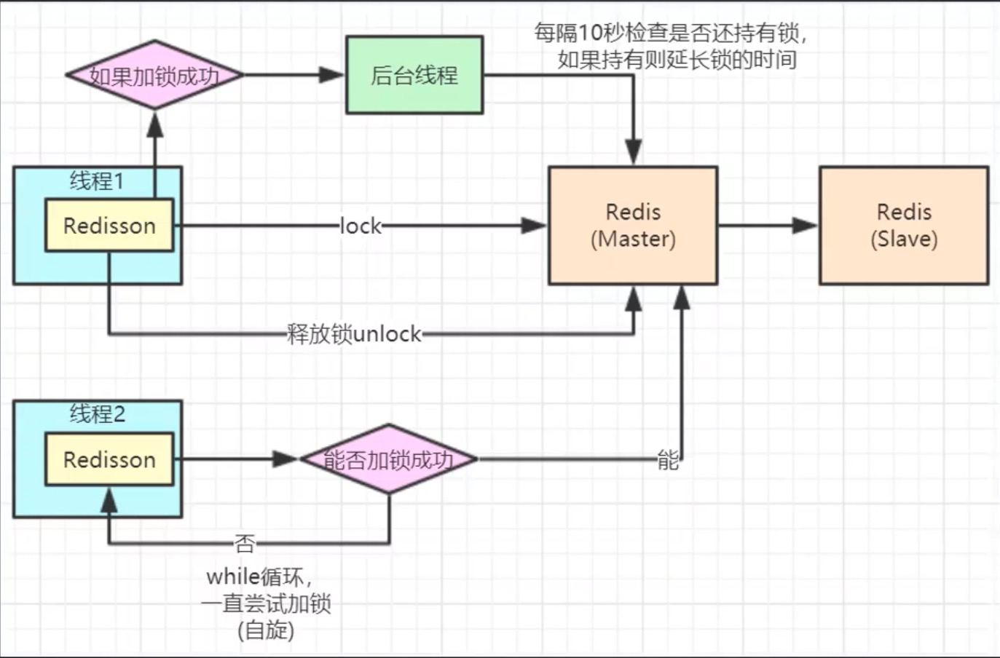

**redisSesson故障转移redis的线程1在master加了锁，转移到slave的时候数据没有同步，线程2在新的master节点上又加锁成功了。redlock超过半数redis节点加锁成功才算加锁成功**

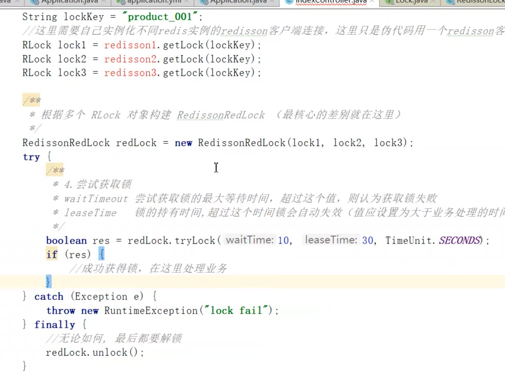

Redlock问题：

1.性能

2.数据回滚问题 网络抖动

3.redis设计之初就是为了高并发而准备的，一秒QPS可以达到10万，设计理念为背


高性能分布式锁实现：

利用分段式方法，concurrenthashmap方式


**集群模式下一个节点配置的主没有从 宕机了怎么办 默认无不可用**


# ZskipList

层（level）：每次创建一个新跳跃表节点的时候，程序都根据**幂次定律**（power law，越大的数出现的概率越小）随机生成一个介于1和32之间的值作为level数组的大小，这个大小就是高度。

跨度（span）：是用来计算排位（rank）的：在查找某个节点的过程中，将沿途访问过的所有层的跨度累记起来，得到的结果就是目标节点在跳跃表中的排位。

```C++
/* ZSETs use a specialized version of Skiplists */
typedef struct zskiplistNode {
    sds ele;
    //按照分值从小到大排列
    double score;
    //指向当前节点的前一个节点
    struct zskiplistNode *backward;
    struct zskiplistLevel {
        //前进指针，用于访问位于表为方向的其他节点
        struct zskiplistNode *forward;
        //跨度，记录了前进指针所指向节点和当前节点的距离
        unsigned long span;
    } level[];
} zskiplistNode;

typedef struct zskiplist {
    struct zskiplistNode *header, *tail;
    //记录跳跃表的长度，也即是，跳跃表当前包含节点的数量（表头节点不计算在内）
    unsigned long length;
    //记录目前跳跃表里面，层数最大的那个节点的层数（表头节点的层数不计算在内）
    int level;
} zskiplist;

typedef struct zset {
    //键为成员，值为分值
    //用于O(1)复杂度的按分支操作
    dict *dict;
    //跳跃表，按分值排序成员
    //用于支持平均复杂度O(log(n))的按分值定位成员操作以及范围
    zskiplist *zsl;
} zset;
```


### Redis为什么用skiplist而不用平衡树？

1、它们不是很占用内存。这基本上取决于你。更改有关节点具有给定数量级别的概率的参数将使内存密集度低于 btree。

2、一个有序集通常是许多 ZRANGE 或 ZREVRANGE 操作的目标，即作为链表遍历跳过列表。使用此操作，跳过列表的缓存局部性至少与其他类型的平衡树一样好。

3、它们更易于实现、调试等。例如，由于跳过列表的简单性，我收到了一个补丁（已经在 Redis 主服务器中），其中增加了在 O(log(N)) 中实现 ZRANK 的跳过列表。它需要对代码进行少量更改。


# 使用SDS字符串的好处

1. 常数复杂度获取字符串长度
2. 杜绝缓存区溢出（C字符串不记录自身的长度，如果把一个字符串添加到另一个字符串，第一个字符串空间大小不足以支撑两个字符串的话就会出现溢出）
3. 减少修改字符串时带来的内存重分配次数
4. 通过未使用空间，SDS实现了**空间预分配**和**惰性空间**释放两种优化策略
5. 二进制安全
6. 兼容部分C字符串函数

#### 空间预分配

SDS修改之后长度

小于1MB free为len属性同样大小的未使用空间

大于1MB free为固定1MB

#### 惰性空间释放

SDS避免了缩短字符串时所需的内存冲分配操作，并未将来可能有的增长操作提供了优化。

#### 二进制安全

C字符串中的字符必须符合某种编码（比如ASCII），并且除了字符串的末尾以外，字符串里面不能包含空字符，否则最先被程序读入的空字符将误认为是字符串结尾，这些限制使得C字符串只能保存文本数据，而不能保存图片，音频，视频，压缩文件这样的二进制数据 。

```java
int zslRandomLevel(void) { 

	int level = 1; 

	while ((random()&0xFFFF) < (ZSKIPLIST_P * 0xFFFF)) 

	level += 1; 

	return (level<ZSKIPLIST_MAXLEVEL) ? level : ZSKIPLIST_MAXLEVEL; 

}
```


## 脑裂问题

**主库的数据还没有同步到从库，结果主库发生了故障，等从库升级为主库后，未同步的数据就丢失了。**

**参考文章：**https://www.jianshu.com/p/8d045424042f


在sentinel认为主库是客观掉线的时候，进行故障转移期间主库又重新连接上了导致出现了脑裂。

```
如果连接的副本少于 N 个，并且延迟小于或等于 M 秒，则 master 可能会停止接受写入。
min-replicas-to-write 这个配置项设置了主库能进行数据同步的最少从库数量；
min-replicas-max-lag 这个配置项设置了主从库间进行数据复制时，从库给主库发送 ACK 消息的最大延迟（以秒为单位）。
```


## 字典

```c++
typedef struct dictEntry {
    void *key;
    union {
        void *val;
        uint64_t u64;
        int64_t s64;
        double d;
    } v;
    struct dictEntry *next;
} dictEntry;

typedef struct dictht {
    //哈希表数组
    dictEntry **table;
    //    hash表大小
    unsigned long size; //  hashtable 容量
    //    用于计算索引值
    unsigned long sizemask;  // size -1
    //    该哈希表已有节点的数量
    unsigned long used;
} dictht;

//字典结构
typedef struct dict {
    dictType *type;
    void *privdata;
//    渐进式的rehash
    dictht ht[2];// ht[0] , ht[1] =null
    long rehashidx; /* rehashing not in progress if rehashidx == -1 */
    unsigned long iterators; /* number of iterators currently running */
} dict;

typedef struct dictType {
    uint64_t (*hashFunction)(const void *key);
    void *(*keyDup)(void *privdata, const void *key);
    void *(*valDup)(void *privdata, const void *obj);
    int (*keyCompare)(void *privdata, const void *key1, const void *key2);
    void (*keyDestructor)(void *privdata, void *key);
    void (*valDestructor)(void *privdata, void *obj);
} dictType;
```

maxmemory <bytes>默认不开启

## rehash

### 哈希表的扩展与所容

1.服务器目前没有在执行bgsave或者bgrewriteaof命令，并且哈希表的负载因子大于等于1

2.服务器目前正在执行bgsave或者bgrewriteaof命令，并且哈希表的负载因子大于等于5

其中哈希表的负载因子可以通过公示：

load_factor=ht[0].used / ht[0].size


### 渐进式rehash

1.为ht[1]分配空间，让字典同时持有ht[0]和ht[1]两个哈希表

2.在字典中维持一个索引计数器变量rehashidx，并将他的值设置为0，表示rehash工作正式开始

3.在rehash进行期间，每次对字典执行添加、删除、查找或者更新操作时，程序除了执行指定的操作以外，还会顺带将ht[0]哈希表在rehashidx索引上的所有键值对rehash到ht[1]，当rehash工作完成之后，程序将rehashidx属性的值增一

4.随着字典操作的不断执行，最终在某个时间点上，ht[0]的所有键值对都会被rehash到ht[1]，这是程序将rehashidx属性的值设为1，表示rehash操作已完成

渐进式rehash的好处在于它采取分而治之的方式，将rehash键值对所需的计算工作均摊到对字典的每个添加、删除、查找和更新操作上，从而避免了集中式rehash而带来的庞大计算量

**当以下条件中的任意一个被满足时， 程序会自动开始对哈希表执行扩展操作：**

- 服务器目前没有在执行 BGSAVE 命令或者 BGREWRITEAOF 命令， 并且哈希表的负载因子大于等于 1 ；
- 服务器目前正在执行 BGSAVE 命令或者 BGREWRITEAOF 命令， 并且哈希表的负载因子大于等于 5 ；

### Redis Rehash机制优化

那么针对在**Redis满容驱逐状态**下，如何避免因Rehash而导致Redis抖动的这种问题。

- 在Redis Rehash源码实现的逻辑上，加上了一个判断条件，如果现有的剩余内存不够触发Rehash操作所需申请的内存大小，即不进行Resize操作；
- 通过提前运营进行规避，比如容量预估时将Rehash占用的内存考虑在内，或者开启自动扩容，或者适当调低内存告警阈值，可以及时增加内存。

### 渐进式rehash执行期间的哈希表操作

​		因为在进行渐进式rehash的过程中，字典会同时使用ht[0]和ht[1]两个哈希表，所以在渐进式rehash进行期间，字典的删除、查找、更新等操作会在两个哈希表上进行。例如，要在字典里面查找一个键的话，程序会现在ht[0]里面进行查找，如果没找到的话，就会继续到ht[1]里面进行查找。

​		另外，在渐进式rehash执行期间，新添加到字典的键值对一律会被保存到ht[1]里面，而ht[0]则不再进行任何添加操作，这一措施保证了ht[0]包含的键值对数量会只减不增，并随着rehash操作的执行而最终变成空表。


## 跳跃表

```c#
/* ZSETs use a specialized version of Skiplists */
typedef struct zskiplistNode {
    sds ele;
    //按照分值从小到大排列
    double score;
    //指向当前节点的前一个节点
    struct zskiplistNode *backward;
    struct zskiplistLevel {
        //前进指针，用于访问位于表为方向的其他节点
        struct zskiplistNode *forward;
        //跨度，记录了前进指针所指向节点和当前节点的距离
        unsigned long span;
    } level[];
} zskiplistNode;

typedef struct zskiplist {
    struct zskiplistNode *header, *tail;
    //记录跳跃表的长度，也即是，跳跃表当前包含节点的数量（表头节点不计算在内）
    unsigned long length;
    //记录目前跳跃表里面，层数最大的那个节点的层数（表头节点的层数不计算在内）
    int level;
} zskiplist;
```


## 整数集合

整数集合（intset）是集合键的底层实现之一，当一个集合只包含整数值元素，并且这个集合的元素数量不多时，Redis就会使用整数集合作为集合键的底层实现。保存类型为，encoding（int16_t、int32_t、int64_t）。

第一次添加元素的时候会按照encoding类型和length属性决定contents数组大小。

```c#
typedef struct intset {
    uint32_t encoding;
    uint32_t length;
    int8_t contents[];
} intset;
```

### 升级

每当我们要将一个新元素添加到整数集合里面，并且新元素的类型比整数集合现有所有元素的类型都要长时，整数集合需要先进行升级（upgrade），然后才能将新元素添加到整数集合里面。

升级证书集合并添加新元素共分为三步进行：

1、根据新元素的类型，扩展整数集合底层数组的空间大小，并为新元素分配空间。

2、将底层数组现有的所有元素都转换成与新元素相同的类型，并将类型转换后的元素继续维持底层数组的有序性不变。

3、将新元素添加到底层数组里面。

### 好处

1、提高灵活性，可以任意插入不同类型的元素 int16_t、int32_t、int64_t

2、节约内存，对于只插入单一类型少位数的元素来说 完全可以使用更省内存的元素类型


## 压缩列表

**压缩列表是Redis为了节约内存而开发的，是由一系列特殊编码的连续内存块组成的顺序型数据结构，一个压缩列表可以包含任意多个节点，每个节点保存一个字节数组或者一个整数值。**

**Redis3.2版本前，ziplist与adlist作为列表对象的底层实现，而3.2后列表对象的底层实现改为quciklist，而ziplist则在quicklist中被应用，除了quicklist，ziplist还被用于zset的底层实现。**

| 属性    | 类型     | 长度  | 用途                                                         |
| ------- | -------- | ----- | ------------------------------------------------------------ |
| zlbytes | uint32_t | 4字节 | 记录整个压缩列表占用的内存字节数：在对压缩列表进行内存重分配，或者计算zlend的位置时使用。 |
| zltail  | uint32_t | 4字节 | 记录压缩列表尾节点距离压缩列表的起始地址有多少字节：通过这个偏移量，程序无须遍历整个压缩列表就可以确定表尾节点的地址。 |
| zllen   | uint16_t | 2字节 | 记录了压缩列表包含的节点数量：当这个属性的值小于UINT16_MAX（65535）时，这个属性的值就是压缩列表包含节点的数量：当这个值等于UINT16_MAX时，节点的真实数量需要遍历整个压缩列表才能计算得出。 |
| entry   | 列表节点 | 不定  | 压缩列表包含的各个节点，节点的长度由节点保存的内容决定。     |
| zlend   | uint8_t  | 1字节 | 特殊值0XFF（十进制255），用于标记压缩力表的末端。            |

每个压缩列表节点由previous_entry_length、encoding、content

previous_entry_length记录的是压缩列表中前一个节点的长度，小于254字节用1字节长度保存，添加节点和删除节点可能引起连锁更新（多个节点长度都是介于250危险空间大小，突然头插入了一个需要5字节保存的数值，导致后边的所有前指针都需要改变）

encoding属性记录了节点的content属性所保存数据的类型以及长度，大于254字节用5字节长度保存

content属性负责保存节点的值，节点值可以是一个字节数组或整数，值的类型和长度由节点的encoding属性决定

**添加和删除节点都会可能引起连锁更新**

zlbytes zltail zllen e1 e2 e3 e4 ……en zlend

如果e1至en所有的节点长度都小于254字节，所以记录这些节点的长度只需要1字节常的previous_entry_length属性，这时如果我们将一个长度大于等于254字节的新节点new设置为压缩列表的表头节点，就会导致所有后续节点都需要重分配空间去存储前一节点的大小

zlbytes zltail zllen big small e1 e2 e3 e4 ……en zlend

如果e1至en都是大小介于250字节至253字节的节点，big节点的长度大于等于254字节（需要5字节的previous_entry_length来保存），而small节点的长度小于254字节（只需要1字节的previous_entry_length来保存），那么当我们将small节点从压缩列表中删除之后，为了让e1的previous_entry_length属性可以记录big节点的长度，程序将扩展e1的空间，并由此引发之后的连锁更新。


## 对象

Redis 使用对象来表示数据库中的键和值， 每次当我们在 Redis 的数据库中新创建一个键值对时， 我们至少会创建两个对象， 一个对象用作键值对的键（键对象）， 另一个对象用作键值对的值（值对象）。

```c#
//  redisObject对象 :  string , list ,set ,hash ,zset ...
typedef struct redisObject {
    //类型
    unsigned type:4;        //  4 bit, sting , hash
    //编码
    unsigned encoding:4;    //  4 bit 
    unsigned lru:LRU_BITS; /* LRU time (relative to global lru_clock) or
                            * LFU data (least significant 8 bits frequency
                            * and most significant 16 bits access time). 
                            *    24 bit 
                            * */
    int refcount;           // 4 byte  
  	//指向底层数据结构实现的指针
    void *ptr;              // 8 byte  总空间:  4 bit + 4 bit + 24 bit + 4 byte + 8 byte = 16 byte  
} robj;
```

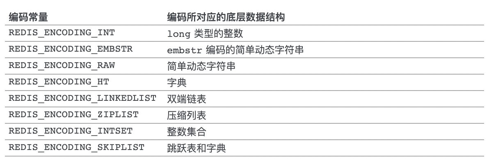

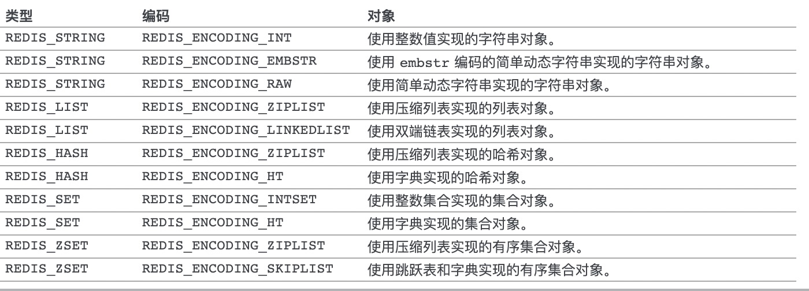

type命令相当于输出值的类型

object encoding 相当于输出的是底层具体的实现

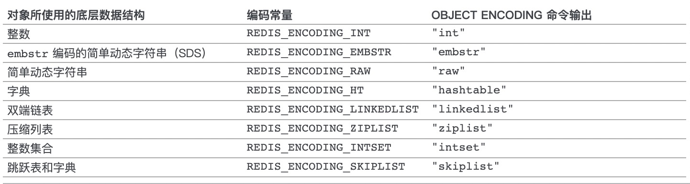


## 字符串对象

字符串对象的编码可以是int，raw或者embstr

如果字符串对象保存的是一个字符串值， 并且这个字符串值的长度小于等于 `39` 字节， 那么字符串对象将使用 `embstr` 编码的方式来保存这个字符串值。

`embstr` 编码是专门用于保存短字符串的一种优化编码方式， 这种编码和 `raw` 编码一样， 都使用 `redisObject` 结构和 `sdshdr` 结构来表示字符串对象， 但 `raw` 编码会调用两次内存分配函数来分别创建 `redisObject` 结构和 `sdshdr` 结构， 而 `embstr` 编码则通过调用一次内存分配函数来分配一块连续的空间， 空间中依次包含 `redisObject` 和 `sdshdr` 两个结构

如果字符串对象保存的是一个字符串值， 并且这个字符串值的长度大于 `39` 字节， 那么字符串对象将使用一个简单动态字符串（SDS）来保存这个字符串值， 并将对象的编码设置为 `raw` 。

对于longdouble类型浮点数也是用字符串表示的，如果对浮点数有操作的时候先转换为浮点数做运算，然后再转换为字符串。

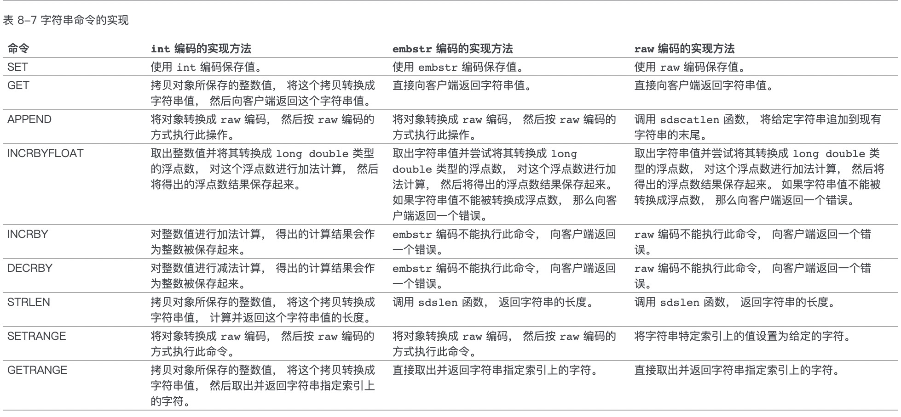


## 列表对象

列表对象的编码可以是 `ziplist` 或者 `linkedlist` 。

- **ziplist 的优点是内存紧凑，访问效率高，缺点是更新效率低，并且数据量较大时，可能导致大量的内存复制**
- **linkedlist 的优点是节点修改的效率高，但是需要额外的内存开销，并且节点较多时，会产生大量的内存碎片**

list-max-ziplist-size  -2        //  单个ziplist节点最大能存储  8kb  ,超过则进行分裂,将数据存储在新的ziplist节点中
list-compress-depth  1        //  0 代表所有节点，都不进行压缩，1， 代表从头节点往后走一个，尾节点往前走一个不用压缩，其他的全部压缩，2，3，4 ... 以此类推

为了结合两者的优点，**在 redis 3.2 之后，list 的底层实现变为快速列表 quicklist**。

```c#
robj *createQuicklistObject(void) {
    quicklist *l = quicklistCreate();
    robj *o = createObject(OBJ_LIST,l);
    o->encoding = OBJ_ENCODING_QUICKLIST;
    return o;
}

quicklist *quicklistCreate(void) {
    struct quicklist *quicklist;

    quicklist = zmalloc(sizeof(*quicklist));
    quicklist->head = quicklist->tail = NULL;
    quicklist->len = 0;
    quicklist->count = 0;
    quicklist->compress = 0;
    quicklist->fill = -2;
    quicklist->bookmark_count = 0;
    return quicklist;
}

typedef struct quicklist {
    quicklistNode *head;
    quicklistNode *tail;
    unsigned long count;       
    unsigned long len;           
    int fill : QL_FILL_BITS;                
    unsigned int compress : QL_COMP_BITS;  
    unsigned int bookmark_count: QL_BM_BITS;
    quicklistBookmark bookmarks[];
} quicklist;

typedef struct quicklistNode {
    struct quicklistNode *prev;
    struct quicklistNode *next;
    unsigned char *zl;
    unsigned int sz;            
    unsigned int count : 16;    
    unsigned int encoding : 2;    
    unsigned int container : 2;  
    unsigned int recompress : 1; 
    unsigned int attempted_compress : 1; 
    unsigned int extra : 10;  
} quicklistNode;
```


quicklist 实际上是 zipList 和 linkedList 的混合体，它将 linkedList 按段切分，每一段使用 zipList 来紧凑存储，多个 zipList 之间使用双向指针串接起来。


### 编码转换

当列表对象可以同时满足以下两个条件时， 列表对象使用 `ziplist` 编码：

1. 列表对象保存的所有字符串元素的长度都小于 `64` 字节；
2. 列表对象保存的元素数量小于 `512` 个；

不能满足这两个条件的列表对象需要使用 `linkedlist` 编码。

List-max-ziplist-value	

List-max-ziplist-entries

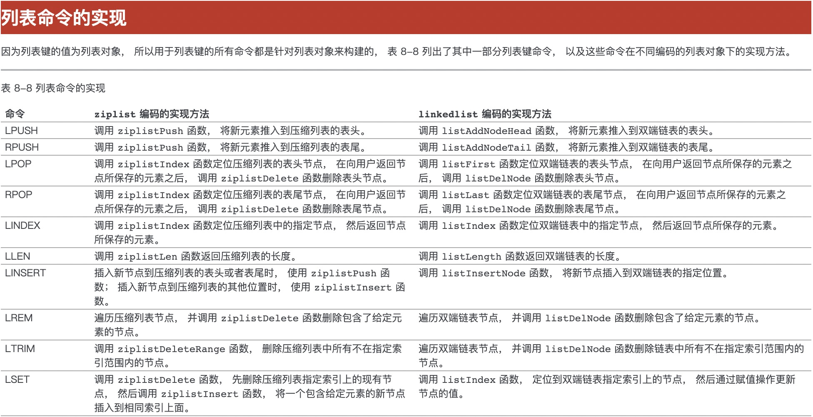


## 哈希对象

哈希对象的编码可以是 `ziplist` 或者 `hashtable` 。

hash-max-ziplist-entries  512    //  ziplist 元素个数超过 512 ，将改为hashtable编码 
hash-max-ziplist-value    64      //  单个元素大小超过 64 byte时，将改为hashtable编码

`ziplist` 编码的哈希对象使用压缩列表作为底层实现， 每当有新的键值对要加入到哈希对象时， 程序会先将保存了键的压缩列表节点推入到压缩列表表尾， 然后再将保存了值的压缩列表节点推入到压缩列表表尾， 因此：

- 保存了同一键值对的两个节点总是紧挨在一起， 保存键的节点在前， 保存值的节点在后；

- 先添加到哈希对象中的键值对会被放在压缩列表的表头方向， 而后来添加到哈希对象中的键值对会被放在压缩列表的表尾方向。

  

### 编码转换

****

当哈希对象可以同时满足以下两个条件时， 哈希对象使用 `ziplist` 编码：

1. 哈希对象保存的所有键值对的键和值的字符串长度都小于 `64` 字节；
2. 哈希对象保存的键值对数量小于 `512` 个；

不能满足这两个条件的哈希对象需要使用 `hashtable` 编码。

hash-max-ziplist-entries 512
hash-max-ziplist-value 64

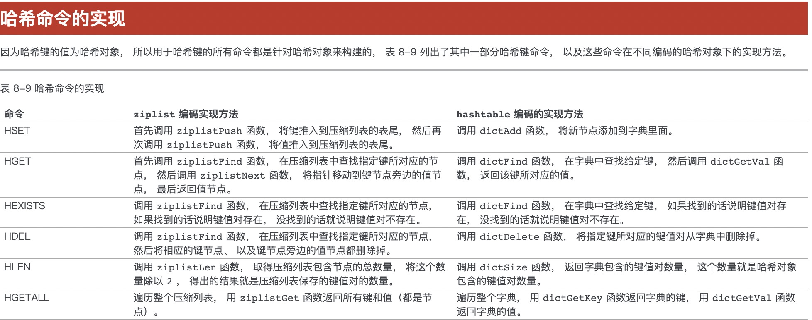


## 集合对象

集合对象的编码可以是 `intset` 或者 `hashtable` 。

`intset` 编码的集合对象使用整数集合作为底层实现， 集合对象包含的所有元素都被保存在整数集合里面。

### 编码的转换

****

当集合对象可以同时满足以下两个条件时， 对象使用 `intset` 编码：

1. 集合对象保存的所有元素都是整数值；
2. 集合对象保存的元素数量不超过 `512` 个；

不能满足这两个条件的集合对象需要使用 `hashtable` 编码。

set-max-intset-entries 512

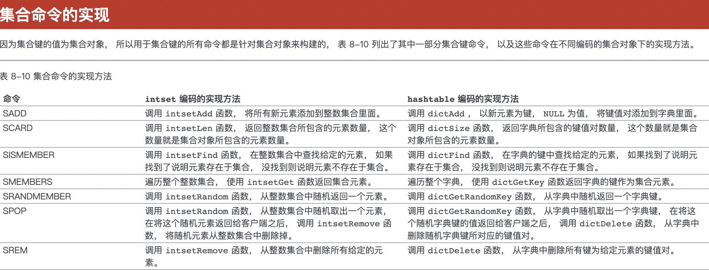


## 有序集合对象

有序集合的编码可以是 `ziplist` 或者 `skiplist` 。

`ziplist` 编码的有序集合对象使用压缩列表作为底层实现， 每个集合元素使用两个紧挨在一起的压缩列表节点来保存， 第一个节点保存元素的成员（member）， 而第二个元素则保存元素的分值（score）。

压缩列表内的集合元素按分值从小到大进行排序， 分值较小的元素被放置在靠近表头的方向， 而分值较大的元素则被放置在靠近表尾的方向。

### 编码的转换

*****

当有序集合对象可以同时满足以下两个条件时， 对象使用 `ziplist` 编码：

1. 有序集合保存的所有元素成员的长度都小于 `64` 字节；
2. 有序集合保存的元素数量小于 `128` 个；

不能满足以上两个条件的有序集合对象将使用 `skiplist` 编码。

zset-max-ziplist-entries 128
zset-max-ziplist-value 64

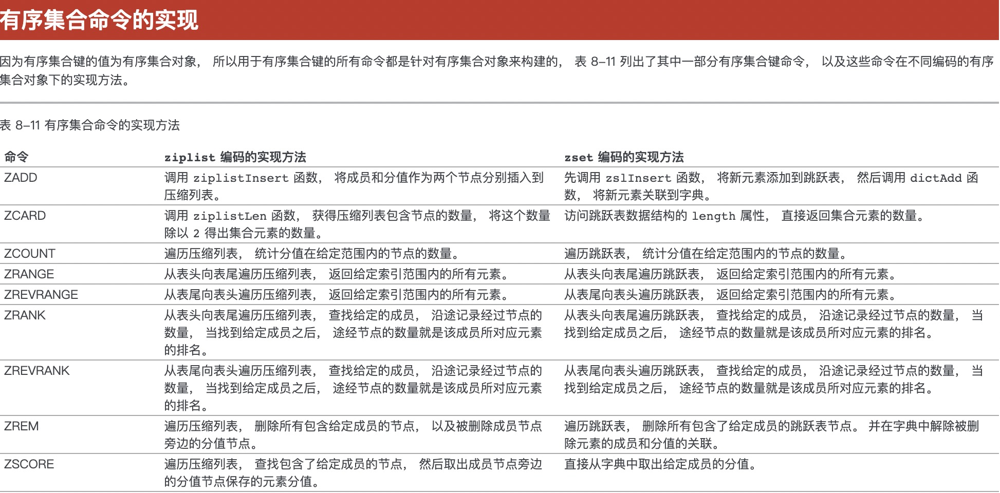


# 文件事件处理器的构成

分别为套接字、I/O多路复用程序、文件时间分排器、事件处理器

I/O多路复用器程序总是会将所有产生事件的套接字都放到一个队列里面，然后通过这个队列，以有序（sequentially），同步（synchronously），每次一个套接字的方式向文件时间分派器传送套接字。


## I/O多路复用程序的实现

​		Redis的I/O多路复用程序的所有功能都是通过包装常见的select、epoll、evport、和kqueue这些I/O多路复用函数库实现的，每个I/O多路复用函数在Redis源码中都对应一个单独的文件，比如as_select.c ae_epoll.c ae_kqueue.c

​		程序编译时自动选择系统中性能最高的I/O多路复用函数库来作为Redis的I/O多路复用程序的底层实现。


## 中断

​		中断使得硬件得以发出通知给处理器。例如在你敲击键盘的时候，键盘控制器（控制键盘的硬件设备）会发出一个中断，通知操作系统有按键按下，中断本质上是一种特殊的电信号，由硬件设备发出向处理器。处理器接收到中断后，会马上向操作系统反映此信号的到来，然后就有操作系统负责处理这些新到来的数据。硬件设备生成中断的时候并不需要考虑与处理器的时钟同步，换句话说就是中断随时可以产生。因此，内核随时可能因为新到来的中断而被打断。

​		在响应一个特定中断的时候，内核会执行一个函数，该函数叫做中断处理程序或者中断服务程序，产生中断的每个设备都有一个响应的中断处理程序。


# 数据库

```c#
typedef struct redisDb {
    dict *dict;                 /* The keyspace for this DB    */
    dict *expires;              /* Timeout of keys with a timeout set    过期时间字典 */
    dict *blocking_keys;        /* Keys with clients waiting for data (BLPOP)*/
    dict *ready_keys;           /* Blocked keys that received a PUSH */
    dict *watched_keys;         /* WATCHED keys for MULTI/EXEC CAS */
    int id;                     /* Database ID */
    long long avg_ttl;          /* Average TTL, just for stats */
    unsigned long expires_cursor; /* Cursor of the active expire cycle. */
    list *defrag_later;         /* List of key names to attempt to defrag one by one, gradually. */
} redisDb;

struct redisServer {
  //...
  redisDb *db
  int dbnum;根据配置文件来决定创建多少个db
  //...
}
```


## Sentinel

当server1的下线时长超过用户设定的下线时长上限时，Sentinel系统就会对server1执行故障转移操作：

- 首先，sentinel系统就会挑选server1属下的其中一个从服务器，并将这个被选中的从服务器升级为新的主服务器。
- 之后，sentinel系统会向server1属下的所有从服务器发送新的复制指令，让他们成为新的主服务器的从服务器，当所有从服务器都开始复制新的主服务器时，故障转移操作执行完毕。
- 另外，sentinel还会继续见识已下线的server1，并在他重新上线时，将它设置为新的主服务器的从服务器。


### 获取主服务器信息

Sentinel默认会以每10秒一次的频率，通过命令连接向被监视的主服务器发送info命令，并通过分析info命令的回复来获取主服务器的当前信息。通过主服务器返回的info命令的回复，sentinel可以获取以下两方面的信息

- 一是关于主服务器本身的信息
- 二是关于主服务器属下所有从服务器的信息


### 向主服务器和从服务器发送信息

默认情况下，sentinel会以每两秒一次的频率，通过命令连接向所有被监视的主服务器和从服务器发送以下格式的命令

publsh __sentinel__ hello"<s_ip>,<s_port>,<s_runid>,<s_epoch>,<m_name>,<m_ip>,<m_port>,<m_epoch>"

- 其中以s_开头的参数记录的是sentinel本身的信息，各个参数的意义
- 而m_开头的参数记录的则是sentinel本身的信息，如果sentienl正在监视的是主服务器，那么这些参数记录的就是主服务器的信息，如果sentinel正在监视的是从服务器，那么这些参数记录的就是从服务器正在复制的主服务器的信息

| 参数    |          意义          |
| :------ | :--------------------: |
| s_ip    |    sentinel的ip地址    |
| s_port  |    sentinel的端口号    |
| s_runid |    sentinel的运行id    |
| s_epoch | sentinel当前的配置纪元 |
| m_name  |     主服务器的名字     |
| m_ip    |    主服务器的ip地址    |
| m_port  |    主服务器的端口号    |
| m_epoch | 主服务器当前的配置纪元 |


### 检测主观下线

默认情况下，sentinel会以每秒一次的频率向所有与它创建了命令连接的实例（包括主服务器，从服务器，其他sentinel在内）发送ping命令

sentinel配置文件中的down-after-milliseconds选项指定了sentinel判断实例进入主观下线所需的时间长度，如果一个实例在down-after-milliseconds毫秒内，连续向sentienl返回无效回复，那么sentienl会修改这个实例所对应的实例结构。


### 检测客观下线

当sentinel将一个主服务器判断为主观下线之后，为了确认这个主服务器是否真的下线了，他会想同样监视这 一主服务器的其他sentinel进行询问，看他们是否也认为主服务器已经经入了下线状态（可以是主观下线或者客观下线）。当sentinel从其他sentinel哪里接收到足够数量的已下线判断之后，sentienl就会将从服务器判定为客观下线，并对主服务器执行故障转移操作。


### 发送sentinel is-master-down-by-add命令

sentienl使用：

sentienl is-master-down-by-addr <ip> <port> <current_epoch> <runid>

命令询问其他sentinel是否同意主服务器已下线


| 参数          |                             意义                             |
| :------------ | :----------------------------------------------------------: |
| ip            |          被sentinel判断为主观下线的主服务器的ip地址          |
| port          |          被sentinel判断为主观下线的主服务器的端口号          |
| current_epoch |         sentinel当前的配置纪元，用于选举领头sentinel         |
| runid         | 可以是*符号或者sentinel的运行id，*符号代表的是检测主观下线状态，sentienl的运行id则用于选举领头sentienl |

### 接收sentinel is-master-dow-by-add命令

当一个sentinel（目标sentienl）接收到另一个sentinel（源sentinel）发来的sentinel is-master-down-by-add命令时，目标sentinel会分析并取出命令请求中包含的各个参数，并根据其中的主服务器ip和端口号，检查主服务器是否已经下线，然后向源sentienl返回一条包含三个参数的multi bulk回复作为sentinel is-master-down-by命令的回复：

1. <down_state>
2. <leader_runid>
3. <leader_epoch>

| 参数         | 意义                                                         |
| ------------ | ------------------------------------------------------------ |
| dwon_state   | 返回目标sentienl对主服务器的检查结果，1代表主服务器已下线 0代表主服务器未下线 |
| leader_runid | 可以是*符号或者目标sentinel的局部领头sentinel的运行id：符号代表命令仅仅用于检测主服务器的下线状态，而局部领头sentinel的运行id则用于选举领头sentinel |
| leader_epoch | 目标sentinel的局部领头sentinel的配置纪元，用于选举领头sentinel，仅用于leader_runid的值不为*时，如果为,那么leader_epoch总为0 |

当这一数量达到配置指定的判断客观下线所需的数量时，sentinel就会将主服务器实例结构flags属性的STR—O—DOWN标识打开，表示主服务器已经进入客观下线状态。

当认为主服务器已经进入下线状态的sentinel的数量，超过sentinel配置中心配置的quorum参数的值，那么该sentinel就会认为主服务器已经进入客观下线状态，比如，如果sentinel在启动时载入了以下配置

sentinel monitor master 127.0.0.1 6379 2

那么包括当前sentienl在内，只要总共有两个sentienl认为主服务器已经进入下线状态，那么当前sentienl就会将主服务器判断为客观下线

## 集群选举新的主节点

新的主节点是通过选举产生的，以下是集群选举新的主节点的方法。

1. 集群的配置纪元是一个自增计数器，它的初始值为0

2. 当集群里的某个节点开始一次故障转移操作时，集群配置纪元的值会被增1

3. 对于每个配置纪元，集群里每个负责处理槽的主节点都有一次投票的机会，而第一个向主节点要求投票的从节点将获得主节点的投票。

4. 当从节点发现自己正在复制的主节点进入已下线状态时，从节点会向集群广播一条clustermsg_type_failover_auth_request消息，要求所有收到这条消息，并且具有投票权的主节点想这个从节点投票。

5. 如果一个主节点具有投票权（它正在负责处理槽），并且这个主节点尚未投票给其他从节点，那么主节点将向要求投票的从节点返回一条clustermas_type_failover_auth_ack消息，表示这个主节点支持从节点称为新的主节点。

6. 每个参与选举的从节点都会接收clustermsg_type_failover_auth_ack消息，并根据自己收到了多少条这种消息来统计自己获得了多少主节点的支持。

7. 如果集群有N个具有投票权的主节点，那么当一个从节点收集到大于等于n/2+1张支持票时，这个从节点就会当选称为新的主节点。

8. 因为在每一个配置纪元里面，每个具有投票权的主节点只能头一次票，所以如果有N个主节点进行投票，那么具有大于等于N/2+1支持票的从节点只会有一个，这确保了新的主节点只会有一个。

9. 如果在一个配置纪元里面没有从节点能收集到足够多的支持票，那么集群进入一个新的配置纪元，并再次进行选举，知道选出新的主节点为止。

   

### 设置键的生存时间或过期时间

****

通过EXPIRE命令或者PEXPIRE命令，客户端可以以秒或者毫秒精度为数据库中的某个键设置生存时间（Time To Live，TTL），在经过指定的秒数或者毫秒数之后，服务器就会自动删除生存时间为0的键。

与EXPIRE命令和PEXPIRE命令类似，客户端可以通过EXPIREAT命令或PEXPIREAT命令，以秒或者毫秒精度给数据库中的某个键设置过期时间（expire time）。

过期时间是一个UNIX时间戳，当键的过期时间来临时，服务器就会自动从数据库中删除这个键。

TTL命令和PTTL命令接受一个带有生存时间或者过期时间的键，返回这个键的剩余生存时间，也就是，返回距离这个键被服务器自动删除还有多长时间。

Redis有四种不同的命令可以用于设置键生存时间（键可以存在多久）或过期时间（键什么时候被删除）

expire key ttl 命令用于将键key的生存时间设置为ttl秒

pexpire key ttl 命令用于将键key的生存时间设置为ttl毫秒

expireat key timestamp 命令用于将键key的过期时间设置为timestamp所指定的秒数时间戳

pexpireat key timestamp 命令用于将键key的过期时间设置为timestamp所指定的毫秒数时间戳

虽然有多种不同单位和不同形式的设置命令，但实际上EXPIRE、PEXPIRE、EXPIREAT 三个命令都是使用PEXPIREAT命令来实现的：无论客户端执行的是以上四个命令中的哪一个，经过转换之后，最终的执行效果都和执行PEXPIREAT命令一样。


### 保存过期时间

****

redisDb结构的expires字典保存了数据库中所有键的过期时间，我们称这个字典为过期字典：

- 过期字典的键是一个指针，这个指针指向键空间中的某个键对象（也即是某个数据库键）
- 过期字典的值是一个long long类型的整数，这个整数保存了键所指向的数据库键的过期时间——一个毫秒精度的UNIX时间戳


### 移除过期时间

****

PERSIST命令可以移除一个键的过期时间

惰性删除策略的实现

```c#
int expireIfNeeded(redisDb *db, robj *key) {

    if (!keyIsExpired(db,key)) return 0; // 未过期 

    /* If we are running in the context of a slave, instead of
     * evicting the expired key from the database, we return ASAP:
     * the slave key expiration is controlled by the master that will
     * send us synthesized DEL operations for expired keys.
     *
     * Still we try to return the right information to the caller,
     * that is, 0 if we think the key should be still valid, 1 if
     * we think the key is expired at this time. */
    if (server.masterhost != NULL) return 1;

    /* Delete the key */
    server.stat_expiredkeys++;
    propagateExpire(db,key,server.lazyfree_lazy_expire);
    notifyKeyspaceEvent(NOTIFY_EXPIRED,
        "expired",key,db->id);
    int retval = server.lazyfree_lazy_expire ? dbAsyncDelete(db,key) :   // 异步删除
                                               dbSyncDelete(db,key);     // 同步删除
    if (retval) signalModifiedKey(NULL,db,key);
    return retval;
}
```


定期删除策略的实现

过期键的定期删除策略由expire.c/activeExpireCycle函数实现，每当Redis的服务器周期性操作redis.c/serverCron函数执行时，activeExpireCycle函数就会被调用，他在规定的时间内，分多次遍历服务器中的各个数据库，从数据库的expire字典中随机检查一部分键的过期时间，并删除其中的键。


### 生成RDB文件

****

在执行SAVE命令或者BGSAVE命令创建一个新的RDB文件时，程序会对数据库中的键进行检查，已经过期的键不会被保存到新创建的RDB文件中。

### 载入RDB文件

****

在启动Redis服务时，如果服务器开启了RDB功能，那么服务器将对RDB文件进行载入：

1、如果服务器以主服务器模式运行，那么在载入RDB文件时，程序会对文件中保存的键进行检查，未过期的键会被载入到数据库中，而过期键则会被忽略，所以过期键对载入RDB文件的主服务器不会造成影响。

2、如果服务器以从服务器模式运行，那么在载入RDB文件时，文件中保存的所有键，不论是否过期，都会被载入到数据库中。不过，因为主从服务器在进行数据同步的时候，从服务器的数据就会被清空，所以一般来讲，过期键对载入RDB文件的从服务器也不会造成影响。


## BGSAVE命令执行时的服务器状态

BGSAVE命令执行期间，服务器处理SAVE，BGSAVE，BGREWRITEAOF三个命令的方式回合平时有所不同。

首先在BGSAVE命令执行期间，客户端发送的save和bgsave命令会被服务器拒绝，服务器禁止save命令和bgsave命令同时执行是为了避免父进程和子进程同时执行两个调用防止竞争条件。

bgrewirteaof命令和bgsave两个命令不能同时执行。

- 如果bgsave命令正在执行，那么客户端发送的bgrewirteaof命令会被延迟到bgsave命令执行完毕之后在执行。
- 如果bgrewireaof命令正在执行，那么客户端发送的bgsave命令会被服务器拒绝。

服务器程序会根据save选项的保存条件 设置服务器状态的redisserver结构的redisparams属性，他里面的每一个saveparam都是一个保存条件。

```c#

struct redisServer {
    ……
struct saveparam *saveparams;   /* Save points array for RDB */
}

struct saveparam {
    //秒数
    time_t seconds;
    //修改数
    int changes;
};
```

### ditry计数器和lastsave属性

****

除了saveparams数组之外，服务器状态还维持着一个dirty计数器，以及一个lastsave属性。

- dirty计数器纪录距离上一次成功执行save命令或者bgsave命令之后，服务器对数据库状态（服务器中的所有数据库）进行了多少次修改（包括写入、删除、更新等操作）
- lastsave属性是一个时间戳，记录了服务器上一次成功执行save命令或者bgsave命令的时间。


### 检查保存条件是否满足

****

redis的服务器周期性操作函数servercron默认每隔100毫秒就会执行一次，该函数用于对正在运行的服务器进行维护，他的其中一项工作就是检查save选项所设置的保存条件是否已经满足，如果满足的话就会执行bgsave命令。

关于分析RDB文件的说明，因为Redis本身带有RDB文件检查工具redis-check-dump。


### AOF文件写入

****

当过期键被惰性删除或者定期删除之后，程序会向AOF文件追加（append）一条DEL命令，来显式地记录该键已被删除。

### AOF重写

****

在执行AOF重写的过程中，程序会对数据库中的键进行检查，已过期的键不会保存到重写后的AOF文件中。

# AOF持久化

AOF持久化功能的实现可以分为命令追加、文件写入、文件同步三个步骤。

### 1、命令追加

当AOF持久化功能处于打开状态时，服务器在执行完一个写命令之后，会以协议格式将被执行的写命令追加到服务器状态的aof_buf缓冲区的末尾。

### 2、AOF文件的写入与同步

Redis 的服务器进程就是一个事件循环（loop）， 这个循环中的文件事件负责接收客户端的命令请求， 以及向客户端发送命令回复， 而时间事件则负责执行像 `serverCron` 函数这样需要定时运行的函数。

因为服务器在处理文件事件时可能会执行写命令， 使得一些内容被追加到 `aof_buf` 缓冲区里面， 所以在服务器每次结束一个事件循环之前， 它都会调用 `flushAppendOnlyFile` 函数， 考虑是否需要将 `aof_buf` 缓冲区中的内容写入和保存到 AOF 文件里面。

| `appendfsync` 选项的值 | `flushAppendOnlyFile` 函数的行为                             |
| :--------------------- | :----------------------------------------------------------- |
| `always`               | 将 `aof_buf` 缓冲区中的所有内容写入并同步到 AOF 文件。       |
| `everysec`             | 将 `aof_buf` 缓冲区中的所有内容写入到 AOF 文件， 如果上次同步 AOF 文件的时间距离现在超过一秒钟， 那么再次对 AOF 文件进行同步， 并且这个同步操作是由一个线程专门负责执行的。 |
| `no`                   | 将 `aof_buf` 缓冲区中的所有内容写入到 AOF 文件， 但并不对 AOF 文件进行同步， 何时同步由操作系统来决定。 |

```text
文件的写入和同步

为了提高文件的写入效率， 在现代操作系统中， 当用户调用 `write` 函数， 将一些数据写入到文件的时候， 操作系统通常会将写入数据暂时保存在一个内存缓冲区里面， 等到缓冲区的空间被填满、或者超过了指定的时限之后， 才真正地将缓冲区中的数据写入到磁盘里面。

这种做法虽然提高了效率， 但也为写入数据带来了安全问题， 因为如果计算机发生停机， 那么保存在内存缓冲区里面的写入数据将会丢失。

为此， 系统提供了 `fsync` 和 `fdatasync` 两个同步函数， 它们可以强制让操作系统立即将缓冲区中的数据写入到硬盘里面， 从而确保写入数据的安全性。
```

**为什么是在执行完命令之后记录日志呢？**

- 避免额外的检查开销，AOF 记录日志不会对命令进行语法检查；
- 在命令执行完之后再记录，不会阻塞当前的命令执行。

这样也带来了风险（我在前面介绍 AOF 持久化的时候也提到过）：

- 如果刚执行完命令 Redis 就宕机会导致对应的修改丢失；
- 可能会阻塞后续其他命令的执行（AOF 记录日志是在 Redis 主线程中进行的）。

## fork函数

**参考文章：**https://segmentfault.com/a/1190000039869422

**写时拷贝是一种可以推迟甚至免除拷贝数据的技术。**内核此时并不复制整个进程地址空间，而是让父进程和子进程共享同一个拷贝。

只有在需要写入的时候，数据才会被复制，从而使各个进程拥有各自的拷贝。也就是说，资源的复制只有在需要写入的时候才进行，在此之前，只是以只读方式共享。这种技术使地址空间上的页的拷贝被推迟到实际发生写入的时候才进行。在页根本不会被写入的情况下（举例来说，fork()后立即调用exec()）它们就无需复制了。

fork()的实际开销就是复制父进程的页表以及给子进程创建唯一的进程描述符。在一般情况下，进程创建后都会马上运行一个可执行的文件，这种优化可以避免拷贝大量根本就不会被使用的数据（地址空间里常常包含数十兆的数据）。由于Unix强调进程快速执行的能力，所以这个优化是很重要的。

在 fork 函数调用时，父进程和子进程会被 Kernel 分配到不同的虚拟内存空间中，所以在两个进程看来它们访问的是不同的内存：

- 在真正访问虚拟内存空间时，Kernel 会将虚拟内存映射到物理内存上，所以父子进程共享了物理上的内存空间；
- 当父进程或者子进程对共享的内存进行修改时，共享的内存才会以页为单位进行拷贝，父进程会保留原有的物理空间，而子进程会使用拷贝后的新物理空间；

## 文件事件

Redis 基于 [Reactor 模式](http://en.wikipedia.org/wiki/Reactor_pattern)开发了自己的网络事件处理器： 这个处理器被称为文件事件处理器（file event handler）：

- 文件事件处理器使用 [I/O 多路复用（multiplexing）](http://en.wikipedia.org/wiki/Multiplexing)程序来同时监听多个套接字， 并根据套接字目前执行的任务来为套接字关联不同的事件处理器。
- 当被监听的套接字准备好执行连接应答（accept）、读取（read）、写入（write）、关闭（close）等操作时， 与操作相对应的文件事件就会产生， 这时文件事件处理器就会调用套接字之前关联好的事件处理器来处理这些事件。

虽然文件事件处理器以单线程方式运行， 但通过使用 I/O 多路复用程序来监听多个套接字， 文件事件处理器既实现了高性能的网络通信模型， 又可以很好地与 Redis 服务器中其他同样以单线程方式运行的模块进行对接， 这保持了 Redis 内部单线程设计的简单性。

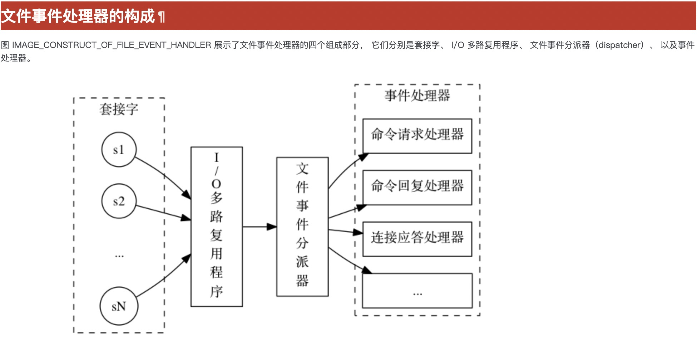


## 命令执行器

​		命令执行器要做的第一件事情就是根据客户端状态的argv[0]参数，在命令表（command table）中查找参数所指定的命令，并将找到的命令保存到客户端状态的cmd属性里面。

​		命令表是一个字典，字典的健是一个个命令名字，比如“set” “get” “del”等等；而字典的值是一个个redisCommand结构，每个redisCommand结构记录了一个Redis命令的实现信息。

```c#
struct redisCommand {
    char *name;
    redisCommandProc *proc;
    int arity;
    char *sflags;   /* Flags as string representation, one char per flag. */
    uint64_t flags; /* The actual flags, obtained from the 'sflags' field. */
    /* Use a function to determine keys arguments in a command line.
     * Used for Redis Cluster redirect. */
    redisGetKeysProc *getkeys_proc;
    /* What keys should be loaded in background when calling this command? */
    int firstkey; /* The first argument that's a key (0 = no keys) */
    int lastkey;  /* The last argument that's a key */
    int keystep;  /* The step between first and last key */
    long long microseconds, calls;
    int id;     /* Command ID. This is a progressive ID starting from 0 that
                   is assigned at runtime, and is used in order to check
                   ACLs. A connection is able to execute a given command if
                   the user associated to the connection has this command
                   bit set in the bitmap of allowed commands. */
};
```


## 主从复制

Redis具有高可靠性，主要体现在两方面，一是数据尽量少丢失，二是服务尽量少中断。AOF和RDB保证了第一点，而第二点的实现，Redis采用增加副本冗余量的方式。

Redis提供主从库模式来保证数据副本一致，主从库采用读写分离。读操作可以通过主库或从库，而写操作首先到主库执行，再由主库将写操作同步给从库。

为什么要采用读写分离的方式呢？

如果客户端对同一个数据进行多次修改，每次写操作都发送到不同的实例上，会导致实例副本数据不一致。**这种情况下如果要做到数据一致，就会涉及到加锁、实例之间协商是否完成修改等一系列操作，带来巨额开销。**而读写分离把所有写操作的请求都发送到主库上，然后同步给从库，多个实例之间就不用协调了。

主从库同步是如何完成的？

启动多个Redis实例的时候，通过replicaof命令形成主从库关系。（Redis 5.0以前使用slaveof）


第一阶段，从库和主库建立连接，告诉主库即将进行同步，主库确认恢复后，主从库间就可以开始同步了，psync命令包含runID和offset两个参数，runID是主库实例的随机ID，由于第一次连接时不知道主库runID，所以是“?”，offset是复制进度，-1表示第一次复制。主库收到psync命令后，使用FULLRESYNC命带上runID和offset返回给从库，FULLRESYNC表示第一次复制采用全量复制。

第二阶段，主库将所有数据同步给从库，从库收到数据后，在本地完成清空当前数据并重新进行数据加载。

第三阶段，主库把第二阶段实行过程中收到的写命令记录在replication buffer中，当主库完成RDB文件发送后，再把replication buffer中的写操作发送给从库。这样就实现主从同步了。

如果有多个从库，而且都要和主库进行全量复制的话，就会导致主库相应应用程序的请求变慢，可以通过“主-从-从”模式，将主库生成RDB和传输RDB的压力，以级联的方式分散到从库上。


一旦从库完成了全量复制，他们会一直维护一个网络连接，主库会通过这个连接将后续收到的命令操作同步给从库。这个过程称为基于**长连接的命令传播。**

主从库间网络断了怎么办？

**当主从库断连后，主库会把断连期间收到的写操作命令，写入 replication buffer，同时也会把这些操作命令也写入 repl_backlog_buffer 这个缓冲区。**

Redis 2.8开始，网络中断后，主从库采用增量复制的方式继续同步，把主从库网络断开期间主库收到的命令，同步给从库。

当主从断连后，主库会把断连期间收到的写操作命令，写入repl_backlog_buffer这个缓冲区。repl_backlog_buffer是一个环形缓冲区，主库会记录自己写到的位置，从库会记录自己已经读到的位置。


由于repl_backlog_buffer是环形缓冲区，所以缓冲区写满后，主库还会继续写入，就会覆盖之前的写入操作。如果从库读取的速度比较慢，可能会导致从库还未读取的操作被主库写的操作覆盖了，这会导致主从库间的数据不一致。

为了避免这种情况，可以调整repl_backlog_size这个参数调整缓冲空间。缓冲空间大小 = 主库写入命令速度 * 操作大小 - 主从库间网络传输命令速度 * 操作大小。在实际应用中，还需考虑可能存在的突发请求压力，通常需要把缓冲空间扩大一倍，即repl_backlog_sieze = 缓冲空间大小 * 2；如果并发请求量非常大，两倍缓冲空间都存不下新操作的话，可以考虑继续增大缓冲空间，并使用切片集群来分担单个主库的请求压力。

复制挤压缓冲区的最小大小可以根据公式：second * write_size_per_second来估算：

- 其中second为从服务器断线后重连上主服务器所需的平均时间（一秒计算）

- 而write_size_per_second则是主服务器平均每秒产生的写命令数据量

例如，如果主服务器平均每秒产生1MB的写数据，而从服务器断线之后平均要5秒次啊能重新连接上主服务器，那么复制挤压缓冲区的大小就不能低于5MB。

为了安全起见，可以将复制挤压缓冲区的大小设为2 x second x write_size_per_second，这样可以保证绝大部分断线情况都能用用部分重同步来处理。


全量同步为什么使用RDB而不用AOF？

RDB是压缩的二进制数据，AOF文件记录的是操作命令，使用RDB进行主从同步的成本最低；
如果使用AOF做主从同步，就必须打开AOF功能，选择文件刷盘策略，选择不当会影响性能，而RDB只有在需要定时备份和主从全量同步数据时才处罚生成快照；

**repl_backlog_buffer和replication buffer的区别？**  

**repl_backlog_buffer**：repl_backlog_buffer 是一个环形缓冲区，主库会记录自己写到的位置，从库则会记录自己已经读到的位置。它是为了从库断连后找到主从差异而设计的环形缓冲区。如果从库断连时间太久，repl_backlog_buffer的环形缓冲区被主库的写命令覆盖了，那么从库也只能进行一次全量同步，所以将repl_backlog_buffer配置尽量大一些，可以降低主从断开后全量同步的概率。而在repl_backlog_buffer中找到差异数据后，就用到了replication buffer；

复制积压缓冲区的最小大小可以根据公式 disconnection_reconnection_second * write_size_per_second来估算

disconnection_reconnection_second：从服务器断线后重新连接上主服务器所需的平均时间（以秒计算）

write_size_per_second：主服务器平均每秒产生的写命令数据量

```.c
repl-backlog-size
```

在和主库进行重连恢复时，从库会通过psync命令把自己记录的salve_repl_offset发送给主库，主库会根据从库各自的复制进度，来决定这个从库可以进行增量复制，还是全量复制。

**replication buffer**：Redis和客户端通信或者和从库通信，都需要分配一个内存buffer进行数据交互，实际上客户端和从库都可以看作是一个client，每一个client连接Redis后，Redis都会分配一个client buffer，所有数据交互都是通过这个buffer进行的。主从增量同步时，从库作为一个client，也会分配一个buffer，只不过这个buffer专门用来传播用户的写命令到从库，保证主从一致，这个buffer通常把它叫做replication buffer；
如果主从在传播命令时，从库处理得非常慢，那么主库的replication buffer就会持续增长，消耗大量内存资源，甚至OOM。所以Redis提供了client-output-buffer-limit参数限制这个buffer的大小，如果超过限制，主库会强制断开这个client连接，复制中断，中断后如果从库再次发起复制请求，可能会造成恶行循环，引发复制风暴。

```.c
client-output-buffer-limit
```

**注：如果主库传输 RDB 文件以及**

**从库加载 RDB 文件耗时长，同时主库接收的写命令操作较多，就会导致复制缓冲区被写满而溢出。一旦溢出，主库就会关闭和从库的网络连接，重新开始全量同步。** 

## 主从同步注意事项：

下面介绍与复制阶段连接超时有关的一些实际问题：

1. 数据同步阶段：在主从节点进行全量复制bgsave时，主节点需要首先fork子进程将当前数据保存到RDB文件中，然后再将RDB文件通过网络传输到从节点。如果RDB文件过大，主节点在fork子进程+保存RDB文件时耗时过多，可能会导致从节点长时间收不到数据而触发超时；此时从节点会重连主节点，然后再次全量复制，再次超时，再次重连……这是个悲伤的循环。为了避免这种情况的发生，除了注意Redis单机数据量不要过大，另一方面就是适当增大**repl-timeout**值，具体的大小可以根据bgsave耗时来调整。
2. 命令传播阶段：如前所述，在该阶段主节点会向从节点发送PING命令，频率由**repl-ping-replica-period**控制；该参数应明显小于**repl-timeout**值(后者至少是前者的几倍)。否则，如果两个参数相等或接近，网络抖动导致个别PING命令丢失，此时恰巧主节点也没有向从节点发送数据，则从节点很容易判断超时。
3. 慢查询导致的阻塞：如果主节点或从节点执行了一些慢查询（如keys *或者对大数据的hgetall等），导致服务器阻塞；阻塞期间无法响应复制连接中对方节点的请求，可能导致复制超时。


### 服务器运行ID

除了复制偏移量和复制积压缓冲区之外，实现部分冲同步还需要用到服务器运行ID（run ID）：

1、每个Redis服务器，不论主服务器还是从服务器，都会有自己的运行ID。

2、运行ID在服务器启动时自动生成，由40个随机的十六进制字符组成。

​		当从服务器对主服务器进行初次复制时，主服务器会将自己的运行ID传送给从服务器，而从服务器则会将这个运行ID保存起来。

当从服务断线并重新连上一个主服务器时，从服务器将向当前连接的主服务器发送之前保存的运行ID：

- 如果从服务保存的运行ID和当前连接的主服务器的运行ID相同，那么说明从服务器断线之前复制的就是当前连接的这个主服务器，主服务器可以继续尝试执行部分重同步操作。

- 相反地，如果从服务器保存的运行ID和当前连接的主服务器的运行ID并不相同，那么说明从服务器断线之前复制的主服务器并不是当前连接的这个主服务器，主服务器将对从服务器执行完整重同步操作。

  

## 发布与订阅

​		Redis发布与订阅功能由PUBLISH、SUBSCRIBE、PSUBSCRIBE等命令组成。

​		当一个客户端执行SUBSCRIBE命令订阅某个或者某些频道的时候，这个客户端与被订阅频道之间就建立了一种订阅关系。

​		Redis将所有频道的订阅关系都保存在服务状态的pubsub_channels字典里面，这个字典的键是某个被订阅的频道，而键的值则是一个链表，链表里面记录了所有订阅这个频道的客户端。

### 模式的订阅

****

​		服务器将所有频道的订阅关系都保存在服务器状态的pubsub_channels属性里面，与此类似，服务器也将所有模式的订阅关系都保存在服务器状态的pubsub_patterns属性里面。

​		pubsub_patterns属性是一个链表，链表中的每个节点都包含着一个pubsub_pattern结构，这个结构的pattern属性记录了被订阅的模式，而client属性则记录了订阅模式的客户端。


### 命令集合

PUBSUB可以查看频道或者模式的相关信息。

**PUBSUB CHANNELS 【pattern】** 用于返回服务器当前被订阅的频道，其中patter参数是可选的：

- 如果不给定pattern参数，那么命令返回服务器当前被订阅的所有频道。
- 如果给定pattern参数，那么命令返回服务器当前被订阅的频道中那些与pattern模式相匹配的频道。

**PUBSUB NUMSUB 【channel-1】 【channel-2】…… 【channel-n】**接受任意多个频道作为输入参数，并返回这些频道的订阅者数量。

**PUBSUB NUMPAT** 用于返回服务器当前被订阅模式的数量。


## 事务

Redis通过MULTI、EXEC、WATCH、DIRTY等命令来实现事务功能。

1. **原子性（Atomicity）：** 事务是最小的执行单位，不允许分割。事务的原子性确保动作要么全部完成，要么完全不起作用；
2. **隔离性（Isolation）：** 并发访问数据库时，一个用户的事务不被其他事务所干扰，各并发事务之间数据库是独立的；
3. **持久性（Durability）：** 一个事务被提交之后。它对数据库中数据的改变是持久的，即使数据库发生故障也不应该对其有任何影响。
4. **一致性（Consistency）：** 执行事务前后，数据保持一致，多个事务对同一个数据读取的结果是相同的；

**Redis 官网也解释了自己为啥不支持回滚。简单来说就是 Redis 开发者们觉得没必要支持回滚，这样更简单便捷并且性能更好。Redis 开发者觉得即使命令执行错误也应该在开发过程中就被发现而不是生产过程中。**


## 排序

Redis的SORT命令可以对列表键（List）、集合键（Set）、或者有序集合键（SortList）的值进行排序。

**SORT <key>** 命令的实现 对一个包含数字值的键key进行排序

服务器执行SORT numbers命令的详细步骤如下：

1）创建一个和numbers列表长度相同的数组，该数组的每个项都是一个redis.h/redisSortObject结构

2）遍历数组，将各个数组项的obj指针分别指向numbers列表的各个项，构成obj指针和列表项之间的一对一的关系。

3）遍历数组，将各个obj指针所指向的列表项转换成一个double类型的浮点数，并将这个浮点数保存在相应数组项的u.score属性里面。。

4）根据数组项u.score属性的值，对数组进行数字值排序，排序后的数组项按u.score属性的值从小到大排序。

5）遍历数组，将各个数组项的obj指针所指向的列表项作为排序结果返回给客户端，程序首先会访问数组的索引0，返回u.score值为1.0的列表项”1“；然后方位数组的索引”1“，返回u.score值为2.0的列表项”2“；最后访问数组的索引”2“,返回u.score值为3.0的列表项”3“。

**ALPHA（ALPHABET 字母表）**

通过使用ALPHA选项，SORT命令可以对包含字符串值的键进行排序。

**ASC选项和DESC选项的实现**

默认情况下，SORT命令执行升序排序，排序后的结果按值的大小从小到大排列

**By选项的实现**

默认情况下，SORT命令使用被排序键所包含的元素作为排序的权重（weight），元素本身决定了元素在排序之后所处的位置。

**LIMIT选项的实现**

默认情况下，SORT命令总会将排序后的所有元素都返回给客户端。

./redis-server redis.conf
./redis-cli -p 6379 shutdown


# RedisDB数据结构


# MYSQL和Redis缓存一致性问题

参考文章：https://mp.weixin.qq.com/s/Hx-gmUNKVqM6opdkNC7r2w

## 更新数据库after更新缓存

一种常见的操作是，设置一个过期时间，让写请求以数据库为准，过期后，读请求同步数据库中的最新数据给缓存。那么在加入了过期时间后，是否就不会有问题了呢？并不是这样。

大家设想一下这样的场景。

假如这里有一个计数器，把数据库自减 1，原始数据库数据是 100，同时有**写写并发**请求申请计数减一，假设线程 A 先减数据库成功，线程 B 后减数据库成功。那么这时候数据库的值是 98，缓存里正确的值应该也要是 98。

但是特殊场景下，你可能会遇到这样的情况：

1. 线程 A 和线程 B 同时更新这个数据
2. 更新数据库的顺序是先 A 后 B
3. 更新缓存时顺序是先 B 后 A 如果我们的代码逻辑还是更新数据库后立刻更新缓存的数据，那么缓存就是99 数据库就是98

**这个问题只能等到下一次数据库更新或者缓存失效才可能修复**

## 更新数据库before更新缓存

这样操作产生的问题更是显而易见的，因为我们无法保证数据库的更新成功，**万一数据库更新失败了，你缓存的数据就不只是脏数据，而是错误数据了**。你可能会想，是否我在更新数据库失败的时候做 Redis 回滚的操作能够解决呢？这其实也是不靠谱的，因为我们也不能保证这个回滚的操作 100% 被成功执行。

同时，在**写写并发**的场景下，同样有类似的一致性问题，请看以下情况：

1. 线程 A 和线程 B 同时更新同这个数据
2. 更新缓存的顺序是先 A 后 B
3. 更新数据库的顺序是先 B 后 A 举个例子。线程 A 希望把计数器置为 0，线程 B 希望置为 1。而按照以上场景，缓存确实被设置为 1，但数据库却被设置为 0。

## 更新数据库before删除缓存

**读写并发的场景下有隐患**

那么思考下这样的请求情况：

1. 线程 A 更新这个数据的同时，线程 B 读取这个数据
2. 线程 A 成功删除了缓存里的老数据，这时候线程 B 查询数据发现缓存失效
3. 线程 A 更新数据库成功

| **时间** | **线程A（写请求）**         | **线程B（读请求）**                           | **问题**                                                    |
| :------- | :-------------------------- | :-------------------------------------------- | :---------------------------------------------------------- |
| T1       | 删除缓存值                  |                                               |                                                             |
| T2       |                             | 1.读取缓存数据，缓存缺失，从数据库读取数据100 |                                                             |
| T3       | 更新数据库中的数据X的值为99 |                                               |                                                             |
| T4       |                             | 将数据100的值写入缓存                         | 此时缓存的值被显式更新为100，但是实际上数据库的值已经是99了 |

针对这种场景，有个做法是所谓的“延迟双删策略”，就是说，既然可能因为读请求把一个旧的值又写回去，那么我在写请求处理完之后，等到差不多的时间延迟再重新删除这个缓存值。

| **时间** | **线程A（写请求）** | **线程C（新的读请求）**     | **线程D（新的读请求）**                  | **问题**                           |
| :------- | :------------------ | :-------------------------- | :--------------------------------------- | :--------------------------------- |
| T5       | sleep(N)            | 缓存存在，读取到缓存旧值100 |                                          | 其他线程可能在双删成功前读到脏数据 |
| T6       | 删除缓存值          |                             |                                          |                                    |
| T7       |                     |                             | 缓存缺失，从数据库读取数据的最新值（99） |                                    |

这种解决思路的关键在于对 N 的时间的判断，如果 N 时间太短，线程 A 第二次删除缓存的时间依旧早于线程 B 把脏数据写回缓存的时间，那么相当于做了无用功。而 N 如果设置得太长，那么在触发双删之前，新请求看到的都是脏数据。

## 更新数据库after删除缓存

**读写并发的场景下有隐患**

那如果我们把更新数据库放在删除缓存之后呢，问题是否解决？我们继续从读写并发的场景看下去，有没有类似的问题。

| **时间** | **线程A（写请求）**             | **线程B（读请求）**                        | **线程C（读请求）**                   | **潜在问题**                            |
| :------- | :------------------------------ | :----------------------------------------- | :------------------------------------ | :-------------------------------------- |
| T1       | 更新主库 X = 99（原值 X = 100） |                                            |                                       |                                         |
| T2       |                                 |                                            | 读取数据，查询到缓存还有数据，返回100 | 线程C实际上读取到了和数据库不一致的数据 |
| T3       | 删除缓存                        |                                            |                                       |                                         |
| T4       |                                 | 查询缓存，缓存缺失，查询数据库得到当前值99 |                                       |                                         |
| T5       |                                 | 将99写入缓存                               |                                       |                                         |

可以看到，大体上，采取先更新数据库再删除缓存的策略是没有问题的，仅在更新数据库成功到缓存删除之间的时间差内，可能会被别的线程读取到老值。

而在开篇的时候我们说过，缓存不一致性的问题无法在客观上完全消灭，因为我们无法保证数据库和缓存的操作是一个事务里的，而我们能做到的只是尽量缩短不一致的时间窗口。

在更新数据库后删除缓存这个场景下，不一致窗口仅仅是 T2 到 T3 的时间，大概是 1ms 左右，在大部分业务场景下我们都可以忽略不计。

但是真实场景下，还是会有一个情况存在不一致的可能性，这个场景是读线程发现缓存不存在，于是读写并发时，读线程回写进去老值。并发情况如下：

| **时间** | **线程A（写请求）**             | **线程B（读请求–缓存不存在场景）**          | **潜在问题**                                                |
| :------- | :------------------------------ | :------------------------------------------ | :---------------------------------------------------------- |
| T1       |                                 | 查询缓存，缓存缺失，查询数据库得到当前值100 |                                                             |
| T2       | 更新主库 X = 99（原值 X = 100） |                                             |                                                             |
| T3       | 删除缓存                        |                                             |                                                             |
| T4       |                                 | 将100写入缓存                               | 此时缓存的值被显式更新为100，但是实际上数据库的值已经是99了 |

总的来说，这个不一致场景出现条件非常严格，因为并发量很大时，缓存不太可能不存在；如果并发很大，而缓存真的不存在，那么很可能是这时的写场景很多，因为写场景会删除缓存。所以待会我们会提到，写场景很多时候实际上并不适合采取删除策略。

- 针对大部分读多写少场景，建议选择更新数据库后删除缓存的策略。
- 针对读写相当或者写多读少的场景，建议选择更新数据库后更新缓存的策略。

# Bigkey

**1、使用 Redis 自带的 --bigkeys 参数来查找。**

```java
# redis-cli -p 6379 --bigkeys

# Scanning the entire keyspace to find biggest keys as well as
# average sizes per key type.  You can use -i 0.1 to sleep 0.1 sec
# per 100 SCAN commands (not usually needed).

[00.00%] Biggest string found so far '"ballcat:oauth:refresh_auth:f6cdb384-9a9d-4f2f-af01-dc3f28057c20"' with 4437 bytes
[00.00%] Biggest list   found so far '"my-list"' with 17 items

-------- summary -------

Sampled 5 keys in the keyspace!
Total key length in bytes is 264 (avg len 52.80)

Biggest   list found '"my-list"' has 17 items
Biggest string found '"ballcat:oauth:refresh_auth:f6cdb384-9a9d-4f2f-af01-dc3f28057c20"' has 4437 bytes

1 lists with 17 items (20.00% of keys, avg size 17.00)
0 hashs with 0 fields (00.00% of keys, avg size 0.00)
4 strings with 4831 bytes (80.00% of keys, avg size 1207.75)
0 streams with 0 entries (00.00% of keys, avg size 0.00)
0 sets with 0 members (00.00% of keys, avg size 0.00)
0 zsets with 0 members (00.00% of keys, avg size 0.00
```

从这个命令的运行结果，我们可以看出：这个命令会扫描(Scan) Redis 中的所有 key ，会对 Redis 的性能有一点影响。并且，这种方式只能找出每种数据结构 top 1 bigkey（占用内存最大的 string 数据类型，包含元素最多的复合数据类型）。

**2、分析 RDB 文件**

通过分析 RDB 文件来找出 big key。这种方案的前提是你的 Redis 采用的是 RDB 持久化。

网上有现成的代码/工具可以直接拿来使用：

- [redis-rdb-toolsopen in new window](https://github.com/sripathikrishnan/redis-rdb-tools) ：Python 语言写的用来分析 Redis 的 RDB 快照文件用的工具
- [rdb_bigkeysopen in new window](https://github.com/weiyanwei412/rdb_bigkeys) : Go 语言写的用来分析 Redis 的 RDB 快照文件用的工具，性能更好。

### 大量 key 集中过期问题

我在上面提到过：对于过期 key，Redis 采用的是 **定期删除+惰性/懒汉式删除** 策略。

定期删除执行过程中，如果突然遇到大量过期 key 的话，客户端请求必须等待定期清理过期 key 任务线程执行完成，因为这个这个定期任务线程是在 Redis 主线程中执行的。这就导致客户端请求没办法被及时处理，响应速度会比较慢。

如何解决呢？下面是两种常见的方法：

1. 给 key 设置随机过期时间。
2. 开启 lazy-free（惰性删除/延迟释放） 。lazy-free 特性是 Redis 4.0 开始引入的，指的是让 Redis 采用异步方式延迟释放 key 使用的内存，将该操作交给单独的子线程处理，避免阻塞主线程。

个人建议不管是否开启 lazy-free，我们都尽量给 key 设置随机过期时间。

# 布隆过滤器

**布隆过滤器**（英语：Bloom Filter）是1970年由布隆提出的。它实际上是一个很长的[二进制](https://zh.m.wikipedia.org/wiki/二进制)向量和一系列随机[映射函数](https://zh.m.wikipedia.org/wiki/映射)。布隆过滤器可以用于检索一个元素是否在一个集合中。它的优点是空间效率和查询时间都远远超过一般的算法，缺点是有一定的误识别率和删除困难。

# Redis的多线程执行流程

(1).流程如下：

1. 主线程获取 socket 放入等待列表
2. 将 socket 分配给各个 IO 线程（并不会等列表满）
3. 主线程阻塞等待 IO 线程（多线程）读取 socket 完毕
4. 主线程执行命令 - 单线程（如果命令没有接收完毕，会等 IO 下次继续）
5. 主线程阻塞等待 IO 线程（多线程）将数据回写 socket 完毕（一次没写完，会等下次再写）
6. 解除绑定，清空等待队列

(2).特点如下：

- IO 线程要么同时在读 socket，要么同时在写，不会同时读或写
- IO 线程只负责读写 socket 解析命令，不负责命令处理（主线程串行执行命令）
- IO 线程数可自行配置


# Lua脚本和事务

Redis 事务在运行错误的情况下，除了执行过程中出现错误的命令外，其他命令都能正常执行。并且，Redis 是不支持回滚（roll back）操作的。因此，Redis 事务其实是不满足原子性的（而且不满足持久性）。

Redis 官网也解释了自己为啥不支持回滚。简单来说就是 Redis 开发者们觉得没必要支持回滚，这样更简单便捷并且性能更好。Redis 开发者觉得即使命令执行错误也应该在开发过程中就被发现而不是生产过程中。

除了不满足原子性之外，**事务中的每条命令都会与 Redis 服务器进行网络交互，这是比较浪费资源的行为。**明明一次批量执行多个命令就可以了，这种操作实在是看不懂。

Redis 从 2.6 版本开始支持执行 Lua 脚本，它的功能和事务非常类似。我们可以利用 Lua 脚本来批量执行多条 Redis 命令，这些 Redis 命令会被提交到 Redis 服务器一次性执行完成，大幅减小了网络开销。

一段 Lua 脚本可以视作一条命令执行，一段 Lua 脚本执行过程中不会有其他脚本或 Redis 命令同时执行，保证了操作不会被其他指令插入或打扰。

如果 Lua 脚本运行时出错并中途结束，出错之后的命令是不会被执行的。并且，出错之前执行的命令是无法被撤销的。因此，严格来说，通过 Lua 脚本来批量执行 Redis 命令也是不满足原子性的。

另外，Redis 7.0 新增了 [Redis functionsopen in new window](https://redis.io/docs/manual/programmability/functions-intro/) 特性，你可以将 Redis functions 看作是比 Lua 更强大的脚本。

**Redis v4.0 之后增加了一些的非阻塞命令如 `UNLINK`、`FLUSHALL ASYNC`、`FLUSHDB ASYNC`。**

# 慢查询

- `slowlog-log-slower-than` 选项指定执行时间超过多少微秒（`1` 秒等于 `1,000,000` 微秒）的命令请求会被记录到日志上。

  举个例子， 如果这个选项的值为 `100` ， 那么执行时间超过 `100` 微秒的命令就会被记录到慢查询日志； 如果这个选项的值为 `500` ， 那么执行时间超过 `500` 微秒的命令就会被记录到慢查询日志； 诸如此类。

- `slowlog-max-len` 选项指定服务器最多保存多少条慢查询日志。

  服务器使用先进先出的方式保存多条慢查询日志： 当服务器储存的慢查询日志数量等于 `slowlog-max-len` 选项的值时， 服务器在添加一条新的慢查询日志之前， 会先将最旧的一条慢查询日志删除。

  举个例子， 如果服务器 `slowlog-max-len` 的值为 `100` ， 并且假设服务器已经储存了 `100` 条慢查询日志， 那么如果服务器打算添加一条新日志的话， 它就必须先删除目前保存的最旧的那条日志， 然后再添加新日志。

# Sentinel

Sentinel（哨岗、哨兵）是Redis的高可用性（high availability）解决方案：由一个或多个Sentinel实例（instance）组成的Sentinel系统（System）可以监视任意多个主服务器，以及这些主服务器属下的所有从服务器，并在被监视的主服务器进入下线状态时，自动将下线主服务器属下的某个从服务器升级为新的主服务器，然后由新的主服务器代替已下线的主服务器继续处理命令请求。

**当Server1的下线时长超过用户设定的下线时长上限时，Sentinel系统就会对server1执行故障转移操作：**

1. 首先，Sentintl 系统会挑选server1属下的其中一个从服务器，并将这个被选中的从服务器升级为新的主服务器。
2. 之后，Sentinel系统回向server1属下的所有从服务器发送新的复制指令，让他们成为新的主服务器的从服务器，当所有从服务器都开始复制新的主服务器时，故障转移操作执行完毕。
3. 另外，Sentinel还会继续监视已下线的server1，并在他重新上线时，将它设置为新的主服务器的从服务器。

## 接收来自主服务器和从服务器的频道信息

当Sentinel遇一个主服务器或者从服务器建立起订阅连接之后，Sentinel就会通过订阅连接，向服务器发送以下命令：

```c
subscribe_sentinel_:hello
```

对于每个与Sentinel连接的服务器，Sentinel即通过命令连接向服务器的Sentinel_hello频道发送信息，通过订阅同一个服务器信息，彼此Sentinel之间就建立了联系。

## 检测主观下线状态

在默认情况下，Sentinel会以每秒一次的频率向所有与他创建了命令连接的实例（包括主服务器、从服务器、其他Sentinel在内）发送ping命令。

如果一个实例在 down-after-milliseconds毫秒内，连续向Sentinel返回无效回复，那么Sentinel会认为是主观下线。

## 检测客观下线

当Sentinel将一个主服务器判断为主观下线之后，为了确认这个主服务器是否真的下线了，它就会同样监视这一主服务器的其他Sentinel进行询问，看它们是否也认为主服务器已经进入了下线状态（可以是主观下线或者可观下线）。当Sentinel从其他Sentinel那里接受到足够数量的已下线判断之后，Sentinel就会将从服务器判定为客观下线，并对主服务器执行故障转移操作。

当认为主服务器已经进入下线状态的Sentinel的数量，超过Sentinel配置中设置的**quorum**参数的值，那么该Sentinel就会认为主服务器已经进入客观下线状态。

## 选举领头sentinel

**当一个主服务器被判断为客观下线时，监视这个下线服务器的各个sentinel会进行协商，选举出一个领头sentinel，并由领头sentinel对下线主服务器执行故障转移操作。**

以下是redis选举领头sentinel的规则和方法。

- 所有在线的sentinel都有被选为领头sentinel的资格，换句话说监视同一个主服务器的多个在线sentinel中的任意的一个都有可能成为领头sentinel。
- 每次进行领头sentinel选举之后，不论选举是否成功，所有sentinel的配置纪元的值都会自增一次，配置纪元实际就是一个计数器，并没有什么特别的。
- 在一个配置纪元里面，所有sentinel都有一次将某个sentinel设置为局部领头sentinel的机会，并且局部领头一旦设置，在这个纪元里面就不能再更改。
- 每个发现主服务器进入客观下线的sentinel都会要求其他sentinel将自己设置为局部领头sentinel。
- 当一个sentinel（源sentinel）向另一个sentinel（目标sentinel）发送sentinel is-master-down-by-add命令，并且命令中的runid参数不是符号而是源sentinel的运行id时，这表示源sentinel要求目标sentinel将前者设置为后者的局部领头sentinel。
- sentinel设置局部领头sentinel的规则是先到先得：最先向目标sentinel发送设置要求的源sentinel将成为目标sentinel的局部领头sentinel，而之后接收到的所有设置要求都会被目标sentinel拒绝。
- 目标sentinel在接收到sentinel is-master-down-by-addr命令之后，将向源sentinel返回一条命令回复，回复中的leader_runid参数和leader_epoch参数分别记录了目标sentinel的局部sentinel的运行id和配置纪元。
- 源sentinel在接收到目标sentinel返回的命令回复之后，会检查回复中leader_epoch参数的值和自己的配置纪元是否相同，如果相同的话，那么源sentinel继续取出回复中的leader_runid参数，如果ledaer_runid参数的值和源sentinel的运行id一致，那么表示目标sentinel将源sentinel设置成了局部领头sentinel。
- 如果有某个sentinel被半数以上的sentinel设置成了局部领头sentienl，那么这个sentinel称为领头sentinel。举个例子，在一个由10个sentinel组成的sentinel系统里面，只要有大于等于10/2+1=6个sentinel将某个sentienl设置为局部领头sentienl，那么被设置的那个sentinel就会成为领头sentienl。
- 因为领头sentinel的产生需要半数以上sentinel的支持，并且每个sentienl在每个配置纪元里面只能设置一次局部领头sentinel，所以在一个配置纪元里面，只会出现一个领头sentinel。
- 如果在给定时限内，没有一个sentinel被选举为领头sentinel，那么各个sentinel将在一段时间之后再次进行选举，直到选出领头sentinel为止。

### 故障转移

在选举产生出领头sentinel之后，领头sentinel将对已下线的主服务器执行故障转移操作，该操作包含以下三个步骤：

1. 在已下线主服务器属下的所有从服务器里面，挑选出一个从服务器，并将其转换为主服务器。
2. 让已下线主服务器属下的所有从服务器改为复制新的主服务器。
3. 将已下线主服务器设置为新的主服务器的从服务器，当这个旧的主服务器重新上线时，他就会成为新的主服务器的从服务器。

### 选出新的主服务器

故障转移第一步要做的就是在已下线主服务器属下的所有从给服务器中，挑选一个状态良好，数据完整的从服务器，然后向这个从服务器发送slaveof no one命令，将这个从服务器转换为主服务器。

#### 新的主服务器是怎样挑选出来的

领头sentinel会将已下线主服务器的所有从服务器保存到一个列表里面，然后按照一下规则，一项一项地对列表进行过滤:

1. 删除列表中所有处于下线或者断线状态的从服务器，这可以保证列表中剩余的从服务器都是正常在线的

2. 删除列表中所有最近5秒内没有回复过领头sentinel的info命令的从服务器，这可以保证列表剩余的从服务器 都是最近成功进行通信的。

3. 删除所有与已下线主服务器连接断开超过down-after-milliseconds * 10 毫秒的从服务器：down-after-milliseconds 选项指定了判断主服务器下线所需的时间，而删除断开时常超过down-after-milliseconds * 10 毫秒的从服务器，则可以保证列表中剩余的从服务器都没有过早地与主服务器断开连接，换句话说，列表中剩余的从服务器保存的数据都是比较新的。之后，领头sentinel将根据服务器的优先级，对列表中的剩余从服务器进行排序，并选出其中优先级最高的从服务器。

   ​		如果有多个具有相同最高优先级的从服务器，那么领头sentinel将按照从服务器的复制偏移量，对具有相同最高优先级的所有从服务器进行排序，并选出其中偏移量最大的从服务器（复制偏移量最大的从服务器就是保存着最新数据的从服务器）

   ​		最后，如果有多个优先级最高、复制偏移量最大的从服务器，那么领头sentinel将按照运行id对这些从服务器进行排序，并选出其中运行id最小的从服务器。

- 选择健康状态的从节点，排除掉断线的，最近没有回复过 INFO命令的从服务器。
- 选择优先级配置高的从服务器
- 选择复制偏移量大的服务器(表示数据最全)，再不行就根绝Id最小的服务器。


# Redis集群

Redis集群是Redis提供的分布式数据库方案，集群通过分片(sharding)来进行数据共享，并提供复制和故障转移功能。

## 槽指派

Redis集群通过分片的方式来保存数据库中的键值对：集群的整个数据库被分为16384个槽（slot），数据库中的每个键都属于这16384个槽的其中一个，集群中的每个节点可以处理0到16384个槽位。

## **槽位定位算法**

Cluster 默认会对 key 值使用 **crc16** 算法进行 hash 得到一个整数值，然后用这个整数值对 16384 进行取模来得到具体槽位。

HASH_SLOT = CRC16(key) mod 16384

## **跳转重定位**

当客户端向一个错误的节点发出了指令，该节点会发现指令的 key 所在的槽位并不归自己管理，这时它会向客户端发送一个特殊的跳转指令携带目标操作的节点地址，告诉客户端去连这个节点去获取数据。客户端收到指令后除了跳转到正确的节点上去操作，还会同步更新纠正本地的槽位映射表缓存，后续所有 key 将使用新的槽位映射表。

## 集群是否完整才能对外提供服务

当redis.conf的配置**cluster-require-full-coverage**为no时，表示当负责一个插槽的主库下线且没有相应的从库进行故障恢复时，集群仍然可用，如果为yes则集群不可用。

## 集群脑裂数据丢失问题

redis集群没有过半机制会有脑裂问题，网络分区导致脑裂后多个主节点对外提供写服务，一旦网络分区恢复，会将其中一个主节点变为从节点，这时会有大量数据丢失。

规避方法可以在redis配置里加上参数(这种方法不可能百分百避免数据丢失，参考集群leader选举机制)：

```java
min-replicas-to-write 1  
```

写数据成功最少同步的slave数量，这个数量可以模仿大于半数机制配置，比如集群总共三个节点可以配置1，加上leader就是2，超过了半数               

**注意**：这个配置在一定程度上会影响集群的可用性，比如slave要是少于1个，这个集群就算leader正常也不能提供服务了，需要具体场景权衡选择。


**网络抖动**

真实世界的机房网络往往并不是风平浪静的，它们经常会发生各种各样的小问题。比如网络抖动就是非常常见的一种现象，突然之间部分连接变得不可访问，然后很快又恢复正常。

为解决这种问题，Redis Cluster 提供了一种选项cluster-node-timeout，表示当某个节点持续 timeout 的时间失联时，才可以认定该节点出现故障，需要进行主从切换。如果没有这个选项，网络抖动会导致主从频繁切换 (数据的重新复制)。

## **Redis集群选举原理分析**

当slave发现自己的master变为FAIL状态时，便尝试进行Failover，以期成为新的master。由于挂掉的master可能会有多个slave，从而存在多个slave竞争成为master节点的过程， 其过程如下：

1. slave发现自己的master变为FAIL
2. 将自己记录的集群currentEpoch加1，并广播**FAILOVER_AUTH_REQUEST** 信息
3. 其他节点收到该信息，只有master响应，判断请求者的合法性，并发送FAILOVER_AUTH_ACK，对每一个epoch只发送一次ack
4. 尝试failover的slave收集master返回的**FAILOVER_AUTH_ACK**
5. slave收到超过半数master的ack后变成新Master(这里解释了集群为什么至少需要三个主节点，如果只有两个，当其中一个挂了，只剩一个主节点是不能选举成功的)
6. slave广播Pong消息通知其他集群节点。


从节点并不是在主节点一进入 FAIL 状态就马上尝试发起选举，而是有一定延迟，一定的延迟确保我们等待FAIL状态在集群中传播，slave如果立即尝试选举，其它masters或许尚未意识到FAIL状态，可能会拒绝投票

•延迟计算公式：

 DELAY = 500ms + random(0 ~ 500ms) + **SLAVE_RANK** * 1000ms

•SLAVE_RANK表示此slave已经从master复制数据的总量的rank。Rank越小代表已复制的数据越新。这种方式下，持有最新数据的slave将会首先发起选举（理论上）。

**Redis集群节点间的通信机制**

redis cluster节点间采取gossip协议进行通信 

- 维护集群的元数据(集群节点信息，主从角色，节点数量，各节点共享的数据等)有两种方式：集中式和gossip 

**集中式：** 

优点在于元数据的更新和读取，时效性非常好，一旦元数据出现变更立即就会更新到集中式的存储中，其他节点读取的时候立即就可以立即感知到；不足在于所有的元数据的更新压力全部集中在一个地方，可能导致元数据的存储压力。 很多中间件都会借助zookeeper集中式存储元数据。

**gossip：** 


gossip协议包含多种消息，包括**ping**，**pong**，**meet**，**fail**等等。 

**meet**：某个节点发送meet给新加入的节点，让新节点加入集群中，然后新节点就会开始与其他节点进行通信；

**ping**：每个节点都会频繁给其他节点发送ping，其中包含自己的状态还有自己维护的集群元数据，互相通过ping交换元数据(类似自己感知到的集群节点增加和移除，hash slot信息等)； 

**pong**: 对ping和meet消息的返回，包含自己的状态和其他信息，也可以用于信息广播和更新； 

**fail**: 某个节点判断另一个节点fail之后，就发送fail给其他节点，通知其他节点，指定的节点宕机了。


gossip协议的优点在于元数据的更新比较分散，不是集中在一个地方，更新请求会陆陆续续，打到所有节点上去更新，有一定的延时，降低了压力；缺点在于元数据更新有延时可能导致集群的一些操作会有一些滞后。


**gossip通信的10000端口** 

每个节点都有一个专门用于节点间gossip通信的端口，就是自己提供服务的端口号+10000，比如7001，那么用于节点间通信的就是17001端口。 每个节点每隔一段时间都会往另外几个节点发送ping消息，同时其他几点接收到ping消息之后返回pong消息。


## 槽重分配期间访问分配集群某节点


那么，客户端为什么可以在访问任何一个实例时，都能获得所有的哈希槽信息呢？这是因为，Redis 实例会把自己的哈希槽信息发给和它相连接的其它实例，来完成哈希槽分配信息的扩散。当实例之间相互连接后，每个实例就有所有哈希槽的映射关系了。

**客户端收到哈希槽信息后，会把哈希槽信息缓存在本地。当客户端请求键值对时，会先计算键所对应的哈希槽，然后就可以给相应的实例发送请求了。**

### MOVED命令

这个实例就会给客户端返回下面的 MOVED 命令响应结果，这个结果中就包含了新实例的访问地址。

```shell
GET hello:key
(error) MOVED 13320 172.16.19.5:6379
```

其中，MOVED 命令表示，客户端请求的键值对所在的哈希槽 13320，实际是在 172.16.19.5 这个实例上。通过返回的 MOVED 命令，就相当于把哈希槽所在的新实例的信息告诉给客户端了。这样一来，客户端就可以直接和 172.16.19.5 连接，并发送操作请求了。并更新本地缓存。

### ASK命令

在这种迁移部分完成的情况下，客户端就会收到一条 ASK 报错信息，如下所示：

```.c
GET hello:key
(error) ASK 13320 172.16.19.5:6379
```

这个结果中的 ASK 命令就表示，客户端请求的键值对所在的哈希槽 13320，在 172.16.19.5 这个实例上，但是这个哈希槽正在迁移。此时，客户端需要先给 172.16.19.5 这个实例发送一个 ASKING 命令。这个命令的意思是，让这个实例允许执行客户端接下来发送的命令。然后，客户端再向这个实例发送 GET 命令，以读取数据。

### 内存淘汰策略

### 过期策略

Redis 会删除已过期的键值，以此来减少 Redis 的空间占用，但因为 Redis 本身是单线的，如果因为删除操作而影响主业务的执行就得不偿失了，为此 Redis 需要制定多个（过期）删除策略来保证糟糕的事情不会发生。

常见的过期策略有以下三种：

- 定时删除
- 惰性删除
- 定期删除

下面分别来看每种策略有何不同。

#### **定时删除**

在设置键值过期时间时，创建一个定时事件，当过期时间到达时，由事件处理器自动执行键的删除操作。

- **优点：**保证内存可以被尽快地释放。
- **缺点：**在 Redis 高负载的情况下或有大量过期键需要同时处理时，会造成 Redis 服务器卡顿，影响主业务执行。

#### **惰性删除**

不主动删除过期键，每次从数据库获取键值时判断是否过期，如果过期则删除键值，并返回 null。

- **优点：**因为每次访问时，才会判断过期键，所以此策略只会使用很少的系统资源。
- **缺点：**系统占用空间删除不及时，导致空间利用率降低，造成了一定的空间浪费。

#### 定期删除

定期删除策略每隔一段时间执行一次删除过期建删除操作，并通过限制删除操作执行的时长和频率来减少删除操作对cpu的影响。

- **缺点：**如果删除操作执行的太频繁，或者执行的时间太长，定期删除策略就会退化成定时删除策略，以至于将CPU时间过多地消耗在删除过期建上面。如果删除操作执行的太少，或者执行的时间太短，定期删除策略又会和惰性删除策略一样，出现浪费内存的情况。

每隔一段时间检查一次数据库，随机删除一些过期键。

Redis 默认每秒进行 10 次过期扫描，此配置可通过 Redis 的配置文件 redis.conf 进行配置，配置键为 hz 它的默认值是 **hz 10**。

需要注意的是：Redis 每次扫描并不是遍历过期字典中的所有键，而是采用随机抽取判断并删除过期键的形式执行的。

**定期删除流程**

1. 从过期字典中随机取出 20 个键；
2. 删除这 20 个键中过期的键；
3. 如果过期 key 的比例超过 25%，重复步骤 1。

同时为了保证过期扫描不会出现循环过度，导致线程卡死现象，算法还增加了扫描时间的上限，默认不会超过 25ms。

#### **查看 Redis 内存淘汰策略**

我们可以使用 `config get maxmemory-policy` 命令，来查看当前 Redis 的内存淘汰策略，命令如下：

```shell
127.0.0.1:6379> config get maxmemory-policy
1) "maxmemory-policy"
2) "noeviction"
```

可以看出此 Redis 使用的是 noeviction 类型的内存淘汰机制，它表示当运行内存超过最大设置内存时，不淘汰任何数据，但新增操作会报错。

#### **内存淘汰策略分类**

早期版本的 Redis 有以下 6 种淘汰策略：

1. **noeviction**：不淘汰任何数据，当内存不足时，新增操作会报错，Redis 默认内存淘汰策略；会发生和硬盘的swap操作
2. **allkeys-lru**：淘汰整个键值中最久未使用的键值；
3. **allkeys-random**：随机淘汰任意键值;
4. **volatile-lru**：淘汰所有设置了过期时间的键值中最久未使用的键值；
5. **volatile-random**：随机淘汰设置了过期时间的任意键值；
6. **volatile-ttl**：优先淘汰更早过期的键值。

在 Redis 4.0 版本中又新增了 2 种淘汰策略：

1. **volatile-lfu**：淘汰所有设置了过期时间的键值中，最少使用的键值；
2. **allkeys-lfu**：淘汰整个键值中最少使用的键值。

其中 allkeys-xxx 表示从所有的键值中淘汰数据，而 volatile-xxx 表示从设置了过期键的键值中淘汰数据。