RocketMq
CommitLog
ConsumerQueue
存储消息地址大小
commitLogoffset，size，messagetaghashcode
indexfile索引文件（增加一些额外操作）

### 消息模型

RocketMQ主要由Producer、Broker、Consumer三部分组成，其中Producer负责生产消息，

Consumer负责消费消息，Broker负责存储消息。Broker在实际部署过程中对应一台服务器，每个

Broker可以存储多个Topic的消息，每个Topic的消息也可以分片存储于不同的Broker。Message

Queue用于存储消息的物理地址，每个Topic中的消息地址存储于多个MessageQueue中。

ConsumerGroup由多个Consumer实例构成。

### Rocketmq核心目录

broker：broker模块（broker启动进程）。

client：消息客户端，包含消息生产者，消息消费者相关类。

common：共公包。

dev：开发者信息（非源代码）

distribution：部署实力文件夹（非源代码）

example：RocketMq实例代码

filter：消息过滤相关基础类

filtersrv：消息过滤服务器实现相关类（filter启动进程）

logappender：日志实现相关类

namesrv：NameServer实现相关类（nameServer启动进程）

openmessageing：消息开发标准

remoting：远程通信模块，基于Netty

srvutil：服务器工具类

store：消息存储实现相关类

style：checkstyle相关实现

test：测试相关类

tooles：工具类，监控命令相关实现类

### NameServer路由中心

#### 为什么NameServer集群节点之间互相没有联系？

因为Topic路由信息无需在集群之间保持强一致性，追求最终一致性/所以NameServer集群之间互不通信，极大降低了nameserver实现的复杂程度，对网络的要求也降低了不少，但是性能相比较zookeeper有了极大的提升。

消息过滤有两种方式

1.服务端过滤（broker）

2.消费者自己过滤

对于消息一般有如下两个维度的考量：

消息堆积能力和消息存储性能

Rocketmq追求消息存储的高性能，引入内存映射机制，为了避免消息无限在消息存储服务器中累积，引入了消息文件过滤机制和文件存储空间预警

#### NameServer路由实现类：RouteInfoManager

```java
//Topic消息队列路由信息，消息发送时根据路由表进行负载均衡
privatefinalHashMap<String/*topic*/, List<QueueData>>topicQueueTable;
//Broker基础信息，包含brokerName，所属集群名称，主备Broker地址
        privatefinalHashMap<String/*brokerName*/, BrokerData>brokerAddrTable;
//Broker集群信息，存储集群中所有Broker名称
        privatefinalHashMap<String/*clusterName*/, Set<String/*brokerName*/>>clusterAddrTable;
//Broker状态信息，NamerServer每次收到心跳包是会替换该信息
        privatefinalHashMap<String/*brokerAddr*/, BrokerLiveInfo>brokerLiveTable;
//Broker上的FilterServer列表，用于类模式消息过滤
        privatefinalHashMap<String/*brokerAddr*/, List<String>/*FilterServer*/>filterServerTable;
```

RocketMQ路由注册是通过Broker与NameServer的心跳功能实现的，Broker启动时向集群中所有的NameServer发送心跳请求，每隔30秒向集群中所有NameServer发送心跳包，NameServer收到Broker心跳包时会更新brokerLiveTable缓存中BrokerLiveInfo的lastUpdateTimestamp，然后NameServer没隔10s扫描brokerLiveTable，如果连续120s没有收到心跳包，NameServer将移除该Broker的路由信息同时关闭Socket连接

#### 网络处理器解析请求类型：DefaultRequestProcessor

RocketMQ有两个触发点来触发路由删除：

1.NameServer定时扫描brokerLiveTable检测上次心跳包与当前系统时间的时间差，如果时间差大于120s，则需要移除该Broker信息。

2.Broker在正常被关闭的情况下，会执行unregisterBroker指令。

#### NameServer路由发现实现类：DefaultRequestProcessor#getRouteInfoByTopic

##### TopicRouteData.java

该类定义了topic路由的相关信息,即一个topic到哪些brokerAddr去找等等,用于网络传输

```java
//顺序消费配置内容，来自于kvConfig
privateStringorderTopicConf;
//topic队列元数据
        privateList<QueueData>queueDatas;
//topic分布的broker元数据
        privateList<BrokerData>brokerDatas;
//broker上过滤服务器地址列表
        privateHashMap<String/*brokerAddr*/, List<String>/*FilterServer*/>filterServerTable;
```

##### TopicPublishInfo.java

```java
//是否是顺序消息
privatebooleanorderTopic=false;
        privatebooleanhaveTopicRouterInfo=false;
//该主题队列的消息队列
        privateList<MessageQueue>messageQueueList=newArrayList<MessageQueue>();
//每选择一次消息队列，该值会自增1，如果Integer.MAX_VALUE，则重置为0，用于选择队列
        privatevolatileThreadLocalIndexsendWhichQueue=newThreadLocalIndex();
        privateTopicRouteDatatopicRouteData;
```

#### BrokerOuterApi#registerBrokerAll（网络发送代码，broker注册NameServer）

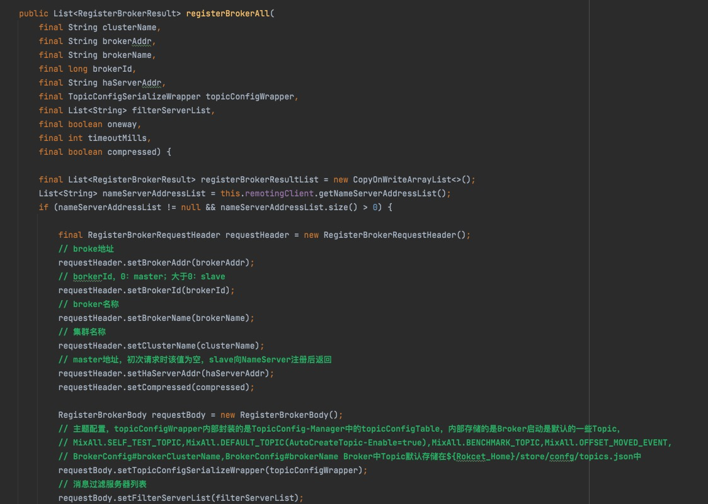

### RocketMQ消息发送

RocketMQ发送普通消息又三种实现方式：可靠同步发送，可靠异步发送，单向（Oneway）发送

#### RokcetMQ消息封装类Message

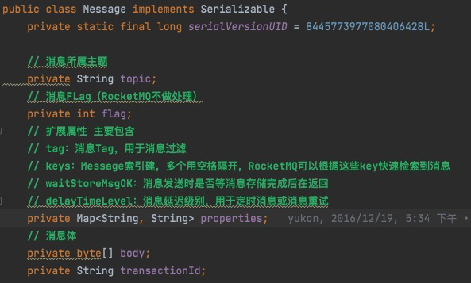

#### 默认的消息生产者实现类：DefaultMQProducer继承自MQAdmin

##### DefaultMQProducer.class重要参数列表

```java
//生产者所属组，消息服务器在回查事务状态时会随机选择该组中任何一个生产者发起事务回查请求
privateStringproducerGroup;
//默认topicKey
        privateStringcreateTopicKey=TopicValidator.AUTO_CREATE_TOPIC_KEY_TOPIC;
//默认主题在每一个Broker队列数量
        privatevolatileintdefaultTopicQueueNums=4;
//发送消息默认超时时间，默认是3s
        privateintsendMsgTimeout=3000;
//消息超过该值则启用压缩，默认4K
        privateintcompressMsgBodyOverHowmuch=1024*4;
//同步方式发送消息重试次数，默认为2，总共执行3次
        privateintretryTimesWhenSendFailed=2;
//异步方式发送消息重试次数，默认为2
        privateintretryTimesWhenSendAsyncFailed=2;
//消息重试时选择另外一个Broker时，是否不等待存储结果就返回，默认为false
        privatebooleanretryAnotherBrokerWhenNotStoreOK=false;
//允许发送的最大消息长度，默认为4M，该值最大值为2^32-1
        privateintmaxMessageSize=1024*1024*4;//4M
```

##### 为DefaultMQProducer此类中提供的几乎所有方法包装内部实现：DefaultMQProducerImpl

ManagementFactory是一个可以获取JVM线程、内存、编译等信息的一个工厂类

DefaultMQProducerImpl#start方法

```java
//创建MQClientInstance实例，整个JVM实例中只存在一个MQClientManager实例，维护一个
//MQClientInstance缓存表ConcurrentMap<String/*clientId*/>,MQClientInstance>factoryTabble=newConcurrentHashMap<String,MQClientInstance>(),
//也就是同一个clientId值会创建一个MQClientInstance。
clientID为客户端IP+instance（进程id）+（unintname可选）
```

### 消息发送基本流程

消息发送流程主要的步骤是：验证消息，查找路由，消息发送（包含异常处理机制）

#### 消息长度验证：

确保生产者处于运行状态，验证是否符合相应的规范，主题名称，消息题不能为空，消息长度不能等于0且默认发送消息的最大长度4M（maxMessageSize=1024x1024x4）

#### 查找主题路由信息：

##### DefaultMQProducerImpl#tryToFindTopicPublishInfo

```java
//tryToFindTopicPublishInfo是查找主题的路由信息的方法。如果生产者中缓存了topic的路由信息，如果该路由信息中包含了消息队列，则直接返回该路由信息，如果没有缓存或没有包含消息队列，则向NameServer查询该topic的路由信息，如果最终未找到路由信息，则抛出异常，无法找到主题相关路由信息异常，先看一下TopicPUblishInfo
privateTopicPublishInfotryToFindTopicPublishInfo(finalStringtopic){
        TopicPublishInfotopicPublishInfo=this.topicPublishInfoTable.get(topic);
        if(null==topicPublishInfo||!topicPublishInfo.ok()){
        this.topicPublishInfoTable.putIfAbsent(topic,newTopicPublishInfo());
        this.mQClientFactory.updateTopicRouteInfoFromNameServer(topic);
        topicPublishInfo=this.topicPublishInfoTable.get(topic);
        }

        if(topicPublishInfo.isHaveTopicRouterInfo()||topicPublishInfo.ok()){
        returntopicPublishInfo;
        }else{
        this.mQClientFactory.updateTopicRouteInfoFromNameServer(topic,true,this.defaultMQProducer);
        topicPublishInfo=this.topicPublishInfoTable.get(topic);
        returntopicPublishInfo;
        }
        }
```

##### MQClientAPIImpl#getTopicRouteInfoFromNameServer

```java
//Producer根据topic去查找对应的topic信息(Broker发送心跳包的时候就把topic发送过去了)
RemotingCommandrequest=RemotingCommand.createRequestCommand(RequestCode.GET_ROUTEINFO_BY_TOPIC,requestHeader);
```

#### 消息发送：

首先消息发送端采用重试机制，有retryTimesWhenSendFailed指定同步方式重试次数，异步重试机制在收到消息发送结构后执行回调之前进行重试，有retryTimesWhenSend-AsyncFailed指定，接下来就是循环执行，选择消息队列，发送消息，发送成功则返回，收到异常则重试，选择消息队列有两种方式。

1）sendLatencyFaultEnable=false默认不启用Broker故障延迟机制

2）sendLatencyFaultEnable=true启用Broker故障延迟机制

默认不启用调用TopicPublishInfo#selectOneMessageQueue

##### 消息发送API核心人口:DefaultMQProducerimpl#sendKernelImpl

```java
privateSendResultsendKernelImpl(finalMessagemsg,
        finalMessageQueuemq,
        finalCommunicationModecommunicationMode,
        finalSendCallbacksendCallback,
        finalTopicPublishInfotopicPublishInfo,
        finallongtimeout)
//1)Messagemsg:待发送消息。
//2)MessageQueuemq:消息将发送到该消息队列上。
//3)CommunicationModecommunicationMode:消息发送模式，SYNC、ASYNC、ONEWAY。
//4)SendCallbacksendCallback:异步消息回调函数。
//5)TopicPublishinfotopicPublishlnfo:主题路由信息
//6)longtimeout:消息发送超时时间。

```

##### MQClientAPIImpl#sendMessage

根据消息发送方式，同步，异步，单向方式进行网络传输。

##### DefaultMQProducerImpl#registerSendMessageHook注册钩子处理类（并且可以注册多个）

```java
publicinterfaceSendMessageHook{
        StringhookName();

        voidsendMessageBefore(finalSendMessageContextcontext);

        voidsendMessageAfter(finalSendMessageContextcontext);
        }
```

#### Broker故障延迟机制

##### MQFaultStrategy#selectOneMessageQueue

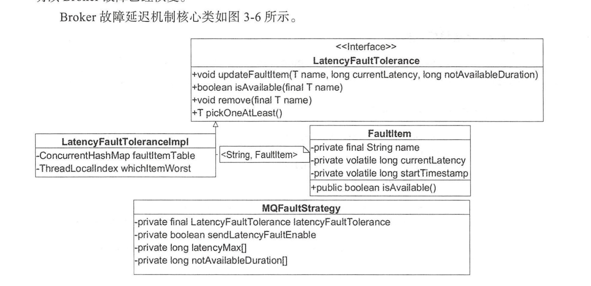

```java
LatencyFaultTolerance.java//延迟机制接口规范

        voidupdateFaultltem(finalTname,finallongcurrentLatency,finallongnotAvailable-
        Duration)//更新失败条目。
//name:brokerName。
//currentLatency:消息发送故障延迟时间。
//notAvailableDuration:不可用持续时辰，在这个时间内，Broker将被规避。
        booleanisAvailable(finalTname)//判断Broker是否可用。name:broker名称。
        voidremove(finalTname)//移除Fault条目，意味着Broker重新参与路由计算。
        TpickOneAtLeast()//尝试从规避的Broker中选择一个可用的Broker，如果没有找到，将返回null。

        Faultltem.java//失败条目(规避规则条目)。
        finalStringname//条目唯一键，这里为brokerName。
        privatevolatileJongcurrentLatency//本次消息发送延迟。
        privatevolatilelongstartTimestamp//故障规避开始时间。MQFaultStrategy:消息失败策略，延迟实现的门面类。

        MQFaultStrategy.java//消息失败策略，延迟实现的门面类
        privatelong[]latencyMax={50L,100L,550L,1000L,2000L,3000L,15000L};
        privatelong[]notAvailableDuration={0L,0L,30000L,60000L,120000L,180000L,600000L};
```

##### DefaultMQProducerlmpl#sendDefaultlmpl

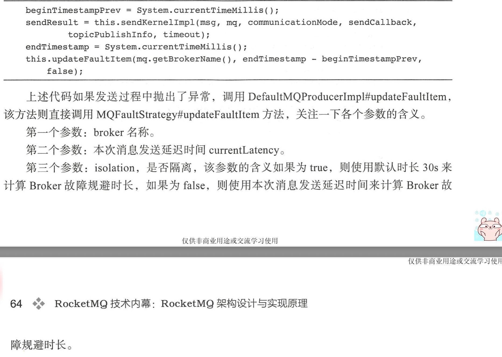

```java
MQFaultStrategy.java//消息失败策略，延迟实现的门面类
        privatelong[]latencyMax={50L,100L,550L,1000L,2000L,3000L,15000L};
        privatelong[]notAvailableDuration={0L,0L,30000L,60000L,120000L,180000L,600000L};

        MQFaultStrategy.java

        publicvoidupdateFaultItem(finalStringbrokerName,finallongcurrentLatency,booleanisolation){
        if(this.sendLatencyFaultEnable){
//从latencyMax数组尾部开始寻找，找到第一个比currentLatency小的下标，
//然后从notAvailableDuration数组中获取需要规避的时长，该方法最终调用LatencyFaultTolerance的updateFaultltem。
        longduration=computeNotAvailableDuration(isolation?30000:currentLatency);
        this.latencyFaultTolerance.updateFaultItem(brokerName,currentLatency,duration);
        }
        }

```

```java
LatencyFaultToleranceImpl.java

/**根据broker名称从缓存表中获取Faultitem，如果找到则更新Faultltem，否则创建Faultltem。这里有两个关键点。
 1)currentLatency、startTimeStamp被volatile修饰。
 2)startTimeStamp为当前系统时间加上需要规避的时长。startTimeStamp是判断broker当前是否可用的直接依据，请看Faultltem#isAvailable方法。*/

@Override
publicvoidupdateFaultItem(finalStringname,finallongcurrentLatency,finallongnotAvailableDuration){
        FaultItemold=this.faultItemTable.get(name);
        if(null==old){
        finalFaultItemfaultItem=newFaultItem(name);
        faultItem.setCurrentLatency(currentLatency);
        faultItem.setStartTimestamp(System.currentTimeMillis()+notAvailableDuration);

        old=this.faultItemTable.putIfAbsent(name,faultItem);
        if(old!=null){
        old.setCurrentLatency(currentLatency);
        old.setStartTimestamp(System.currentTimeMillis()+notAvailableDuration);
        }
        }else{
        old.setCurrentLatency(currentLatency);
        old.setStartTimestamp(System.currentTimeMillis()+notAvailableDuration);
        }
        }
```

#### 同步发送

MQ客户端发送消息的入口是MQClientAPIImpl#sendMessage。请求命令是Request­d-Code.SEND_MESSAGE，我们可以找到该命令的处理类:
org.apache.rocketmq.broker.processor.SendMessageProcessor。人口方法在SendMessageProcessor#sendMessage。

SendMessageProcessor是在BrokerController一开始注册的

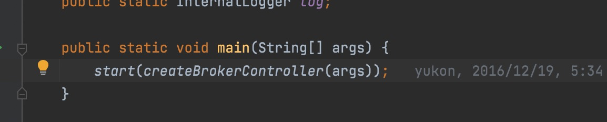

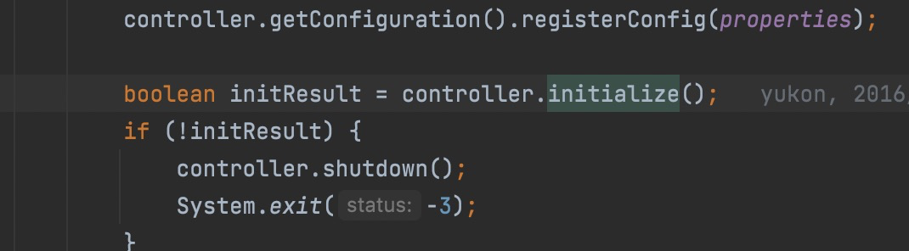

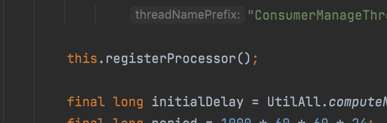

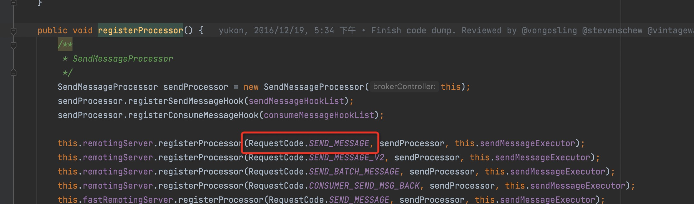

AbstractSendMessageProcessor#msgCheck

```txt
//检查消息发送是否合理，这里完成了以下几件事情。
//1)检查该Broker是否有写权限。
//2)检查该Topic是否可以进行消息发送。主要针对默认主题，默认主题不能发送消息，
//仅仅供路由查找。
//3)在NameServer端存储主题的配置信息，默认路径:${ROCKET_HOME}/store/config/topic.js。
//下面是主题存储信息。order:是否是顺序消息;perm:权限码;readQueueNums:读队列数量;
//writeQueueNums:写队列数量;topicName:主题名称;topicSysFlag:topicFlag，当前版本暂为保留;topicFilterType:主题过滤方式，当前版本仅支持SINGLETAG。
//4)检查队列，如果队列不合法，返回错误码。
Step2:如果消息重试次数超过允许的最大重试次数，消息将进入到DLD延迟队列。延迟队列主题:%DLQ%+消费组名，延迟队列在消息消费时将重点讲解。
Step3:调用DefaultMessageStore#putMessage进行消息存储。关于消息存储的实现细节将在第4章重点剖析。
```

#### 异步发送


消息异步发送是指消息生产者调用发送的API后，无须阻塞等待消息服务器返回本次消息发送结果，只需要提供一个回调函数，供消息发送客户端在收到响应结果回调。异步方式相比同步方式，消息发送端的发送性能会显著提高，但为了保护消息服务器的负载压力，RocketMQ对消息发送的异步消息进行了井发控制，通过参数clientAsyncSemaphoreValue来控制，默认为65535。异步消息发送虽然也可以通过DefaultMQProducer#retryTimes­WhenSendAsyncFailed属性来控制消息重试次数，但是重试的调用人口是在收到服务端响应包时进行的，如果出现网络异常、网络超时等将不会重试。

#### 单向发送


单向发送是指消息生产者调用消息发送的API后，无须等待消息服务器返回本次消息发送结果，并且无须提供回调函数，表示消息发送压根就不关心本次消息发送是否成功，其实现原理与异步消息发送相同，只是消息发送客户端在收到响应结果后什么都不做而已，并且没有重试机制。

#### 批量消息

批量消息发送是将同一主题的多条消息一起打包发送到消息服务端，减少网络调用次数，提高网络传输效率。

并且单批次消息发送总长度不能超过DefaultMQProducer#maxMessageSize（4M）。

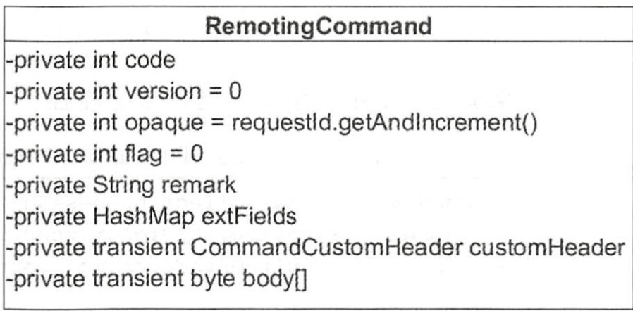

1) code:请求命令编码，请求命令类型。
2) version:版本号。
3) opaque:客户端请求序号。
4) flag:标记。倒数第一位表示请求类型，O:请求;1:返回。倒数第二位，l:表示oneway。
5) remark:描述。
6) extFields:扩展属性。
7) customeHeader:每个请求对应的请求头信息。
8) byte[]body:
   消息体内容。单条消息发送时，消息体的内容将保存在body中。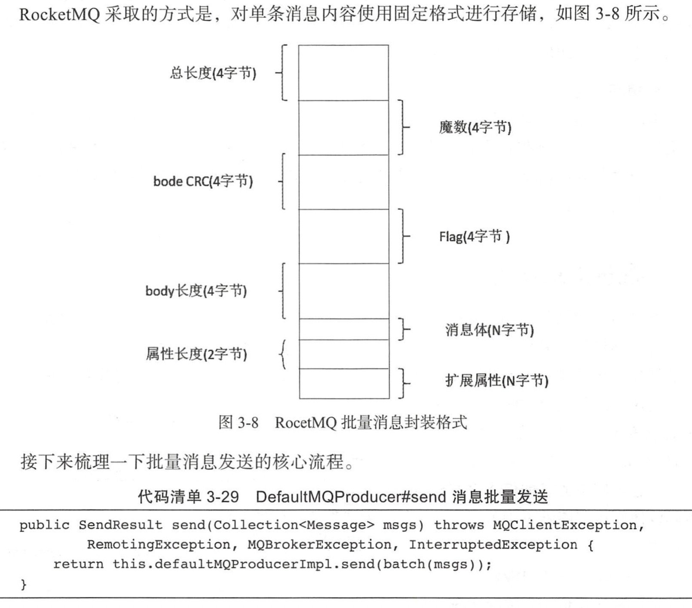

首先在消息发送端，调用batch方法，将一批消息封装成MessageBatch对象。Message­Batch继承自Message对象，Messag巳Batch内部持有List<Message>
messages。这样的话，批量消息发送与单条消息发送的处理流程完全一样。MessageBatch只需要将该集合中的每条消息的消息体body聚合成一个byte口数值，在消息服务端能够从该byte[]
数值中正确解
析出消息即可。

## 消息存储

RocketMQ主要存储的文件包括**Comitlog文件、ConsumeQueue文件、IndexFile文件**。

为了提高消息消费的效率，RocketMQ引入了ConsumeQueue消息队列文件，每个消息主题包含多个消息消费队列，每一个消息队列有一个消息文件。IndexFile索引文件，其主要设计理念就是为了加速消息的检索性能，根据消息的属性快速从Commitlog文件中检索消息。RocketMQ是一款高性能的消息中间件，存储部分的设计是核心，存储的核心是IO访问性能。

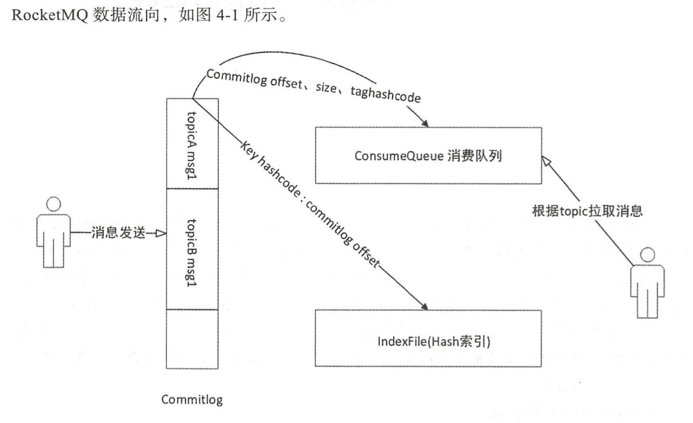

1. CommitLog:消息存储文件，所有消息主题的消息都存储在CommitLog文件中。
2. ConsumeQueue:消息消费队列，消息到达CommitLog文件后，将异步转发到消息消费队列，供消息消费者消费。
3. IndexFile:消息索引文件，主要存储消息Key与Offset的对应关系。
4. 事务状态服务:存储每条消息的事务状态。
5. 定时消息服务:每一个延迟级别对应一个消息消费队列，存储延迟队列的消息拉取进度。

### 消息存储实现类:DefaultMessageStore

Commitlog文件存储目录为${ROCKET_HOME}/store/commitlog目录，每一个文件默认lG，一个文件写满后再创建另外一个，以该文件中第一个偏移量为文件名，偏移量小于20位用0补齐。MappedFileQueue可以看作是${ROCKET_HOME}/store/commitlog文件夹，
**而MappedFile则对应该文件夹下一个个的文件。**

### 核心属性

**每个CommitLog文件最少会空闲8个字节，高4字节存储当前文件剩余空间，低4字节存储魔数**

```java
MessageStoreConfigmessageStoreConfig:消息存储配置属性。
        CommitLogcommitLog:CommitLog文件的存储实现类。
        ConcurrentMap<String/*topic灯，ConcurrentMap<Integer/*queueld叫，Consume­
Queue>>consumeQueueTable:*//消息队列存储缓存表，按消息主题分组。
        FlushConsumeQueueServiceflushConsumeQueueService:消息队列文件ConsumeQueue刷盘线程。
        CleanCommitLogServicecleanCommitLogService:清除CommitLog文件服务。
        CleanConsumeQueueS巳rvicecleanConsumeQueueService:清除ConsumeQueue文件服务。
        IndexServiceindexService:索引文件实现类。
        AllocateMappedFileServiceallocateMappedFileService:MappedFile分配服务。
        ReputMessageServicereputMessageService:CommitLog消息分发，根据CommitLog文件构建ConsumeQueue、IndexFile文件。
        HAServicehaService:存储HA机制。
        TransientStorePooltransientStorePool:消息堆内存缓存。
        MessageArrivingListenermessageArrivingListener:消息拉取长轮询模式消息达到监听器。
        BrokerConfigbrokerConfig:Broker配置属性。
        StoreCheckpointstoreCheckpoint:文件刷盘检测点。
        LinkedList<CommitLogDispatcher>dispatcherList:CommitLog文件转发请求。
```

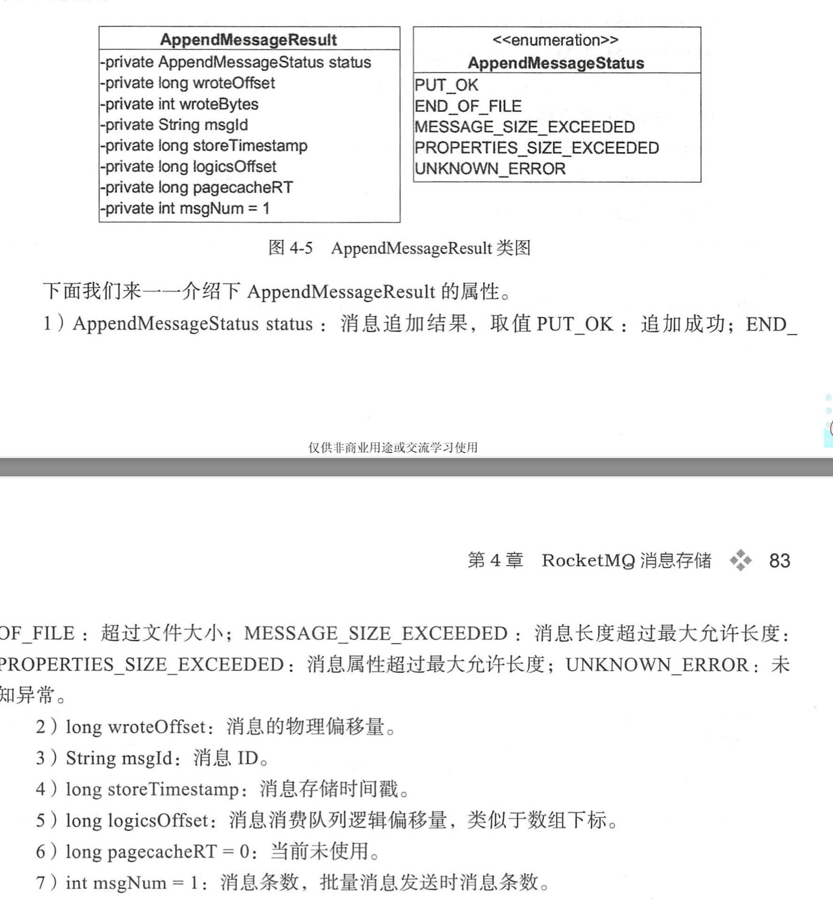

## CommitLog

#### CommitLog#DefaultAppendMessageCallback#doAppend

 DefaultAppendMessageCallback#doAppend只是将消息追加在内存中，需要根据是同步刷盘还是异步刷盘方式，将内存中的数据持久化到磁盘，关于刷盘操作后面会详细介绍。然后执行HA主从同步复制

RocketMQ通过使用内存映射文件来提高IO访问性能

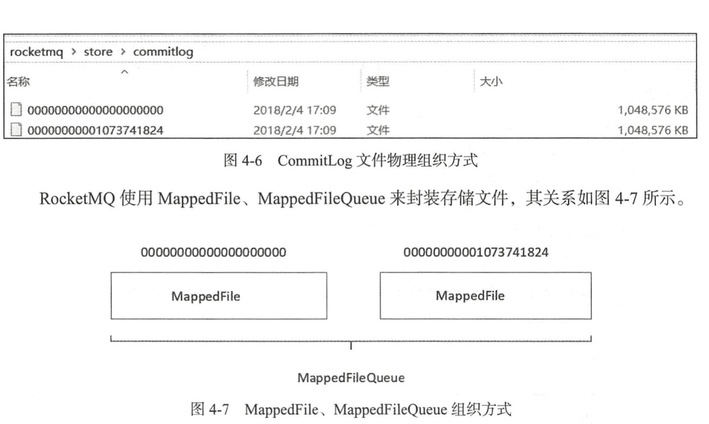

#### MappedFileQueue

#### MappedFileQueue#getMappedFileByTime

#### MappedFileQueue#findMappedFileByOffset

```java
    // 存储目录 。
private final String storePath;
// 单个文件的存储大小 。1G
private final int mappedFileSize;
// MappedFile 文件集合 。
private final CopyOnWriteArrayList<MappedFile> mappedFiles=new CopyOnWriteArrayList<MappedFile>();
// 创建 MappedFile服务类。
private final AllocateMappedFileService allocateMappedFileService;
// 当前刷盘指针， 表示该指针之前的所有数据全部持久化到磁盘。
private long flushedWhere=0;
// 当前数据提交指针，内存中ByteBuffer当前的写指针，该值大于等于flushedWhere。
private long committedWhere=0;
```

#### 查找MappedFile对应地址

根据消息偏移量 offset查找 MappedFile。 根据 offet查找 MappedFile直接使用 offset%­ mappedFileSize
是否可行?答案是否定的，由于使用了内存映射，只要存在于存储目录下的文件，都需要对应创建内存映射文件，如果不定时将已消费的消息从存储文件中删除，会造成极大的内存压力与资源浪费，
**所有 RocketMQ 采取定时删除存储文件的策略**，也就是说在存储文件中， 第一个文件不一定是 00000000000000000000，因为该文件在某一时
刻会被删除，故根据 offset定位 MappedFile 的算法为 (int) ((offset / this.mappedFileSize) - (
mappedFile.getFileFromOffset() / this.MappedFileSize))。

mappedFile.getFileFromOffset()**该文件的初始偏移量**

#### MappedFile

```java
    // 操作系统每页大小，默认4k。
public static final int OS_PAGE_SIZE=1024*4;
protected static final InternalLogger log=InternalLoggerFactory.getLogger(LoggerName.STORE_LOGGER_NAME);
// 当 前 JVM 实 例中 Mapped-File 虚拟内存 。
private static final AtomicLong TOTAL_MAPPED_VIRTUAL_MEMORY=new AtomicLong(0);
// 当前JVM实例中MappedFile对象个数 。
private static final AtomicInteger TOTAL_MAPPED_FILES=new AtomicInteger(0);
// 当前该文件的写指针，从0开始(内存映射文件中的写指针)。
protected final AtomicInteger wrotePosition=new AtomicInteger(0);
// 当前文件的提交指针，如果开启 transientStore-PoolEnable， 则数据会存储在 TransientStorePool 中， 然后提交到内存映射 ByteBuffer 中， 再刷写到磁盘。
protected final AtomicInteger committedPosition=new AtomicInteger(0);
// 刷写到磁盘指针，该指针之前的数据持久化到磁盘中 。
private final AtomicInteger flushedPosition=new AtomicInteger(0);
// 文件大小 。
protected int fileSize;
// 文件通道 。
protected FileChannel fileChannel;
/**
 * Message will put to here first, and then reput to FileChannel if writeBuffer is not null.
 */
// 堆外内存ByteBuffer，如果不为空，数据首先将存储在该Buffer中， 然后提交到MappedFile对应的内存映射文件Buffer。 transientStorePoolEnable为true时不为空。
protected ByteBuffer writeBuffer=null;
// 堆内存池，transientStorePoolEnable为true时启用。
protected TransientStorePool transientStorePool=null;
// 文件名称
private String fileName;
// 该文件的初始偏移量
private long fileFromOffset;
// 物理文件
private File file;
// 物理文件对应的内存映射buffer
private MappedByteBuffer mappedByteBuffer;
// 文件最后一次内存写入时间
private volatile long storeTimestamp=0;
// 是否是MappedFileQueue队列中第一个文件
private boolean firstCreateInQueue=false;
```

#### MappedFile初始化(两种)

根据是否开启transientStorePoolEnable存在两种初始化情况。transientStorePoolEnable为true表示内容先存储在堆外内存，然后通过Commit线程将数据提交到内存映射Buffer中，再通过Flush线程将内存映射Buffer中的数据持久化到磁盘中。

#### 内存映射文件的提交动作由MappedFile的commit方法实现

执行提交操作，commitLeastPages为本次提交最小的页数，如果待提交数据不满commitLeastPages，则不执行本次提交操作，待下次提交。

**学习MappedByteBuffer，ByteBuffer**

#### TransientStorePool

TransientStorePool:
短暂的存储池。RocketMQ单独创建一个MappedByteBuffer内存缓存池，用来临时存储数据，数据先写人该内存映射中，然后由commit线程定时将数据从该内存复制到与目的物理文件对应的内存映射中。RokcetMQ引人该机制主要的原因是提供一种内存锁定，将当前堆外内存一直锁定在内存中，避免被进程将内存交换到磁盘。

Store目录存储文件描述：

1. commitlog:消息存储目录。

2. config:运行期间一些配置信息，主要包括下列信息。

   consumerFilter.json:主题消息过滤信息。

   consumerOffset.json:集群消费模式消息消费进度。

   delayOffset.json:延时消息队列拉取进度。

   subscriptionGroup.json:消息消费组配置信息。

   topics.json:topic配置属性。

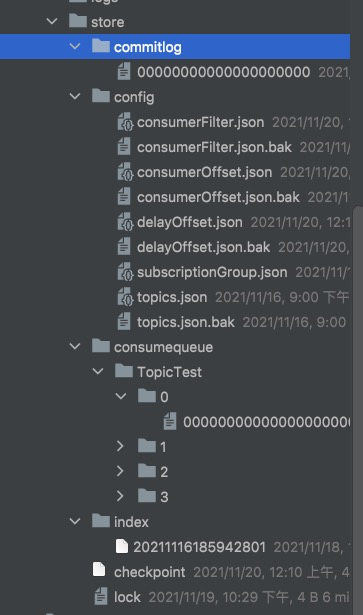

3. consumequ巳ue:消息消费队列存储目录。
4. index:消息索引文件存储目录。
5. abort:如果存在abort文件说明Broker非正常关闭，该文件默认启动时创建，正常退出之前删除。
6. checkpoint:文件检测点，存储commitlog文件最后一次刷盘时间戳、consumequeue最后一次刷盘时间、index索引文件最后一次刷盘时间戳。

## ConsumeQueue文件

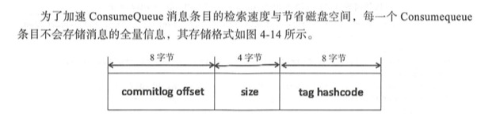


单个ConsumeQueue文件中默认包含30万个条目，单个文件的长度为30w×20字节，单个ConsumeQueue文件可以看出是一个ConsumeQueue条目的数组，其下标为Consume­Queue的逻辑偏移量，消息消费进度存储的偏移量即逻辑偏移量。

​        **构建机制是当消息到达Commitlog文件后，由专门的线程产生消息转发任务，从而构建消息消费队列文件与下文提到的索引文件。
**

## Index索引文件

消息消费队列是RocketMQ专门为**消息订阅**构建的索引文件，提高根据主题与消息队列检索消息的速度，另外RocketMQ引入了**Hash索引机制
**为消息建立索引，HashMap的设计包含两个基本点:**Hash槽与Hash冲突的链表结构**。

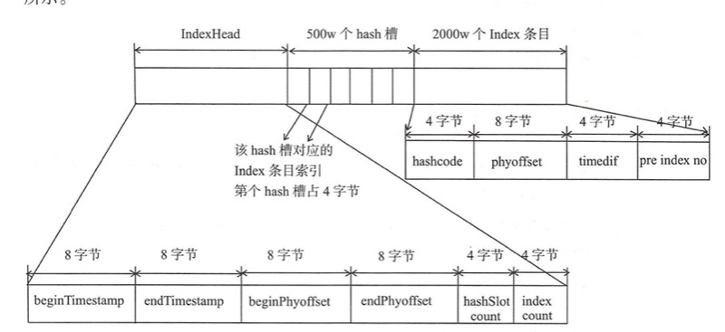

1. IndexHeader头部，包含40个字节，记录该IndexFile的统计信息，其结构如下。beginTimestamp:该索引文件中包含消息的最小存储时间。
   endTimestamp:该索引文件中包含消息的最大存储时间。
   beginPhyoffset:该索引文件中包含消息的最小物理偏移量(commitlog文件偏移量)。endPhyoffset:
   该索引文件中包含消息的最大物理偏移量(commitlog文件偏移量)。hashslotCount:
   hashslot个数，并不是hash槽使用的个数，在这里意义不大。indexCount:Index条目列表当前已使用的个数，Index条目在Index条目列表中按顺序

   存储。

2. Hash槽，一个IndexFile默认包含500万个Hash槽，每个Hash槽存储的是落在该Hash槽的hashcode最新的Index的索引。

3. Index条目列表，默认一个索引文件包含2000万个条目，每一个Index条目结构如下。hashcode:key的hashcode。
   phyoffset:消息对应的物理偏移量。timedif:该消息存储时间与第一条消息的时间戳的差值，小于0该消息无效。prelndexNo:
   该条目的前一条记录的Index索引，当出现hash冲突时，构建的链表结构。

### IndexFile#putKey

将消息索引键与消息偏移量映射关系写入到IndexFile的实现方法为:

```java
publicbooleanputKey(finalStringkey,finallongphyOffset,finallongstoreTimestamp)
        if(this.indexHeader.getIndexCount()<this.indexNum){
        intkeyHash=indexKeyHashMethod(key);
        intslotPos=keyHash%this.hashSlotNum;
        intabsSlotPos=IndexHeader.INDEX_HEADER_SIZE+slotPos*hashSlotSize;
        {
```

如果当前已使用条目大于等于允许最大条目数时，则返回fasle，表示当前索引文件已写满。如果当前索引文件未写满则根据key算出key的hashcode，然后keyHash对hash槽数量取余定位到hasbcod巳对应的hash槽下标，hashcode对应的hash槽的物理地址为IndexHeader头部(
40字节)加上**下标**乘以每个hash槽的大小(4字节)。

### IndexFile#selectPhyOffset

根据索引key查找消息的实现方法为：

```java
publicvoidselectPhyOffset(finalList<Long>phyOffsets,finalStringkey,finalintmaxNum,finallongbegin,finallongend,booleanlock){
        if(this.mappedFile.hold()){
        intkeyHash=indexKeyHashMethod(key);
        intslotPos=keyHash%this.hashSlotNum;
        intabsSlotPos=IndexHeader.INDEX_HEADER_SIZE+slotPos*hashSlotSize;
//List<Long>phyOffsets:查找到的消息物理偏移量。
//Stringkey:索引key。
//intmaxNum:本次查找最大消息条数。
//longbegin:开始时间戳。
//longend:结束时间戳。
```

Stepl:
根据key算出key的hashcode，然后keyHash对hash槽数量取余定位到hashcode对应的hash槽下标，hashcode对应的hash槽的物理地址为IndexHeader头部(
40字节)加上**下标**乘以每个hash槽的大小(4字节)。

```java
if(slotValue<=invalidIndex||slotValue>this.indexHeader.getIndexCount()
        ||this.indexHeader.getIndexCount()<=1){
        }
```

Step2:如果对应的Hash槽中存储的数据小于1或大于当前索引条目个数则表示该HashCode没有对应的条目，直接返回。

## checkpoint文件

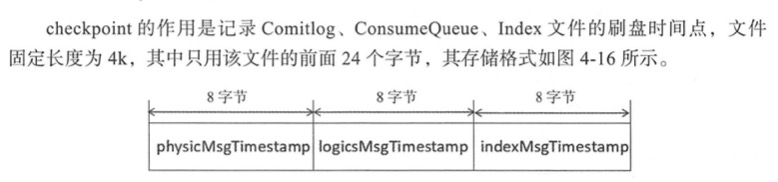

1. physicMsgTimestamp:commitlog文件刷盘时间点。
2. logicsMsgTimestamp:消息消费队列文件刷盘时间点。
3. indexMsgTimestamp:索引文件刷盘时间点。

## 实时更新消息消费队列与索引文件

消息消费队列文件、消息属性索引文件都是基于CommitLog文件构建的，当消息生产者提交的消息存储在Commitlog文件中，ConsumeQueue、IndexFile需要及时更新，否则消息无法及时被消费，根据消息属性查找消息也会出现较大延迟。
**RocketMQ通过开启一个线程ReputMessageServcie来准实时转发CommitLog文件更新事件**
，相应的任务处理器根据转发的消息及时更新ConsumeQueue、IndexFile文件。

### DefaultMessageStore#start实时更新ConsumeQueue和IndexFile文件

```java
        @Override
public void run(){
        DefaultMessageStore.log.info(this.getServiceName()+" service started");

        while(!this.isStopped()){
        try{
        Thread.sleep(1);
        this.doReput();
        }catch(Exception e){
        DefaultMessageStore.log.warn(this.getServiceName()+" service has exception. ",e);
        }
        }

        DefaultMessageStore.log.info(this.getServiceName()+" service end");
        }
```

ReputMessageService线程**每执行一次任务推送休息1毫秒**就继续尝试推送消息到**消息消费队列**和**索引文件**
，消息消费转发的核心实现在doReput方法中实现。

```java
DispatchRequest dispatchRequest=DefaultMessageStore.this.commitLog.checkMessageAndReturnSize(result.getByteBuffer(),false,false);
        int size=dispatchRequest.getBufferSize()==-1?dispatchRequest.getMsgSize():dispatchRequest.getBufferSize();

        if(dispatchRequest.isSuccess()){
        if(size>0){
        DefaultMessageStore.this.doDispatch(dispatchRequest);
```

Step2:
从result返回的ByteBuffer中循环读取消息，一次读取一条，创建Dispatch­Request对象。DispatchRequest，如果消息长度大于0，则调用doDispatch方法。最终将分别调用CommitLogDispatcherBuildConsumeQueue(
构建消息消费队列)、CommitLogDispatcherBuildlndex(构建索引文件)。

### DispatchRequest

```java
//消息主题名称。
privatefinalStringtopic;
//消息队列ID。
        privatefinalintqueueId;
//消息物理偏移量。
        privatefinallongcommitLogOffset;
//消息长度。
        privateintmsgSize;
//消息过滤taghashcode。
        privatefinallongtagsCode;
//消息存储时间戳。
        privatefinallongstoreTimestamp;
//消息队列偏移量。
        privatefinallongconsumeQueueOffset;
//消息索引key。多个索引key用空格隔开，例如“key!key2”。
        privatefinalStringkeys;
//是否成功解析到完整的消息。
        privatefinalbooleansuccess;
//消息唯一键。
        privatefinalStringuniqKey;

//消息系统标记。
        privatefinalintsysFlag;
//消息预处理事务偏移量。
        privatefinallongpreparedTransactionOffset;
//消息属性。
        privatefinalMap<String, String>propertiesMap;
//位图。
        privatebyte[]bitMap;
```

### CommitLogDispatcherBuildConsumeQueue

消息消费队列转发任务实现类为:CommitLogDispatcherBuildConsumeQueue，内部最终将调用**putMessagePositioninfo**方法。*
*ConumeQueue的刷盘方式固定为异步刷盘模式。**

```java
classCommitLogDispatcherBuildConsumeQueueimplementsCommitLogDispatcher{

@Override
publicvoiddispatch(DispatchRequestrequest){
        finalinttranType=MessageSysFlag.getTransactionValue(request.getSysFlag());
        switch(tranType){
        caseMessageSysFlag.TRANSACTION_NOT_TYPE:
        caseMessageSysFlag.TRANSACTION_COMMIT_TYPE:
        DefaultMessageStore.this.putMessagePositionInfo(request);
        break;
        caseMessageSysFlag.TRANSACTION_PREPARED_TYPE:
        caseMessageSysFlag.TRANSACTION_ROLLBACK_TYPE:
        break;
        }
        }
        }
```

### CommitLogDispatcherBuildlndex

Hash索引文件转发任务实现类:CommitLogDispatcherBuildlndex。CommitlogDispatcherBuildlndex#dispatch

```java
classCommitLogDispatcherBuildIndeximplementsCommitLogDispatcher{

@Override
publicvoiddispatch(DispatchRequestrequest){
        if(DefaultMessageStore.this.messageStoreConfig.isMessageIndexEnable()){
        DefaultMessageStore.this.indexService.buildIndex(request);
        }
        }
        }
```

## 消息队列与索引文件恢复

由于RocketMQ存储首先将消息全量存储在Commitlog文件中，然后异步生成转发任务更新ConsumeQueue、Index文件。如果消息成功存储到Commitlog文件中，转发任务未成功执行，此时消息服务器Broker由于某个原因看机，导致Commitlog、ConsumeQueue、IndexFile文件数据不一致。如果不加以人工修复的话，会有一部分消息即便在Commitlog文件中存在，但由于并没有转发到Consum巳queue，这部分消息将永远不会被消费者消费。那RocketMQ是如何使Commitlog、消息消费队列(
ConsumeQueue)达到最终一致性的呢?下面详细分析一下RocketMQ关于存储文件的加载流程来一窥端倪。

```java
public boolean load(){
        boolean result=true;

        try{
        //Stepl :判断上一次退出是否正常。 其实现机制是Broker在启动时创建${ROC口T_ HOME}/store/abort文件，
        //在退出时通过注册 NM 钩子函数删除 abort文件。 如果下一次启动时存在 abort 文件 。
        //说明 Broker 是异常退出的， Commitlog 与 Consumequeue 数据有可能不一致，需要进行修复 。
        boolean lastExitOK=!this.isTempFileExist();
        log.info("last shutdown {}",lastExitOK?"normally":"abnormally");

        if(null!=scheduleMessageService){
        result=result&&this.scheduleMessageService.load();
        }

        // load Commit Log
        result=result&&this.commitLog.load();

        // load Consume Queue
        result=result&&this.loadConsumeQueue();

        if(result){
        this.storeCheckpoint=
        new StoreCheckpoint(StorePathConfigHelper.getStoreCheckpoint(this.messageStoreConfig.getStorePathRootDir()));

        this.indexService.load(lastExitOK);

        this.recover(lastExitOK);

        log.info("load over, and the max phy offset = {}",this.getMaxPhyOffset());
        }
        }catch(Exception e){
        log.error("load exception",e);
        result=false;
        }

        if(!result){
        this.allocateMappedFileService.shutdown();
        }

        return result;
        }
```

Stepl:判断上一次退出是否正常。**其实现机制是Broker在启动时创建${ROC口T_HOME}/store/abort文件**
，在退出时通过注册NM钩子函数删除abort文件。如果下一次启动时存在abort文件。说明Broker是异常退出的，Commitlog与Consumequeue数据有可能不一致，需要进行修复。

## Broker恢复策略

**根据Broker是否是正常停止执行不同的恢复策略，异常停止 、正常停止的文件恢复机制 。**

### Broker正常停止文件恢复的实现为 CommitLog#recoverNormally。

```java
public void recoverNormally(long maxPhyOffsetOfConsumeQueue){
        boolean checkCRCOnRecover=this.defaultMessageStore.getMessageStoreConfig().isCheckCRCOnRecover();
final List<MappedFile> mappedFiles=this.mappedFileQueue.getMappedFiles();
        if(!mappedFiles.isEmpty()){
        // Began to recover from the last third file
        int index=mappedFiles.size()-3;
        if(index< 0)
        index=0;
        //省略...
        }
        }
```

Broker正常停止再重启时，从倒数第三个文件开始进行恢复，如果不足 3个文 件，则从第 一 个文件开始恢 复。 checkCRCOnRecover 参
数设置在进行文件恢复时查找消息 时是否验证 CRC。

### Broker异常停止文件恢复实现为commitLog#recoverAbnormally。

异常停止则需要从最后一个文件往前走。

## 文件刷盘机制

RocketMQ 的存储与读写是基于 JDK NIO 的内存映射机制( MappedByteBuffer)的，消息存储时首先将消息追加到内存，再根据配置的刷盘策略在不同时间进行刷写磁盘。
如果 是同步刷盘，消息追加到内存后，将同步调用 MappedByteBuffer 的 force ()方法;如果是 异步刷盘，在消息追加到内存后立刻返回给消息发送端。
RocketMQ使用一个单独的线程按 照某一个设定的频率执行刷盘操作。 **通过在 broker配置文件中配置 flushDiskType来设定刷盘方式**
，可选值为 ASYNC FLUSH (异步刷盘)、 SYNC_FLUSH (同步刷 盘)， **默认为异步 刷 盘** 。 本书默认以消息存储文件 Commitlog
文件刷盘机制为例来剖析 RocketMQ 的刷盘机制， ConsumeQueue、 IndexFile刷盘的实现原理与 Commitlog刷盘机制类似。
RocketMQ处理刷盘的实现方法为 Commitlog#handleDiskFlush() 方法， 刷盘流程作为消息发送 、 消息存储的子流程。*
*值得注意的是索引文件的刷盘并不是采取定时刷盘机制，而是每更新一次索引文件就会将上 一次 的改动刷写到磁盘。**

## Broker 同步刷盘

### 同步刷盘，指的是在消息追加到内存映射文件的内存中后，立即将数据从内存刷写到磁盘文件。CommitLog#submitFlushRequest

```java
public CompletableFuture<PutMessageStatus> submitFlushRequest(AppendMessageResult result,MessageExt messageExt){
        // Synchronization flush
        if(FlushDiskType.SYNC_FLUSH==this.defaultMessageStore.getMessageStoreConfig().getFlushDiskType()){
final GroupCommitService service=(GroupCommitService)this.flushCommitLogService;
        if(messageExt.isWaitStoreMsgOK()){
        GroupCommitRequest request=new GroupCommitRequest(result.getWroteOffset()+result.getWroteBytes(),
        this.defaultMessageStore.getMessageStoreConfig().getSyncFlushTimeout());
        service.putRequest(request);
        return request.future();
        }else{
        service.wakeup();
        return CompletableFuture.completedFuture(PutMessageStatus.PUT_OK);
        }
        }
        // Asynchronous flush
        else{
        if(!this.defaultMessageStore.getMessageStoreConfig().isTransientStorePoolEnable()){
        flushCommitLogService.wakeup();
        }else{
        commitLogService.wakeup();
        }
        return CompletableFuture.completedFuture(PutMessageStatus.PUT_OK);
        }
        }
```

```java
public class AppendMessageResult {
    // Return code
    private AppendMessageStatus status;
    // Where to start writing
    private long wroteOffset;
    // Write Bytes
    private int wroteBytes;
    // Message ID
    private String msgId;
    private Supplier<String> msgIdSupplier;
    // Message storage timestamp
    private long storeTimestamp;
    // Consume queue's offset(step by one)
    private long logicsOffset;
    private long pagecacheRT = 0;

    private int msgNum = 1;
}
```

**构建一个GroupCommitRequest同步任务并提交到GroupCommitRequest，等待同步刷盘任务完成，如果超 时则返回刷 盘错误， 刷盘成功
后正常返 回给调用方 。**

**消费发送线程将消息追加到内存映射文件后，将同步任务 GroupCommitRequest 提交到 GroupCommitService线程，然后调用阻塞等待刷盘结果，超时时间默认为
5s。**

```java
public static class GroupCommitRequest {
    //刷盘点偏移量
    private final long nextOffset;
    //刷盘结果任务
    private CompletableFuture<PutMessageStatus> flushOKFuture = new CompletableFuture<>();
    //开始时间
    private final long startTimestamp = System.currentTimeMillis();
    //超时时间
    private long timeoutMillis = Long.MAX_VALUE;
    //省略。。。。。。
}
```

### ServiceThread

```java
protected void waitForRunning(long interval){
        if(hasNotified.compareAndSet(true,false)){
        this.onWaitEnd();
        return;
        }

        //entry to wait CountDownLatch2 阿里自定义
        waitPoint.reset();

        try{
        waitPoint.await(interval,TimeUnit.MILLISECONDS);
        }catch(InterruptedException e){
        log.error("Interrupted",e);
        }finally{
        hasNotified.set(false);
        this.onWaitEnd();
        }
        }
```

```java
private void swapRequests(){
        lock.lock();
        try{
        LinkedList<GroupCommitRequest> tmp=this.requestsWrite;
        this.requestsWrite=this.requestsRead;
        this.requestsRead=tmp;
        }finally{
        lock.unlock();
        }
        }
```

**由于避免同步刷盘消费任务与其他消息生产者提交任务直接的锁竞争， GroupCommit­Service
提供读容器与写容器，这两个容器每执行完一次任务后，交互，继续消费任务 。**

```java
public void run(){
        CommitLog.log.info(this.getServiceName()+" service started");

        while(!this.isStopped()){
        try{
        this.waitForRunning(10);
        this.doCommit();
        }catch(Exception e){
        CommitLog.log.warn(this.getServiceName()+" service has exception. ",e);
        }
        }

        // Under normal circumstances shutdown, wait for the arrival of the
        // request, and then flush
        try{
        Thread.sleep(10);
        }catch(InterruptedException e){
        CommitLog.log.warn("GroupCommitService Exception, ",e);
        }

synchronized (this){
        this.swapRequests();
        }

        this.doCommit();

        CommitLog.log.info(this.getServiceName()+" service end");
        }
```

GroupCommitService每处理一批同步刷盘请求( requestsRead容器中请求)后**“休息“** IOms， 然后继续处理下一批，其任务的核心实现为
doCommit 方法 。

```java
private void doCommit(){
        if(!this.requestsRead.isEmpty()){
        for(GroupCommitRequest req:this.requestsRead){
        // There may be a message in the next file, so a maximum of
        // two times the flush
        boolean flushOK=CommitLog.this.mappedFileQueue.getFlushedWhere()>=req.getNextOffset();
        for(int i=0;i< 2&&!flushOK;i++){
        CommitLog.this.mappedFileQueue.flush(0);
        flushOK=CommitLog.this.mappedFileQueue.getFlushedWhere()>=req.getNextOffset();
        }

        req.wakeupCustomer(flushOK?PutMessageStatus.PUT_OK:PutMessageStatus.FLUSH_DISK_TIMEOUT);
        }

        long storeTimestamp=CommitLog.this.mappedFileQueue.getStoreTimestamp();
        if(storeTimestamp>0){
        CommitLog.this.defaultMessageStore.getStoreCheckpoint().setPhysicMsgTimestamp(storeTimestamp);
        }

        this.requestsRead=new LinkedList<>();
        }else{
        // Because of individual messages is set to not sync flush, it
        // will come to this process
        CommitLog.this.mappedFileQueue.flush(0);
        }
        }
```

同步刷盘的简单描述就是，消息 生产者在消息服务端 将消息内容追加到内存映射 文件中(内存)后，需 要
同步将内存的内容立刻刷写到磁盘 。 通过调用内存映射文件 (MappedByteBuffer的 force方法)可将内存中的数据写入磁盘。

## Broker异步刷盘

# SpringBoot整合RocketMq

## 事务执行流程


1. 发送方发送半事务消息
2. Broker收到半事务消息存储后返回结果
3. 发送半事务消息方处理本地事务 executeLocalTransaction()
4. 发送方把本地事务处理结果以消息形式发送到Broker
5. Broker在固定的时间内（默认60秒）未收到4的确认消息，Broker为发送方发送回查消息
6. 业务发送发收到Broker回查消息后，查询本地业务执行结果 checkLocalTransaction()
7. 业务方发送回查结果消息

1-4 是同步调用，5-7是异步调用。RocketMQ事务消息使用了2PC+事后补偿机制保证了最终一致性。

# 主流mq


1、消费者和消费者组属于个体与群体的关系，非常容易理解，不赘述
2、Topic是相当于一种消息类型，而队列queue则是属于某个Topic下的更细分的一种单元。举个例子。Topic代表老虎，是一种动物类型，而队列就相当于东北虎，是对老虎的更详细描述。

3、在同一个消费者组下的消费者，不能同时消费同一个queue。
4、一个消费者组下的消费者，可以同时消费同一个Topic下的不同队列的消息。


5、不同消费者组下的消费者，可以同时消费同一个Topic下的相同队列的消息。


6、同消费者组下的消费者，不可以同时消费不同Topic下的消息。


# 基本概念

## Topic

**因此，RocketMQ的设计理念是基于Topic和消息队列的划分来实现高吞吐量和可伸缩性，并且确保了消息的有序性和高可靠性。**

RocketMQ 中的一个 Topic 可以对应多个 Consumer Group。**每个 Consumer Group 都可以独立消费 Topic 中的消息，并且每个 Consumer Group 可以设置不同的消费策略，例如广播消费和顺序消费。**

Topic是消息发布和订阅的逻辑概念，用于将消息进行分类和管理。而消息队列是Topic的物理实现，用于存储和传输消息。 在RocketMQ中，一个Topic可以有多个消息队列，每个消息队列都有一个唯一的标识（Queue ID）。当生产者发送消息到一个Topic时，RocketMQ会根据默认或自定义的路由策略，将消息均匀地分配到该Topic下的消息队列中。 每个消息队列只会被一个消费者消费，这样可以保证消息的顺序性。同时，RocketMQ还支持水平扩展，即可以动态增加或减少消息队列的数量，以满足不同业务场景的需求。 因此，RocketMQ的设计理念是基于Topic和消息队列的划分来实现高吞吐量和可伸缩性，并且确保了消息的有序性和高可靠性。

RocketMQ提供了3种消息查询方式：

- **按照Message Key 查询：**消息的key是业务开发同学在发送消息之前自行指定的，通常会把具有业务含义，区分度高的字段作为消息的key，如用户id，订单id等。
- **按照Unique Key查询：**除了业务开发同学明确的指定消息中的key，RocketMQ生产者客户端在发送发送消息之前，会自动生成一个UNIQ_KEY，设置到消息的属性中，从逻辑上唯一代表一条消息。
- **按照Message Id 查询：**Message Id 是消息发送后，在Broker端生成的，其包含了Broker的地址，和在CommitLog中的偏移信息，并会将Message Id作为发送结果的一部分进行返回。Message Id中属于精确匹配，从物理上唯一代表一条消息，查询效率更高。

事实上，用户主动设置的Key以及客户端自动生成的Unique Key，最终都会设置到Message对象的properties属性


# 消息重复消费的原因

**Exactly-Once** 语义是消息系统和流式计算系统中消息流转的最理想状态，但是在业界并没有太多理想的实现。

## 消息发送异常时重新发送

**消息发送和消费过程大致如下：**

- 生产者在发送消息之前根据负载均衡策略**(默认是轮询 + 最小延迟)**选择一个Queue，然后跟这个Queue所在的机器建立连接，把消息发送到这个Queue上
- 消费者只要消费这个Queue，那么就能消费到消息

但是当出现了异常时，这种异常包括消息发送超时、响应超时等等，RocketMQ为了保证消息成功发送，会进行消息发送的重试操作，默认情况下会最多会重试两次

此时如果发生重试操作，那么势必会导致消息被发送了两次甚至更多次，导致服务端存了多条相同的消息，那么就一定会导致消费者**重复消费消息**。


 默认实现：

| 投递策略                 | 策略实现类                      | 说明                                                         |
| :----------------------- | :------------------------------ | :----------------------------------------------------------- |
| 随机分配策略             | SelectMessageQueueByRandom      | 使用了简单的随机数选择算法                                   |
| 基于Hash分配策略         | SelectMessageQueueByHash        | 根据附加参数的Hash值，按照消息队列列表的大小取余数，得到消息队列的index |
| 基于机器机房位置分配策略 | SelectMessageQueueByMachineRoom | 开源的版本没有具体的实现，基本的目的应该是机器的就近原则分配 |


| 算法名称                              | 含义                 |
| :------------------------------------ | :------------------- |
| AllocateMessageQueueAveragely         | 平均分配算法         |
| AllocateMessageQueueAveragelyByCircle | 基于环形平均分配算法 |
| AllocateMachineRoomNearby             | 基于机房临近原则算法 |
| AllocateMessageQueueByMachineRoom     | 基于机房分配算法     |
| AllocateMessageQueueConsistentHash    | 基于一致性hash算法   |
| AllocateMessageQueueByConfig          | 基于配置分配算法     |


## 消费消息抛出异常

## 消费者提交offset失败

## 服务端持久化offset失败

## 主从同步offset失败

## 重平衡

## 清理长时间消费的消息

# 顺序消费

**Apache RocketMQ 顺序消息的顺序关系通过消息组（MessageGroup）判定和识别**，发送顺序消息时需要为每条消息设置归属的消息组，相同消息组的多条消息之间遵循先进先出的顺序关系，不同消息组、无消息组的消息之间不涉及顺序性。

**如何保证消息的顺序性**

Apache RocketMQ 的消息的顺序性分为两部分，生产顺序性和消费顺序性。

**生产顺序性** ：

如需保证消息生产的顺序性，则必须满足以下条件：

- **单一生产者**：消息生产的顺序性仅支持单一生产者，不同生产者分布在不同的系统，即使设置相同的消息组，不同生产者之间产生的消息也无法判定其先后顺序。
- **串行发送**：Apache RocketMQ 生产者客户端支持多线程安全访问，但如果生产者使用多线程并行发送，则不同线程间产生的消息将无法判定其先后顺序。

满足以上条件的生产者，将顺序消息发送至 Apache RocketMQ 后，会保证设置了同一消息组的消息，按照发送顺序存储在同一队列中。

**消费顺序性** ：

如需保证消息消费的顺序性，则必须满足以下条件：

- 投递顺序

  Apache RocketMQ 通过客户端SDK和服务端通信协议保障消息按照服务端存储顺序投递，但业务方消费消息时需要严格按照接收---处理---应答的语义处理消息，避免因异步处理导致消息乱序。

  备注

  消费者类型为PushConsumer时， Apache RocketMQ 保证消息按照存储顺序一条一条投递给消费者，若消费者类型为SimpleConsumer，则消费者有可能一次拉取多条消息。此时，消息消费的顺序性需要由业务方自行保证。消费者类型的具体信息，请参见[消费者分类](https://rocketmq.apache.org/zh/docs/featureBehavior/06consumertype)。

- 有限重试

  Apache RocketMQ 顺序消息投递仅在重试次数限定范围内，即一条消息如果一直重试失败，超过最大重试次数后将不再重试，跳过这条消息消费，不会一直阻塞后续消息处理。

  对于需要严格保证消费顺序的场景，请务设置合理的重试次数，避免参数不合理导致消息乱序。

顺序消息分为两种情况：局部有序和全局有序。

- 局部有序：值发送同一个队列的消息有序，可以在发送消息时指定队列，在消费消息时按顺序消费。例如同一个订单ID的消息要保证有序，不同订单的ID的消息没有约束，相互不影响，不同订单ID之间的消息是并行的。
- 全局有序：设置Topic只有一个队列可以实现全局有序，创建topic时手动设置。此类场景极少，性能差，通常不推荐使用。

springcloud stream发送顺序消息很简单

- 在spring.properties配置文件中指定producer.sync=ture,默认是异步发送，此处改为同步发送。
- MessageBuilder设置Header信息头（BinderHeaders.PARTITION_HEADER），表示这是一条顺序消息，将消息固定地发送到第几个消息队列。

消费者端需要修改：

- 修改spring.properties配置文件consumer.orderly=true，默认是并发消费，此处改为顺序消费

RokcetMq支持两种消息模式：集群消费（Clustering）和广播消费（Broadcasting）。两者的区别是，**在广播消费模式下每条消息会被ConsumerGroup的每个Consumer消费，在集群消费模式下每条消息只会被ConsumerGroup的一个Consumer消费。**更新本地缓存使用广播消费。

对于顺序消费来说如果消费线程出现异常，不会提交消费进度，会阻塞在这里继续等待并重试，从而保证顺序消息消费，阻塞当前消息知道超过最大重试次数，进入到死信队列。

RocketMQ会为每个消费组都设置一个Topic名称为“%RETRY%+consumerGroup”的重试队列（这里需要注意的是，这个Topic的重试队列是针对消费组，而不是针对每个Topic设置的），用于暂时保存因为各种异常而导致Consumer端无法消费的消息。考虑到异常恢复起来需要一些时间，会为重试队列设置多个重试级别，每个重试级别都有与之对应的重新投递延时，重试次数越多投递延时就越大。RocketMQ对于重试消息的处理是先保存至Topic名称为“SCHEDULE_TOPIC_XXXX”的延迟队列中，后台定时任务按照对应的时间进行Delay后重新保存至“%RETRY%+consumerGroup”的重试队列中。

**rocketmq支持两种消费方式：顺序消费和并发消费。**

在所有消息系统中消费消息有三种模式：at-most-one（最多一次）、at-least-once（最少一次）和exactly-only-once（精确仅一次），分布式消息系统都是在三者间取平衡，前两者是可行的并且被广泛使用的。

- at-most-once：消息投递后不论消费是否成功，不会再重复投递，有可能导致消息未被消费，RocketMQ未使用该种方式。
- at-least-once：消息投递后，消费完成后，向服务器返回ACK（消费确认机制），没有消费则一定不会返回ACK消息。由于网络异常、客户端重启等原因，服务器未能收到客户端返回的ACK，服务器会再次投递，这就会导致可能重复消费，RocketMQ通过ACK来确保消息至少被消费一次。
- exactly-only-once：必须下面两个条件都满足，才能认为消息是"Exactly Only Once"。1、发送消息阶段，不允许发送重复的消息；2、消费消息阶段，不允许消费重复的消息。在分布式系统环境下，如果要实现该模式，巨大的开销不可避免。RocketMQ为了追求高性能，并不保证此特性，无法避免消息重复，有业务上进行幂等性处理。

# 事务消息

```
TransactionListener

executeLocalTransaction
checkLocalTransaction
```


事务消息发送步骤如下：

1. 生产者将半事务消息发送至云消息队列 RocketMQ 版服务端。
2. 云消息队列 RocketMQ 版服务端将消息持久化成功之后，向生产者返回Ack确认消息已经发送成功，此时消息为半事务消息。
3. 生产者开始执行本地事务逻辑。
4. 生产者根据本地事务执行结果向服务端提交二次确认结果（Commit或是Rollback），服务端收到确认结果后处理逻辑如下：
   - 二次确认结果为Commit：服务端将半事务消息标记为可投递，并投递给消费者。
   - 二次确认结果为Rollback：服务端将回滚事务，不会将半事务消息投递给消费者。
5. 在断网或者是生产者应用重启的特殊情况下，若服务端未收到发送者提交的二次确认结果，或服务端收到的二次确认结果为Unknown未知状态，经过固定时间后，服务端将对消息生产者即生产者集群中任一生产者实例发起消息回查。

事务消息回查步骤如下：

1. 生产者收到消息回查后，需要检查对应消息的本地事务执行的最终结果。
2. 生产者根据检查得到的本地事务的最终状态再次提交二次确认，服务端仍按照步骤4对半事务消息进行处理。

# JMS

JMS即Java消息服务（Java Message Service）应用程序接口，是一个[Java平台](https://baike.baidu.com/item/Java平台?fromModule=lemma_inlink)中关于面向[消息中间件](https://baike.baidu.com/item/消息中间件/5899771?fromModule=lemma_inlink)（MOM）的[API](https://baike.baidu.com/item/API/10154?fromModule=lemma_inlink)，用于在两个应用程序之间，或[分布式系统](https://baike.baidu.com/item/分布式系统/4905336?fromModule=lemma_inlink)中发送消息，进行[异步通信](https://baike.baidu.com/item/异步通信/2273903?fromModule=lemma_inlink)。Java消息服务是一个与具体平台无关的API，绝大多数MOM提供商都对JMS提供支持。