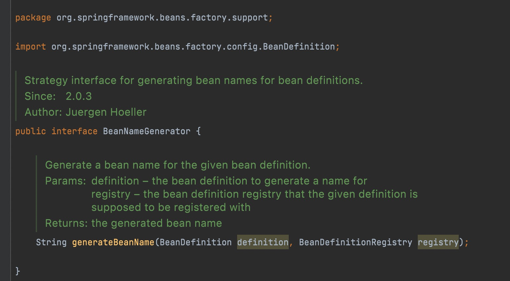

# espring假设去掉二级缓存？

如果去掉了二级缓存，则需要直接在 `singletonFactory.getObject()` 阶段初始化完毕，并放到一级缓存中。


那有这么一种场景，B 和 C 都依赖了 A。要知道在有代理的情况下 `singletonFactory.getObject()` 获取的是代理对象。


而多次调用 `singletonFactory.getObject()` 返回的代理对象是不同的，就会导致 B 和 C 依赖了不同的 A。那如果获取 B 到之后直接放到一级缓存，然后 C 再获取呢？


# spring假设去掉三级缓存？

去掉三级缓存之后，Bean 直接创建 **earlySingletonObjects**， 看着好像也可以。如果有代理的时候，在 earlySingletonObjects 直接放代理对象就行了。但是会导致一个问题：**在实例化阶段就得执行后置处理器，判断有AnnotationAwareAspectJAutoProxyCreator 并创建代理对象**。这么一想，是不是会对 Bean 的生命周期有影响。同样，先创建 singletonFactory 的好处就是：在真正需要实例化的时候，再使用 singletonFactory.getObject() 获取 Bean 或者 Bean 的代理。相当于是延迟实例化。

**AnnotationAwareAspectJAutoProxyCreator后置处理器**


如果单纯为了解决循环依赖问题，那么使用二级缓存足够解决问题，三级缓存存在的意义是为了避免代理，如果没有代理对象，二级缓存足够解决问题。

### Spring 2.6默认去除循环依赖

circular refernences prohibited by default，也可以通过参数开启

```java
spring.main.allow-circular-references=true  
```


## 循环依赖+动态代理


```java
* <p>Bean factory implementations should support the standard bean lifecycle interfaces
* as far as possible. The full set of initialization methods and their standard order is:
* <ol>
* <li>BeanNameAware's {@code setBeanName}
* <li>BeanClassLoaderAware's {@code setBeanClassLoader}
* <li>BeanFactoryAware's {@code setBeanFactory}
* <li>EnvironmentAware's {@code setEnvironment}
* <li>EmbeddedValueResolverAware's {@code setEmbeddedValueResolver}
* <li>ResourceLoaderAware's {@code setResourceLoader}
* (only applicable when running in an application context)
* <li>ApplicationEventPublisherAware's {@code setApplicationEventPublisher}
* (only applicable when running in an application context)
* <li>MessageSourceAware's {@code setMessageSource}
* (only applicable when running in an application context)
* <li>ApplicationContextAware's {@code setApplicationContext}
* (only applicable when running in an application context)
* <li>ServletContextAware's {@code setServletContext}
* (only applicable when running in a web application context)
* <li>{@code postProcessBeforeInitialization} methods of BeanPostProcessors
* <li>InitializingBean's {@code afterPropertiesSet}
* <li>a custom init-method definition
* <li>{@code postProcessAfterInitialization} methods of BeanPostProcessors
* </ol>
```

```java
// Invoke factory processors registered as beans in the context.
invokeBeanFactoryPostProcessors(beanFactory);
InternalConfigurationAnnotationProcessor
ConfigurationClassPostProcessor帮助我们做了注解识别和解析的过程
ConfigurationClassParser#doProcessConfigurationClass
//@Component
//@PropertySources
//@ComponentScans
//@ComponentScan
//@ImportResource

//配置文件读取是GenericBeanDefinition
//注解扫描是ScannedGenericBeanDefintion
//父类AbstractBeanDefinition
//AnnotatedBeanDefinition有这个注解元数据信息  private final AnnotationMetadata metadata;

```

#### ConfigurationClassPostProcessor

```java
@SpringBootApplication  -> @EnableAutoConfiguration  -> @Import(AutoConfigurationImportSelector.class) 就是在 ConfigurationClassPostProcessor去解析加载的
```

#### https://juejin.cn/post/6844903944146124808


## Bean名称生成策略




启动流程


## BeanPostProcessor关键实现类


## Spring的观察者模式

**refresh()#initApplicationEventMulticaster()**


```txt
initialMulticaster（springboot的监听器）
applicationEventMulticaster（spring上下文监听器）
```


# spring-configuration-metadata.json配置文件用来在配置文件输入的时候提示


# Spring Aop

## Advice的执行顺序

```java
success
// Around advice start exec ...
// Before advice exec ...
// 方法 A 执行
// AfterReturning advice exec ...
// After advice exec ...
// Around advice end exec ...

throwable
// Around advice start exec ...
// Before advice exec ...
// AfterThrowing advice exec ...
// After advice exec ...d
// java.lang.ArithmeticException: / by zero
// Around advice end exec ...
```

**注：可以通过Order注解或者实现Order接口修改优先级，数越大优先级越低**


## Aop调用链条组装

```java
由于cglib代理创建的时候callback数组0的位置是 DynamicAdvisedInterceptor，而在调用目标方法的时候都会走到 DynamicAdvisedInterceptor.intercept()，而里面最终就会创建一个 CglibMethodInvocation 对象，把符合的list<Advice>传给构造方法，还有其他参数，代理对象等，接着就会调用 proceed(),由于 CglibMethodInvocation 的 proceed()就是调用父类的 ReflectiveMethodInvocation.proceed(),而父类就会有一个计数器不断的调用list<advice>对应坐标的类，当前 ReflectiveMethodInvocation.proceed()最后面会调用每个advice的invoke方法，并会把当前对象传过去，因为当前proceed()是 CglibMethodInvocation 调用过来的，所以this对象就是他( CglibMethodInvocation),接下来调用的第一个invoke()坑定是 ExposeInvocationInterceptor 的（AbstractAdvisorAutoProxyCreator&findEligibleAdvisors()extendAdvisors()添加的，是从AbstractAutoProxyCreator的warpIfNecessary方法来的），首先会把 CglibMethodInvocation 方到一个threadlocal里面，以保证同线程其他位置可以使用，proceed(this(代指 CglibMethodInvocation))最后会调用
CglibMethodInvocation.proceed()，由于里面是调用父类的proceed(),这是父类的计数器每次调用就会+1，然后还有走到invoke(this),周而复始。各通知类的方法不尽相同，就是会在调用方法的前后穿插自己的逻辑比如 MethodBeforeAdviceInterceptor（）。

XML的时候Advice是以下表作为顺序的，最终在拼出来的chain按照这个顺序
对于拓扑排序结果 只会在Before Around After会出现，现在都是按照默认值来排序的，getAdvisors()方法声明了顺序都是0，默认顺序是 getAdvisorMethods() 
  Around.class, Before.class, After.class, AfterReturning.class, AfterThrowing.class
先按照注解比较，相同在按照方法名比较


0 = {ExposeInvocationInterceptor@2024} 
1 = AspectJAroundAdvice
	@Override
	public Object invoke(MethodInvocation mi) throws Throwable {
		if (!(mi instanceof ProxyMethodInvocation)) {
			throw new IllegalStateException("MethodInvocation is not a Spring ProxyMethodInvocation: " + mi);
		}
		ProxyMethodInvocation pmi = (ProxyMethodInvocation) mi;
		// MethodInvocationProceedingJoinPoint.proceed()
		ProceedingJoinPoint pjp = lazyGetProceedingJoinPoint(pmi);
		JoinPointMatch jpm = getJoinPointMatch(pmi);
		return invokeAdviceMethod(pjp, jpm, null, null);
	}

	/**
	 * Return the ProceedingJoinPoint for the current invocation,
	 * instantiating it lazily if it hasn't been bound to the thread already.
	 * @param rmi the current Spring AOP ReflectiveMethodInvocation,
	 * which we'll use for attribute binding
	 * @return the ProceedingJoinPoint to make available to advice methods
	 */
	protected ProceedingJoinPoint lazyGetProceedingJoinPoint(ProxyMethodInvocation rmi) {
		return new MethodInvocationProceedingJoinPoint(rmi);
	}
2 = MethodBeforeAdviceInterceptor
	@Override
	public Object invoke(MethodInvocation mi) throws Throwable {
		this.advice.before(mi.getMethod(), mi.getArguments(), mi.getThis());
		return mi.proceed();
	}
3 = AspectJAfterAdvice
	@Override
	public Object invoke(MethodInvocation mi) throws Throwable {
		try {
			//调用 ReflectiveMethodInvocation 的proceed()方法
			return mi.proceed();
		}
		finally {
			invokeAdviceMethod(getJoinPointMatch(), null, null);
		}
	}
	@Nullable
	protected JoinPointMatch getJoinPointMatch() {
		MethodInvocation mi = ExposeInvocationInterceptor.currentInvocation();//取出 CglibaMethodInvocation
		if (!(mi instanceof ProxyMethodInvocation)) {
			throw new IllegalStateException("MethodInvocation is not a Spring ProxyMethodInvocation: " + mi);
		}
		return getJoinPointMatch((ProxyMethodInvocation) mi);
	}
4 = AfterReturningAdviceInterceptor
	@Override
	public Object invoke(MethodInvocation mi) throws Throwable {
		Object retVal = mi.proceed();
		this.advice.afterReturning(retVal, mi.getMethod(), mi.getArguments(), mi.getThis());
		return retVal;
	}
5 = AspectJAfterThrowingAdvice
	@Override
	public Object invoke(MethodInvocation mi) throws Throwable {
		try {
			//执行下一个通知/拦截器 methodInvocation 通过调用joinpoint接口的proceed
			return mi.proceed();
		}
		catch (Throwable ex) {
			if (shouldInvokeOnThrowing(ex)) {
				invokeAdviceMethod(getJoinPointMatch(), null, ex);
			}
			throw ex;
		}
	}
```


## 注解对应Advice接口


```java
InstantiationModelAwarePointcutAdvisorImpl
内部注解所对应的AspectAdvice对象
AtAround -> AspectJAroundAdvice
AtBefore -> AspectJMethodBeforeAdvice
AtAfter -> AspectJAfterAdvice
AtAfterReturning -> AspectJAfterReturningAdvice
AtAfterThrowing -> AspectJAfterThrowingAdvice
```

## DefaultListableBeanFactory类图


```java
1.创建AspectJPointcutAdvisor#0-4，先使用其带参的构造方法进行对象的创建，但是想使用带参数的构造方法，必须要把参数对象准备好，因此要准备创建内置包含的对象AspectJAroundAdvice

2.创建AspectJAroundAdvice，也需要使用带参的构造方法进行创建，也需要提前准备好具体的参数对象，包含三个参数：

  1. MethodLocatingFactoryBean
  2. AspectJExpressionPointcut
  3. SimpleBeanFactoryAwareAspectInstanceFactory

3.分别创建上述的三个对象，上述三个对象的创建过程都是调用无参的构造方法，直接发射调用即可。
```


## SpringAop运行过程

## 1.调用被代理的方法

2.找到cglib文件

3.根据var00000找到DynamicAdvisedInterceptor#intercept方法ExposeInvocationInterceptor中间的调用循环结构

适配器是以Interceptor结尾的 其他的是直接继承自MethodInterceptor


```java
@EnableAspectJAutoProxy 
//注入了一个关键的类 AnnotationAwareAspectJAutoProxyCreator
//两种方式创建代理类
//resolveBeforeInstantiation&postProcessBeforeInstantiation
//initializeBean&postProcessAfterInitialization
```


# spring创建对象的五种方式


## 通过BeanPostProcess实现InstantiationBeanPostProcessor创建对象

```java
public class CustomTargetSource extends AbstractBeanFactoryBasedTargetSource {

    private static final long serialVersionUID = 1231212121L;

    @Override
    public Object getTarget() throws Exception {
        return getBeanFactory().getBean(getTargetBeanName());
    }
}
public class CustomTargetSourceCreator extends AbstractBeanFactoryBasedTargetSourceCreator {
    @Override
    protected AbstractBeanFactoryBasedTargetSource createBeanFactoryBasedTargetSource(Class<?> beanClass, String beanName) {
        if (getBeanFactory() instanceof ConfigurableListableBeanFactory) {
            if (beanClass.isAssignableFrom(UserServiceImpl.class)) {
                return new CustomTargetSource();
            }
        }
        return null;
    }
}
@Component
public class SetCustomTargetSourceCreator implements PriorityOrdered, BeanFactoryAware, InitializingBean {

    private BeanFactory beanFactory;
    private boolean load = false;

    @Override
    public int getOrder() {
        return 45;
    }

    @Override
    public void setBeanFactory(BeanFactory beanFactory) throws BeansException {
        this.beanFactory = beanFactory;
    }


    @Override
    public void afterPropertiesSet() throws Exception {
        if (!load) {
            AnnotationAwareAspectJAutoProxyCreator annotationAwareAspectJAutoProxyCreator = beanFactory.getBean(AnnotationAwareAspectJAutoProxyCreator.class);
            CustomTargetSourceCreator customTargetSourceCreator = new CustomTargetSourceCreator();
            customTargetSourceCreator.setBeanFactory(beanFactory);
            annotationAwareAspectJAutoProxyCreator.setCustomTargetSourceCreators(customTargetSourceCreator);
            load = !load;
        }
    }
}
public interface UserService {
    void userInfo();
}
@Service
public class UserServiceImpl implements UserService{
    @Override
    public void userInfo() {
        System.out.println("打印了用户信息 UserServiceImpl1");
    }
}
```

## RestTemplate的Ribbon


## Spring默认启动的时候就会创建几个BeanDefinition

AnnotationConfigUtils.java类的

1. AutowiredAnnotationBeanPostProcessor.java
2. CommonAnnotationBeanPostProcessor.java
3. ConfigurationClassPostProcessor.java

# springboot2.0默认创建什么代理？

参考文章：https://note.youdao.com/ynoteshare/index.html?id=ca8cc5711375e0fd4e605aa4f5aa4be3&type=note&_time=1656590927414


# Spring事务

**EnableTransactionManagement的selector 注册类**

```java
AutoProxyRegistrar -> InfrastructureAdvisorAutoProxyCreator

ProxyTransactionManagementConfiguration -> BeanFactoryTransactionAttributeSourceAdvisor
																					 TransactionAttributeSource
																					 TransactionInterceptor
```


## 五种Advice

```java
MethodBeforeAdvice

AfterReturningAdvice

ThrowsAdvice

MethodInterceptor

IntroductionInterceptor
```

```java
PointcutAdvisor
ClassFilter getClassFilter();
MethodMatcher getMethodMatcher();
```

```java
//AfterReturningAdviceAdapter
//MethodBeforeAdviceAdapter
//ThrowsAdviceAdapter
```

spirng boot项目的@EnableAspectJAutoProxy 最终会通过Import注册一个AnnotationAwareAspectJAutoProxyCreator类d

```java
			//AfterReturningAdviceAdapter AfterReturningAdviceInterceptor
			//MethodBeforeAdviceAdapter   MethodBeforeAdviceInterceptor
			//ThrowsAdviceAdapter         ThrowsAdviceInterceptor       
```
ConfigurationClassPostprocessor.java加载的类多了3个


##详解Spring的事务管理PlatformTransactionManager
https://www.jianshu.com/p/903c01cb2a77

springboot提供加载资源.properties .yml
PropertySourceLoader.java

SpringApplication&run&prepareEnvironment去加载bootstrap.yml文件
读取nacos配置文件是在SpringApplication&run&prepareContext方法&applyInitializers&PropertySourceBootstrapConfiguration&PropertySourceLocator.locateCollection&NacosPropertySourceLocator.locate

源码参考文章：https://juejin.cn/post/6887751198737170446

## 事务传播行为

参考文章：https://juejin.cn/post/6844903608224333838


**先简单介绍一下Spring事务的传播行为：**

所谓事务的传播行为是指，如果在开始当前事务之前，一个事务上下文已经存在，此时有若干选项可以指定一个事务性方法的执行行为。在`TransactionDefinition`定义中包括了如下几个表示传播行为的常量：

- `TransactionDefinition.PROPAGATION_REQUIRED`：如果当前存在事务，则加入该事务；如果当前没有事务，则创建一个新的事务。这是默认值。
- `TransactionDefinition.PROPAGATION_REQUIRES_NEW`：创建一个新的事务，如果当前存在事务，则把当前事务挂起。
- `TransactionDefinition.PROPAGATION_SUPPORTS`：如果当前存在事务，则加入该事务；如果当前没有事务，则以非事务的方式继续运行。
- `TransactionDefinition.PROPAGATION_NOT_SUPPORTED`：以非事务方式运行，如果当前存在事务，则把当前事务挂起。
- `TransactionDefinition.PROPAGATION_NEVER`：以非事务方式运行，如果当前存在事务，则抛出异常。
- `TransactionDefinition.PROPAGATION_MANDATORY`：如果当前存在事务，则加入该事务；如果当前没有事务，则抛出异常。
- `TransactionDefinition.PROPAGATION_NESTED`：如果当前存在事务，则创建一个事务作为当前事务的嵌套事务来运行；如果当前没有事务，则该取值等价于`TransactionDefinition.PROPAGATION_REQUIRED`。


## Spring事务管理接口介绍

Spring 框架中，事务管理相关最重要的 3 个接口如下：

- **PlatformTransactionManager**： （平台）事务管理器，Spring 事务策略的核心。
- **TransactionDefinition**： 事务定义信息(事务隔离级别、传播行为、超时、只读、回滚规则)。
- **TransactionStatus**： 事务运行状态。

我们可以把 **PlatformTransactionManager** 接口可以被看作是事务上层的管理者，而 **TransactionDefinition** 和 **TransactionStatus** 这两个接口可以看作是事务的描述。

**PlatformTransactionManager** 会根据 **TransactionDefinition** 的定义比如事务超时时间、隔离级别、传播行为等来进行事务管理 ，而 **TransactionStatus** 接口则提供了一些方法来获取事务相应的状态比如是否新事务、是否可以回滚等等。


```java
//TransactionDefinition
//隔离级别
//传播行为
//回滚规则
//是否只读
//事务超时

public interface TransactionStatus{
    boolean isNewTransaction(); // 是否是新的事务
    boolean hasSavepoint(); // 是否有恢复点
    void setRollbackOnly();  // 设置为只回滚
    boolean isRollbackOnly(); // 是否为只回滚
    boolean isCompleted; // 是否已完成
}
DataSourceTransactionObject
设置保存点
设置通过TransactionSynchronizationManager&resource属性获取 key DataSource value为ConnectionHolder
```


## spring支持两种事务

### 编程式事务管理

通过 `TransactionTemplate`或者`TransactionManager`手动管理事务，实际应用中很少使用，但是对于你理解 Spring 事务管理原理有帮助。

使用`TransactionTemplate` 进行编程式事务管理的示例代码如下：

```java
@Autowired
private TransactionTemplate transactionTemplate;
public void testTransaction() {

        transactionTemplate.execute(new TransactionCallbackWithoutResult() {
            @Override
            protected void doInTransactionWithoutResult(TransactionStatus transactionStatus) {

                try {

                    // ....  业务代码
                } catch (Exception e){
                    //回滚
                    transactionStatus.setRollbackOnly();
                }

            }
        });
}
```

使用 `TransactionManager` 进行编程式事务管理的示例代码如下：

```java
@Autowired
private PlatformTransactionManager transactionManager;

public void testTransaction() {

  TransactionStatus status = transactionManager.getTransaction(new DefaultTransactionDefinition());
          try {
               // ....  业务代码
              transactionManager.commit(status);
          } catch (Exception e) {
              transactionManager.rollback(status);
          }
}
```

### 非编程式事务

### 声明式事务管理

推荐使用（代码侵入性最小），实际是通过 AOP 实现（基于`@Transactional` 的全注解方式使用最多）。

使用 `@Transactional`注解进行事务管理的示例代码如下：

```java
@Transactional(propagation=propagation.PROPAGATION_REQUIRED)
public void aMethod {
  //do something
  B b = new B();
  C c = new C();
  b.bMethod();
  c.cMethod();
}
```


**如果内层事务需要回滚，他会在rollack里面判断globalrollack是不是true 如果是true就是记录在threadlocal里面一个true的变量，**
**外层事务由于catch了异常，就会在commit的时候判断threadlocal是否有这个变量，然后决定是否会滚**

### 事务失效几种方式

1. 数据库引擎是否支持事务（Mysql 的 MyIsam引擎不支持事务）

2. 注解所在的类是否被加载为 Bean（是否被Spring 管理）

3. 注解所在的方法是否为 public 修饰的

4. 是否存在自身调用的问题

5. 所用数据源是否加载了事务管理器

6. @Transactional的扩展配置propagation是否正确

7. 异常没有被抛出, 或异常类型错误

8. 方法用final修饰或static修饰

9. 多线程调用

   如果你在方法中有`try{}catch(Exception e){}`处理，那么try里面的代码块就脱离了事务的管理，若要事务生效需要在catch中`throw new RuntimeException ("xxxxxx");`这一点也是面试中会问到的事务失效的场景。


1、就是`@Transactional`注解保证的是每个方法处在一个事务，如果有try一定在catch中抛出运行时异常。

2、方法必须是public修饰符。否则注解不会生效，但是加了注解也没啥毛病，不会报错，只是没卵用而已。

3、this.本方法的调用，被调用方法上注解是不生效的，因为无法再次进行切面增强

## mybatis使用spring事务创建的数据库连接

参考文章：https://qiuyadongsite.github.io/2019/01/15/mybatis-sources-code-6/

# Feign底层实现细节

https://www.cnblogs.com/rickiyang/p/11802487.html

@EnableFeignClients -> @Import(FeignClientsRegistrar.class)

```java
class FeignClientsRegistrar
		implements ImportBeanDefinitionRegistrar, ResourceLoaderAware, EnvironmentAware {

}

```

**通过import注解来注册bean有几种方式**

1. 实现ImportSelector接口，spring容器就会实例化类，并且调用其selectImports方法；
2. 实现ImportBeanDefinitionRegistrar接口，spring容器就会调用其registerBeanDefinitions方法；

3. 带有Configuration注解的配置类。

```java
	@Override
	public void registerBeanDefinitions(AnnotationMetadata metadata,
			BeanDefinitionRegistry registry) {
    //把EnableFeignClients的属性信息根据主启动类名称和信息绑定到FeignClientSpecification并注入到容器中，在FeignAutoConfiguration类中，FeignContext会使用
		registerDefaultConfiguration(metadata, registry);
    //生成FeignClient对应的bean，注入到Spring 的IOC容器。
		registerFeignClients(metadata, registry);
	}
```

在registerFeignClient方法中构造了一个BeanDefinitionBuilder对象，BeanDefinitionBuilder的主要作用就是构建一个AbstractBeanDefinition，AbstractBeanDefinition类最终被构建成一个BeanDefinitionHolder 然后注册到Spring中。

beanDefinition类为FeignClientFactoryBean，故在Spring获取类的时候实际返回的是FeignClientFactoryBean类。

`FeignClientFactoryBean`作为一个实现了`FactoryBean`的工厂类，那么每次在Spring Context 创建实体类的时候会调用它的`getObject()`方法。

##Springboot对于配置文件的解析关键类（）

**ConfigFileApplicationListener、YamlPropertySourceLoader、PropertiesPropertySourceLoader**


**参照网址：**https://blog.csdn.net/xby7437/article/details/115010642?ops_request_misc=%257B%2522request%255Fid%2522%253A%2522165452814216782350967629%2522%252C%2522scm%2522%253A%252220140713.130102334..%2522%257D&request_id=165452814216782350967629&biz_id=0&utm_medium=distribute.pc_search_result.none-task-blog-2~all~sobaiduend~default-2-115010642-null-null.142


## Spring实例化bean的5种方式

1. 通过BeanPostProcessor实现InstantiationBeanPostProcessor来返回一个cglib执行的bean，resolveBeforeInstantiation(beanName, mbdToUse);
2. 通过无参构造器实例化bean
3. 通过实例供应器创建bean，mbd.getInstanceSupplier()
4. 通过factoryMethod工厂方法创建bean，getFactoryMethodName
5. 通过factoryBean创建对象


### 常用类类图


### spring-Expression

SpelExpressionParser、EvaluationContext、rootObject

参考文章：未读 https://blog.51cto.com/u_3631118/3121519

关于SpEL的几个概念：

- 表达式（“干什么”）：SpEL的核心，所以表达式语言都是围绕表达式进行的
- 解析器（“谁来干”）：用于将字符串表达式解析为表达式对象
- 上下文（“在哪干”）：表达式对象执行的环境，该环境可能定义变量、定义自定义函数、提供类型转换等等
- root根对象及活动上下文对象（“对谁干”）：root根对象是默认的活动上下文对象，活动上下文对象表示了当前表达式操作的对象


## SPel主要对象：

```java
Expression :表示的是表达式对象。能够根据上下文对象对自身进行计算的表达式。
ExpressionParser：表达式解析器，将表达式字符串解析为可计算的已编译表达式。支持分析模板（Template）和标准表达式字符串。
EvaluationContext：评估/计算的上下文，表达式在计算上下文中执行。在表达式计算期间遇到引用时，正是在这种上下文中解析引用。它的默认实现为：StandardEvaluationContext。
```

# MDC

MDC 全称是 Mapped Diagnostic Context，可以粗略的理解成是一个线程安全的存放诊断日志的容器。

log4j
log4j可以控制日志信息输送的目的地是控制台、文件、GUI组件，甚至是套接口服务器、NT的时间记录器、UNIX Syslog护进程等。

可以控制每一条日志信息的级别，能够更加细致的控制日志的生产过程，可以通过一个配置文件来灵活的进行配置，不需要修改应用代码。

logback
是由log4j创始人设计的又一个开源日志组件。logback当前分成三个模块：logback-core,logback- classic和logback-access。logback-core是其它两个模块的基础模块。logback-classic是log4j的一个 改良版本。此外logback-classic完整实现SLF4J API使你可以很方便地更换成其它日志系统如log4j或JDK14 Logging。logback-access访问模块与Servlet容器集成提供通过Http来访问日志的功能。

SLF4J所提供的核心API是一些接口以及一个LoggerFactory的工厂类。从某种程度上，SLF4J有点类似JDBC，不过比JDBC更简单，在JDBC中，你需要指定驱动程序，而在使用SLF4J的时候，不需要在代码中或配置文件中指定你打算使用那个具体的日志系统。如同使用JDBC基本不用考虑具体数据库一样，SLF4J提供了统一的记录日志的接口，只要按照其提供的方法记录即可，最终日志的格式、记录级别、输出方式等通过具体日志系统的配置来实现，因此可以在应用中灵活切换日志系统。
Logback与SLF4J结合起来用,两个组件的官方网站如下：

1、更快的实现 Logback的内核重写了，在一些关键执行路径上性能提升10倍以上。而且logback不仅性能提升了，初始化内存加载也更小了。

2、非常充分的测试 Logback经过了几年，数不清小时的测试。Logback的测试完全不同级别的。这是简单重要的原因选择logback而不是log4j。

3、Logback-classic非常自然实现了SLF4j Logback-classic实现了 SLF4j。在使用SLF4j中，你都感觉不到logback-classic。而且因为logback-classic非常自然地实现了SLF4J， 所 以切换到log4j或者其他，非常容易，只需要提供成另一个jar包就OK，根本不需要去动那些通过SLF4JAPI实现的代码。

4、非常充分的文档 官方网站有两百多页的文档。
5、自动重新加载配置文件 当配置文件修改了，Logback-classic能自动重新加载配置文件。扫描过程快且安全，它并不需要另外创建一个扫描线程。这个技术充分保证了应用程序能跑得很欢在JEE环境里面。

6、Lilith Lilith是log事件的观察者，和log4j的chainsaw类似。而lilith还能处理大数量的log数据 。

7、谨慎的模式和非常友好的恢复 在谨慎模式下，多个FileAppender实例跑在多个JVM下，能 够安全地写道同一个日志文件。RollingFileAppender会有些限制。Logback的FileAppender和它的子类包括 RollingFileAppender能够非常友好地从I/O异常中恢复。

8、配置文件可以处理不同的情况 开发人员经常需要判断不同的Logback配置文件在不同的环境下（开发，测试，生产）。而这些配置文件仅仅只有一些很小的不同，可以通过,和来实现，这样一个配置文件就可以适应多个环境。

9、Filters（过滤器） 有些时候，需要诊断一个问题，需要打出日志。在log4j，只有降低日志级别，不过这样会打出大量的日志，会影响应用性能。在Logback，你可以继续 保持那个日志级别而除掉某种特殊情况，如alice这个用户登录，她的日志将打在DEBUG级别而其他用户可以继续打在WARN级别。要实现这个功能只需 加4行XML配置。可以参考MDCFIlter 。

10、SiftingAppender（一个非常多功能的Appender） 它可以用来分割日志文件根据任何一个给定的运行参数。如，SiftingAppender能够区别日志事件跟进用户的Session，然后每个用户会有一个日志文件。

11、自动压缩已经打出来的log RollingFileAppender在产生新文件的时候，会自动压缩已经打出来的日志文件。压缩是个异步过程，所以甚至对于大的日志文件，在压缩过程中应用不会受任何影响。

12、堆栈树带有包版本 Logback在打出堆栈树日志时，会带上包的数据。

13、自动去除旧的日志文件 通过设置TimeBasedRollingPolicy或者SizeAndTimeBasedFNATP的maxHistory属性，你可以控制已经产生日志文件的最大数量。如果设置maxHistory 12，那那些log文件超过12个月的都会被自动移除。

总之，logback比log4j优秀，可以取代之。


# 解析@Service、@Repository、@Controller等注解

参考文章：https://blog.csdn.net/m0_68615056/article/details/124371422?ops_request_misc=%257B%2522request%255Fid%2522%253A%2522165658284316782391839919%2522%252C%2522scm%2522%253A%252220140713.130102334..%2522%257D&request_id=165658284316782391839919&biz_id=0&utm_medium=distribute.pc_search_result.none-task-blog-2~all~baidu_landing_v2~default-2-124371422-null-null.142^v27^pc_search_result_control_group,157^v15^new_3&utm_term=MergedAnnotationsCollection&spm=1018.2226.3001.4187

```java
ConfigurationClassPostProcessor&processConfigBeanDefinitions -> ConfigurationClassParser&doProcessConfigurationClass -> 
ComponentScanAnnotationParser&parse ->
ClassPathBeanDefinitionScanner&doScan ->
ClassPathScanningCandidateComponentProvider&scanCandidateComponents ->

ConfigurationClassPostProcessor ==》ConfigurationClassParser ==》ComponentScanAnnotationParser ==》ClassPathBeanDefinitionScanne ==》ClassPathScanningCandidateComponentProvider

//通过指定的包路径，扫描所有的class文件，asm字节码解析获取class的注解信息封装成MetadataReader，并通过   MergedAnnotationsCollection 递归合并父级的注解，最后判断class是否满足注入ico容器，即有没有@Component注解。


SimpleAnnotationMetadataReadingVisitor
CachingMetdataReaderFactory
SimpleMetadataReader 构造方法构建了一个 SimpleAnnotationMetadataReadingVisitor
SimpleAnnotationMetadataReadingVisitor&visitEnd 回掉方法
MergedAnnotationsCollection
```


# @Import注解

支持注入：

```java
//@Configuration
//实现ImportSelector接口的类
//实现ImportBeanDefinitionRegistrar接口的类
//@component类
```

