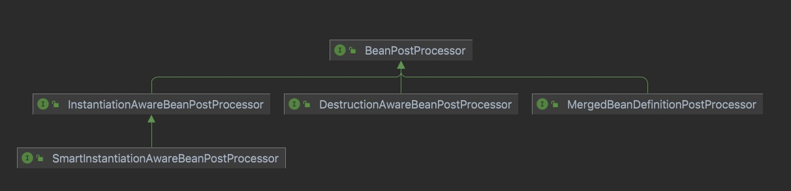
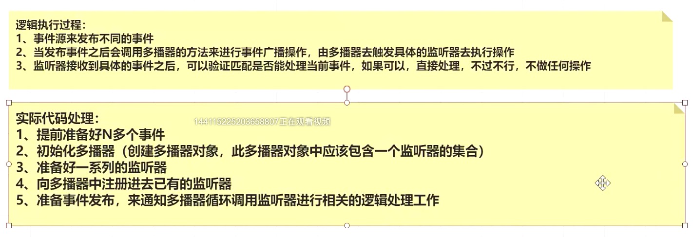
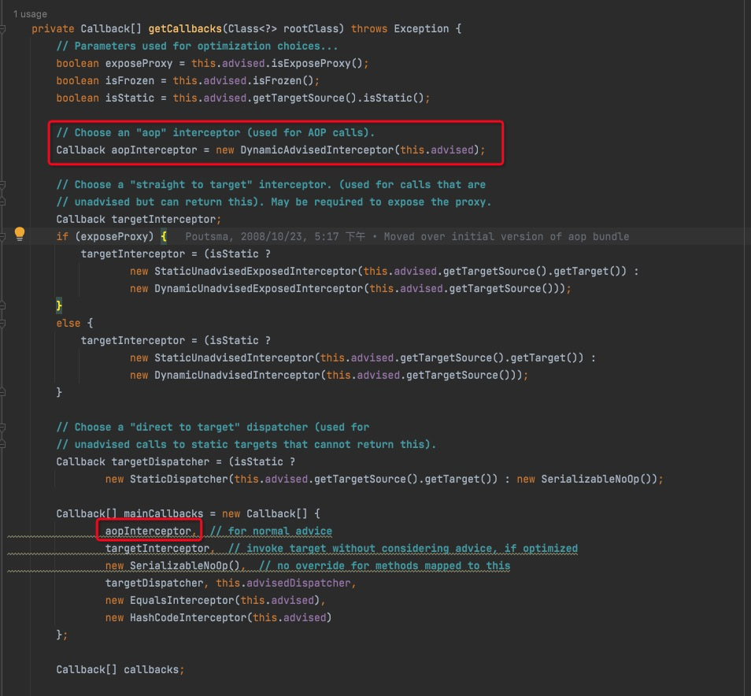

## dspring假设去掉二级缓存？

如果去掉了二级缓存，则需要直接在 `singletonFactory.getObject()` 阶段初始化完毕，并放到一级缓存中。


那有这么一种场景，B 和 C 都依赖了 A。要知道在有代理的情况下 `singletonFactory.getObject()` 获取的是代理对象。


而多次调用 `singletonFactory.getObject()` 返回的代理对象是不同的，就会导致 B 和 C 依赖了不同的 A。那如果获取 B 到之后直接放到一级缓存，然后 C 再获取呢？


## spring假设去掉三级缓存？

去掉三级缓存之后，Bean 直接创建 **earlySingletonObjects**， 看着好像也可以。如果有代理的时候，在 earlySingletonObjects 直接放代理对象就行了。但是会导致一个问题：**在实例化阶段就得执行后置处理器，判断有AnnotationAwareAspectJAutoProxyCreator 并创建代理对象**。这么一想，是不是会对 Bean 的生命周期有影响。同样，先创建 singletonFactory 的好处就是：在真正需要实例化的时候，再使用 singletonFactory.getObject() 获取 Bean 或者 Bean 的代理。相当于是延迟实例化。

**AnnotationAwareAspectJAutoProxyCreator后置处理器**


如果单纯为了解决循环依赖问题，那么使用二级缓存足够解决问题，三级缓存存在的意义是为了避免代理，如果没有代理对象，二级缓存足够解决问题。

### 2.6默认去除循环依赖

circular refernences prohibited by default，也可以通过参数开启

```java
spring.main.allow-circular-references=true  
```


## 循环依赖+动态代理


```java
* <p>Bean factory implementations should support the standard bean lifecycle interfaces
* as far as possible. The full set of initialization methods and their standard order is:
* <ol>
* <li>BeanNameAware's {@code setBeanName}
* <li>BeanClassLoaderAware's {@code setBeanClassLoader}
* <li>BeanFactoryAware's {@code setBeanFactory}
* <li>EnvironmentAware's {@code setEnvironment}
* <li>EmbeddedValueResolverAware's {@code setEmbeddedValueResolver}
* <li>ResourceLoaderAware's {@code setResourceLoader}
* (only applicable when running in an application context)
* <li>ApplicationEventPublisherAware's {@code setApplicationEventPublisher}
* (only applicable when running in an application context)
* <li>MessageSourceAware's {@code setMessageSource}
* (only applicable when running in an application context)
* <li>ApplicationContextAware's {@code setApplicationContext}
* (only applicable when running in an application context)
* <li>ServletContextAware's {@code setServletContext}
* (only applicable when running in a web application context)
* <li>{@code postProcessBeforeInitialization} methods of BeanPostProcessors
* <li>InitializingBean's {@code afterPropertiesSet}
* <li>a custom init-method definition
* <li>{@code postProcessAfterInitialization} methods of BeanPostProcessors
* </ol>
```


```java
// Invoke factory processors registered as beans in the context.
invokeBeanFactoryPostProcessors(beanFactory);
InternalConfigurationAnnotationProcessor
ConfigurationClassPostProcessor帮助我们做了注解识别和解析的过程
ConfigurationClassParser#doProcessConfigurationClass
//@Component
//@PropertySources
//@ComponentScans
//@ComponentScan
//@ImportResource

//配置文件读取是GenericBeanDefinition
//注解扫描是ScannedGenericBeanDefintion
//父类AbstractBeanDefinition
//AnnotatedBeanDefinition有这个注解元数据信息  private final AnnotationMetadata metadata;

```

#### ConfigurationClassPostProcessor

```java
@SpringBootApplication  -> @EnableAutoConfiguration  -> @Import(AutoConfigurationImportSelector.class) 就是在 ConfigurationClassPostProcessor去解析加载的
```

#### https://juejin.cn/post/6844903944146124808


## Bean名称生成策略


启动流程


## BeanPostProcessor关键实现类




## Spring的观察者模式

**refresh()#initApplicationEventMulticaster()**




```txt
initialMulticaster（springboot的监听器）
applicationEventMulticaster（spring上下文监听器）
```


## SPI（service provider interface）

## Spring Aop


## DefaultListableBeanFactory类图


```java
1.创建AspectJPointcutAdvisor#0-4，先使用其带参的构造方法进行对象的创建，但是想使用带参数的构造方法，必须要把参数对象准备好，因此要准备创建内置包含的对象AspectJAroundAdvice

2.创建AspectJAroundAdvice，也需要使用带参的构造方法进行创建，也需要提前准备好具体的参数对象，包含三个参数：

  1. MethodLocatingFactoryBean
  2. AspectJExpressionPointcut
  3. SimpleBeanFactoryAwareAspectInstanceFactory

3.分别创建上述的三个对象，上述三个对象的创建过程都是调用无参的构造方法，直接发射调用即可。
```


SpringAop运行过程

1.调用被代理的方法

2.找到cglib文件

3.根据var00000找到DynamicAdvisedInterceptor#intercept方法ExposeInvocationInterceptor中间的调用循环结构


适配器是以Interceptor结尾的 其他的是直接继承自MethodInterceptor





## spring创建对象的五种方式


## 事务传播行为


## RestTemplate的Ribbon


## Spring默认启动的时候就会创建几个BeanDefinition

AnnotationConfigUtils.java类的

1. AutowiredAnnotationBeanPostProcessor.java
2. CommonAnnotationBeanPostProcessor.java
3. ConfigurationClassPostProcessor.java


## spring事务

```java
AbstractAutoProxyCreator 
后置处理器beanpostprocessor
AnnotationAwareAspectJAutoProxyCreator
AbstractAdvisorAutoProxyCreator

```

JDK动态代理     InvocationHandler

CGlib 动态代理 MethodInterceptor

### 五种Advice

```java
MethodBeforeAdvice

AfterReturningAdvice

ThrowsAdvice

MethodInterceptor

IntroductionInterceptor
```

```java
PointcutAdvisor
ClassFilter getClassFilter();
MethodMatcher getMethodMatcher();
```

```java
//AfterReturningAdviceAdapter
//MethodBeforeAdviceAdapter
//ThrowsAdviceAdapter
```

spirng boot项目的@EnableAspectJAutoProxy 最终会通过Import注册一个AnnotationAwareAspectJAutoProxyCreator类

```java
			//AfterReturningAdviceAdapter AfterReturningAdviceInterceptor
			//MethodBeforeAdviceAdapter   MethodBeforeAdviceInterceptor
			//ThrowsAdviceAdapter         ThrowsAdviceInterceptor       
```
ConfigurationClassPostprocessor.java加载的类多了3个


### @Valid与@Validated注解

@Valid常见用在方法，类中字段上进行校验,java的核心包

@Validated是spring提供的对@Valid的封装，常见用在方法上进行校验

但在分组、注解位置、嵌套验证等功能上有所不同，这里主要就这几种情况进行说明。

- `@Validated`：用在类型、方法和方法参数上。但不能用于成员属性（field）
- `@Valid`：可以用在方法、构造函数、方法参数和成员属性（field）上

## **[分组校验]**

- `@Validated`：提供分组功能，可以在参数验证时，根据不同的分组采用不同的验证机制
- `@Valid`：没有分组功能

## **[嵌套校验]**

一个待验证的pojo类，其中还包含了待验证的对象，需要在待验证对象上注解`@Valid`，才能验证待验证对象中的成员属性，这里不能使用`@Validated`。

xi
MDC 全称是 Mapped Diagnostic Context，可以粗略的理解成是一个线程安全的存放诊断日志的容器。

log4j
log4j可以控制日志信息输送的目的地是控制台、文件、GUI组件，甚至是套接口服务器、NT的时间记录器、UNIX Syslog护进程等。

可以控制每一条日志信息的级别，能够更加细致的控制日志的生产过程，可以通过一个配置文件来灵活的进行配置，不需要修改应用代码。

logback
是由log4j创始人设计的又一个开源日志组件。logback当前分成三个模块：logback-core,logback- classic和logback-access。logback-core是其它两个模块的基础模块。logback-classic是log4j的一个 改良版本。此外logback-classic完整实现SLF4J API使你可以很方便地更换成其它日志系统如log4j或JDK14 Logging。logback-access访问模块与Servlet容器集成提供通过Http来访问日志的功能。

SLF4J所提供的核心API是一些接口以及一个LoggerFactory的工厂类。从某种程度上，SLF4J有点类似JDBC，不过比JDBC更简单，在JDBC中，你需要指定驱动程序，而在使用SLF4J的时候，不需要在代码中或配置文件中指定你打算使用那个具体的日志系统。如同使用JDBC基本不用考虑具体数据库一样，SLF4J提供了统一的记录日志的接口，只要按照其提供的方法记录即可，最终日志的格式、记录级别、输出方式等通过具体日志系统的配置来实现，因此可以在应用中灵活切换日志系统。
Logback与SLF4J结合起来用,两个组件的官方网站如下：

1、更快的实现 Logback的内核重写了，在一些关键执行路径上性能提升10倍以上。而且logback不仅性能提升了，初始化内存加载也更小了。

2、非常充分的测试 Logback经过了几年，数不清小时的测试。Logback的测试完全不同级别的。这是简单重要的原因选择logback而不是log4j。

3、Logback-classic非常自然实现了SLF4j Logback-classic实现了 SLF4j。在使用SLF4j中，你都感觉不到logback-classic。而且因为logback-classic非常自然地实现了SLF4J， 所 以切换到log4j或者其他，非常容易，只需要提供成另一个jar包就OK，根本不需要去动那些通过SLF4JAPI实现的代码。

4、非常充分的文档 官方网站有两百多页的文档。
5、自动重新加载配置文件 当配置文件修改了，Logback-classic能自动重新加载配置文件。扫描过程快且安全，它并不需要另外创建一个扫描线程。这个技术充分保证了应用程序能跑得很欢在JEE环境里面。

6、Lilith Lilith是log事件的观察者，和log4j的chainsaw类似。而lilith还能处理大数量的log数据 。

7、谨慎的模式和非常友好的恢复 在谨慎模式下，多个FileAppender实例跑在多个JVM下，能 够安全地写道同一个日志文件。RollingFileAppender会有些限制。Logback的FileAppender和它的子类包括 RollingFileAppender能够非常友好地从I/O异常中恢复。

8、配置文件可以处理不同的情况 开发人员经常需要判断不同的Logback配置文件在不同的环境下（开发，测试，生产）。而这些配置文件仅仅只有一些很小的不同，可以通过,和来实现，这样一个配置文件就可以适应多个环境。

9、Filters（过滤器） 有些时候，需要诊断一个问题，需要打出日志。在log4j，只有降低日志级别，不过这样会打出大量的日志，会影响应用性能。在Logback，你可以继续 保持那个日志级别而除掉某种特殊情况，如alice这个用户登录，她的日志将打在DEBUG级别而其他用户可以继续打在WARN级别。要实现这个功能只需 加4行XML配置。可以参考MDCFIlter 。

10、SiftingAppender（一个非常多功能的Appender） 它可以用来分割日志文件根据任何一个给定的运行参数。如，SiftingAppender能够区别日志事件跟进用户的Session，然后每个用户会有一个日志文件。

11、自动压缩已经打出来的log RollingFileAppender在产生新文件的时候，会自动压缩已经打出来的日志文件。压缩是个异步过程，所以甚至对于大的日志文件，在压缩过程中应用不会受任何影响。

12、堆栈树带有包版本 Logback在打出堆栈树日志时，会带上包的数据。

13、自动去除旧的日志文件 通过设置TimeBasedRollingPolicy或者SizeAndTimeBasedFNATP的maxHistory属性，你可以控制已经产生日志文件的最大数量。如果设置maxHistory 12，那那些log文件超过12个月的都会被自动移除。

总之，logback比log4j优秀，可以取代之。


##详解Spring的事务管理PlatformTransactionManager
https://www.jianshu.com/p/903c01cb2a77

springboot提供加载资源.properties .yml
PropertySourceLoader.java

SpringApplication&run&prepareEnvironment去加载bootstrap.yml文件
读取nacos配置文件是在SpringApplication&run&prepareContext方法&applyInitializers&PropertySourceBootstrapConfiguration&PropertySourceLocator.locateCollection&NacosPropertySourceLocator.locate

### Feign底层实现细节

https://www.cnblogs.com/rickiyang/p/11802487.html

@EnableFeignClients -> @Import(FeignClientsRegistrar.class)

```java
class FeignClientsRegistrar
		implements ImportBeanDefinitionRegistrar, ResourceLoaderAware, EnvironmentAware {

}

```

**通过import注解来注册bean有几种方式**

1. 实现ImportSelector接口，spring容器就会实例化类，并且调用其selectImports方法；
2. 实现ImportBeanDefinitionRegistrar接口，spring容器就会调用其registerBeanDefinitions方法；

3. 带有Configuration注解的配置类。

```java
	@Override
	public void registerBeanDefinitions(AnnotationMetadata metadata,
			BeanDefinitionRegistry registry) {
    //把EnableFeignClients的属性信息根据主启动类名称和信息绑定到FeignClientSpecification并注入到容器中，在FeignAutoConfiguration类中，FeignContext会使用
		registerDefaultConfiguration(metadata, registry);
    //生成FeignClient对应的bean，注入到Spring 的IOC容器。
		registerFeignClients(metadata, registry);
	}
```

在registerFeignClient方法中构造了一个BeanDefinitionBuilder对象，BeanDefinitionBuilder的主要作用就是构建一个AbstractBeanDefinition，AbstractBeanDefinition类最终被构建成一个BeanDefinitionHolder 然后注册到Spring中。

beanDefinition类为FeignClientFactoryBean，故在Spring获取类的时候实际返回的是FeignClientFactoryBean类。

`FeignClientFactoryBean`作为一个实现了`FactoryBean`的工厂类，那么每次在Spring Context 创建实体类的时候会调用它的`getObject()`方法。

##Springboot对于配置文件的解析关键类（）

**ConfigFileApplicationListener、YamlPropertySourceLoader、PropertiesPropertySourceLoader**


**参照网址：**https://blog.csdn.net/xby7437/article/details/115010642?ops_request_misc=%257B%2522request%255Fid%2522%253A%2522165452814216782350967629%2522%252C%2522scm%2522%253A%252220140713.130102334..%2522%257D&request_id=165452814216782350967629&biz_id=0&utm_medium=distribute.pc_search_result.none-task-blog-2~all~sobaiduend~default-2-115010642-null-null.142


## Spring实例化bean的5种方式

1. 通过BeanPostProcessor实现InstantiationBeanPostProcessor来返回一个cglib执行的bean，resolveBeforeInstantiation(beanName, mbdToUse);
2. 通过无参构造器实例化bean
3. 通过实例供应器创建bean，mbd.getInstanceSupplier()
4. 通过factoryMethod工厂方法创建bean，getFactoryMethodName
5. 通过factoryBean创建对象


### 常用类类图


### spring-Expression

SpelExpressionParser、EvaluationContext、rootObject

参考文章：未读 https://blog.51cto.com/u_3631118/3121519

关于SpEL的几个概念：

- 表达式（“干什么”）：SpEL的核心，所以表达式语言都是围绕表达式进行的
- 解析器（“谁来干”）：用于将字符串表达式解析为表达式对象
- 上下文（“在哪干”）：表达式对象执行的环境，该环境可能定义变量、定义自定义函数、提供类型转换等等
- root根对象及活动上下文对象（“对谁干”）：root根对象是默认的活动上下文对象，活动上下文对象表示了当前表达式操作的对象


## SPel主要对象：

```java
Expression :表示的是表达式对象。能够根据上下文对象对自身进行计算的表达式。
ExpressionParser：表达式解析器，将表达式字符串解析为可计算的已编译表达式。支持分析模板（Template）和标准表达式字符串。
EvaluationContext：评估/计算的上下文，表达式在计算上下文中执行。在表达式计算期间遇到引用时，正是在这种上下文中解析引用。它的默认实现为：StandardEvaluationContext。
```

