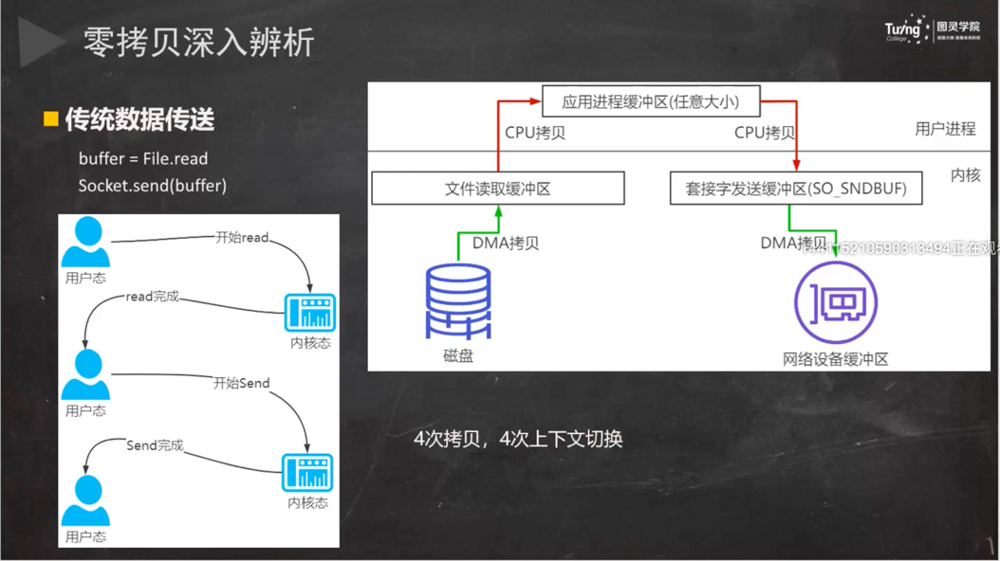
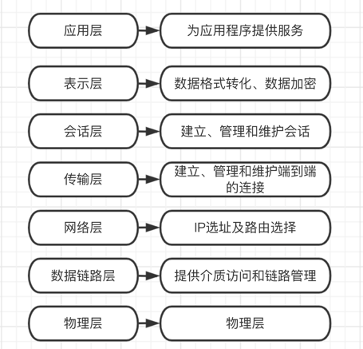
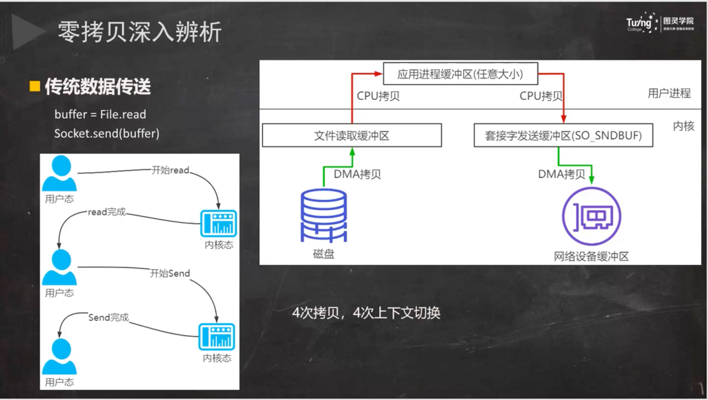
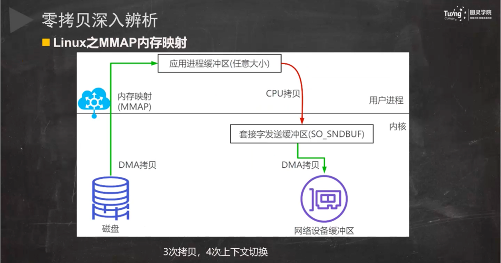
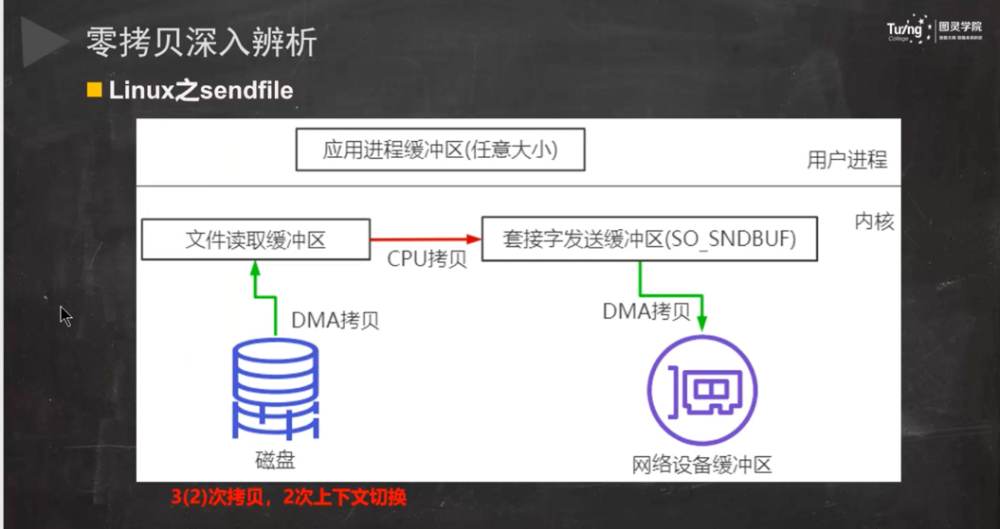
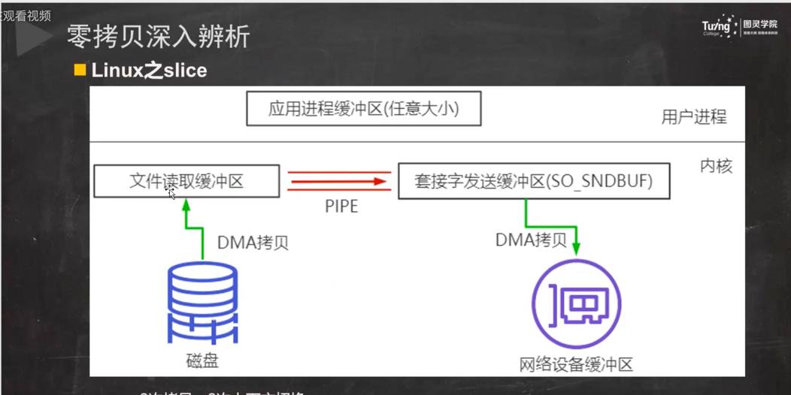

TCP协议灵魂拷问：https://juejin.cn/post/6844904070889603085

计算机是什么？

利用通信线路将地理上分散的、具有独立功能的计算机系统和通信设备按不同的形式连接起来、以功能完善的网络软件及协议实现资源共享和信息传递的系统。

主要网络有哪些？

1、局域网

2、城域网

3、广域网






##压缩工具
snappy、zstd
snappy、zstd 等压缩工具类，可以直接将字符串压缩成 byte[] 再往外传输，这个被压缩后的字符串，直至入库都是 byte[]，全程不对大报文解压。


TCP缓冲区

每个TCP的Socket的内核中都有一个发送缓冲区和一个接收缓冲区

#### 直接内存比对内存快在哪里？

直接内存相比堆内存，避免了二次拷贝。java在处理write数据的时候会先在jvm内存外申请一个直接内存，当有要发送的数据的时候先把数据写入到直接内存，然后再由直接内存写入到套接字发送缓冲区，之后再通过协议栈过网络发送给对端。**
为什么要把数据再拷贝一次到？**
因为GC的原因，如果没有直接内存，对直接告诉套接字发送缓冲区要发送数据的地址，这时候还没有发送，堆这个时候刚好发生GC，导致要发送的数据经过GC算法整理功能进行了移动位置，就会出现套接字发送缓冲区按照之前堆给的地址进行数据读取发送是错误的数据。

#### 什么是零拷贝？

零拷贝（英语：Zero-copy）技术是指计算机执行操作时，CPU不需要先将数据从某处内存复制到另一个特定区域。这种技术通常用于通过网络传输文件时节省CPU周期和内存带宽。

kafka

netty

rocketmq

nginx

apache

零拷贝技术可以减少数据拷贝和共享总线操作的次数，消除传输数据在存储器之间不必要的中间拷贝次数，从而有效地提高数据传输效率。

零拷贝技术减少了用户进程地址空间和内核地址空间因为上下文切换而带来的开销

Linux的I/O机制与DMA（Direct Merry Access，直接内存读取）

### DMA技术

DMA，英文全称是**Direct Memory Access**，即直接内存访问。**DMA**本质上是一块主板上独立的芯片，允许外设设备和内存存储器之间直接进行IO数据传输，其过程
**不需要CPU的参与**。

我们一起来看下IO流程，DMA帮忙做了什么事情.


- 用户应用进程调用read函数，向操作系统发起IO调用，进入阻塞状态，等待数据返回。
- CPU收到指令后，对DMA控制器发起指令调度。
- DMA收到IO请求后，将请求发送给磁盘；
- 磁盘将数据放入磁盘控制缓冲区，并通知DMA
- DMA将数据从磁盘控制器缓冲区拷贝到内核缓冲区。
- DMA向CPU发出数据读完的信号，把工作交换给CPU，由CPU负责将数据从内核缓冲区拷贝到用户缓冲区。
- 用户应用进程由内核态切换回用户态，解除阻塞状态

可以发现，DMA做的事情很清晰啦，它主要就是**帮忙CPU转发一下IO请求，以及拷贝数据**。为什么需要它的？

> 主要就是效率，它帮忙CPU做事情，这时候，CPU就可以闲下来去做别的事情，提高了CPU的利用效率。大白话解释就是，CPU老哥太忙太累啦，所以他找了个小弟（名叫DMA）
> ，替他完成一部分的拷贝工作，这样CPU老哥就能着手去做其他事情。










####文件描述符
File
descriptor，简称fd，当应用程序请求内核打开/新建一个文件时，内核会返回一个文件描述符用于对应这个打开/新建的文件，其fd本质上就是一个非负整数。实际上，它是一个索引值，指向内核为每一个进程所维护的该进程打开文件的记录表。当程序打开/新建一个文件时，内核会向进程返回一个文件描述符。在程序设计中，一些涉及底层的程序编写往往会围绕着文件描述符展开。但是文件描述符这一概念往往只适用于UNIX、Linux这样的操作系统。

##select(linux一个进程正常只能打开文件描述符为1024个)
int select(int n,fd_set *readfds,fd_set *writefds,fd_set *exceptfds,struct timeval *timeout);
##poll
int poll(struct pollfd *fds, unsigned int nfds,int timeout);
##epoll
int epoll_create(int size);
int epoll_ctl(int epfd,int op,int fd,struct epoll_event * event);
int epoll_wait(int epfd,struct epoll_event *events,int maxevents,int timeout);

####select、poll、epoll的比较
select，poll，epoll都是操作系统实现IO多路复用的机制。我们知道，I/O多路复用就通过一种极致，可以监视多个描述符，一旦某个描述符就绪(
一般是读就绪或者写就绪)，能够通知程序进行相应的读写操作。那么这三种机制有什么区别呢？
1、支持一个进程所能打开的最大连接数
2、FD剧增后带来的IO效率问题
select 因为每次调用时都会对连接进行线性遍历，所以随着FD的增加会造成遍历速度慢的“线性下降性能问题”
poll 同上
epoll
因为epoll内核中实现是根绝每个fd上的callback函数来实现的，只有活跃的socket才会主动调用callback，所以在活跃socke较少的情况下，使用epoll没有前面两者的线性下降的性能问题，但是所有socket都很活跃的情况下，可能会有性能问题。

开启防火墙
firewall-cmd --zone=public --add-port=9848/tcp --permanent
firewall-cmd --zone=public --add-port=9849/tcp --permanent
查看防火墙
firewall-cmd --list-all
firewall-cmd --reload

RPC 全称是 Remote Procedure Call ，即远程过程调用，其对应的是我们的本地调用。
参考文章：https://baijiahao.baidu.com/s?id=1709082440305850192&wfr=spider&for=pc

OSI参考模型定义了每一层的应用，定义每一层作用的是协议，协议是约定，其具体内容为规范，我们日常所使用的就是遵循各个协议具体规范的产品和通信手段。


**应用：**适用需要,以供使用

**作用：**对人或事物产生的影响或其功能、效果

### 网络类型

 计算机网络从覆盖范围上划分可以分为三类:局域网、城域网、广域网。局域网 LAN(作 用范围一般为几米到几十公里)、城域网 MAN(界于
WAN 与 LAN 之间)、广域网 WAN(作用 范围一般为几十到几千公里)。当然计算机网络划分不止这一种分类方式，可以按拓扑结构 分类(
总线型、环型、星型、网状)、还可以按按信息的交换方式(电路交换、报文交换、 报文分组交换)来分等等方式。

## 由来

 开放性的标准化体系结构，OSI 诞生。ARPANET 兴起后,计算机网络发展迅猛,各大计算机公司相继推出自己的网络体系结构及实现这些结构的软硬件产品。由于没有统一的标准,
不同厂商的产品之间互联很困难,人们迫切需要一种开放性的标准化实用网络环境,这样应 运而生了两种国际通用的最重要的体系结构,
为了实现网络设备间的互相通讯，**ISO 和 IEEE (电气和电子工程师协会，是世界上最大的非营利性专业技术学会)相继提出了OSI 参考模
型及其TCP/IP模型。由于TCP/IP尽早地制定了可行性较强的协议，提出了应对技术快速革新的协议，并及时进行后期改良的方案，因此打败了
OSI 模型，成为了事实上的标准。**

OSI七层模型

开放系统互连参考模型（Open System Interconnect）国际标准化组织（ISO）和国际电报电话咨询委员会（CCITT）联合制定的开发系统互连参考模型。

OSI 采用了分层的结构化技术，共分七层，物理层、数据链路层、网络层、传输层、会话层、表示层、应用层。


### TCP/IP模型


 无论什么模型，每一个抽象层建立在低一层提供的服务上，并且为高一层提供服务。大 致来说，可以这么理解(
只是帮助我们理解，实际上肯定会有点出入)，对于我们的 PC 机 来说，物理层可以看成网卡，数据链路层可以看成网卡驱动程序，网络层和传输层由操作负
责处理，应用层则是常用的一些网络应用程序和我们自己所编写的网络应用程序。

**UDP（User Datagram Protocol 用户数据报协议）**

注意:

 我们一些常见的网络应用基本上都是基于 *TCP* 和 *UDP* 的，这两个协议又会使用网络层 的 *IP* 协议。但是我们完全可以绕过传输层的
*TCP* 和 *UDP*，直接使用 *IP*，比如 *Linux* 内核中的 *LVS* 就可以直接基于 *IP* 层进行负载平衡调度;甚至还可以直接访问链路层，比如
*tcpdump* 程序就是直接和链路层进行通信的。

**MAC** **地址**

MAC 地址全称叫做媒体访问控制地址，也称为局域网地址(LAN Address)，MAC 位址， 以太网地址(Ethernet Address)或物理地址(Physical
Address)，由网络设备制造商生产时 写在硬件内部。MAC 地址与网络无关，也即无论将带有这个地址的硬件(如网卡、集线器、 路由器等)
接入到网络的何处，都有相同的 MAC 地址，它由厂商写在网卡的 BIOS 里，从理 论上讲，除非盗来硬件(网卡)，否则是没有办法冒名顶替的。

MAC 地址共 48 位(6 个字节)。前 24 位由 IEEE(电气和电子工程师协会)决定如何分 配，后 24
位由实际生产该网络设备的厂商自行制定。例如:FF:FF:FF:FF:FF:FF 或 FF-FF-FF-FF-FF-FF

**IP** **地址**

IP 地址(Internet Protocol Address)的全称叫作互联网协议地址，它的本义是为互联网上的每一个网络和每一台主机配置一个唯一的逻辑地址，用来与物理地址作区分。

IP 地址分为:IPv4 和 IPv6。我们这里着重讲的是 IPv4 地址，IP 地址是由 32 位的二进制 数组成，它们通常被分为 4 个“8
位二进制数”，我们可以把它理解为 4 个字节，格式表示 为:(A.B.C.D)。其中，A，B，C，D 这四个英文字母表示为 0-255 的十进制的整数。例:
192.168.1.1

### *Tips*:*IP* 地址和 *MAC* 地址之间的区别

*1*、对于网络中的一些设备，路由器或者是 *PC* 及而言，*IP* 地址的设计是出于拓扑设计 出来的，只要在不重复 *IP*
地址的情况下，它是可以随意更改的;而 *MAC* 地址是根据生产厂 商烧录好的，它一般不能改动的，一般来说，当一台 *PC*
机的网卡坏了之后，更换了网卡之 后 *MAC* 地址就会变了。

*2*、在前面的介绍里面，它们最明显的区别就是长度不同，*IP* 地址的长度为 *32* 位，而 *MAC* 地址为 *48* 位。

*3*、它们的寻址协议层不同。*IP* 地址应用于 *OSI* 模型的网络层，而 *MAC* 地址应用在 *OSI* 模型的数据链路层。
数据链路层协议可以使数据从一个节点传递到相同链路的另一个节点 上(通过 *MAC* 地址)
，而网络层协议使数据可以从一个网络传递到另一个网络上(*ARP* 根 据目的 *IP* 地址，找到中间节点的 *MAC*
地址，通过中间节点传送，从而最终到达目的网络)。

*4*、分配依据不同。*IP* 地址的分配是基于我们自身定义的网络拓扑，*MAC* 地址的分配是 基于制造商。

### **端口号**

在传输层也有这种类似于地址的概念，那就是端口号。端口号用来识别同一台计算机中 进行通信的不同应用程序。因此，它也被称为程序地址。

一台计算机上同时可以运行多个程序。传输层协议正是利用这些端口号识别本机中正在 进行通信的应用程序，并准确地将数据传输。


#### 面试题:为什么端口号有 65535 个?

因为在 TCP、UDP 协议报文的开头，会分别有 16 位二进制来存储源端口号和目标端口

号，所以端口个数是 2^16=65536 个，但是 0 号端口用来表示所有端口，所以实际可用的端 口号是 65535 个。

#### 端口号的确定

• **标准既定的端口号**:这种方法也叫静态方法。它是指每个应用程序都有其指定的端 口号。但并不是说可以随意使用任何一个端口号。例如
HTTP、FTP、TELNET 等广为使用的 应用协议中所使用的端口号就是固定的。这些端口号被称为知名端口号，分布在 0~1023 之
间，我们在编写自己的网络应用服务时，尽量不要使用这些端口号。

• **时序分配法**:服务器有必要确定监听端口号，以让客户端程序访问服务器上的服务。 但是客户端没必要确定端口号。在这种方法下，客户端应用程序完全可以不用自己设置端口
号，而全权交给操作系统进行分配，客户端使用的临时端口号，操作系统分配的一般都是大 于 10000 的。

**总的来说，操作系统是通过源 IP 地址、目标 IP 地址、协议号(协议类型)、源端口号 以及目标端口号这五个元素唯一性的识别一个网络上的通信。网络通信五元组
**

#### **服务端理论上能达成的最高并发数量是多少?从我们上面的用户 A 和用户 B 构成的 TCP 连接四元组:**

(A1,PA,X,3306)

(B1,PB,X,3306)

可以看到目的 IP 地址和目的端口(X,3306)是不变的，这样就只剩下源 IP 地址、源端 口是可变的。IP 地址是一个 32 位的整数，所以源
IP 最大有 2 的 32 次方这么多个。 端口是一个 16 位的整数，所以端口的数量就是 2 的 16 次方。2 的 32 次方(ip 数)× 2 的 16
次方(port 数)大约等于两百多万亿。所以理论上，我们每个 server 可以接收的连 接上限就是两百多万亿。

### TCP超时重传时间

TCP 提供的是一种可靠的数据流服务，数据有可能被拆分后发送，那么采用超时重传机 制是和应答确认机制是组成 TCP 可靠传输的关键设计。

而超时重传机制中最最重要的就是重传超时**(RTO，Retransmission TimeOut)**的时间选 择，很明显，在工程上和现实中网络环境是十分复杂多变的，有时候可能突然的抽风，有时
候可能突然的又很顺畅。在数据发送的过程中，如果用一个固定的值一直作为超时计时器的 时长是非常不经济也非常不准确的方法，这样的话，超时的时长就需要根据网络情况动态调
整，就需要采样统计一个数据包从发送端发送出去到接收到这个包的回复这段时长来动态设 置重传超时值，这个时长就是为 RTT，学名 *
*round-trip time**，然后再根据这个 RTT 通过各种 算法和公式平滑 RTT 值后，最终确定重传超时值。

### TCP三次握手


1. **第一次握手:**客户端将请求报文标志位 SYN 置为 1，请求报文的 Sequence Number 字段 (简称 seq)中填入一个随机值
   J，并将该数据包发送给服务器端，客户端进入 SYN_SENT 状 态，等待服务器端确认。
2. **第二次握手:**服务器端收到数据包后由请求报文标志位 SYN=1 知道客户端请求建立连接，服务器端将应答报文标志位 SYN 和 ACK
   都置为 1，应答报文的 Acknowledgment Number 字段(简称 ack)中填入 ack=J+1，应答报文的 seq 中填入一个随机值 K，并将该数据包发送
   给客户端以确认连接请求，服务器端进入 SYN_RCVD 状态。
3. **第三次握手:**客户端收到应答报文后，检查 ack 是否为 J+1，ACK 是否为 1，如果正确 则将第三个报文标志位 ACK 置为
   1，ack=K+1，并将该数据包发送给服务器端，服务器端检 查 ack 是否为 K+1，ACK 是否为 1，如果正确则连接建立成功，客户端和服务器端进入
   ESTABLISHED 状态，完成三次握手，随后客户端与服务器端之间可以开始传输数据了。

# 计算机组成


**First Draft**里面说了一台计算机应该有哪些部分组成，我们一起来看看。

首先是一个包含算术逻辑单元（Arithmetic Logic Unit，ALU）和处理器寄存器（Processor Register）的**处理器单元**（Processing
Unit），用来完成各种算术和逻辑运算。因为它能够完成各种数据的处理或者计算工作，因此也有人把这个叫作数据通路（Datapath）或者运算器。

然后是一个包含指令寄存器（Instruction Reigster）和程序计数器（Program Counter）的**控制器单元**（Control
Unit/CU），用来控制程序的流程，通常就是不同条件下的分支和跳转。在现在的计算机里，上面的算术逻辑单元和这里的控制器单元，共同组成了我们说的
CPU。

接着是用来存储数据（Data）和指令（Instruction）的**内存**。以及更大容量的**外部存储**，在过去，可能是磁带、磁鼓这样的设备，现在通常就是硬盘。

最后就是各种**输入和输出设备**
，以及对应的输入和输出机制。我们现在无论是使用什么样的计算机，其实都是和输入输出设备在打交道。个人电脑的鼠标键盘是输入设备，显示器是输出设备。我们用的智能手机，触摸屏既是输入设备，又是输出设备。而跑在各种云上的服务器，则是通过网络来进行输入和输出。这个时候，网卡既是输入设备又是输出设备。

任何一台计算机的任何一个部件都可以归到运算器、控制器、存储器、输入设备和输出设备中，而所有的现代计算机也都是基于这个基础架构来设计开发的。

而所有的计算机程序，也都可以抽象为从**输入设备**读取输入信息，通过**运算器**和**控制器**来执行存储在**存储器**
里的程序，最终把结果输出到**输出设备**中。而我们所有撰写的无论高级还是低级语言的程序，也都是基于这样一个抽象框架来进行运作的。

# x86,x64,x86-64,amd64,arm指令集架构之间的关系

参考文章：https://zhuanlan.zhihu.com/p/113157931

# Stub

Stub Network ，**一般指桩网络，又叫末端网络**，是指仅有一单个通路通过路由器连接到其他子网，或者仅有一个通路连接到其他网络。

# 正向代理反向代理

**正向代理（forward proxy），是一个位于客户端和目标服务器之间的服务器(代理服务器)
，为了从目标服务器取得内容，客户端向代理服务器发送一个请求并指定目标，然后代理服务器向目标服务器转交请求并将获得的内容返回给客户端。
**

**反向代理（reverse proxy）：是指以代理**[**服务器**](https://cloud.tencent.com/product/cvm?from=10680)*
*来接受internet上的连接请求，然后将请求转发给内部网络上的服务器，并将从服务器上得到的结果返回给internet上请求连接的客户端，此时代理服务器对外就表现为一个反向代理服务器。
**

### **正向代理的用途**

**突破访问限制**

通过代理服务器，可以突破自身IP访问限制，访问国外网站，教育网等。即，租客可以通过中介，来解决无法联系上房东的问题。

**提高访问速度**

通常代理服务器都设置一个较大的硬盘缓冲区，会将部分请求的响应保存到缓冲区中，当其他用户再访问相同的信息时，
则直接由缓冲区中取出信息，传给用户，以提高访问速度。即，中介手里留存了很多房源信息和钥匙，可以直接带租客去看房。

**隐藏客户端真实IP**

上网者也可以通过这种方法隐藏自己的IP，免受攻击。即，房东并不知道租客的真实身份。

### **反向代理的用途**

**隐藏服务器真实IP**

使用反向代理，可以对客户端隐藏服务器的IP地址。即，租客并不房东知道的真实身份。

**负载均衡**

反向代理服务器可以做负载均衡，根据所有真实服务器的负载情况，将客户端请求分发到不同的真实服务器上。即，二房东发现房主本人很忙，于是找到房主的妻子帮忙处理租房事宜。

**提高访问速度**

反向代理服务器可以对于静态内容及短时间内有大量访问请求的动态内容提供缓存服务，提高访问速度。即，二房东同样有房屋信息和钥匙。

**提供安全保障**

反向代理服务器可以作为应用层防火墙，为网站提供对基于Web的攻击行为（例如DoS/DDoS）的防护，更容易排查恶意软件等。还可以为后端服务器统一提供加密和SSL加速（如SSL终端代理），提供HTTP访问认证等。

### **正向代理和反向代理的区别**

1、**正向代理其实是客户端的代理**，帮助客户端访问其无法访问的服务器资源。**反向代理则是服务器的代理**，帮助服务器做负载均衡，安全防护等。

2、**正向代理一般是客户端架设的**，比如在自己的机器上安装一个代理软件。而**反向代理一般是服务器架设的**
，比如在自己的机器集群中部署一个反向代理服务器。

3、**正向代理中，服务器不知道真正的客户端到底是谁**，以为访问自己的就是真实的客户端。而在**反向代理中，客户端不知道真正的服务器是谁
**，以为自己访问的就是真实的服务器。

4、正向代理和反向代理的作用和目的不同。**正向代理主要是用来解决访问限制问题。而反向代理则是提供负载均衡、安全防护等作用。二者均能提高访问速度。
**

**参考文章：**https://cloud.tencent.com/developer/article/1418457

# 中断

中断处理程序通常不是和特定设备关联，而是和特定中断关联的，也就是说，如果一个设备可以产生多种不同的中断，那么该设备就可以对应多个中断处理程序，相应的，该设备的驱动程序也就需要准备多个这样的函数。

- 硬中断： 硬中断是由硬件设备（**如外部设备或处理器内部的异常**
  ）发起的中断信号，用于通知处理器某个事件已发生。硬中断是通过修改处理器的执行流程，跳转到硬件中断处理程序来处理的。硬中断通常是异步的，意味着它们可以在任何时候发生，并且需要尽快处理以避免数据丢失或其他问题。
- 软中断： 软中断则是由软件（**即操作系统**
  ）主动触发的中断。软中断是通过在程序中插入特殊的指令（例如系统调用）来触发的，用于请求操作系统执行某些任务。与硬中断不同，软中断是同步的，因为它们由程序显式地发起，并且在程序执行到达中断点时触发。
  中断的目的是打破正常的程序执行顺序，以响应某个事件或处理请求。

## 将网卡收到的数据包转移到主机内存（NIC与驱动交互）

NIC在接收到数据包之后，首先需要将数据同步到内核中，这中间的桥梁是`rx ring buffer`
。它是由NIC和驱动程序共享的一片区域，事实上，`rx ring buffer`存储的并不是实际的packet数据，而是一个描述符，这个描述符指向了它真正的存储地址，具体流程如下：

1. 驱动在内存中分配一片缓冲区用来接收数据包，叫做`sk_buffer`；
2. 将上述缓冲区的地址和大小（即接收描述符），加入到`rx ring buffer`。描述符中的缓冲区地址是DMA使用的物理地址；
3. 驱动通知网卡有一个新的描述符；
4. 网卡从`rx ring buffer`中取出描述符，从而获知缓冲区的地址和大小；
5. 网卡收到新的数据包；
6. 网卡将新数据包通过DMA直接写到`sk_buffer`中。


当驱动处理速度跟不上网卡收包速度时，驱动来不及分配缓冲区，NIC接收到的数据包无法及时写到`sk_buffer`
，就会产生堆积，当NIC内部缓冲区写满后，就会丢弃部分数据，引起丢包。这部分丢包为`rx_fifo_errors`，在`/proc/net/dev`
中体现为fifo字段增长，在ifconfig中体现为overruns指标增长。

## 通知系统内核处理（驱动与Linux内核交互）

这个时候，数据包已经被转移到了`sk_buffer`
中。前文提到，这是驱动程序在内存中分配的一片缓冲区，并且是通过DMA写入的，这种方式不依赖CPU直接将数据写到了内存中，意味着对内核来说，其实并不知道已经有新数据到了内存中。那么如何让内核知道有新数据进来了呢？答案就是中断，通过中断告诉内核有新数据进来了，并需要进行后续处理。

提到中断，就涉及到硬中断和软中断，首先需要简单了解一下它们的区别：

- 硬中断： 由硬件自己生成，具有随机性，硬中断被CPU接收后，触发执行中断处理程序。中断处理程序只会处理关键性的、短时间内可以处理完的工作，剩余耗时较长工作，会放到中断之后，由软中断来完成。硬中断也被称为上半部分。
- 软中断： 由硬中断对应的中断处理程序生成，往往是预先在代码里实现好的，不具有随机性。（除此之外，也有应用程序触发的软中断，与本文讨论的网卡收包无关。）也被称为下半部分。

*
*当NIC把数据包通过DMA复制到内核缓冲区sk_buffer后，NIC立即发起一个硬件中断。CPU接收后，首先进入上半部分，网卡中断对应的中断处理程序是网卡驱动程序的一部分，之后由它发起软中断，进入下半部分，开始消费sk_buffer中的数据，交给内核协议栈处理。
**


通过中断，能够快速及时地响应网卡数据请求，但如果数据量大，那么会产生大量中断请求，CPU大部分时间都忙于处理中断，效率很低。为了解决这个问题，现在的内核及驱动都采用一种叫NAPI（new
API）的方式进行数据处理，其原理可以简单理解为 中断+轮询，在数据量大时，一次中断后通过轮询接收一定数量包再返回，避免产生多次中断。

**参考文章：**https://tech.meituan.com/2018/03/16/redis-high-concurrency-optimization.html

# TCP三次握手or四次挥手

# 


# 洪范攻击


# Time-wait的作用

参考文章：https://zhuanlan.zhihu.com/p/51961509

原因1：**为了保证客户端发送的最后一个ack报文段能够到达服务器。**
因为这最后一个ack确认包可能会丢失，然后服务器就会超时重传第三次挥手的fin信息报，然后客户端再重传一次第四次挥手的ack报文。如果没有这2msl，客户端发送完最后一个ack数据报后直接关闭连接，那么就接收不到服务器超时重传的fin信息报(
**此处应该是客户端收到一个非法的报文段，而返回一个RST的数据报，表明拒绝此次通信，然后双方就产生异常，而不是收不到。**)
，那么服务器就不能按正常步骤进入close状态。那么就会耗费服务器的资源。当网络中存在大量的timewait状态，那么服务器的压力可想而知。

原因2：**
在第四次挥手后，经过2msl的时间足以让本次连接产生的所有报文段都从网络中消失，这样下一次新的连接中就肯定不会出现旧连接的报文段了。**
也就是防止我们上一篇文章 [为什么tcp是三次握手而不是两次握手？](https://zhuanlan.zhihu.com/p/51448333)
中说的：已经失效的连接请求报文段出现在本次连接中。如果没有的话就可能这样：这次连接一挥手完马上就结束了，没有timewait。*
*这次连接中有个迷失在网络中的syn包，然后下次连接又马上开始，下个连接发送syn包，迷失的syn包忽然又到达了对面，所以对面可能同时收到或者不同时间收到请求连接的syn包，然后就出现问题了。
**

# 虚拟内存

### VM: virtual memory

​        **为了更加有效地管理内存并且少出错 ， 现代系统提供了一种对主存的抽象概念， 叫做虚拟内存(VM )。
虚虚拟内存是硬件异常、硬件地址翻译、主存、磁盘文件和内核软件的完美交互，它为每个进程提供了一个大的、一致的和私有的地址空间`**

#### 基本概念

- 物理内存: DRAM存储器
- 虚拟内存: 虚拟内存被组织为一个由存放在磁盘上的N个连续的字节大小的单元组成的数组
- 虚拟寻址: CPU生成一个虚拟地址来访问主存,主存中的"内存管理单元(MMU)"通过页表动态将虚拟地址翻译成内存中的物理地址
- 物理内存地址(PA)与虚拟内存地址(VP)数据表示:
    - 相同位数的低X位表示地址便宜,二者相同(VPO=PPO)
    - 二者的其余高位,位数与值并不相同(VPN != PPN)
- 页表条目(PTE):
    - 虚拟内存与PTE是一一对应的关系(不同的进程占有各自的虚拟内存空间,且数据结构相同,各自的页表也是独占的)
    - 有效位=1,数据位存储的未PPN
    - 有效位=0,数据位无地址,表示未分配
    - 有效位=0,数据位有地址,表示未缓存,磁盘已映射到虚拟内存,只不过未被加载进屋里内存
- 存储在内存管理单元(MMU)的块表(TLB): 缓存一些已知的PTE信息

#### CPU通过PTE寻址过程

- CPU读取VP3 (VP3=VPN3+VPO3)
- OS根据VPN3获取PTE对应的数据
    - PTE有效位=1,拼接PPN3+VPO3=PPO3=PA,进入下一步
    - PTE有效位=0,缺页异常,(加载VP3进对应的物理页),(缺页,计算出牺牲页,如果dirty就写回磁盘,然后将虚拟页写入物理页),并更新PTE
- 将得到的PA根据内存块的组相连信息(组ID,块ID)获取内存中的数据

#### CPU通过TLB寻址理解

- CPU根据虚拟地址(VA)尝试在内存管理单元(MMU)中去匹配块表(TLB): 根据VPN不同的区间获取TLB(组和块)中的PPN

    - 将虚拟页号(VPN)分割成TLB的标记索引(TLBT)和组索引(TLBI)
    - 根据TLB中查找到的信息[物理页号(PPN),有效标记位]判断是否有效
    - 如果有效的话将PPN与VA切割出的虚拟地址偏移(VPO)拼接成物理地址
    - 将得到的物理地址分割成组索引(CI),块索引(CO),组标记(CT),通过有效标记位和上诉信息在RAM中的缓存块中匹配正确的数据返回给CPU

#### 简述一个运行在Linux上的Intel core i7的寻址过程

```
  四个独立的核,拥有一个层次结构的高速缓存结构(L1,L2),一个层次结构的块表(TLB),与前者一一对应
```

- 1.CPU发送虚拟地址给L1-TLB,根据计算规则尝试从TLB中获取到对应的物理页号(PPN),基于虚拟地址偏移(VPO)与物理地址偏移(PPO)
  都是相同的(低12位),所以可以拼接出一个完整的物理地址
- 2.根据得到的物理地址在L1高速缓存中,找到对应的数据块
- 3.如果step1不成功,就直接将VPN分成4片(VPN1,VPN2,VPN3,VPN4)分别对应四级页表结构找到最终的PPN,回到step2

    - 这是基于VPN与PTE(页表条目)一一对应的关系
- 4.如果step2不成功,将上述步骤得到的物理地址请求下级缓存,
    - 下级缓存如果缓存命中就返回数据,缓存不命中直至发生缺页中断异常,将数据换入物理内存,负责重复step4

#### 磁盘,虚拟内存,物理内存的对应概念

- 在进程的虚拟内存地址中划分了2大板块[进程虚拟内存,内核虚拟内存]

- 内核虚拟内存: 除了存有当前进程相关的数据,还保留了各个进程所共享的代码和数据

- ```
  对于Linux的写时复制:
  内存映射: 通过将一个虚拟内存区域与一个磁盘上的对象关联起来,以初始化这个虚拟内存区域的内容
           被映射的文件被划分成页大小的片,每个片都包含虚拟页面的初始化内容
           因为是按需调度,所以虚拟页面没有实际交换进物理内存,直播CPU第一次引用该页面(如果虚拟内存区域比文件区要大,就使用0来填充)
  共享文件: 文件所映射都不同进程的虚拟内存地址并不一样,但是通过各自虚拟内存地址所找到的物理内存地址是一致的
  私有文件: 一开始的时候2个进程将私有对象映射到自己的虚拟内存的不同区域,但是共享这个对象的同一个物理副本.
           但是每个对应的私有区域的页表条目都被标记为只读,这个区域的数据结构被标记为"私有的写时复制".
           当其中一个进程试图区写该对象时,就会触发"保护屏障",内核就在物理内存中创建这个页面的一个新副本,跟新PTE指向这个副本,然后恢复这个页面的可写权限
  磁盘 > 虚拟内存 > 页表 > 物理内存 > 高速缓存
  ```

# 计算机存储单位

```txt
1B（字节）=8Bit（位）
1KB （Kilobyte 千字节）=1024B
1MB （Megabyte 兆字节 简称“兆”）=1024KB
1GB （Gigabyte 吉字节 又称“千兆”）=1024MB
1TB （Trillionbyte 万亿字节 太字节）=1024GB,其中1024=2^10 ( 2 的10次方)
1PB （Petabyte 千万亿字节 拍字节）=1024TB
1EB （Exabyte 百亿亿字节 艾字节）=1024PB
1ZB （Zettabyte 十万亿亿字节 泽字节）= 1024 EB
1YB （Yottabyte 一亿亿亿字节 尧字节）= 1024 ZB
1BB （Brontobyte 一千亿亿亿字节）= 1024 YB
```

kill

正常关闭进程，会触发shutdownhook

kill -9

强制关闭进程，不能触发shutdownhook，也就不能触发springboot的优雅停机

# CPU是什么？

CPU（中央处理器）是计算机系统中最重要的组件之一，它负责执行程序和处理数据。CPU可以看作是计算机的大脑，它通过执行指令来完成各种计算和操作。
CPU由多个核心组成，每个核心都是一个完整的处理器，可以同时执行多个指令。每个核心都包含算术逻辑单元（ALU）、控制单元、寄存器等功能单元。
CPU的主要任务是执行指令。指令是由计算机程序编写的，用于告诉CPU应该执行什么样的操作。指令可以执行各种操作，例如算术运算、逻辑运算、数据传输等。CPU根据指令的类型和操作码，从内存中获取指令并解析执行。
CPU的工作过程通常包括以下几个步骤： **1. 取指令**：从内存中获取下一条指令。 **2. 解码指令**：解析指令的操作码和操作数。 **3.
执行指令**：根据指令的类型执行相应的操作。 **4. 访问内存**：如果指令需要读取或写入内存数据，则进行相应的内存访问操作。 **5.
更新状态**：根据指令执行结果更新相关寄存器或标志位的值。 **6. 跳转**：根据指令的条件或跳转目标，决定下一条要执行的指令。
除了执行指令外，CPU还负责管理和调度计算机系统中的其他硬件设备，例如内存、硬盘、输入输出设备等。它通过中断机制实现与这些设备的交互，并确保它们能够按照预期工作。
总而言之，CPU是计算机系统的核心组件，负责执行程序和处理数据。它通过执行指令来完成各种计算和操作，并管理和调度系统中的其他硬件设备。多cpu之间的通信方式，共享内存，进程间通信（IPC）机制，管道，消息队列

一般现代的服务器会有多个 CPU，而每个 CPU 又包含多个物理核心，每个物理核心又分为多个逻辑核心，每个物理核下的逻辑核共用 L1/L2 Cache。