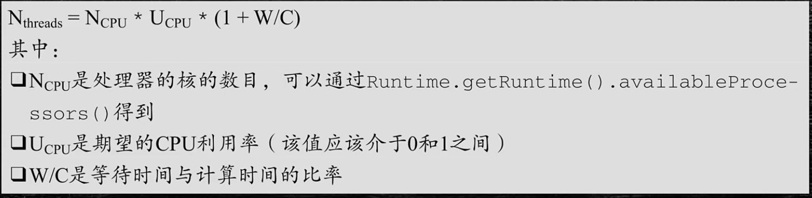

TCP协议灵魂拷问：https://juejin.cn/post/6844904070889603085

计算机是什么？

利用通信线路将地理上分散的、具有独立功能的计算机系统和通信设备按不同的形式连接起来、以功能完善的网络软件及协议实现资源共享和信息传递的系统。

主要网络有哪些？

1、局域网

2、城域网

3、广域网

##压缩工具
snappy、zstd
snappy、zstd 等压缩工具类，可以直接将字符串压缩成 byte[] 再往外传输，这个被压缩后的字符串，直至入库都是 byte[]，全程不对大报文解压。

TCP缓冲区

每个TCP的Socket的内核中都有一个发送缓冲区和一个接收缓冲区

#### 直接内存比对内存快在哪里？

直接内存相比堆内存，避免了二次拷贝。java在处理write数据的时候会先在jvm内存外申请一个直接内存，当有要发送的数据的时候先把数据写入到直接内存，然后再由直接内存写入到套接字发送缓冲区，之后再通过协议栈过网络发送给对端。**为什么要把数据再拷贝一次到？**因为GC的原因，如果没有直接内存，对直接告诉套接字发送缓冲区要发送数据的地址，这时候还没有发送，堆这个时候刚好发生GC，导致要发送的数据经过GC算法整理功能进行了移动位置，就会出现套接字发送缓冲区按照之前堆给的地址进行数据读取发送是错误的数据。

#### 什么是零拷贝？

零拷贝（英语：Zero-copy）技术是指计算机执行操作时，CPU不需要先将数据从某处内存复制到另一个特定区域。这种技术通常用于通过网络传输文件时节省CPU周期和内存带宽。

kafka

netty

rocketmq

nginx

apache

零拷贝技术可以减少数据拷贝和共享总线操作的次数，消除传输数据在存储器之间不必要的中间拷贝次数，从而有效地提高数据传输效率。

零拷贝技术减少了用户进程地址空间和内核地址空间因为上下文切换而带来的开销

Linux的I/O机制与DMA（Direct Merry Access，直接内存读取）

### DMA技术

DMA，英文全称是**Direct Memory Access**，即直接内存访问。**DMA**本质上是一块主板上独立的芯片，允许外设设备和内存存储器之间直接进行IO数据传输，其过程**不需要CPU的参与**。

我们一起来看下IO流程，DMA帮忙做了什么事情.

- 用户应用进程调用read函数，向操作系统发起IO调用，进入阻塞状态，等待数据返回。
- CPU收到指令后，对DMA控制器发起指令调度。
- DMA收到IO请求后，将请求发送给磁盘；
- 磁盘将数据放入磁盘控制缓冲区，并通知DMA
- DMA将数据从磁盘控制器缓冲区拷贝到内核缓冲区。
- DMA向CPU发出数据读完的信号，把工作交换给CPU，由CPU负责将数据从内核缓冲区拷贝到用户缓冲区。
- 用户应用进程由内核态切换回用户态，解除阻塞状态

可以发现，DMA做的事情很清晰啦，它主要就是**帮忙CPU转发一下IO请求，以及拷贝数据**。为什么需要它的？

> 主要就是效率，它帮忙CPU做事情，这时候，CPU就可以闲下来去做别的事情，提高了CPU的利用效率。大白话解释就是，CPU老哥太忙太累啦，所以他找了个小弟（名叫DMA） ，替他完成一部分的拷贝工作，这样CPU老哥就能着手去做其他事情。

####文件描述符
File descriptor，简称fd，当应用程序请求内核打开/新建一个文件时，内核会返回一个文件描述符用于对应这个打开/新建的文件，其fd本质上就是一个非负整数。实际上，它是一个索引值，指向内核为每一个进程所维护的该进程打开文件的记录表。当程序打开/新建一个文件时，内核会向进程返回一个文件描述符。在程序设计中，一些涉及底层的程序编写往往会围绕着文件描述符展开。但是文件描述符这一概念往往只适用于UNIX、Linux这样的操作系统。

##select(linux一个进程正常只能打开文件描述符为1024个)
int select(int n,fd_set *readfds,fd_set *writefds,fd_set *exceptfds,struct timeval *timeout);
##poll
int poll(struct pollfd *fds, unsigned int nfds,int timeout);
##epoll
int epoll_create(int size);
int epoll_ctl(int epfd,int op,int fd,struct epoll_event * event);
int epoll_wait(int epfd,struct epoll_event *events,int maxevents,int timeout);

####select、poll、epoll的比较
select，poll，epoll都是操作系统实现IO多路复用的机制。我们知道，I/O多路复用就通过一种极致，可以监视多个描述符，一旦某个描述符就绪(一般是读就绪或者写就绪)，能够通知程序进行相应的读写操作。那么这三种机制有什么区别呢？
1、支持一个进程所能打开的最大连接数
2、FD剧增后带来的IO效率问题
select 因为每次调用时都会对连接进行线性遍历，所以随着FD的增加会造成遍历速度慢的“线性下降性能问题”
poll 同上
epoll 因为epoll内核中实现是根绝每个fd上的callback函数来实现的，只有活跃的socket才会主动调用callback，所以在活跃socke较少的情况下，使用epoll没有前面两者的线性下降的性能问题，但是所有socket都很活跃的情况下，可能会有性能问题。

开启防火墙
firewall-cmd --zone=public --add-port=9848/tcp --permanent
firewall-cmd --zone=public --add-port=9849/tcp --permanent
查看防火墙
firewall-cmd --list-all
firewall-cmd  --reload

RPC 全称是 Remote Procedure Call ，即远程过程调用，其对应的是我们的本地调用。
参考文章：https://baijiahao.baidu.com/s?id=1709082440305850192&wfr=spider&for=pc

OSI参考模型定义了每一层的应用，定义每一层作用的是协议，协议是约定，其具体内容为规范，我们日常所使用的就是遵循各个协议具体规范的产品和通信手段。

**应用：**适用需要,以供使用

**作用：**对人或事物产生的影响或其功能、效果

### 网络类型

​		计算机网络从覆盖范围上划分可以分为三类:局域网、城域网、广域网。局域网 LAN(作 用范围一般为几米到几十公里)、城域网 MAN(界于 WAN 与 LAN 之间)、广域网 WAN(作用 范围一般为几十到几千公里)。当然计算机网络划分不止这一种分类方式，可以按拓扑结构 分类(总线型、环型、星型、网状)、还可以按按信息的交换方式(电路交换、报文交换、 报文分组交换)来分等等方式。

## 由来

​		开放性的标准化体系结构，OSI 诞生。ARPANET 兴起后,计算机网络发展迅猛,各大计 算机公司相继推出自己的网络体系结构及实现这些结构的软硬件产品。由于没有统一的标准, 不同厂商的产品之间互联很困难,人们迫切需要一种开放性的标准化实用网络环境,这样应 运而生了两种国际通用的最重要的体系结构, 为了实现网络设备间的互相通讯，ISO 和 IEEE (电气和电子工程师协会，是世界上最大的非营利性专业技术学会)相继提出了 OSI 参考模 型及其TCP/IP模型。由于TCP/IP尽早地制定了可行性较强的协议，提出了应对技术快速革新的协议，并及时进行后期改良的方案，因此打败了 OSI 模型，成为了事实上的标准。

OSI七层模型

开放系统互连参考模型（Open System Interconnect）国际标准化组织（ISO）和国际电报电话咨询委员会（CCITT）联合制定的开发系统互连参考模型。

OSI 采用了分层的结构化技术，共分七层，物理层、数据链路层、网络层、传输层、会 话层、表示层、应用层。

### TCP/IP模型

​		无论什么模型，每一个抽象层建立在低一层提供的服务上，并且为高一层提供服务。大 致来说，可以这么理解(只是帮助我们理解，实际上肯定会有点出入)，对于我们的 PC 机 来说，物理层可以看成网卡，数据链路层可以看成网卡驱动程序，网络层和传输层由操作负 责处理，应用层则是常用的一些网络应用程序和我们自己所编写的网络应用程序。

**UDP（User Datagram Protocol 用户数据报协议）**

注意:

​		我们一些常见的网络应用基本上都是基于 *TCP* 和 *UDP* 的，这两个协议又会使用网络层 的 *IP* 协议。但是我们完全可以绕过传输层的 *TCP* 和 *UDP*，直接使用 *IP*，比如 *Linux* 内核中的 *LVS* 就可以直接基于 *IP* 层进行负载平衡调度;甚至还可以直接访问链路层，比如 *tcpdump* 程序就是直接和链路层进行通信的。

**MAC** **地址**

MAC 地址全称叫做媒体访问控制地址，也称为局域网地址(LAN Address)，MAC 位址， 以太网地址(Ethernet Address)或物理地址(Physical Address)，由网络设备制造商生产时 写在硬件内部。MAC 地址与网络无关，也即无论将带有这个地址的硬件(如网卡、集线器、 路由器等)接入到网络的何处，都有相同的 MAC 地址，它由厂商写在网卡的 BIOS 里，从理 论上讲，除非盗来硬件(网卡)，否则是没有办法冒名顶替的。

MAC 地址共 48 位(6 个字节)。前 24 位由 IEEE(电气和电子工程师协会)决定如何分 配，后 24 位由实际生产该网络设备的厂商自行制定。例如:FF:FF:FF:FF:FF:FF 或 FF-FF-FF-FF-FF-FF

**IP** **地址**

IP 地址(Internet Protocol Address)的全称叫作互联网协议地址，它的本义是为互联网上的每一个网络和每一台主机配置一个唯一的逻辑地址，用来与物理地址作区分。

IP 地址分为:IPv4 和 IPv6。我们这里着重讲的是 IPv4 地址，IP 地址是由 32 位的二进制 数组成，它们通常被分为 4 个“8 位二进制数”，我们可以把它理解为 4 个字节，格式表示 为:(A.B.C.D)。其中，A，B，C，D 这四个英文字母表示为 0-255 的十进制的整数。例: 192.168.1.1

### *Tips*:*IP* 地址和 *MAC* 地址之间的区别

*1*、对于网络中的一些设备，路由器或者是 *PC* 及而言，*IP* 地址的设计是出于拓扑设计 出来的，只要在不重复 *IP* 地址的情况下，它是可以随意更改的;而 *MAC* 地址是根据生产厂 商烧录好的，它一般不能改动的，一般来说，当一台 *PC* 机的网卡坏了之后，更换了网卡之 后 *MAC* 地址就会变了。

*2*、在前面的介绍里面，它们最明显的区别就是长度不同，*IP* 地址的长度为 *32* 位，而 *MAC* 地址为 *48* 位。

*3*、它们的寻址协议层不同。*IP* 地址应用于 *OSI* 模型的网络层，而 *MAC* 地址应用在 *OSI* 模型的数据链路层。 数据链路层协议可以使数据从一个节点传递到相同链路的另一个节点 上(通过 *MAC* 地址)，而网络层协议使数据可以从一个网络传递到另一个网络上(*ARP* 根 据目的 *IP* 地址，找到中间节点的 *MAC* 地址，通过中间节点传送，从而最终到达目的网络)。

*4*、分配依据不同。*IP* 地址的分配是基于我们自身定义的网络拓扑，*MAC* 地址的分配是 基于制造商。

### **端口号**

在传输层也有这种类似于地址的概念，那就是端口号。端口号用来识别同一台计算机中 进行通信的不同应用程序。因此，它也被称为程序地址。

一台计算机上同时可以运行多个程序。传输层协议正是利用这些端口号识别本机中正在 进行通信的应用程序，并准确地将数据传输。

#### 面试题:为什么端口号有 65535 个?

 因为在 TCP、UDP 协议报文的开头，会分别有 16 位二进制来存储源端口号和目标端口

号，所以端口个数是 2^16=65536 个，但是 0 号端口用来表示所有端口，所以实际可用的端 口号是 65535 个。

#### 端口号的确定

• **标准既定的端口号**:这种方法也叫静态方法。它是指每个应用程序都有其指定的端 口号。但并不是说可以随意使用任何一个端口号。例如 HTTP、FTP、TELNET 等广为使用的 应用协议中所使用的端口号就是固定的。这些端口号被称为知名端口号，分布在 0~1023 之 间，我们在编写自己的网络应用服务时，尽量不要使用这些端口号。

• **时序分配法**:服务器有必要确定监听端口号，以让客户端程序访问服务器上的服务。 但是客户端没必要确定端口号。在这种方法下，客户端应用程序完全可以不用自己设置端口 号，而全权交给操作系统进行分配，客户端使用的临时端口号，操作系统分配的一般都是大 于 10000 的。

**总的来说，操作系统是通过源 IP 地址、目标 IP 地址、协议号(协议类型)、源端口号 以及目标端口号这五个元素唯一性的识别一个网络上的通信。网络通信五元组**

#### **服务端理论上能达成的最高并发数量是多少?从我们上面的用户 A 和用户 B 构成的 TCP 连接四元组:**

(A1,PA,X,3306)

(B1,PB,X,3306)

可以看到目的 IP 地址和目的端口(X,3306)是不变的，这样就只剩下源 IP 地址、源端 口是可变的。IP 地址是一个 32 位的整数，所以源 IP 最大有 2 的 32 次方这么多个。 端口是一个 16 位的整数，所以端口的数量就是 2 的 16 次方。2 的 32 次方(ip 数)× 2 的 16 次方(port 数)大约等于两百多万亿。所以理论上，我们每个 server 可以接收的连 接上限就是两百多万亿。

### TCP超时重传时间

TCP 提供的是一种可靠的数据流服务，数据有可能被拆分后发送，那么采用超时重传机 制是和应答确认机制是组成 TCP 可靠传输的关键设计。

而超时重传机制中最最重要的就是重传超时**(RTO，Retransmission TimeOut)**的时间选 择，很明显，在工程上和现实中网络环境是十分复杂多变的，有时候可能突然的抽风，有时 候可能突然的又很顺畅。在数据发送的过程中，如果用一个固定的值一直作为超时计时器的 时长是非常不经济也非常不准确的方法，这样的话，超时的时长就需要根据网络情况动态调 整，就需要采样统计一个数据包从发送端发送出去到接收到这个包的回复这段时长来动态设 置重传超时值，这个时长就是为 RTT，学名 **round-trip time**，然后再根据这个 RTT 通过各种 算法和公式平滑 RTT 值后，最终确定重传超时值。

### TCP三次握手

1. **第一次握手:**客户端将请求报文标志位 SYN 置为 1，请求报文的 Sequence Number 字段 (简称 seq)中填入一个随机值 J，并将该数据包发送给服务器端，客户端进入 SYN_SENT 状 态，等待服务器端确认。
2. **第二次握手:**服务器端收到数据包后由请求报文标志位 SYN=1 知道客户端请求建立连接，服务器端将应答报文标志位 SYN 和 ACK 都置为 1，应答报文的 Acknowledgment Number 字段(简称 ack)中填入 ack=J+1，应答报文的 seq 中填入一个随机值 K，并将该数据包发送 给客户端以确认连接请求，服务器端进入 SYN_RCVD 状态。
3. **第三次握手:**客户端收到应答报文后，检查 ack 是否为 J+1，ACK 是否为 1，如果正确 则将第三个报文标志位 ACK 置为 1，ack=K+1，并将该数据包发送给服务器端，服务器端检 查 ack 是否为 K+1，ACK 是否为 1，如果正确则连接建立成功，客户端和服务器端进入 ESTABLISHED 状态，完成三次握手，随后客户端与服务器端之间可以开始传输数据了。