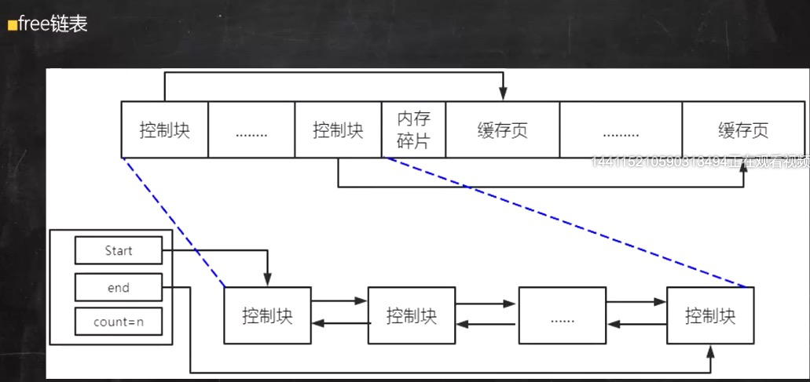
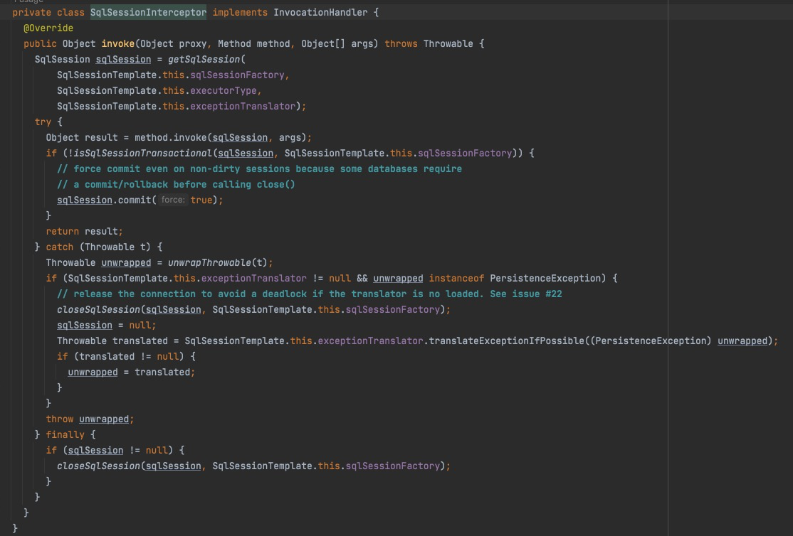

explain 通过执行计划可以模拟优化器执行sql语句，查询sql的课优化空间

set session optimizer_switch='derived_merge=off'; #关闭mysql5.7新特性对衍生表的合并优化
set session optimizer_switch='derived_merge=on'; #关闭mysql5.7新特性对衍生表的合并优化

#### ID列

id列越大执行优先级越高，id相同则从上往下执行，id为NULL最后执行。

#### Select_type列

#simple：简单查询。查询不包含子查询和union
#primary 查询最外层的select
#derived 包含在select中的子查询（不在from子句中）
#subquery 包含在 from 子句中的子查询。MySQL会将结果存放在一个临时表中，也称为派生表（derived的英文含义）
#union 在union中的第二个和随后的select
explain select (select 1 from actor where id = 1) from (select * from film where id = 1) der;

#### table列

显示explain正在执行哪一张表

#### type列

#### 8大查询类型

关联类型或访问类型
**null > system > const > eq_ref > ref > range > index > ALL**
一般来说，得保证查询达到range级别，最好达到ref

##### 1.Null

​	mysql能够在优化阶段分解查询语句，在执行阶段用不着再访问表或索引。

##### 2.const,system

​	mysql能对查询的某部分进行优化并将其转化成一个常量,用于 primary key 或 unique key 的所有列与常数比较时，所以表最多有一个匹配行，读取1次，速度比较快。system是 const的特例，表里只有一条元组匹配时为system
explain select * from (select * from film where id = 1) tmp;

##### 3.eq_ref

​	primary key 或 unique key 索引的所有部分被连接使用 ，最多只会返回一条符合条件的记录。这可能是在 const 之外最好的联接类型了，简单的 select 查询不会出现这种 type。

##### 4.ref

​	相比 eq_ref，不使用唯一索引，而是使用普通索引或者唯一性索引的部分前缀，索引要和某个值相比较，可能会找到多个符合条件的行。

##### 5.range

​	范围扫描通常出现在 in(), between ,> ,<, >= 等操作中。使用一个索引来检索给定范围的行。

##### 6.index

​	扫描全索引就能拿到结果，一般是扫描某个二级索引，这种扫描不会从索引树根节点开始快速查找，而是直接 对二级索引的叶子节点遍历和扫描，速度还是比较慢的，这种查询一般为使用覆盖索引，二级索引一般比较小，所以这种通常比ALL快一些。

##### 7.ALL

​	即全表扫描，扫描你的聚簇索引的所有叶子节点。通常情况下这需要增加索引来进行优化了。

#### possible_keys列

这一列显示查询可能使用哪些索引来查找。 

explain 时可能出现 possible_keys 有列，而 key 显示 NULL 的情况，这种情况是因为表中数据不多，mysql认为索引 

对此查询帮助不大，选择了全表查询。

#### key列

这一列显示mysql实际采用哪个索引来优化对该表的访问。 

如果没有使用索引，则该列是 NULL。如果想强制mysql使用或忽视possible_keys列中的索引，在查询中使用 force 

index、ignore index。 

#### key_len列

这一列显示了mysql在索引里使用的字节数，通过这个值可以算出具体使用了索引中的哪些列。

字符串，char(n)和varchar(n)，5.0.3以后版本中，**n均代表字符数，而不是字节数，**如果是utf-8，一个数字 

或字母占1个字节，一个汉字占3个字节 

char(n)：如果存汉字长度就是 3n 字节 

varchar(n)：如果存汉字则长度是 3n + 2 字节，加的2字节用来存储字符串长度，因为 

varchar是变长字符串 

数值类型

tinyint：1字节 

smallint：2字节 

int：4字节 

bigint：8字节 

时间类型

date：3字节

timestamp：4字节 时间到2039年

datetime：8字节    时间到9999年

如果字段允许为 NULL，需要1字节记录是否为 NULL 

索引最大长度是768字节，当字符串过长时，mysql会做一个类似左前缀索引的处理，将前半部分的字符提取出来做索 

引。

#### ref列

这一列显示了在key列记录的索引中，表查找值所用到的列或常量，常见的有：const（常量），字段名（例：film.id） 

#### rows列

这一列是mysql估计要读取并检测的行数，注意这个不是结果集里的行数。 

#### Extra列

这一列展示的是额外信息。常见的重要值如下： 

using index：使用覆盖索引

Using where：使用 where 语句来处理结果，并且查询的列未被索引覆盖

Using index condition：查询的列不完全被索引覆盖，where条件中是一个前导列的范围； 

Using temporary：mysql需要创建一张临时表来处理查询。出现这种情况一般是要进行优化的，首先是想到用索 

引来优化。 

Using filesort：将用外部排序而不是索引排序，数据较小时从内存排序，否则需要在磁盘完成排序。这种情况下一 

般也是要考虑使用索引来优化的。

Select tables optimized away：使用某些聚合函数（比如 max、min）来访问存在索引的某个字段是


#### mysql组件

##### **连接器**

管理连接与权限校验

客户端如果长时间不发送command到Server端，连接器就会自动将它断开。这个时间是由参数 wait_timeout 控制的，默认值 

是 8 小时。 

 show global variables like "wait_timeout"; 

Lost connection to MySQL server during query

开发当中我们大多数时候用的都是长连接,把连接放在Pool内进行管理，但是长连接有些时候会导致 MySQL 占用内存涨得特别 

快，这是因为 MySQL 在执行过程中临时使用的内存是管理在连接对象里面的。这些资源会在连接断开的时候才释放。所以如 

果长连接累积下来，可能导致内存占用太大，被系统强行杀掉（OOM），从现象看就是 MySQL 异常重启了。 

怎么解决这类问题呢？ 

1、定期断开长连接。使用一段时间，或者程序里面判断执行过一个占用内存的大查询后，断开连接，之后要查询再重连。 

2、如果你用的是 MySQL 5.7 或更新版本，可以在每次执行一个比较大的操作后，通过执行 mysql_reset_connection 来重新初始化连接资 

源。这个过程不需要重连和重新做权限验证，但是会将连接恢复到刚刚创建完时的状态。 

##### 查询缓存（**mysql8.0已经移除了查询缓存功能**）

查询缓存按照理想来说是对于效率提升很好的一个手段，但是由于缓存失效的非常频繁，只要对一个表的更新，那这张表的所有缓存都会被清空

一般也就长时间不被修改的表才用到缓存。

而对于8.0之前有三个参数来决定query_cache_type缓存的使用

0代表关闭查询缓存 1代表开启缓存，2代表只有遇到关键字sql_cache关键字时才缓存

##### 分析器

###### 词法分析

对于一个个空格的sql需要区分出每个单词所代表的含义，比如select id from user 各个区分 作用 select 查询 id 列名 from user 从user表

###### 语法分析

根据词法分析的结果，语法分析器会根据语法规则，判断你输入的这个 SQL 语句 

是否满足 MySQL 语法。 

如果你的语句不对，就会收到“You have an error in your SQL syntax”的错误提醒，比如下面这个语句 from 写成了 

"rom"。

而其中使用到的就是词法分析器

主要分为6个步骤

1.词法分析

2.语法分析

3.语义分析

4.构建执行树

5.生成执行计划

6.计划的执行

SQL语句的分析分为词法分析与语法分析，mysql的词法分析由MySQLLex[MySQL自己实现的]完成，语法分析由Bison生 

成。关于语法树大家如果想要深入研究可以参考这篇wiki文章：https://en.wikipedia.org/wiki/LR_parser。那么除了Bison 

外，Java当中也有开源的词法结构分析工具例如Antlr4，ANTLR从语法生成一个解析器，可以构建和遍历解析树，可以在IDEA 

工具当中安装插件：**antlr v4 grammar plugin。插件使用详见课程** 


##### **优化器**

经过了分析器，MySQL 就知道你要做什么了。在开始执行之前，还要先经过优化器的处理。 

优化器是在表里面有多个索引的时候，决定使用哪个索引；或者在一个语句有多表关联（join）的时候，决定各个表的连接 

顺序。

##### **执行器**

先判断你对于这张表又没有权限。

然后再执行sql判断是否符合条件的数据，最后组成一个结果集返回给客户端。


#### bin-log

binlog是Server层实现的二进制日志,他会记录我们的cud操作。Binlog有以下几个特点： 

1、Binlog在MySQL的Server层实现（引擎共用） 

2、Binlog为逻辑日志,记录的是一条语句的原始逻辑 

3、Binlog不限大小,追加写入,不会覆盖以前的日志 

使用bin-log需要先配置

配置my.cnf

log-bin=地址

格式有三种 statement，row，mixed

binlog-format=row（默认）

show variables like '%log_bin%'; 查看bin‐log是否开启 

flush logs; 会多一个最新的bin‐log日志 

show master status; 查看最后一个bin‐log日志的相关信息 

reset master; 清空所有的bin‐log日志 

statmenent：update 表 set 字段 = 值 where id = 1 记录的就是他 记录的是产生经过的过程 资源损耗小 有可能产生主丛不一致

update 表 set 字段 = 值 where id = 1 or age = 20 limit 1 

优化器就不确定走的是哪个索引了

row ： update 表 set 字段 = 值 where id = 1 记录的就是修改完之后的结果 记录的是产生的结果 数据量大 数据同步量也大 安全性高

trace工具分析sql执行计划


#### 索引使用情况（mysql5.6引入索引下推）

1、联合索引第一个字段用范围不会走索引

2、强制走索引  force index（）

3、覆盖索引优化

4、in和or在表数据量比较大的情况会走索引，在表记录不多的情况下会选择全表扫描

5、like KK% 一般情况都会走索引

​		索引下推（Index Condition Pushdown）可以在索引遍历过程中，对索引中包含的所有字段先做判断，过滤掉不符合条件的记录之后再回表，可 以有效的减少回表次数。

**为什么范围查找Mysql没有用索引下推优化？** 

估计应该是Mysql认为**范围查找过滤的结果集过大**，like KK% 在绝大多数情况来看，过滤后的结果集比较小，所以这里Mysql选择给 like 

KK% 用了索引下推优化，当然这也不是绝对的，有时like KK% 也不一定就会走索引下推。 

order by 与group by

order by根据where和order by字段的情况 再根据联合索引或者其他耳机索引的创建情况决定是否走了index和filesort

排序方式也是决定一部分因素之一

```mysql
explain select * from employees where name in ('LiLei','zhuge')  order by age,position;
```

对于排序来说多个相等条件也是范围查询

1、MySQL支持两种方式的排序filesort和index，Using index是指MySQL扫描索引本身完成排序。index 

效率高，filesort效率低。 

2、order by满足两种情况会使用Using index。 

​       1) order by语句使用索引最左前列。 

​       2) 使用where子句与order by子句条件列组合满足索引最左前列。 

3、尽量在索引列上完成排序，遵循索引建立（索引创建的顺序）时的最左前缀法则。 

4、如果order by的条件不在索引列上，就会产生Using filesort。 

5、能用覆盖索引尽量用覆盖索引 

6、group by与order by很类似，其实质是先排序后分组，遵照索引创建顺序的最左前缀法则。对于group 

by的优化如果不需要排序的可以加上**order by null禁止排序**。注意，where高于having，能写在where中 

的限定条件就不要去having限定了。

#### **filesort文件排序方式**

##### 单路排序：

是一次性取出满足条件行的所有字段，然后在sort buffer中进行排序；用trace工具可以看到sort_mode信息里显示< sort_key, additional_fields >或者< sort_key, packed_additional_fields >

##### 双路排序（又叫**回表**排序模式）：

是首先根据相应的条件取出相应的**排序字段**和**可以直接定位行数据的行 ID**，然后在 sort buffer 中进行排序，排序完后需要再次取回其它需要的字段；用trace工具可以看到sort_mode信息里显示< sort_key, rowid >

mysql通过比较系统变量 max_length_for_sort_data(默认4096字节，mysql 8.0.27)的大小和需要查询的字段总大小判断使用哪种排序方式

如果 字段的总长度小于max_length_for_sort_data ，那么使用 单路排序模式；

如果 字段的总长度大于max_length_for_sort_data ，那么使用 双路排序模式


#### 索引原则

1、代码先行，索引后上

2、联合索引尽量覆盖条件

3、不要在小基数字段上建立索引

4、长字符串我们可以采用前缀索引

5、where与order by冲突时优先where

6、基于慢sql查询做优化


#### sql 慢查询

MySQL的慢查询，全名是**慢查询日志**，是MySQL提供的一种日志记录，用来记录在MySQL中**响应时间超过阀值**的语句。

long_query_time（默认是10秒）


设置完成后需要重启数据库 设置方式**https://blog.csdn.net/qq_40884473/article/details/89455740**

`set global slow_query_log=1`开启了慢查询日志只对当前数据库生效，MySQL重启后则会失效。

关于运行时间**正好等于**`long_query_time`的情况，并不会被记录下来。

##### log-queries-not-using-indexes

该系统变量指定**未使用索引的查询**也被记录到慢查询日志中（可选项）。

##### log_slow_admin_statements

这个系统变量表示，是否将慢管理语句例如`ANALYZE TABLE`和`ALTER TABLE`等记入慢查询日志。

##### Slow_queries

如果你想查询有多少条慢查询记录，可以使用`Slow_queries`系统变量。

##### mysqldumpslow工具

在生产环境中，如果要手工分析日志，查找、分析SQL，显然是个体力活。

MySQL提供了日志分析工具`mysqldumpslow`

#### **mysql的表关联常见有两种算法**

#####  Nested-Loop Join 算法（嵌套循环连接 Nested—loop join（NLJ）算法 磁盘扫描）

当使用left join时，左表是驱动表，右表是被驱动表，当使用right join时，右表时驱动表，左表是被驱动表，当使用join时，mysql会选择数据量比较小的表作为驱动表，大表作为被驱动表。

使用了 NLJ算法。一般 join 语句中，如果执行计划 Extra 中未出现 **Using join buffer** 则表示使用的 join 算法是 NLJ。

**上面sql的大致流程如下：**

1. 从表 t2 中读取一行数据（如果t2表有查询过滤条件的，用先用条件过滤完，再从过滤结果里取出一行数据）；
2. 从第 1 步的数据中，取出关联字段 a，到表 t1 中查找；
3. 取出表 t1 中满足条件的行，跟 t2 中获取到的结果合并，作为结果返回给客户端；
4. 重复上面 3 步。

整个过程会读取 t2 表的所有数据(**扫描100行**)，然后遍历这每行数据中字段 a 的值，根据 t2 表中 a 的值索引扫描 t1 表中的对应行(**扫描100次 t1 表的索引，1次扫描可以认为最终只扫描 t1 表一行完整数据，也就是总共 t1 表也扫描了100行**)。因此整个过程扫描了 **200 行**。

如果被驱动表的关联字段没索引，**使用NLJ算法性能会比较低(下面有详细解释)**，mysql会选择Block Nested-Loop Join算法。


 


##### Block Nested-Loop Join 算法（基于块的嵌套循环连接Block Nested-loop join（BNL）算法 基于sort buffer内存计算）

把**驱动表**的数据读入到 join_buffer 中，然后扫描**被驱动表**，把**被驱动表**每一行取出来跟 join_buffer 中的数据做对比。

Extra 中 的Using join buffer (Block Nested Loop)说明该关联查询使用的是 BNL 算法。

**上面sql的大致流程如下：**

1. 把 t2 的所有数据放入到 **join_buffer** 中
2. 把表 t1 中每一行取出来，跟 join_buffer 中的数据做对比
3. 返回满足 join 条件的数据

整个过程对表 t1 和 t2 都做了一次全表扫描，因此扫描的总行数为10000(表 t1 的数据总量) + 100(表 t2 的数据总量) = **10100**。并且 join_buffer 里的数据是无序的，因此对表 t1 中的每一行，都要做 100 次判断，所以内存中的判断次数是 100 * 10000= **100 万次**。

这个例子里表 t2 才 100 行，要是表 t2 是一个大表，join_buffer 放不下怎么办呢？·

join_buffer 的大小是由参数 join_buffer_size 设定的，默认值是 262144。如果放不下表 t2 的所有数据话，策略很简单，就是**分段放**。

比如 t2 表有1000行记录， join_buffer 一次只能放800行数据，那么执行过程就是先往 join_buffer 里放800行记录，然后从 t1 表里取数据跟 join_buffer 中数据对比得到部分结果，然后清空  join_buffer ，再放入 t2 表剩余200行记录，再次从 t1 表里取数据跟 join_buffer 中数据对比。所以就多扫了一次 t1 表。


#### 对于小表定义的明确

在决定哪个表做驱动表的时候，应该是两个表按照各自的条件过滤，**过滤完成之后**，计算参与 join 的各个字段的总数据量，**数据量小的那个表，就是“小表”**，应该作为驱动表。


#### in和exsits优化

原则：**小表驱动大表**，即小的数据集驱动大的数据集

**in：**当B表的数据集小于A表的数据集时，in优于exists 

**exists：**当A表的数据集小于B表的数据集时，exists优于in

　　将主查询A的数据，放到子查询B中做条件验证，根据验证结果（true或false）来决定主查询的数据是否保留


#### count(\*)查询优化

**四个sql的执行计划一样，说明这四个sql执行效率应该差不多**

**字段有索引：count(\*)≈count(1)>count(字段)>count(主键 id)    //字段有索引，count(字段)统计走二级索引，二级索引存储数据比主键索引少，所以count(字段)>count(主键 id)** 

**字段无索引：count(\*)≈count(1)>count(主键 id)>count(字段)    //字段没有索引count(字段)统计走不了索引，count(主键 id)还可以走主键索引，所以count(主键 id)>count(字段)**

count(1)跟count(字段)执行过程类似，不过count(1)不需要取出字段统计，就用常量1做统计，count(字段)还需要取出字段，所以理论上count(1)比count(字段)会快一点。

count(**) 是例外，mysql并不会把全部字段取出来，而是专门做了优化，不取值，按行累加，效率很高，所以不需要用count(列名)或count(常量)来替代 count(*)。

为什么对于count(id)，mysql最终选择辅助索引而不是主键聚集索引？因为二级索引相对主键索引存储数据更少，检索性能应该更高，mysql内部做了点优化(应该是在5.7版本才优化)。


#### 事务

事务是由一组SQL语句组成的逻辑处理单元,事务具有以下4个属性,通常简称为事务的ACID属性。

- 原子性(Atomicity) ：事务是一个原子操作单元,其对数据的修改,要么全都执行,要么全都不执行。

- 一致性(Consistent) ：在事务开始和完成时,数据都必须保持一致状态。这意味着所有相关的数据规则都必须应用于事务的修改,以保持数据的完整性。

- 隔离性(Isolation) ：数据库系统提供一定的隔离机制,保证事务在不受外部并发操作影响的“独立”环境执行。这意味着事务处理过程中的中间状态对外部是不可见的,反之亦然。

- 持久性(Durable) ：事务完成之后,它对于数据的修改是永久性的,即使出现系统故障也能够保持。

  

  并发事务处理带来的问题

  ##### 更新丢失（Lost update）或脏写

  ​	当两个或多个事务选择同一行，然后基于最初选定的值更新该行时，由于每个事务都不知道其他事务的存在，就会发生丢失更新问题–**最后的更新覆盖了由其他事务所做的更新**。

  ##### 脏读（Dirty Reads）

  ​	一个事务正在对一条记录做修改，在这个事务完成并提交前，这条记录的数据就处于不一致的状态；这时，另一个事务也来读取同一条记录，如果不加控制，第二个事务读取了这些“脏”数据，并据此作进一步的处理，就会产生未提交的数据依赖关系。这种现象被形象的叫做“脏读”。

  　　一句话：**事务A读取到了事务B已经修改但尚未提交的数据**，还在这个数据基础上做了操作。此时，如果B事务回滚，A读取的数据无效，不符合一致性要求。

  ##### 不可重读（Non-Repeatable Reads） 

  　　一个事务在读取某些数据后的某个时间，再次读取以前读过的数据，却发现其读出的数据已经发生了改变、或某些记录已经被删除了！这种现象就叫做“不可重复读”。

  　　一句话：**事务A内部的相同查询语句在不同时刻读出的结果不一致，不符合隔离性**

  ##### 幻读（Phantom Reads）

  　　一个事务按相同的查询条件重新读取以前检索过的数据，却发现其他事务插入了满足其查询条件的新数据，这种现象就称为“幻读”。

  　　一句话：**事务A读取到了事务B提交的新增数据，不符合隔离性**

  

  数据库的事务隔离越严格,并发副作用越小,但付出的代价也就越大,因为事务隔离实质上就是使事务在一定程度上“串行化”进行,这显然与“并发”是矛盾的。

  同时,不同的应用对读一致性和事务隔离程度的要求也是不同的,比如许多应用对“不可重复读"和“幻读”并不敏感,可能更关心数据并发访问的能力。

  **常看当前数据库的事务隔离级别: show variables like 'tx_isolation';**

  **设置事务隔离级别：****set tx_isolation='REPEATABLE-READ';**

  **Mysql默认的事务隔离级别是可重复读，用Spring开发程序时，如果不设置隔离级别默认用Mysql设置的隔离级别，如果Spring设置了就用已经设置的隔离级别**

  ##### **锁详解**

  锁是计算机协调多个进程货线程并发访问某一资源的机制。

  ##### **锁分类** 

  - 从性能上分为乐观锁(用版本对比来实现)和悲观锁

  - 从对数据库操作的类型分，分为读锁和写锁(都属于悲观锁)

    读锁（共享锁，S锁(**S**hared)）：针对同一份数据，多个读操作可以同时进行而不会互相影响

    写锁（排它锁，X锁(Exclusive)）：当前写操作没有完成前，它会阻断其他写锁和读锁

  - 从对数据操作的粒度分，分为表锁和行锁

  

  **表锁**

  每次操作锁住整张表。开销小，加锁快；不会出现死锁；锁定粒度大，发生锁冲突的概率最高，并发度最低；一般用在整表数据迁移的场景。

  lock table 表名称 read（write），表名称2 read（write）

  show open tables；

  unlock tables
  **案例分析（加读锁）**

  lock table mylock read

  当前session和其他session都可以读该表

  当前session中插入或者更新锁定的表都会报错，其他session插入或更新则会等待

  **案例分析(加写锁）**

  lock table mylock write；

  当前session对该表的增删改查都没有问题，其他session对该表的所有操作被阻塞

  

  ##### **行锁**

  每次操作锁住一行数据。开销大，加锁慢；会出现死锁；锁定粒度最小，发生锁冲突的概率最低，并发度最高。

  InnoDB与MYISAM的最大不同有两点：

  - **InnoDB支持事务（TRANSACTION）**
  - **InnoDB支持行级锁**

  **总结：**

MyISAM在执行查询语句SELECT前，会自动给涉及的所有表加读锁,在执行update、insert、delete操作会自动给涉及的表加写锁。

InnoDB在执行查询语句SELECT时(非串行隔离级别)，不会加锁。但是update、insert、delete操作会加行锁。

简而言之，就是**读锁会阻塞写，但是不会阻塞读。而写锁则会把读和写都阻塞**。


**间隙锁(Gap Lock) 间隙锁是在可重复读隔离级别下才会生效。**

间隙锁，锁的就是两个值之间的空隙。Mysql默认级别是repeatable-read，有办法解决幻读问题吗？间隙锁在某些情况下可以解决幻读问题。


**临键锁(Next-key Locks)**

Next-Key Locks是行锁与间隙锁的组合。像上面那个例子里的这个(3,20]的整个区间可以叫做临键锁。


**无索引行锁会升级为表锁(RR级别会升级为表锁，RC级别不会升级为表锁)**

锁主要是加在索引上，如果对非索引字段更新，行锁可能会变表锁

session1 执行：update account set balance = 800 where name = 'lilei';

session2 对该表任一行操作都会阻塞住

**InnoDB的行锁是针对索引加的锁，不是针对记录加的锁。并且该索引不能失效，否则都会从行锁升级为表锁**。

锁定某一行还可以用lock in share mode(共享锁) 和for update(排它锁)，例如：select * from test_innodb_lock where a = 2 for update; 这样其他session只能读这行数据，修改则会被阻塞，直到锁定行的session提交


**死锁**

**set tx_isolation='**repeatable-read**';**

Session_1执行：select * from account where id=1 for update;

Session_2执行：select * from account where id=2 for update;

Session_1执行：select * from account where id=2 for update;

Session_2执行：select * from account where id=1 for update;

查看近期死锁日志信息：show engine innodb status\G; 

大多数情况mysql可以自动检测死锁并回滚产生死锁的那个事务，但是有些情况mysql没法自动检测死锁


**MVCC多版本并发控制机制**

Mysql在可重复读隔离级别下如何保证事务较高的隔离性，我们上节课给大家演示过，同样的sql查询语句在一个事务里多次执行查询结果相同，就算其它事务对数据有修改也不会影响当前事务sql语句的查询结果。

这个隔离性就是靠MVCC(**Multi-Version Concurrency Control**)机制来保证的，对一行数据的读和写两个操作默认是不会通过加锁互斥来保证隔离性，避免了频繁加锁互斥，而在串行化隔离级别为了保证较高的隔离性是通过将所有操作加锁互斥来实现的。

Mysql在读已提交和可重复读隔离级别下都实现了MVCC机制。


**undo日志版本链与read view机制详解**

undo日志版本链是指一行数据被多个事务依次修改过后，在每个事务修改完后，Mysql会保留修改前的数据undo回滚日志，并且用两个隐藏字段trx_id和roll_pointer把这些undo日志串联起来形成一个历史记录版本链(见下图，需参考视频里的例子理解)

​    


在**可重复读隔离级别**，当事务开启，执行任何（select）查询sql时会生成当前事务的**一致性视图read-view，**该视图在事务结束之前都不会变化(**如果是读已提交隔离级别在每次执行查询sql时都会重新生成**)，这个视图由执行查询时所有**未提交事务id数组**（**数组里最小的事务id为min_id**）和**已创建的最大事务id（max_id）**组成，事务里的任何sql查询结果需要从对应版本链里的最新数据开始逐条跟read-view做比对从而得到最终的快照结果。

**版本链比对规则：**

1. 如果 row 的 trx_id 落在绿色部分( trx_id<min_id),表示这个版本是已提交的事务生成的，这个数据是可见的。

2. 如果 row 的 trx_id 落在红色部分( trx_id>max_id )，表示这个版本是由将来启动的事务生成的，是不可见的(若 row 的 trx_id 就是当前自己的事务是可见的）；

3. 如果 row 的 trx_id 落在黄色部分(min_id <=trx_id<= max_id)，那就包括两种情况

  a. 若 row 的 trx_id 在视图数组中，表示这个版本是由还没提交的事务生成的，不可见(若 row 的 trx_id 就是当前自己的事务是可见的)；

  b. 若 row 的 trx_id 不在视图数组中，表示这个版本是已经提交了的事务生成的，可见。

对于删除的情况可以认为是update的特殊情况，会将版本链上最新的数据复制一份，然后将trx_id修改成删除操作的trx_id，同时在该条记录的头信息（record header）里的（deleted_flag）标记位写上true，来表示当前记录已经被删除，在查询时按照上面的规则查到对应的记录如果delete_flag标记位为true，意味着记录已被删除，则不返回数据。

**注意：**begin/start transaction 命令并不是一个事务的起点，在执行到它们之后的第一个修改操作InnoDB表的语句，事务才真正启动，才会向mysql申请事务id，mysql内部是严格按照事务的启动顺序来分配事务id的。

**总结：**

MVCC机制的实现就是通过read-view机制与undo版本链比对机制，使得不同的事务会根据数据版本链对比规则读取同一条数据在版本链上的不同版本数据。

#### **Innodb引擎SQL执行的BufferPool缓存机制**

​    

**为什么Mysql不能直接更新磁盘上的数据而且设置这么一套复杂的机制来执行SQL了？**

因为来一个请求就直接对磁盘文件进行随机读写，然后更新磁盘文件里的数据性能可能相当差。

因为磁盘随机读写的性能是非常差的，所以直接更新磁盘文件是不能让数据库抗住很高并发的。

Mysql这套机制看起来复杂，但它可以保证每个更新请求都是**更新内存BufferPool**，然后**顺序写日志文件**，同时还能保证各种异常情况下的数据一致性。

更新内存的性能是极高的，然后顺序写磁盘上的日志文件的性能也是非常高的，要远高于随机读写磁盘文件。

正是通过这套机制，才能让我们的MySQL数据库在较高配置的机器上每秒可以抗下几干甚至上万的读写请求。


#### 执行一个SQL的步骤：

undo日志文件、redo日志文件（Innodb引擎持有）、binlog（server层，binlog主要用来恢复数据库磁盘里的数据）

redo日志文件：如果事务提交成功，buffer pool里的数据还没来得及写入磁盘，此时系统宕机了，可以用redo日志里的数据恢复buffer pool里的缓存数据

1.加载缓存数据加载id为1的记录所在的整页数据（16kb）

2.写入更新数据的旧值便于回滚（如果事务提交失败要回滚数据，可以用undo日志里的数据恢复buffer pool里的缓存数据）

3.更新buffer poll 缓存池的数据

4.写redo日志

5.准备提交事务 redo日志写入磁盘

6.准备提交事务 binlog日志吸入磁盘

7.写入commit标记到redo日志文件里，提交事务完成，该标记为了保证事务提交后redo于binlog数据一致

8.随机写入磁盘，以page为单位写入，这步做完磁盘里的数据就是最新的了


mysql主从

1.数据安全

2.读写分离 缓解压力

3.高可用 故障转移


#### 索引失效

1.mysql在使用不等于**（！=，<>，not in **，**not exists,（is null,is not null）一般不走索引 ）** 的时候无法使用索引会导致全表扫描 

2.不在索引列上做任何操作（计算、函数、（自动or手动）类型转换），会导致索引失效而转向全表扫描

EXPLAIN SELECT * FROM employees WHERE **left(name,3)** = 'LiLei'; 

3.存储引擎不能使用索引中范围条件右边的列

4.**<** **小于、** **>** **大于、** **<=**、**>=** 这些，mysql内部优化器会根据检索比例、表大小等多个因素整体评估是否使用索引

5.**字符串不加单引号索引失效**

6.**少用or或in，用它查询时，mysql不一定使用索引，mysql内部优化器会根据检索比例、表大小等多个因素整体评** 

**估是否使用索引，详见范围查询优化**

## 面试题

### 线上怎么修改列的数据类型的？

方式一:使用mysql5.6 提供的在线修改功能。

ALTER TABLE table_name change old_field_name new_field_name field_type;

那么，在mysql5.5这个版本之前，这是通过临时表拷贝的方式实现的。执行ALTER语句后，会**新建**一个带有新结构的**临时表**，将原表数据全部拷贝到临时表，然后Rename，完成创建操作。这个方式过程中，原表是可读的，不可写。


## 数据库设计范式

第一范式

每一列属性都是不可在分的属性值，确保每一列的原子性

第二范式

有一个主键唯一标识

第三范式

要求一个数据库表中不包含已在其他表中包含的非主关键字信息，即数据不能存在传递关系，即每个属性都跟主键有直接关系而不是间接关系


范式化和反范式话

1.性能提升-冗余，缓存和汇总

2.性能提升-计数器表

3.反范式设计-分库分表中的查询


回表优化MRR

只为用于搜索，排序或分组的列创建索引

三星索引

1.索引将相关的记录放到一起则获得一星 离得越近比如在同一个页，扫瞄的范围设置的很窄

2.如果索引中的数据顺序和查找的排序顺序一致则获得二星（排序星）

3.如果索引种的列包含了查询中需要的全部列则获得三星（宽索引星）可以理解为覆盖索引


磁盘读取512字节 有的会是4kb

1.寻道时间 要把磁头移动到某一个确认的硬盘之上 最长

2.旋转时间 寻找匹配的数据

3.传输时间

寻道时间+旋转时间+传输时间

一般是9到10ms左右


磁盘4k 预读 往往是整数位

成本

I/O成本 1.0

CPU成本 0.2

show table status 表名 表估算值

单表查询的成本

基于成本的优化步骤

1、根据搜索条件，找出所有可能使用的索引

2、计算全表扫描的代价

3、计算使用不同索引执行查询的代价

4、对比各种执行方案的代价，找出成本最低的那一个


预读和局部性原理：

当一个数据被用到时，其附近的数据也通常会马上被使用。

程序运行期间所需要的数据通常比较集中。

in

```
# index dive
show variables like '%dive%';
200
大于两个估算
小于实际计算
```

explain format=json <SQL语句>  /G


索引合并

MySQL在一般情况下执行一个查询时最多只会用到单个二级索引，但存在有特殊情况，在这样特殊情况下也可能在一个查询中使用到多个二级索引，MySQL种这种使用到多个索引来完成一次查询的执行方法称之为：索引合并/index merge

1. intersection合并 select * from order_exp WHERE order_no = 'a' AND expire_time = 'b'

   等值匹配 select * from order_exp WHERE order_no>'a' AND insert_time = 'a' AND order_status = 'b' AND expire_time = 'c'

   主键列可以是范围匹配 select * from order_exp WHERE id > 100 AND insert_time = 'a'

2. Union合并 select * from order_exp WHERE insert_time = 'a' AND order_status = 'b' AND expire_time = 'c' OR (order_no = 'a' AND expire_time = 'b')

3. Sort—Union合并 select * from order_exp WHERE order_no < 'a' OR expire_time > 'z'


## MySQL查询优化规则详解


物化表是指在内存或者磁盘建立一张临时表以查出的列为基础，为临时表建立索引，去掉重复数据后，和外层数据进行关联


File Header

Page Header

Infimum + Supremum

User Records

Free Space

Page Directory

File Tailer


独立表空间结构

区 （64个页）

段（256个区）用两个段来区分是叶子结点 还是非叶子结点 页节点段 非页节点段

## Innodb三个特性

Adaptive Hash Index

Buffer pool

Double write buffer

预读不是特性


mysql官方推荐的设置为80% 加上其他一些使用额外还有10% 比较危险

show engine innodb status;查看innodb使用情况 hit rate命中率

buffer pool 如果再没有专人管理和实时监控的情况下 设置为内存的60%

如果有专人管理和实时监控的情况下 设置为内存的75% 并持续根据业务和数据情况进行增大和减小

以上都是推荐值

free链表



每一个空白页都有一个控制块

被修改过的页又叫做脏页

flush链表 被修改过的页都生成一个链表 和free链表差不多

LRU（Least recently used）链表的管理

热区young 冷 old

热区域63% 37%

刷新脏页到磁盘

BUF_FLUSH_LRU

BUF_FLUSH_LIST 异步

BUF_FLUSH_SINGLE_PAGE

事务原子性是通过undo日志来实现的 

持久性 redo  wal机制

隔离性读写锁 mvcc

acid

c是目的 aid是手段

redo

1.logbuffer快满的时候

2.事务提交的时候

3.专门线程刷盘

4.系统推出的时候

ib_logfile0

ib_logfile1

覆盖写

innodb_flush_log_at_trx_commit(0,1,2)

0.事务提交的时候不立即同步redo日志 由后台线程同步

1.默认值 commit的时候强制刷新到磁盘

2.当事务commit时候，将redo日志写到操作系统的缓冲区，并不保证将日志刷新到磁盘之上

redo log 那个数据页在某个位置进行了修改

binlog逻辑日志 sql的原始逻辑 记录数据变化的业务逻辑 binlog无法判断哪些数据已经落盘 哪些没有落盘的

redo和binlog通过2pc来保证数据一致性


## mybatis的一级缓存失效 

**会现在自己的threadlocal里面找sqlsession 如果没有创建一个新的 创建完成之后在设置到threadloca变量里面，如果没有开启事务就会一级缓存失效。**

```java
@Override
public <T> T selectOne(String statement, Object parameter) {
  return this.sqlSessionProxy.selectOne(statement, parameter);
}
```

```java
public SqlSessionTemplate(SqlSessionFactory sqlSessionFactory, ExecutorType executorType,
    PersistenceExceptionTranslator exceptionTranslator) {

  notNull(sqlSessionFactory, "Property 'sqlSessionFactory' is required");
  notNull(executorType, "Property 'executorType' is required");

  this.sqlSessionFactory = sqlSessionFactory;
  this.executorType = executorType;
  this.exceptionTranslator = exceptionTranslator;
  this.sqlSessionProxy = (SqlSession) newProxyInstance(
      SqlSessionFactory.class.getClassLoader(),
      new Class[] { SqlSession.class },
      new SqlSessionInterceptor());
}
```




## jdbc四大核心对象

Connection

DriverManager

PreparedStatement

ResultSet


maven-source-plugin maven插件 生成jar包的同时 生成source包


```java
XMLConfigBuilder.java //解析xml文件

XmlMapperBuilder.java //解析mapper文件
```

