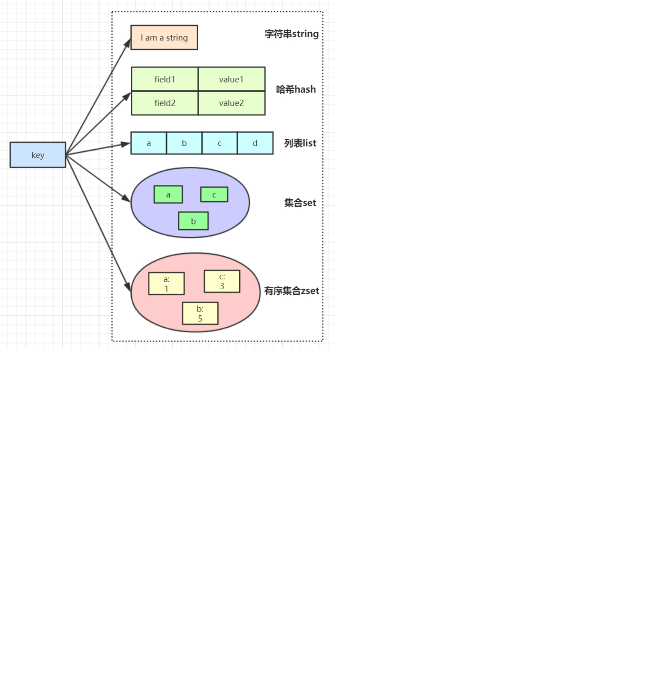
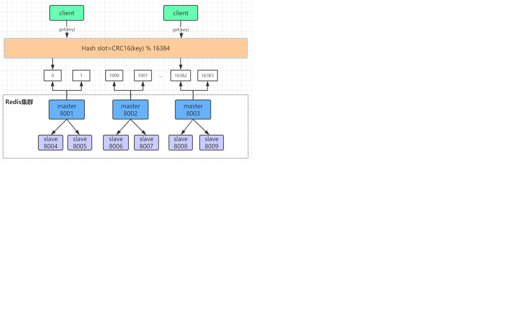
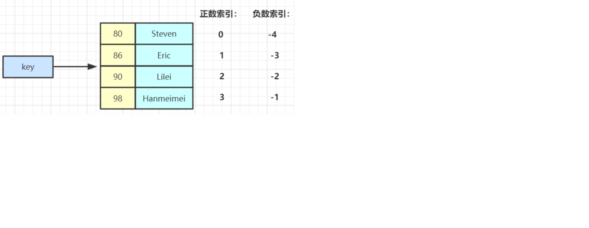
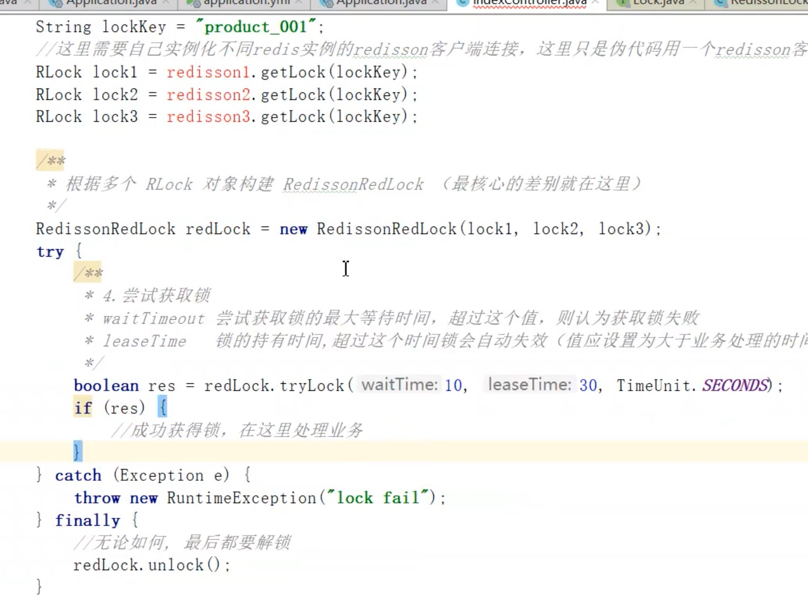
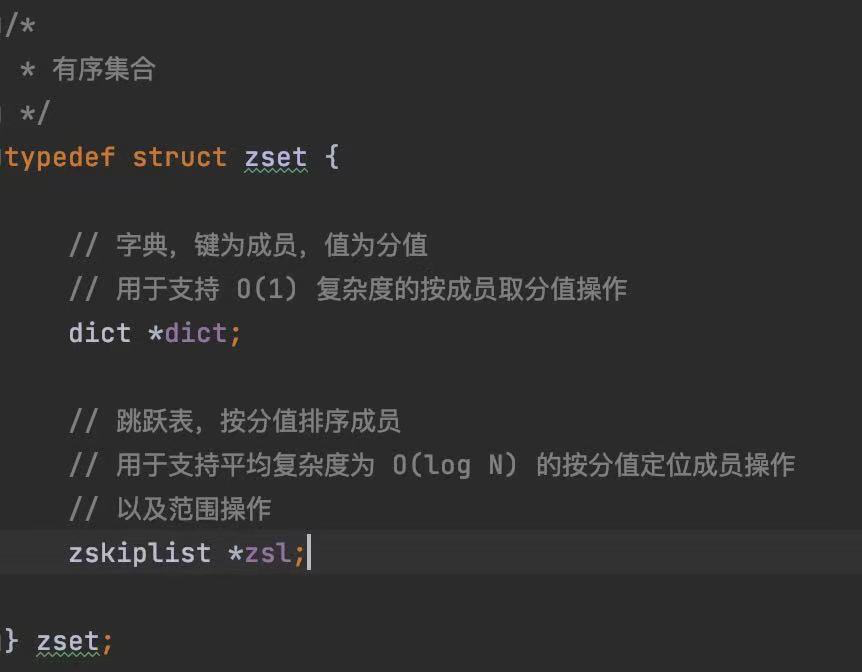

Redis: SDS,simple dynamic string

1.二进制安全的数据结构
2.提拱了内存与分配机制，避免了频繁的内存分配
3.兼容C语言函数库

C: char data[] ="guojia\0" 读取\0就结尾了

sdc：
 free：9
 len：6
 char buf[]="guojia" -> “guojia123”
 addlen:3
 (len+addlen) * 2 = 18


## Redis的五种数据结构



### String

字符串常用操作
SET  key  value 			//存入字符串键值对
MSET  key  value [key value ...] 	//批量存储字符串键值对
SETNX  key  value 		//存入一个不存在的字符串键值对
GET  key 			//获取一个字符串键值
MGET  key  [key ...]	 	//批量获取字符串键值
DEL  key  [key ...] 		//删除一个键
EXPIRE  key  seconds 		//设置一个键的过期时间(秒)

原子加减
INCR  key 			//将key中储存的数字值加1
DECR  key 			//将key中储存的数字值减1
INCRBY  key  increment 		//将key所储存的值加上increment
DECRBY  key  decrement 	//将key所储存的值减去decrement

单值缓存
SET  key  value 	
GET  key 	

对象缓存
1) SET  user:1  value(json格式数据)
2) MSET  user:1:name  zhuge   user:1:balance  1888
    MGET  user:1:name   user:1:balance 
    分布式锁
    SETNX  product:10001  true 		//返回1代表获取锁成功
    SETNX  product:10001  true 		//返回0代表获取锁失败
    。。。执行业务操作
    DEL  product:10001			//执行完业务释放锁
    SET product:10001 true  ex  10  nx	//防止程序意外终止导致死锁

计数器
INCR article:readcount:{文章id}  	
GET article:readcount:{文章id} 

Web集群session共享
spring session + redis实现session共享

分布式系统全局序列号	
INCRBY  orderId  1000		//redis批量生成序列号提升性能


### Hash

Hash常用操作
HSET  key  field  value 			//存储一个哈希表key的键值
HSETNX  key  field  value 		//存储一个不存在的哈希表key的键值
HMSET  key  field  value [field value ...] 	//在一个哈希表key中存储多个键值对
HGET  key  field 				//获取哈希表key对应的field键值
HMGET  key  field  [field ...] 		//批量获取哈希表key中多个field键值
HDEL  key  field  [field ...] 		//删除哈希表key中的field键值
HLEN  key				//返回哈希表key中field的数量
HGETALL  key				//返回哈希表key中所有的键值

HINCRBY  key  field  increment 		//为哈希表key中field键的值加上增量increment

对象缓存
HMSET  user  {userId}:name  zhuge  {userId}:balance  1888
HMSET  user  1:name  zhuge  1:balance  1888
HMGET  user  1:name  1:balance  


电商购物车
1）以用户id为key
2）商品id为field
3）商品数量为value

购物车操作
添加商品hset cart:1001 10088 1
增加数量hincrby cart:1001 10088 1
商品总数hlen cart:1001
删除商品hdel cart:1001 10088
获取购物车所有商品hgetall cart:1001

优点
1）同类数据归类整合储存，方便数据管理
2）相比string操作消耗内存与cpu更小
3）相比string储存更节省空间

缺点
过期功能不能使用在field上，只能用在key上
Redis集群架构下不适合大规模使用




### List

List常用操作
LPUSH  key  value [value ...] 		//将一个或多个值value插入到key列表的表头(最左边)
RPUSH  key  value [value ...]	 	//将一个或多个值value插入到key列表的表尾(最右边)
LPOP  key			//移除并返回key列表的头元素
RPOP  key			//移除并返回key列表的尾元素
LRANGE  key  start  stop		//返回列表key中指定区间内的元素，区间以偏移量start和stop指定

BLPOP  key  [key ...]  timeout	//从key列表表头弹出一个元素，若列表中没有元素，阻塞等待					timeout秒,如果timeout=0,一直阻塞等待
BRPOP  key  [key ...]  timeout 	//从key列表表尾弹出一个元素，若列表中没有元素，阻塞等待					timeout秒,如果timeout=0,一直阻塞等待

#### 常用数据结构

Stack(栈) = LPUSH + LPOP
Queue(队列）= LPUSH + RPOP
Blocking MQ(阻塞队列）= LPUSH + BRPOP


##### 微博消息和微信公号消息

诸葛老师关注了MacTalk，备胎说车等大V
1）MacTalk发微博，消息ID为10018
LPUSH  msg:{诸葛老师-ID}  10018
2）备胎说车发微博，消息ID为10086
LPUSH  msg:{诸葛老师-ID} 10086
3）查看最新微博消息
LRANGE  msg:{诸葛老师-ID}  0  4


### Set

SADD  key  member  [member ...]			//往集合key中存入元素，元素存在则忽略，
							若key不存在则新建
SREM  key  member  [member ...]			//从集合key中删除元素
SMEMBERS  key					//获取集合key中所有元素
SCARD  key					//获取集合key的元素个数
SISMEMBER  key  member			//判断member元素是否存在于集合key中
SRANDMEMBER  key  [count]			//从集合key中选出count个元素，元素不从key中删除
SPOP  key  [count]				//从集合key中选出count个元素，元素从key中删除

Set运算操作
SINTER  key  [key ...] 				//交集运算
SINTERSTORE  destination  key  [key ..]		//将交集结果存入新集合destination中
SUNION  key  [key ..] 				//并集运算
SUNIONSTORE  destination  key  [key ...]		//将并集结果存入新集合destination中
SDIFF  key  [key ...] 				//差集运算
SDIFFSTORE  destination  key  [key ...]		//将差集结果存入新集合destination中

集合操作实现微博微信关注模型

关住的人

我关注的人也关注他（共同关注的人）

集合操作实现电商商品筛选

选择cpu 还选择brand（品牌）


### ZSet

ZSet常用操作
ZADD key score member [[score member]…]	//往有序集合key中加入带分值元素
ZREM key member [member …]		//从有序集合key中删除元素
ZSCORE key member 			//返回有序集合key中元素member的分值
ZINCRBY key increment member		//为有序集合key中元素member的分值加上increment 
ZCARD key				//返回有序集合key中元素个数
ZRANGE key start stop [WITHSCORES]	//正序获取有序集合key从start下标到stop下标的元素
ZREVRANGE key start stop [WITHSCORES]	//倒序获取有序集合key从start下标到stop下标的元素

Zset集合操作
ZUNIONSTORE destkey numkeys key [key ...] 	//并集计算
ZINTERSTORE destkey numkeys key [key …]	//交集计算



Zset集合操作实现排行榜
1）点击新闻
ZINCRBY  hotNews:20190819  1  守护香港
2）展示当日排行前十
ZREVRANGE  hotNews:20190819  0  9  WITHSCORES 
3）七日搜索榜单计算
ZUNIONSTORE  hotNews:20190813-20190819  7 
hotNews:20190813  hotNews:20190814... hotNews:20190819
4）展示七日排行前十
ZREVRANGE hotNews:20190813-20190819  0  9  WITHSCORES


遵循空字符结尾这一惯例的好处是，SDS可以直接重用一部分C字符串函数库里面的函数。

## Redis锁


**redisSesson故障转移redis的线程1在master加了锁，转移到slave的时候数据没有同步，线程2在新的master节点上又加锁成功了。redlock超过半数redis节点加锁成功才算加锁成功**



Redlock问题：

1.性能

2.数据回滚问题 网络抖动

3.redis设计之初就是为了高并发而准备的，一秒QPS可以达到10万，设计理念为背


高性能分布式锁实现：

利用分段式方法，concurrenthashmap方式


**集群模式下一个节点配置的主没有从 宕机了怎么办 默认无不可用**


## ZskipList

层（level）：每次创建一个新跳跃表节点的时候，程序都根据**幂次定律**（power law，越大的数出现的概率越小）随机生成一个介于1和32之间的值作为level数组的大小，这个大小就是高度。

跨度（span）：是用来计算排位（rank）的：在查找某个节点的过程中，将沿途访问过的所有层的跨度累记起来，得到的结果就是目标节点在跳跃表中的排位。

```C++
/* ZSETs use a specialized version of Skiplists */
typedef struct zskiplistNode {
    sds ele;
    //按照分值从小到大排列
    double score;
    //指向当前节点的前一个节点
    struct zskiplistNode *backward;
    struct zskiplistLevel {
        //前进指针，用于访问位于表为方向的其他节点
        struct zskiplistNode *forward;
        //跨度，记录了前进指针所指向节点和当前节点的距离
        unsigned long span;
    } level[];
} zskiplistNode;

typedef struct zskiplist {
    struct zskiplistNode *header, *tail;
    //记录跳跃表的长度，也即是，跳跃表当前包含节点的数量（表头节点不计算在内）
    unsigned long length;
    //记录目前跳跃表里面，层数最大的那个节点的层数（表头节点的层数不计算在内）
    int level;
} zskiplist;

typedef struct zset {
    dict *dict;
    zskiplist *zsl;
} zset;
```




### 使用SDS字符串的好处

1. 常数复杂度获取字符串长度
2. 杜绝缓存区溢出（C字符串不记录自身的长度，如果把一个字符串添加到另一个字符串，第一个字符串空间大小不足以支撑两个字符串的话就会出现溢出）
3. 减少修改字符串时带来的内存重分配次数
4. 通过未使用空间，SDS实现了**空间预分配**和**惰性空间**释放两种优化策略
5. 二进制安全
6. 兼容部分C字符串函数

#### 空间预分配

SDS修改之后长度

小于1MB free为len属性同样大小的未使用空间

大于1MB free为固定1MB

#### 惰性空间释放

SDS避免了缩短字符串时所需的内存冲分配操作，并未将来可能有的增长操作提供了优化。

#### 二进制安全

C字符串中的字符必须符合某种编码（比如ASCII），并且除了字符串的末尾以外，字符串里面不能包含空字符，否则最先被程序读入的空字符将误认为是字符串结尾，这些限制使得C字符串只能保存文本数据，而不能保存图片，音频，视频，压缩文件这样的二进制数据 。


```java
int zslRandomLevel(void) { 

	int level = 1; 

	while ((random()&0xFFFF) < (ZSKIPLIST_P * 0xFFFF)) 

	level += 1; 

	return (level<ZSKIPLIST_MAXLEVEL) ? level : ZSKIPLIST_MAXLEVEL; 

}
```


## 脑裂问题

https://www.jianshu.com/p/8d045424042f


## 字典

```c++
typedef struct dictEntry {
    void *key;
    union {
        void *val;
        uint64_t u64;
        int64_t s64;
        double d;
    } v;
    struct dictEntry *next;
} dictEntry;

typedef struct dictht {
    //哈希表数组
    dictEntry **table;
    //    hash表大小
    unsigned long size; //  hashtable 容量
    //    用于计算索引值
    unsigned long sizemask;  // size -1
    //    该哈希表已有节点的数量
    unsigned long used;
} dictht;

//字典结构
typedef struct dict {
    dictType *type;
    void *privdata;
//    渐进式的rehash
    dictht ht[2];// ht[0] , ht[1] =null
    long rehashidx; /* rehashing not in progress if rehashidx == -1 */
    unsigned long iterators; /* number of iterators currently running */
} dict;

typedef struct dictType {
    uint64_t (*hashFunction)(const void *key);
    void *(*keyDup)(void *privdata, const void *key);
    void *(*valDup)(void *privdata, const void *obj);
    int (*keyCompare)(void *privdata, const void *key1, const void *key2);
    void (*keyDestructor)(void *privdata, void *key);
    void (*valDestructor)(void *privdata, void *obj);
} dictType;
```

maxmemory <bytes>默认不开启

## rehash

### 哈希表的扩展与所容

1.服务器目前没有在执行bgsave或者bgrewriteaof命令，并且哈希表的负载因子大于等于1

2.服务器目前正在执行bgsave或者bgrewriteaof命令，并且哈希表的负载因子大于等于5

其中哈希表的负载因子可以通过公示：

load_factor=ht[0].used / ht[0].size


### 渐进式rehash

1.为ht[1]分配空间，让字典同时持有ht[0]和ht[1]两个哈希表

2.在字典中维持一个索引计数器变量rehashidx，并将他的值设置为0，表示rehash工作正式开始

3.在rehash进行期间，每次对字典执行添加、删除、查找或者更新操作时，程序除了执行指定的操作以外，还会顺带将ht[0]哈希表在rehashidx索引上的所有键值对rehash到ht[1]，当rehash工作完成之后，程序将rehashidx属性的值增一

4.随着字典操作的不断执行，最终在某个时间点上，ht[0]的所有键值对都会被rehash到ht[1]，这是程序将rehashidx属性的值设为1，表示rehash操作已完成

渐进式rehash的好处在于它采取分而治之的方式，将rehash键值对所需的计算工作均摊到对字典的每个添加、删除、查找和更新操作上，从而避免了集中式rehash而带来的庞大计算量


### 渐进式rehash执行期间的哈希表操作

​		因为在进行渐进式rehash的过程中，字典会同时使用ht[0]和ht[1]两个哈希表，所以在渐进式rehash进行期间，字典的删除、查找、更新等操作会在两个哈希表上进行。例如，要在字典里面查找一个键的话，程序会现在ht[0]里面进行查找，如果没找到的话，就会继续到ht[1]里面进行查找。

​		另外，在渐进式rehash执行期间，新添加到字典的键值对一律会被保存到ht[1]里面，而ht[0]则不再进行任何添加操作，这一措施保证了ht[0]包含的键值对数量会只减不增，并随着rehash操作的执行而最终变成空表。


## 跳跃表

```c#
/* ZSETs use a specialized version of Skiplists */
typedef struct zskiplistNode {
    sds ele;
    //按照分值从小到大排列
    double score;
    //指向当前节点的前一个节点
    struct zskiplistNode *backward;
    struct zskiplistLevel {
        //前进指针，用于访问位于表为方向的其他节点
        struct zskiplistNode *forward;
        //跨度，记录了前进指针所指向节点和当前节点的距离
        unsigned long span;
    } level[];
} zskiplistNode;

typedef struct zskiplist {
    struct zskiplistNode *header, *tail;
    //记录跳跃表的长度，也即是，跳跃表当前包含节点的数量（表头节点不计算在内）
    unsigned long length;
    //记录目前跳跃表里面，层数最大的那个节点的层数（表头节点的层数不计算在内）
    int level;
} zskiplist;
```


## 整数集合

整数集合（intset）是集合键的底层实现之一，当一个集合只包含整数值元素，并且这个集合的元素数量不多时，Redis就会使用整数集合作为集合键的底层实现。保存类型为，encoding（int16_t、int32_t、int64_t）。

第一次添加元素的时候会按照encoding类型和length属性决定contents数组大小。

```c#
typedef struct intset {
    uint32_t encoding;
    uint32_t length;
    int8_t contents[];
} intset;
```

### 升级

每当我们要将一个新元素添加到整数集合里面，并且新元素的类型比整数集合现有所有元素的类型都要长时，整数集合需要先进行升级（upgrade），然后才能将新元素添加到整数集合里面。

升级证书集合并添加新元素共分为三步进行：

1、根据新元素的类型，扩展整数集合底层数组的空间大小，并为新元素分配空间。

2、将底层数组现有的所有元素都转换成与新元素相同的类型，并将类型转换后的元素继续维持底层数组的有序性不变。

3、将新元素添加到底层数组里面。

### 好处

1、提高灵活性，可以任意插入不同类型的元素 int16_t、int32_t、int64_t

2、节约内存，对于只插入单一类型少位数的元素来说 完全可以使用更省内存的元素类型


## 压缩列表

压缩列表是Redis为了节约内存而开发的，是由一系列特殊编码的连续内存块组成的顺序型数据结构，一个压缩列表可以包含热议多个节点，每个节点保存一个字节数组或者一个整数值。


| 属性    | 类型     | 长度  | 用途                                                         |
| ------- | -------- | ----- | ------------------------------------------------------------ |
| zlbytes | uint32_t | 4字节 | 记录整个压缩列表占用的内存字节数：在对压缩列表进行内存重分配，或者计算zlend的位置时使用。 |
| zltail  | uint32_t | 4字节 | 记录压缩列表尾节点距离压缩列表的起始地址有多少字节：通过这个偏移量，程序无须遍历整个压缩列表就可以确定表尾节点的地址。 |
| zllen   | uint16_t | 2字节 | 记录了压缩列表包含的节点数量：当这个属性的值小于UINT16_MAX（65535）时，这个属性的值就是压缩列表包含节点的数量：当这个值等于UINT16_MAX时，节点的真实数量需要遍历整个压缩列表才能计算得出。 |
| entryX  | 列表节点 | 不定  | 压缩列表包含的各个节点，节点的长度由节点保存的内容决定。     |
| zlend   | uint8_t  | 1字节 | 特殊值0XFF（十进制255），用于标记压缩力表的末端。            |

每个压缩列表节点由previous_entry_length、encoding、content

previous_entry_length记录的是压缩列表中前一个节点的长度，小于254字节用1字节长度保存，添加节点和删除节点可能引起连锁更新（多个节点长度都是介于250危险空间大小，突然头插入了一个需要5字节保存的数值，导致后边的所有前指针都需要改变）

encoding属性记录了节点的content属性所保存数据的类型以及长度，大于254字节用5字节长度保存

content属性负责保存节点的值，节点值可以是一个字节数组或整数，值的类型和长度由节点的encoding属性决定


## 对象

Redis 使用对象来表示数据库中的键和值， 每次当我们在 Redis 的数据库中新创建一个键值对时， 我们至少会创建两个对象， 一个对象用作键值对的键（键对象）， 另一个对象用作键值对的值（值对象）。

```c#
//  redisObject对象 :  string , list ,set ,hash ,zset ...
typedef struct redisObject {
    //类型
    unsigned type:4;        //  4 bit, sting , hash
    //编码
    unsigned encoding:4;    //  4 bit 
    unsigned lru:LRU_BITS; /* LRU time (relative to global lru_clock) or
                            * LFU data (least significant 8 bits frequency
                            * and most significant 16 bits access time). 
                            *    24 bit 
                            * */
    int refcount;           // 4 byte  
  	//指向底层数据结构实现的指针
    void *ptr;              // 8 byte  总空间:  4 bit + 4 bit + 24 bit + 4 byte + 8 byte = 16 byte  
} robj;
```

https://github.com/Snailclimb/JavaGuide/blob/main/docs/database/redis/redis%E7%9F%A5%E8%AF%86%E7%82%B9&%E9%9D%A2%E8%AF%95%E9%A2%98%E6%80%BB%E7%BB%93.md


type命令相当于输出值的类型

object encoding 相当于输出的是底层具体的实现


## 字符串对象

字符串对象的编码可以是int，raw或者embstr

如果字符串对象保存的是一个字符串值， 并且这个字符串值的长度小于等于 `39` 字节， 那么字符串对象将使用 `embstr` 编码的方式来保存这个字符串值。

`embstr` 编码是专门用于保存短字符串的一种优化编码方式， 这种编码和 `raw` 编码一样， 都使用 `redisObject` 结构和 `sdshdr` 结构来表示字符串对象， 但 `raw` 编码会调用两次内存分配函数来分别创建 `redisObject` 结构和 `sdshdr` 结构， 而 `embstr` 编码则通过调用一次内存分配函数来分配一块连续的空间， 空间中依次包含 `redisObject` 和 `sdshdr` 两个结构

如果字符串对象保存的是一个字符串值， 并且这个字符串值的长度大于 `39` 字节， 那么字符串对象将使用一个简单动态字符串（SDS）来保存这个字符串值， 并将对象的编码设置为 `raw` 。

对于longdouble类型浮点数也是用字符串表示的，如果对浮点数有操作的时候先转换为浮点数做运算，然后再转换为字符串。


## 列表对象

列表对象的编码可以是 `ziplist` 或者 `linkedlist` 。

### 编码转换

当列表对象可以同时满足以下两个条件时， 列表对象使用 `ziplist` 编码：

1. 列表对象保存的所有字符串元素的长度都小于 `64` 字节；
2. 列表对象保存的元素数量小于 `512` 个；

不能满足这两个条件的列表对象需要使用 `linkedlist` 编码。

List-max-ziplist-value

List-max-ziplist-entries


## 哈希对象

哈希对象的编码可以是 `ziplist` 或者 `hashtable` 。

`ziplist` 编码的哈希对象使用压缩列表作为底层实现， 每当有新的键值对要加入到哈希对象时， 程序会先将保存了键的压缩列表节点推入到压缩列表表尾， 然后再将保存了值的压缩列表节点推入到压缩列表表尾， 因此：

- 保存了同一键值对的两个节点总是紧挨在一起， 保存键的节点在前， 保存值的节点在后；

- 先添加到哈希对象中的键值对会被放在压缩列表的表头方向， 而后来添加到哈希对象中的键值对会被放在压缩列表的表尾方向。

  

### 编码转换

****

当哈希对象可以同时满足以下两个条件时， 哈希对象使用 `ziplist` 编码：

1. 哈希对象保存的所有键值对的键和值的字符串长度都小于 `64` 字节；
2. 哈希对象保存的键值对数量小于 `512` 个；

不能满足这两个条件的哈希对象需要使用 `hashtable` 编码。

hash-max-ziplist-entries 512
hash-max-ziplist-value 64


## 集合对象

集合对象的编码可以是 `intset` 或者 `hashtable` 。

`intset` 编码的集合对象使用整数集合作为底层实现， 集合对象包含的所有元素都被保存在整数集合里面。

### 编码的转换

****

当集合对象可以同时满足以下两个条件时， 对象使用 `intset` 编码：

1. 集合对象保存的所有元素都是整数值；
2. 集合对象保存的元素数量不超过 `512` 个；

不能满足这两个条件的集合对象需要使用 `hashtable` 编码。

set-max-intset-entries 512


## 有序结合对象

有序集合的编码可以是 `ziplist` 或者 `skiplist` 。

`ziplist` 编码的有序集合对象使用压缩列表作为底层实现， 每个集合元素使用两个紧挨在一起的压缩列表节点来保存， 第一个节点保存元素的成员（member）， 而第二个元素则保存元素的分值（score）。

压缩列表内的集合元素按分值从小到大进行排序， 分值较小的元素被放置在靠近表头的方向， 而分值较大的元素则被放置在靠近表尾的方向。

### 编码的转换

*****

当有序集合对象可以同时满足以下两个条件时， 对象使用 `ziplist` 编码：

1. 有序集合保存的所有元素成员的长度都小于 `64` 字节；
2. 有序集合保存的元素数量小于 `128` 个；

不能满足以上两个条件的有序集合对象将使用 `skiplist` 编码。

zset-max-ziplist-entries 128
zset-max-ziplist-value 64


### 

# 数据库

```c#
typedef struct redisDb {
    dict *dict;                 /* The keyspace for this DB    */
    dict *expires;              /* Timeout of keys with a timeout set    过期时间字典 */
    dict *blocking_keys;        /* Keys with clients waiting for data (BLPOP)*/
    dict *ready_keys;           /* Blocked keys that received a PUSH */
    dict *watched_keys;         /* WATCHED keys for MULTI/EXEC CAS */
    int id;                     /* Database ID */
    long long avg_ttl;          /* Average TTL, just for stats */
    unsigned long expires_cursor; /* Cursor of the active expire cycle. */
    list *defrag_later;         /* List of key names to attempt to defrag one by one, gradually. */
} redisDb;

struct redisServer {
  //...
  redisDb *db
  int dbnum;根据配置文件来决定创建多少个db
  //...
}
```


### 设置键的生存时间或过期时间

****

通过EXPIRE命令或者PEXPIRE命令，客户端可以以秒或者毫秒精度为数据库中的某个键设置生存时间（Time To Live，TTL），在经过指定的秒数或者毫秒数之后，服务器就会自动删除生存时间为0的键。

与EXPIRE命令和PEXPIRE命令类似，客户端可以通过EXPIREAT命令或PEXPIREAT命令，以秒或者毫秒精度给数据库中的某个键设置过期时间（expire time）。

过期时间是一个UNIX时间戳，当键的过期时间来临时，服务器就会自动从数据库中删除这个键。

TTL命令和PTTL命令接受一个带有生存时间或者过期时间的键，返回这个键的剩余生存时间，也就是，返回距离这个键被服务器自动删除还有多长时间。

Redis有四种不同的命令可以用于设置键生存时间（键可以存在多久）或过期时间（键什么时候被删除）

expire key ttl 命令用于将键key的生存时间设置为ttl秒

pexpire key ttl 命令用于将键key的生存时间设置为ttl毫秒

expireat key timestamp 命令用于将键key的过期时间设置为timestamp所指定的秒数时间戳

pexpireat key timestamp 命令用于将键key的过期时间设置为timestamp所指定的毫秒数时间戳

虽然有多种不同单位和不同形式的设置命令，但实际上EXPIRE、PEXPIRE、EXPIREAT 三个命令都是使用PEXPIREAT命令来实现的：无论客户端执行的是以上四个命令中的哪一个，经过转换之后，最终的执行效果都和执行PEXPIREAT命令一样。


### 保存过期时间

****

redisDb结构的expires字典保存了数据库中所有键的过期时间，我们称这个字典为过期字典：

- 过期字典的键是一个指针，这个指针指向键空间中的某个键对象（也即是某个数据库键）
- 过期字典的值是一个long long类型的整数，这个整数保存了键所指向的数据库键的过期时间——一个毫秒精度的UNIX时间戳


### 移除过期时间

****

PERSIST命令可以移除一个键的过期时间

惰性删除策略的实现

```c#
int expireIfNeeded(redisDb *db, robj *key) {

    if (!keyIsExpired(db,key)) return 0; // 未过期 

    /* If we are running in the context of a slave, instead of
     * evicting the expired key from the database, we return ASAP:
     * the slave key expiration is controlled by the master that will
     * send us synthesized DEL operations for expired keys.
     *
     * Still we try to return the right information to the caller,
     * that is, 0 if we think the key should be still valid, 1 if
     * we think the key is expired at this time. */
    if (server.masterhost != NULL) return 1;

    /* Delete the key */
    server.stat_expiredkeys++;
    propagateExpire(db,key,server.lazyfree_lazy_expire);
    notifyKeyspaceEvent(NOTIFY_EXPIRED,
        "expired",key,db->id);
    int retval = server.lazyfree_lazy_expire ? dbAsyncDelete(db,key) :   // 异步删除
                                               dbSyncDelete(db,key);     // 同步删除
    if (retval) signalModifiedKey(NULL,db,key);
    return retval;
}
```


定期删除策略的实现

过期键的定期删除策略由expire.c/activeExpireCycle函数实现，每当Redis的服务器周期性操作redis.c/serverCron函数执行时，activeExpireCycle函数就会被调用，他在规定的时间内，分多次遍历服务器中的各个数据库，从数据库的expire字典中随机检查一部分键的过期时间，并删除其中的键。


## AOF、RDB和复制功能对过期键的处理

### 生成RDB文件

****

在执行SAVE命令或者BGSAVE命令创建一个新的RDB文件时，程序会对数据库中的键进行检查，已经过期的键不会被保存到新创建的RDB文件中。

### 载入RDB文件

****

在启动Redis服务时，如果服务器开启了RDB功能，那么服务器将对RDB文件进行载入：

1、如果服务器以主服务器模式运行，那么在载入RDB文件时，程序会对文件中保存的键进行检查，未过期的键会被载入到数据库中，而过期键则会被忽略，所以过期键对载入RDB文件的主服务器不会造成影响。

2、如果服务器以从服务器模式运行，那么在载入RDB文件时，文件中保存的所有键，不论是否过期，都会被载入到数据库中。不过，因为主从服务器在进行数据同步的时候，从服务器的数据就会被清空，所以一般来讲，过期键对载入RDB文件的从服务器也不会造成影响。

