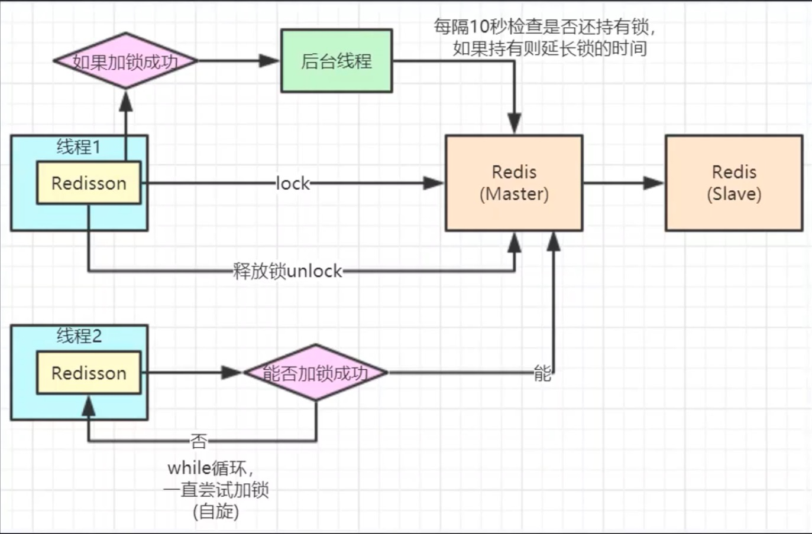

Redis: SDS,simple dynamic string

1.二进制安全的数据结构
2.提拱了内存与分配机制，避免了频繁的内存分配
3.兼容C语言函数库

C: char data[] ="guojia\0" 读取\0就结尾了

sdc：
 free：9
 len：6
 char buf[]="guojia" -> “guojia123”
 addlen:3
 (len+addlen) * 2 = 18


## Redis的五种数据结构


### String

字符串常用操作
SET  key  value 			//存入字符串键值对
MSET  key  value [key value ...] 	//批量存储字符串键值对
SETNX  key  value 		//存入一个不存在的字符串键值对
GET  key 			//获取一个字符串键值
MGET  key  [key ...]	 	//批量获取字符串键值
DEL  key  [key ...] 		//删除一个键
EXPIRE  key  seconds 		//设置一个键的过期时间(秒)

原子加减
INCR  key 			//将key中储存的数字值加1
DECR  key 			//将key中储存的数字值减1
INCRBY  key  increment 		//将key所储存的值加上increment
DECRBY  key  decrement 	//将key所储存的值减去decrement

单值缓存
SET  key  value 	
GET  key 	

对象缓存
1) SET  user:1  value(json格式数据)
2) MSET  user:1:name  zhuge   user:1:balance  1888
    MGET  user:1:name   user:1:balance 
    分布式锁
    SETNX  product:10001  true 		//返回1代表获取锁成功
    SETNX  product:10001  true 		//返回0代表获取锁失败
    。。。执行业务操作
    DEL  product:10001			//执行完业务释放锁
    SET product:10001 true  ex  10  nx	//防止程序意外终止导致死锁

计数器
INCR article:readcount:{文章id}  	
GET article:readcount:{文章id} 

Web集群session共享
spring session + redis实现session共享

分布式系统全局序列号	
INCRBY  orderId  1000		//redis批量生成序列号提升性能


### Hash

Hash常用操作
HSET  key  field  value 			//存储一个哈希表key的键值
HSETNX  key  field  value 		//存储一个不存在的哈希表key的键值
HMSET  key  field  value [field value ...] 	//在一个哈希表key中存储多个键值对
HGET  key  field 				//获取哈希表key对应的field键值
HMGET  key  field  [field ...] 		//批量获取哈希表key中多个field键值
HDEL  key  field  [field ...] 		//删除哈希表key中的field键值
HLEN  key				//返回哈希表key中field的数量
HGETALL  key				//返回哈希表key中所有的键值

HINCRBY  key  field  increment 		//为哈希表key中field键的值加上增量increment

对象缓存
HMSET  user  {userId}:name  zhuge  {userId}:balance  1888
HMSET  user  1:name  zhuge  1:balance  1888
HMGET  user  1:name  1:balance  


电商购物车
1）以用户id为key
2）商品id为field
3）商品数量为value

购物车操作
添加商品hset cart:1001 10088 1
增加数量hincrby cart:1001 10088 1
商品总数hlen cart:1001
删除商品hdel cart:1001 10088
获取购物车所有商品hgetall cart:1001

优点
1）同类数据归类整合储存，方便数据管理
2）相比string操作消耗内存与cpu更小
3）相比string储存更节省空间

缺点
过期功能不能使用在field上，只能用在key上
Redis集群架构下不适合大规模使用


### List

List常用操作
LPUSH  key  value [value ...] 		//将一个或多个值value插入到key列表的表头(最左边)
RPUSH  key  value [value ...]	 	//将一个或多个值value插入到key列表的表尾(最右边)
LPOP  key			//移除并返回key列表的头元素
RPOP  key			//移除并返回key列表的尾元素
LRANGE  key  start  stop		//返回列表key中指定区间内的元素，区间以偏移量start和stop指定

BLPOP  key  [key ...]  timeout	//从key列表表头弹出一个元素，若列表中没有元素，阻塞等待					timeout秒,如果timeout=0,一直阻塞等待
BRPOP  key  [key ...]  timeout 	//从key列表表尾弹出一个元素，若列表中没有元素，阻塞等待					timeout秒,如果timeout=0,一直阻塞等待

#### 常用数据结构

Stack(栈) = LPUSH + LPOP
Queue(队列）= LPUSH + RPOP
Blocking MQ(阻塞队列）= LPUSH + BRPOP


##### 微博消息和微信公号消息

诸葛老师关注了MacTalk，备胎说车等大V
1）MacTalk发微博，消息ID为10018
LPUSH  msg:{诸葛老师-ID}  10018
2）备胎说车发微博，消息ID为10086
LPUSH  msg:{诸葛老师-ID} 10086
3）查看最新微博消息
LRANGE  msg:{诸葛老师-ID}  0  4


### Set

SADD  key  member  [member ...]			//往集合key中存入元素，元素存在则忽略，
							若key不存在则新建
SREM  key  member  [member ...]			//从集合key中删除元素
SMEMBERS  key					//获取集合key中所有元素
SCARD  key					//获取集合key的元素个数
SISMEMBER  key  member			//判断member元素是否存在于集合key中
SRANDMEMBER  key  [count]			//从集合key中选出count个元素，元素不从key中删除
SPOP  key  [count]				//从集合key中选出count个元素，元素从key中删除

Set运算操作
SINTER  key  [key ...] 				//交集运算
SINTERSTORE  destination  key  [key ..]		//将交集结果存入新集合destination中
SUNION  key  [key ..] 				//并集运算
SUNIONSTORE  destination  key  [key ...]		//将并集结果存入新集合destination中
SDIFF  key  [key ...] 				//差集运算
SDIFFSTORE  destination  key  [key ...]		//将差集结果存入新集合destination中

集合操作实现微博微信关注模型

关住的人

我关注的人也关注他（共同关注的人）

集合操作实现电商商品筛选

选择cpu 还选择brand（品牌）


### ZSet

ZSet常用操作
ZADD key score member [[score member]…]	//往有序集合key中加入带分值元素
ZREM key member [member …]		//从有序集合key中删除元素
ZSCORE key member 			//返回有序集合key中元素member的分值
ZINCRBY key increment member		//为有序集合key中元素member的分值加上increment 
ZCARD key				//返回有序集合key中元素个数
ZRANGE key start stop [WITHSCORES]	//正序获取有序集合key从start下标到stop下标的元素
ZREVRANGE key start stop [WITHSCORES]	//倒序获取有序集合key从start下标到stop下标的元素

Zset集合操作
ZUNIONSTORE destkey numkeys key [key ...] 	//并集计算
ZINTERSTORE destkey numkeys key [key …]	//交集计算


Zset集合操作实现排行榜
1）点击新闻
ZINCRBY  hotNews:20190819  1  守护香港
2）展示当日排行前十
ZREVRANGE  hotNews:20190819  0  9  WITHSCORES 
3）七日搜索榜单计算
ZUNIONSTORE  hotNews:20190813-20190819  7 
hotNews:20190813  hotNews:20190814... hotNews:20190819
4）展示七日排行前十
ZREVRANGE hotNews:20190813-20190819  0  9  WITHSCORES


遵循空字符结尾这一惯例的好处是，SDS可以直接重用一部分C字符串函数库里面的函数。

## Redis锁



**redisSesson故障转移redis的线程1在master加了锁，转移到slave的时候数据没有同步，线程2在新的master节点上又加锁成功了。redlock超过半数redis节点加锁成功才算加锁成功**


Redlock问题：

1.性能

2.数据回滚问题 网络抖动

3.redis设计之初就是为了高并发而准备的，一秒QPS可以达到10万，设计理念为背


高性能分布式锁实现：

利用分段式方法，concurrenthashmap方式


**集群模式下一个节点配置的主没有从 宕机了怎么办 默认无不可用**


## ZskipList

层（level）：每次创建一个新跳跃表节点的时候，程序都根据**幂次定律**（power law，越大的数出现的概率越小）随机生成一个介于1和32之间的值作为level数组的大小，这个大小就是高度。

跨度（span）：是用来计算排位（rank）的：在查找某个节点的过程中，将沿途访问过的所有层的跨度累记起来，得到的结果就是目标节点在跳跃表中的排位。

```C++
/* ZSETs use a specialized version of Skiplists */
typedef struct zskiplistNode {
    sds ele;
    //按照分值从小到大排列
    double score;
    //指向当前节点的前一个节点
    struct zskiplistNode *backward;
    struct zskiplistLevel {
        //前进指针，用于访问位于表为方向的其他节点
        struct zskiplistNode *forward;
        //跨度，记录了前进指针所指向节点和当前节点的距离
        unsigned long span;
    } level[];
} zskiplistNode;

typedef struct zskiplist {
    struct zskiplistNode *header, *tail;
    //记录跳跃表的长度，也即是，跳跃表当前包含节点的数量（表头节点不计算在内）
    unsigned long length;
    //记录目前跳跃表里面，层数最大的那个节点的层数（表头节点的层数不计算在内）
    int level;
} zskiplist;

typedef struct zset {
    dict *dict;
    zskiplist *zsl;
} zset;
```


### 使用SDS字符串的好处

1. 常数复杂度获取字符串长度
2. 杜绝缓存区溢出（C字符串不记录自身的长度，如果把一个字符串添加到另一个字符串，第一个字符串空间大小不足以支撑两个字符串的话就会出现溢出）
3. 减少修改字符串时带来的内存重分配次数
4. 通过未使用空间，SDS实现了**空间预分配**和**惰性空间**释放两种优化策略
5. 二进制安全
6. 兼容部分C字符串函数

#### 空间预分配

SDS修改之后长度

小于1MB free为len属性同样大小的未使用空间

大于1MB free为固定1MB

#### 惰性空间释放

SDS避免了缩短字符串时所需的内存冲分配操作，并未将来可能有的增长操作提供了优化。

#### 二进制安全

C字符串中的字符必须符合某种编码（比如ASCII），并且除了字符串的末尾以外，字符串里面不能包含空字符，否则最先被程序读入的空字符将误认为是字符串结尾，这些限制使得C字符串只能保存文本数据，而不能保存图片，音频，视频，压缩文件这样的二进制数据 。


```java
int zslRandomLevel(void) { 

	int level = 1; 

	while ((random()&0xFFFF) < (ZSKIPLIST_P * 0xFFFF)) 

	level += 1; 

	return (level<ZSKIPLIST_MAXLEVEL) ? level : ZSKIPLIST_MAXLEVEL; 

}
```


## 脑裂问题

https://www.jianshu.com/p/8d045424042f


