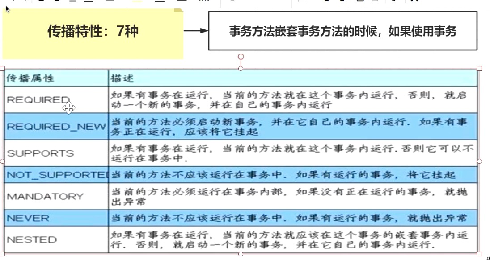

## spring假设去掉二级缓存？

如果去掉了二级缓存，则需要直接在 `singletonFactory.getObject()` 阶段初始化完毕，并放到一级缓存中。


那有这么一种场景，B 和 C 都依赖了 A。要知道在有代理的情况下 `singletonFactory.getObject()` 获取的是代理对象。


而多次调用 `singletonFactory.getObject()` 返回的代理对象是不同的，就会导致 B 和 C 依赖了不同的 A。那如果获取 B 到之后直接放到一级缓存，然后 C 再获取呢？


## spring假设去掉三级缓存？

去掉三级缓存之后，Bean 直接创建 **earlySingletonObjects**， 看着好像也可以。如果有代理的时候，在 earlySingletonObjects 直接放代理对象就行了。但是会导致一个问题：**在实例化阶段就得执行后置处理器，判断有AnnotationAwareAspectJAutoProxyCreator 并创建代理对象**。这么一想，是不是会对 Bean 的生命周期有影响。同样，先创建 singletonFactory 的好处就是：在真正需要实例化的时候，再使用 singletonFactory.getObject() 获取 Bean 或者 Bean 的代理。相当于是延迟实例化。

**AnnotationAwareAspectJAutoProxyCreator后置处理器**


如果单纯为了解决循环依赖问题，那么使用二级缓存足够解决问题，三级缓存存在的意义是为了避免代理，如果没有代理对象，二级缓存足够解决问题。


## 循环依赖+动态代理


```java
* <p>Bean factory implementations should support the standard bean lifecycle interfaces
* as far as possible. The full set of initialization methods and their standard order is:
* <ol>
* <li>BeanNameAware's {@code setBeanName}
* <li>BeanClassLoaderAware's {@code setBeanClassLoader}
* <li>BeanFactoryAware's {@code setBeanFactory}
* <li>EnvironmentAware's {@code setEnvironment}
* <li>EmbeddedValueResolverAware's {@code setEmbeddedValueResolver}
* <li>ResourceLoaderAware's {@code setResourceLoader}
* (only applicable when running in an application context)
* <li>ApplicationEventPublisherAware's {@code setApplicationEventPublisher}
* (only applicable when running in an application context)
* <li>MessageSourceAware's {@code setMessageSource}
* (only applicable when running in an application context)
* <li>ApplicationContextAware's {@code setApplicationContext}
* (only applicable when running in an application context)
* <li>ServletContextAware's {@code setServletContext}
* (only applicable when running in a web application context)
* <li>{@code postProcessBeforeInitialization} methods of BeanPostProcessors
* <li>InitializingBean's {@code afterPropertiesSet}
* <li>a custom init-method definition
* <li>{@code postProcessAfterInitialization} methods of BeanPostProcessors
* </ol>
```


```java
// Invoke factory processors registered as beans in the context.
invokeBeanFactoryPostProcessors(beanFactory);
InternalConfigurationAnnotationProcessor
ConfigurationClassPostProcessor帮助我们做了注解识别和解析的过程
ConfigurationClassParser#doProcessConfigurationClass
//@Component
//@PropertySources
//@ComponentScans
//@ComponentScan
//@ImportResource

//配置文件读取是GenericBeanDefinition
//注解扫描是ScannedGenericBeanDefintion
//父类AbstractBeanDefinition
//AnnotatedBeanDefinition有这个注解元数据信息  private final AnnotationMetadata metadata;

```

#### ConfigurationClassPostProcessor

```java
@SpringBootApplication  -> @EnableAutoConfiguration  -> @Import(AutoConfigurationImportSelector.class) 就是在 ConfigurationClassPostProcessor去解析加载的
```

#### https://juejin.cn/post/6844903944146124808


## Bean名称生成策略


启动流程


## BeanPostProcessor关键实现类


## Spring的观察者模式

**refresh()#initApplicationEventMulticaster()**


```txt
initialMulticaster（springboot的监听器）
applicationEventMulticaster（spring上下文监听器）
```


## SPI（service provider interface）

## Spring Aop


## DefaultListableBeanFactory类图


```java
1.创建AspectJPointcutAdvisor#0-4，先使用其带参的构造方法进行对象的创建，但是想使用带参数的构造方法，必须要把参数对象准备好，因此要准备创建内置包含的对象AspectJAroundAdvice

2.创建AspectJAroundAdvice，也需要使用带参的构造方法进行创建，也需要提前准备好具体的参数对象，包含三个参数：

  1. MethodLocatingFactoryBean
  2. AspectJExpressionPointcut
  3. SimpleBeanFactoryAwareAspectInstanceFactory

3.分别创建上述的三个对象，上述三个对象的创建过程都是调用无参的构造方法，直接发射调用即可。
```


SpringAop运行过程

1.调用被代理的方法

2.找到cglib文件

3.根据var00000找到DynamicAdvisedInterceptor#intercept方法


ExposeInvocationInterceptor

中间的调用循环结构


适配器是以Interceptor结尾的 其他的是直接继承自MethodInterceptor


## spring创建对象的五种方式


## 事务传播行为




## RestTemplate的Ribbon


