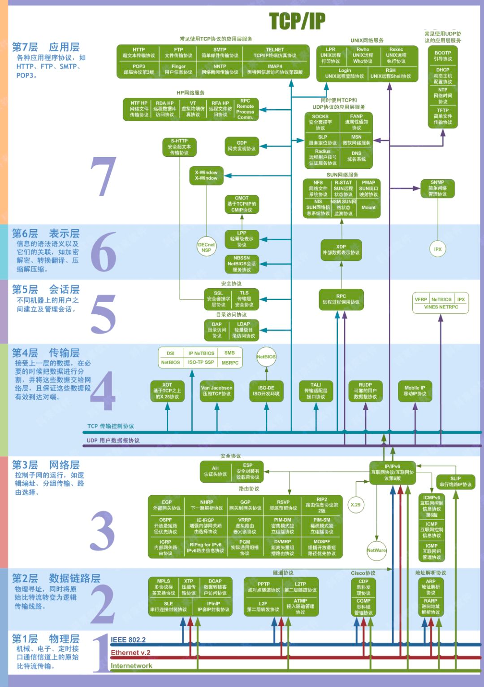
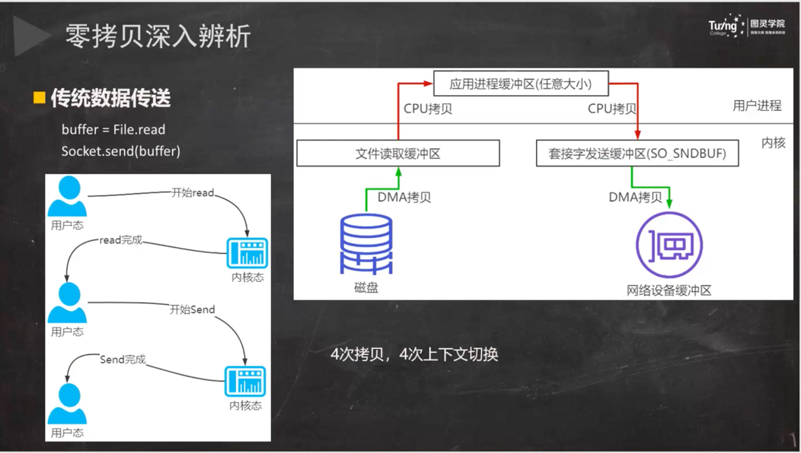

TCP协议灵魂拷问：https://juejin.cn/post/6844904070889603085

计算机是什么？

利用通信线路将地理上分散的、具有独立功能的计算机系统和通信设备按不同的形式连接起来、以功能完善的网络软件及协议实现资源共享和信息传递的系统。

主要网络有哪些？

1、局域网

2、城域网

3、广域网

##压缩工具
snappy、zstd
snappy、zstd 等压缩工具类，可以直接将字符串压缩成 byte[] 再往外传输，这个被压缩后的字符串，直至入库都是 byte[]，全程不对大报文解压。

TCP缓冲区

每个TCP的Socket的内核中都有一个发送缓冲区和一个接收缓冲区

#### 直接内存比对内存快在哪里？

直接内存相比堆内存，避免了二次拷贝。java在处理write数据的时候会先在jvm内存外申请一个直接内存，当有要发送的数据的时候先把数据写入到直接内存，然后再由直接内存写入到套接字发送缓冲区，之后再通过协议栈过网络发送给对端。**为什么要把数据再拷贝一次到？**因为GC的原因，如果没有直接内存，对直接告诉套接字发送缓冲区要发送数据的地址，这时候还没有发送，堆这个时候刚好发生GC，导致要发送的数据经过GC算法整理功能进行了移动位置，就会出现套接字发送缓冲区按照之前堆给的地址进行数据读取发送是错误的数据。

#### 什么是零拷贝？

零拷贝（英语：Zero-copy）技术是指计算机执行操作时，CPU不需要先将数据从某处内存复制到另一个特定区域。这种技术通常用于通过网络传输文件时节省CPU周期和内存带宽。

kafka

netty

rocketmq

nginx

apache

零拷贝技术可以减少数据拷贝和共享总线操作的次数，消除传输数据在存储器之间不必要的中间拷贝次数，从而有效地提高数据传输效率。

零拷贝技术减少了用户进程地址空间和内核地址空间因为上下文切换而带来的开销

Linux的I/O机制与DMA（Direct Merry Access，直接内存读取）

### DMA技术

DMA，英文全称是**Direct Memory Access**，即直接内存访问。**DMA**本质上是一块主板上独立的芯片，允许外设设备和内存存储器之间直接进行IO数据传输，其过程**不需要CPU的参与**。

我们一起来看下IO流程，DMA帮忙做了什么事情.

- 用户应用进程调用read函数，向操作系统发起IO调用，进入阻塞状态，等待数据返回。
- CPU收到指令后，对DMA控制器发起指令调度。
- DMA收到IO请求后，将请求发送给磁盘；
- 磁盘将数据放入磁盘控制缓冲区，并通知DMA
- DMA将数据从磁盘控制器缓冲区拷贝到内核缓冲区。
- DMA向CPU发出数据读完的信号，把工作交换给CPU，由CPU负责将数据从内核缓冲区拷贝到用户缓冲区。
- 用户应用进程由内核态切换回用户态，解除阻塞状态

可以发现，DMA做的事情很清晰啦，它主要就是**帮忙CPU转发一下IO请求，以及拷贝数据**。为什么需要它的？

> 主要就是效率，它帮忙CPU做事情，这时候，CPU就可以闲下来去做别的事情，提高了CPU的利用效率。大白话解释就是，CPU老哥太忙太累啦，所以他找了个小弟（名叫DMA） ，替他完成一部分的拷贝工作，这样CPU老哥就能着手去做其他事情。

